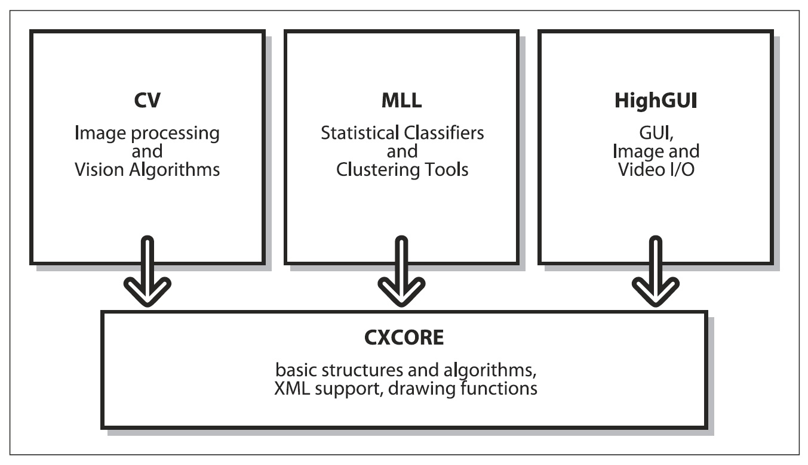

## [П]|[РС]|(РП) Структура и содержимое OpenCV

OpenCV структурирован по пяти основным компонентам, четыре из которых показаны на рисунке 1-5. Компонент **CV** содержит основные алгоритмы обработки изображений и высокоуровневые алгоритмы компьютерного зрения; **ML** - библиотеку машинного обучения, которая включает в себя средства статистической классификации и кластеризации. **HighGUI** содержит процедуры и функции ввода/вывода для хранения и загрузки видео и изображений. **CXCore** содержит основные структуры данных.

Рисунок 1-5. Базовая структура OpenCV

Рисунок 1-5 не включает **CvAux**, который содержит устаревшие области (встроенные СММ для распознавания лиц) и экспериментальные алгоритмы (background/foreground сегментация). **CvAux** не в должной мере задокументирован на Wiki и вовсе отсутствует в **.../opencv/docs**. **CvAux** содержит:

* Собственные значения объектов, вычислительно эффективный метод распознавания, который, по сути, оперирует шаблонным сопоставлением
* 1D и 2D скрытую марковскую модели, технику статистического распознавания с использованием метода динамического программирования
* Встроенную СММ
* Распознавание жестов при помощи стерео зрения
* Расширенную триангуляцию Delaunay, последовательности и т.д.
* Стерео зрение
* Сопоставление образцов в области контура
* Дескриптор текстур
* Слежение за глазами и ртом
* 3D tracking
* Поиск скелета (центральных линий) объектов сцены
* Искривление промежуточного обзора между двумя камерами
* Background-foreground сегментацию
* Видеонаблюдение (см. Wiki FAQ для получения дополнительной информации)
* Калибровку камеры классами C++ (функции C и "движок" **CV**)

Некоторые из этих функций могут в дальнейшем мигрировать в **CV**; иные, возможно, никогда.
