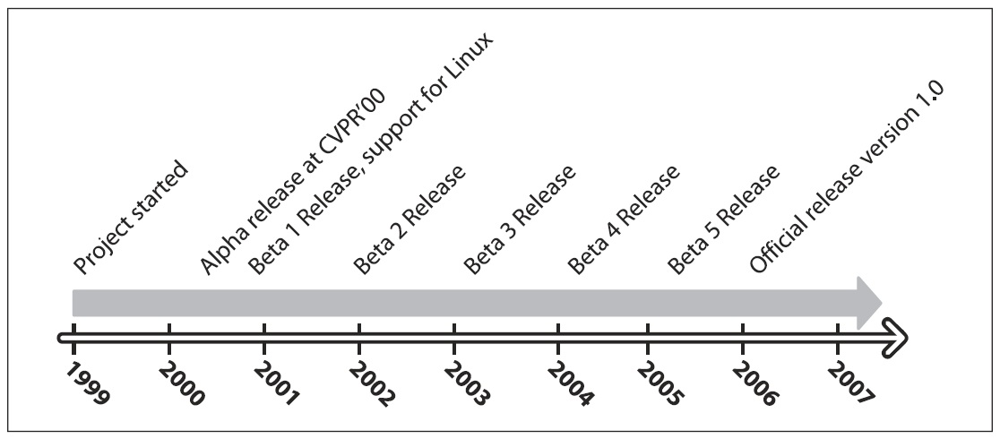
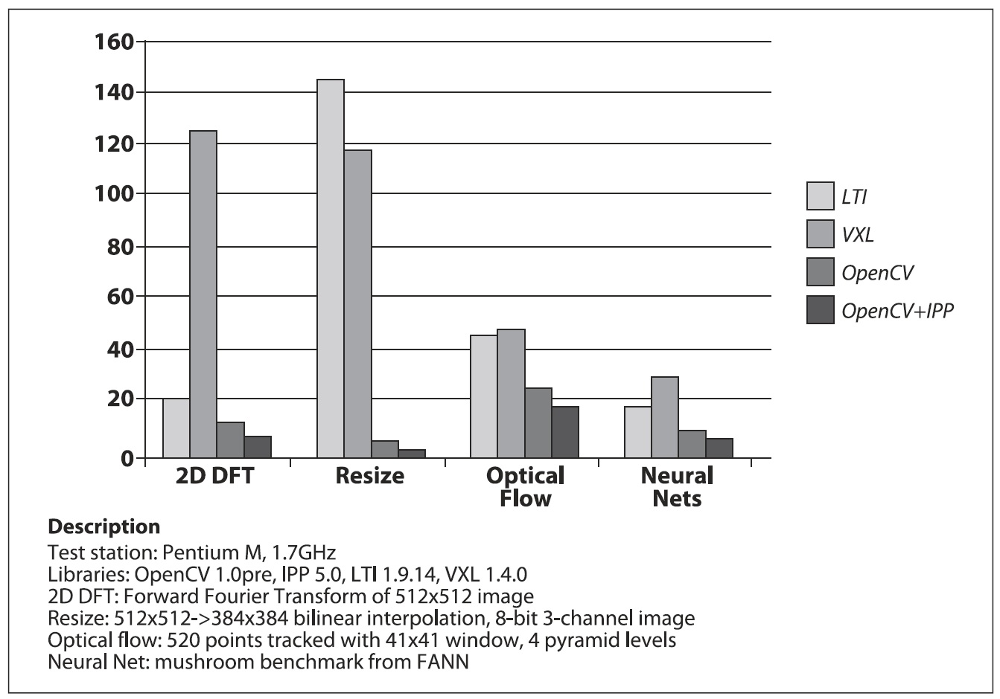

## [П]|[РС]|(РП) История появления OpenCV

OpenCV появился по инициативе Intel Research для продвижения ресурсоемких приложений. С этой целью, Intel запустил ряд проектов, в числе которых были: трассировка лучей в реальном времени и 3D отображение. Один из авторов, работник Intel, будучи гостем университета, заметил, что некоторые ведущие университеты, такие как MIT Media Lab, имели на тот момент хорошо развитую и внутренне открытую инфраструктуру по развитию компьютерного зрения и код, который "кочевал" от студента к студенту, тем самым давая каждому последующему студенту бесценный опыт для развития их собственных проектов компьютерного зрения. Так, новому студенту не нужно было изобретать основные функции самому, а использовать те, что были написаны до него. 

Таким образом, задумка OpenCV — это способ сделать компьютерное зрение общедоступным. При содействии Intel Performance Library Team, задача реализации кода ядра и алгоритмических спецификаций OpenCV была направлена команде Intel из **РОССИИ**. Все начиналось в исследовательской лаборатории корпорации Intel при использовании ПО Performance Libraries наряду с опытом из **РОССИИ**. 

Главным в российской команде был **Вадим Писаревский**, которому удалось написать и оптимизировать большую часть OpenCV и который до сих пор прикладывает немало усилий для развития OpenCV. Вместе с ним в разработке ранней инфраструктуры участвовал **Виктор Ерухимов**, а также управляющий российской лабораторией Валерий Kuriakin {неизвестен перевод}. В начале перед OpenCV ставилось несколько задач:

* Способствовать исследованиям в области компьютерного зрения путем разработки не только открытого, но и тщательно оптимизированного кода. Теперь никто больше не должен изобретать велосипед.
* Распространение знаний через общую инфраструктуру, что бы разработчики могли строить приложения с более читаемым и легко передаваемым кодом.
* Продвижение коммерческих приложений, базирующихся на компьютерном зрении и собираемые с общедоступным производительно-оптимизированным кодом - лицензия не требует от коммерческих приложений, что бы они были открытыми и общедоступными.

Эти цели отвечают на вопрос "почему" OpenCV. Включение компьютерного зрения в приложения приводило к увеличению востребованности в быстрых процессорах. Обновление драйверов более быстрых процессоров стало приносить Intel больше доходов, нежели продажа дополнительного ПО. Возможно, поэтому открытый и свободный код возник у поставщика оборудования, а не у компаний производителей дополнительного ПО. В некотором смысле, аппаратные компании менее ограничены в создании инновационного ПО.

В любом open source проекте важно достичь критической массы, при которой проект станет само поддерживаемым. На данный момент библиотека OpenCV скачена около двух миллионов раз, это число растет и в среднем составляет 26 000 загрузок в месяц. Число активно использующих пользователей приближается к 20 000. Пользователи все больше и больше вносят свой вклад в развитие OpenCV и центр развития в значительной степени вышел за пределы Intel. Путь развития OpenCV показан на рисунке 1-3.

Рисунок 1-3. Путь развития OpenCV

За это время, OpenCV пострадала от бума и спада доткомов {компании, чья бизнес-модель целиком основывается на работе в рамках сети Интернет}, а также от многочисленных изменений в руководстве. Во время этих колебаний, были времена, когда работники Intel не принимали участия в развитии библиотеки вообще. Тем не менее, с появлением многоядерных процессоров и множества новых приложений компьютерного зрения, значение OpenCV стало расти. Сегодня OpenCV активно развивается в ряде институтов, так что в скором времени ожидается множество новых обновлений, связанных с: калибровкой сразу нескольких камер, восприятием глубины сцены, методами смешивания зрения с датчиками глубины, лучшим распознаванием образов и еще большей поддержкой для роботов. Для получения дополнительной информации о будущем OpenCV, обратитесь к главе 14.

### Ускорение OpenCV с помощью IPP

Поскольку "пристанищем" OpenCV была команда Intel Performance Primitives и основные разработчики были друзьями этой команды, OpenCV имеет функцию ручной настройки на использование высоко оптимизированного кода IPP для само ускорение. Ускорение от использования IPP может быть существенным. На рисунке 1-4 представлено сравнение OpenCV и OpenCV с IPP с двумя другими библиотеками компьютерного зрения LTI и VXL. Обратите внимание, что производительность была ключевой задачей OpenCV; библиотека требовалась для запуска кода с использованием зрения в режиме реального времени. 

OpenCV написана при помощи высокопроизводительного кода на C и C++. Но это никоем образом не связано с IPP. OpenCV автоматически подключает IPP для повышения производительности.

Рисунок 1-4. Сравнение двух других библиотек компьютерного зрения (LTI и VXL) с OpenCV (с и без IPP) по четырем критериям эффективности: четыре полосы для каждого теста отражают результаты, пропорциональные времени выполнения для каждой из указанных библиотек; во всех случаях, OpenCV превосходит другие библиотеки, а OpenCV с IPP превосходит OpenCV без IPP

### Кто владелец OpenCV?

Хотя Intel и начинал разработку OpenCV, библиотеку всегда можно было использовать в коммерческих и научно-исследовательских работах. Поэтому она является открытой и бесплатной, а сам код может быть использован или встроен (частично или полностью) в другие приложения, хоть коммерческие, хоть научно-исследовательские. При этом не обязательно делать код вашего приложения открытым и общедоступным. Не требуется вносить ваши улучшения в библиотеку, хотя мы надеемся, что вы будете это делать.
