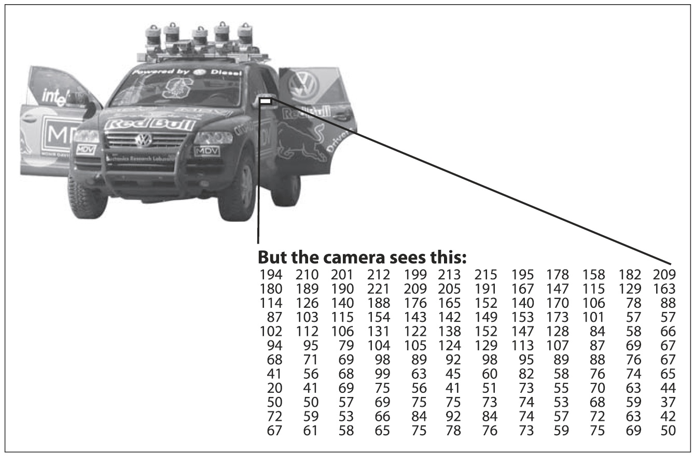

## Что такое компьютерное зрение

Компьютерное зрение - процесс преобразования данных, полученных с фотоаппаратов и видеокамер, в новое представление. Все эти преобразования делаются для достижения какой-то конкретной цели. Входные данные могут содержать некоторую контекстную информацию, такую как "камера установлена в машине" или "лазерный дальнометр определил объект в радиусе 1 метра". Решением может быть "есть человек в этой сцене" или "есть 14 опухолевых клеток на снимке". Новое представление может означать превращение цветного изображения в черно-белое или устранение движения камеры из последовательности изображений.

Не стоит себя обманывать и думать что задачи компьютерного зрения такие уж и легкие. Как труден может быть поиск, скажем, автомобиля, когда имеется только его образ? Ваша интуиция может быть весьма обманчивой. Человеческий мозг делит сигнал поступивший от зрения на множество каналов, которые впоследствии передают различные виды информации в ваш мозг. Ваш мозг устроен таким образом, что ваше внимание концентрируется только на важных участках изображения, исключая при этом остальные. Существует масса ответных сигналов, перемещающиеся в зрительном канале, которые пока плохо изучены. Сигналы поступают на ассоциативные входы, пришедшие от датчиков контроля мышц и всех других чувств, которые позволяют мозгу опираться на перекрестные ассоциации, накопленные за годы прожитых лет. За счет обратной связи в мозгу, процесс повторяется вновь и вновь и включает в себя датчик (глаз), который механически управляет освещением с помощью радужной оболочки и настаивает прием на поверхности сетчатки.

Однако, в системе машинного зрения все что получает компьютер это сетку с числами от камеры или с диска. По большей части, нет не встроенного распознавания образов, не автоматического управления фокусом и диафрагмой, не перекрестных ассоциаций с многолетним опытом работы. По большей части, системы компьютерного зрения все еще довольно наивны. На рисуноке 1-1 изображен автомобиль. 

Рисунок 1-1. Компьютер видит боковое зеркало авто просто как сетку чисел

На этом рисунке мы видим боковое зеркало со стороны водителя. Компьютер же "видет" только сетку с числами. Любой номер из этой сетки имеет довольно таки большую шумовую состовляющую и само по себе дает нам мало информации, однако, эта сетка чисел все что "видет компьютер. Наша задача сводиться к преобразованию сетки чисел к виду: "боковое зеркало". Рисунок 1-2 дает нам чуть больше представления о том, почему компьютерное зрение это так трудно.

Рисунок 1-2. Некорректная природа зрения: двумерное представление объекта может радикально измениться в зависимости от позиции, с которой на него посмотретьы

На самом деле, проблему, о которой шла речь ранее, формально невозможно решить. Учитывая двумерное представление трехмерного мира, невозможно однозначно восстановить 3D сигнал. Формально, такого рода некорректная задача не имеет однозначного или окончательного решения. Двумерное изображение можно представить любым из бесконечных сочетаний 3D-сцен, даже если данные были совершенны. К тому же, как упоминалось ранее, данные подвержены шуму и искажениям. Такого рода повреждения происходят от вариаций в мире (погода, освещение, отражения, премещения), недостатков в объективе и механических установках, конечного времени интеграции на датчике (размытие при движении), электрический шум в датчике или другой электронике, артефактов сжатия после захвата изображения. Учитывая все эти проблемы, как мы можем добиться хоть како то прогресса?

При проектировании практической системы, дополнительные знания контекста зачастую могут быть использованы, чтобы обойти ограничения, накладываемые визуальными датчиками. Рассмотрим следующий пример: мобильный робот должен найти и подобрать степлер. Робот может использовать следующий факт: стол это объект, который находится внутри офиса и чаще всего степлер можно найти на столах. Это дает неявную ссылку о размере; степлер должен поместиться на столе. Это так же помогает устранить ложные "распознавания" расположения степлера в невозможных местах (например, на потолке или окне). Робот может проигнорировать 200-футовый рекламный дирижабль с рекламой о степлере, потому что дирижаблю не хватает на фоне древесины стола. (!) В иных случаях, когда приходиться извлекать изображения степлера из базы данных, может оказаться так, что на этих изображениях степлер будет огромных размеров или же иметь необычную фору, что повлечет за собой исключение этих изображений из рассмотрения(!). То есть фотограф, вероятно, взял только изображения степлеров реальных размеров. Люди склонны к центрированию объекта при съемке и, как правило, ориентируются на эту характеристику. Таким образом, фотографии, сделанные людьми, содержат немного неявной информации. 

Контекстная информация также может быть смоделирована явно методами машинного обучения. Скрытые переменные, такие как размер, ориентация притяжения и т.д. можно соотнести с их значениями в маркированном обучающем множестве. В альтернативе, можно попытаться измерить скрытые пременные смещения с помощью дополнительных датчиков. Используя датчик глубины, можно точно измерить размер объекта.

Следующая проблема компьютерного зрения это шум. Как правило, мы имеем дело с шумом, когда используем статистические методы. Например, может быть невозможно обнаружить контур в изображении простым сравнением соседних точек. Но если мы соберем статистику по локальной области, то задача обнаружения контура становится легче. (!) Контур должен появиться в виде строки непосредственных ответов по локальной области, каждый из которых ориентирован в соответствии с его соседями(!). Так же возможно компенсировать шум, принимая статистические данные в течение долгого времени. Тем не менее иные методы учета шума или искажения путем создания четких моделей позволяют распознавать непосредственно из имеющихся данных. Например искажения от объектива хорошо известны и чтобы почти полностью исправить такие искажения, необходимо знать только параметры простой полиномиальной модели. 

Те или иные действия или решения принятые в компьютерном зрении сделаны на основе данных полученных с камеры в контексте конкретной цели или задачи. Мы можем удалить шум или повреждения в изображении так, что наша система безопасности будет выдавать предупреждения, если кто-то попытается залезть на забор или же система мониторинга будет подсчитывать, сколько людей переступило через определенную область в парке аттракционов. ПО виденья для роботов, которые передвигаються по офису будут использовать иные стратегии, нежели стационарные камеры видеонаблюдения, поскольку эти две системы имеют существенно различные контексты и задачи. Как правило: контекст задач компьютерного зрения ограничены и потому, рассчитывая на эти ограничения, задачу можно упростить и от этого конечное решение будет более надежным.

OpenCV направлена на обеспечение основных инструментов, необходимых для решения проблем компьютерного зрения. В некоторых случаях, высоко функциональной библиотеки будет достаточно, чтобы решить более сложные проблемы в области компьютерного зрения. Даже если это не так, то оснавные компоненты библиотеки являются достаточно полными, что бы позволить создать новое решение самостоятельно, тем самым решить почти любую проблему компьютерного зрения. Есть несколько проверенных и надежных методов, которые используют многие компоненты библиотеки. Как правило, после создания проекта обнаруживаются слабые места и исправляются с помощью собственного кода и умений (более известно как "решить проблему которая фактически имеется, а не ту которую вы вообразили"). Тогда можно использовать данное решение как эталон для оценки улучшений, которые будут сделаны в дальнейшем. С этого момента любые новые слабые места могут быть решены за счет встроенного решения. 