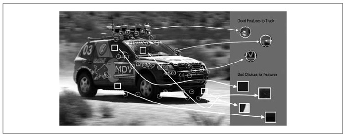
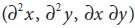
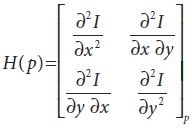
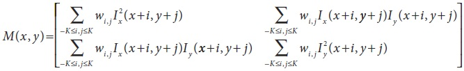
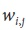

## Поиск углов

Существует множество локальных особенностей, которые можно отслеживать. Для начала заострим внимание на разъяснении того, что такое особенность. Очевидно, что если выбрать точку на большой пустой стене, то не так уж и легко будет её обнаружить в следующем кадре в видеопотоке. Если все точки на стене будут одинаковыми или очень похожими, то существует очень малый шанс отследить конкретную точку в последующих кадрах. С другой стороны, выбирая уникальную точку, шанс найти её в последующих кадрах в разы возрастают. На практике должны выбираться уникальные (или почти уникальные) точки или особенности, чтобы максимизировать шансы распознать их в последующих кадрах (Рисунок 10-1).



Рисунок 10-1. Точки в кругах - это хорошие точкам для слежения, в то время как точки в прямоугольниках – это наихудший выбор

Теперь вновь вернемся к рассмотрению большой пустой стены с точками; можно попытаться найти точки, претерпевающие существенные изменения - например, те, которые имеют сильную производную. На самом деле этого не достаточно, но это только начало. Точка с сильной производной может быть связана с каким-то краем, при этом выглядеть так же, как и все другие точки вдоль этого края (раздел *Метод Lucas-Kanade*, рисунок 10-8).

Если сильная производная наблюдается в двух ортогональных направлениях, то можно надеяться на то, что точка является уникальной. По этой причине зачастую отслеживают так называемую *угловую* особенность. По идее, углы – а не края – это точки, которые содержат достаточно информации, чтобы их можно было бы отслеживать от кадра к кадру. 

Наиболее часто используемое определение угла было представлено *Harris*. Данное определение опирается на матрицу производных интенсивности второго порядка . Производные второго порядка, взятые во всех точках изображения, можно представить как формирование новых «вторых производных изображений» или как объединение нового изображения *Hessian*. Эта терминология возникла из матрицы *Hessian* вокруг точки, которая определена в двух измерениях:



Для угла Harris рассматривается *автокорреляционная матрица* вторых производных изображений по малой области вокруг каждой точки. Такая матрица определяется следующим образом:



где  – весовой вклад, который может быть постоянным, но зачастую используется для создания кругового окна или Гауссово взвешивания. Углы по определению Harris это места на изображении, где автокорреляционная матрица вторых производных имеет два больших собственных значения. В сущности это означает, что текстура (или края) проходят, по крайней мере, два отдельных направления, центрируемых вокруг такой точки, которая соответствует реальному углу, который имеет два ребра, встречающихся в точке. Вторые производные полезны, т.к. они не зависят от однородного градиента. (Градиент получается из первых производных. Если первые производные являются однородными (константами), то вторая производная равна 0). Это определение также полезно в случае рассмотрения только собственных значений автокорреляционной матрицы, т.к. в таком случае рассматриваются значения, которые инвариантны к вращению, что очень важно, потому что отслеживаемые объекты могут вращаться и перемещаться. В добавок к этому, эти два собственных числа определяют не только является ли выбранная особенность хорошей для слежения, но и обеспечивают идентификационную подпись для точки.

Исходное определение Harris включает взятие детерминанта H(p), вычитание следа H(p) (с некоторым весовым коэффициентом) и последующим сравнением этой разницы с заданным порогом. Впоследствии, *Shi* и *Tomasi* обнаружили, что хорошие углы можно получить, если наименьшее из собственных чисел больше минимального порога. Метод *Shi* и *Tomasi* является не только достаточным, но и во многих случаях дает более хорошие результаты, чем метод Harris.

Функция *cvGoodFeaturesToTrack()* реализует метод *Shi* и *Tomasi*. Эта функция вычисляет вторые производные (с помощью оператора Собеля), которые необходимы для вычисления собственных чисел. В результате будет возвращен список точек, которые соответствуют определению хороших точек для отслеживания.

```cpp
void cvGoodFeaturesToTrack(
 const CvArr* image
,CvArr* eigImage
,CvArr* tempImage
,CvPoint2D32f* corners
,int* corner_count
,double quality_level
,double min_distance
,const CvArr* mask = NULL
,int block_size = 3
,int use_harris = 0
,double k = 0.4
);
```

*image* - это исходное 8 или 32 битное (т.е. *IPL_DEPTH_8U* или *IPL_DEPTH_32F*) одноканальное  изображение. Следующие два аргумента – это одноканальные 32 битные изображения одинакового размера. И *tempImage* и *eigImage* используются алгоритмом в качестве отправной точки, однако содержимое *eigImage* имеет смысл. В частности, каждая запись содержит минимальное собственное значение соответствующей точки исходного изображения. 
