## (П]|(РС)|(РП) Оценочная функция

Допустим, отслеживаются перемещения человека, гуляющего вдоль камеры. В каждом кадре происходит фиксация местоположения этого человека. Это может быть сделано любым, описанным ранее, способом, но в каждом отдельном случае ищется оценка положения человека в каждом кадре. Скорее всего, эта оценка будет не совсем точной. Причин для этого множество. Это может быть связано и с не точностью датчика, и от использования приближений на ранних этапах обработки, и с вопросами, связанные с сокрытиями или тенями, или с возможной сменой формы из-за того, что человек во время перемещений размахивает руками и ногами. Независимо от источника, ожидается, что изменения будут меняться несколько беспорядочно, а о "фактических" значениях может идти речь лишь при наличии идеализированного датчика. Можно представить все эти неточности как простое добавление шума к процессу отслеживания.

Необходимо иметь возможность оценки передвижений этого человека за счет максимально возможного использования сделанных измерений. Таким образом, совокупный эффект от всех измерений позволяет обнаруживать часть перемещений человека, не зависящих от шума. Ключевым дополнительным ингредиентом является *модель* перемещений человека. Например, можно смоделировать перемещение человека со следующим утверждением: "Человек попадает в кадр с одной стороны и перемещается вдоль кадра с постоянной скоростью". За счет такой модели можно определить не только местоположение человека, но и какие параметры модели поддерживают данное наблюдение.

Данная задача разбивается на два этапа (рисунок 10-18). Первый этап, как правило, именуется этапом предсказаний, в котором используется информация, полученная в прошлом, для улучшения модели с местоположением человека (или предмета). Второй этап, этап коррекции, производит измерение с последующим сопоставлением с предсказанными ранее измерениями.

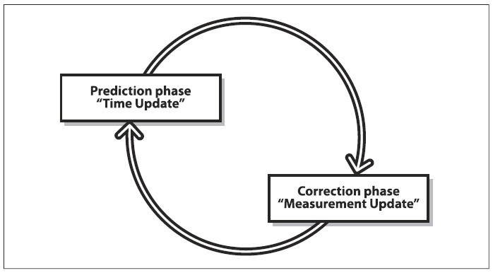

Рисунок 10-18. Двухэтапный цикл оценки: предсказание на основе предыдущих данных с последующим применением новых измерений

Принцип действия задачи двухэтапной оценки соответствует оценке наиболее популярного метода, использующего *фильтр Kalman*. В дополнение к этому методу, есть ещё один наиболее важный метод, *алгоритм condensation*, реализующий широкий класс методов, известных как фильтры частиц. Основное различие между фильтром Kalman и алгоритмом condensation сводится к описанию плотности вероятного состояния. Данное различие будет более подробно рассмотрено в следующих разделах.

### Фильтр Kalman

С момента первых упоминаний (1960 г.) о фильтре Kalman его значение заметно возросло. Основная идея фильтра Kalman заключается в том, что при строгом, но разумно, наборе предположений можно – при учете истории изменений системы - построить модель состояний системы, которая максимизирует *posterior* вероятность предыдущих изменений. Более подробную информацию можно найти в работах Welsh и Bishop. Кроме того, можно максимизировать *posterior* (это академический жаргон, означающий "взгляд в прошлое"; таким образом, когда говорят, что такое то распределение "максимизирует posteriori вероятность", то это можно трактовать как "что на самом деле произошло") вероятность без ведения длинной истории предыдущих изменений. Вместо этого происходит многократное обновление модели состояний системы и сохранение этой модели для последующей итерации. Это значительно упрощает вычислительную часть этого метода. 

Перед тем, как переходить к деталям, необходимо уделить немного времени на обсуждение предположений. Имеется три важных предположения, необходимые для теоретического истолкования фильтра Kalman: (1) моделируемая система линейна, (2) шум – это измерения, сделанные вне "белого", и (3) этот шум имеет Gaussian природу. Первое предположение означает, что состояние системы в момент времени *k* может быть смоделирована как некая матрица, помноженная на состояние в момент времени *k - 1*. Остальные предположения означают, что шум не коррелируется во времени, а его амплитуда может быть точно смоделирована только при помощи среднего значения и ковариации (т.е. шум полностью можно описать при помощи первых и вторых моментов). Эти предположения могут показаться ограниченными, однако, на самом деле они охватывают множество случаев (единственное, что стоит учесть, так это то, что если начальное состояние (например) имеет шансы 50×50, то потребуется использовать что-то более сложное, чем только фильтр Kalman).

Что же означает "максимизация posteriori вероятности предыдущих изменений"? Это означает, что новая модель строиться после проведения измерений – с учетом неопределенности предыдущей модели и нового значения - модели, обладающей лучшей вероятностью быть правильной. Это означает, что фильтр Kalman, с учетом трех предположений, является лучшим способом объединения данных из различных источников или из одного, но с данными полученными в разные моменты времени. 

При наличии уже знакомой информации происходит получение новой информации, с последующим изменением уже знакомой информации, основываясь на надежности старой и новой информации в соответствии с взвешенным сочетанием старого и нового. 

Далее будет более подробно рассмотрен принцип работы фильтра на примере одномерного движения. Его можно пропустить и перейти к следующему разделу.

**Немного математики Kalman**

Так в чем же суть фильтра Kalman? - *сплав информации*. Например, необходимо узнать, где некая точка находиться на линии (одномерный сценарий). В результате наличия шума имеется два ненадежных (в Гауссовом смысле) места: 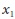 и 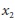. Гауссова неопределенность имеет значения 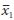 и 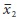 в совокупности со стандартными отклонениями 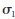 и . Стандартные отклонения – это выражение неопределенности относительно того, насколько хороши измерения. Распределение вероятности в зависимости от локаций именуется *Гауссовым распределением*:

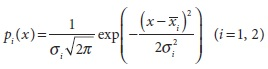

При наличии двух таких измерений, каждое с Гауссовым распределением вероятности, можно ожидать, что плотность вероятности при некотором значении *x* и учете обоих измерений будет пропорциональна 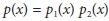. Оказывается, этот результат является ещё одним распределением гаусса, для которого можно вычислить среднее значение и стандартное отклонение следующим образом: при условии, что 

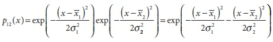

а также при условии, что распределение гаусса имеет максимум в среднем значение, можно найти это среднее значение просто вычислив производную *p(x)* по *x*. Производная функции в точке максимума равна 0:

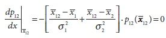

Т.к функция распределения вероятности *p(x)* никогда не равна 0, то выражение в скобках должно быть равно 0. Решение данного уравнения для *x* дает очень важное соотношение:

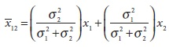

Это новое среднее значение 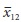 является просто взвешенной суммой двух измерений средних, где взвешивание определяется относительно неопределенности двух измерений. При этом, например, если неопределенность 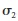 второго измерения особенно велика, то новое среднее по существу будет таким же, как среднее  для ранее определенного измерения.

После подставления нового среденего значения  в выражение 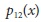 и существенных преобразований неопределенность 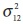 можно определить следующим образом:

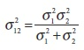

Но что означает полученная величина? На самом деле многое. А именно: при выполнении нового измерения с новыми значениями среднего и неопределенности, можно объединить эти значения с уже имеющимися значениями среднего и неопределенности для получения нового состояния, которое характеризуется ещё более новыми средним значением и неопределенностью.

Свойство, что два гауссова измерения в сочетании эквивалентны одному гауссовому измерению (с вычисленными средним и неопределенностью), является наиболее важным. Это означает, что при наличии измерения *M* можно объединить первые два измерения, третье объединить с объединением первых двух, четвертое объединить с объединением первых трех и т.д. Это именно то, что происходит при слежении в компьютерном зрении; после получения одной меры следует получение следующей, а за ней следйющей и т.д.

Приняв измерерния 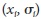 за временные шаги, можно вычислить текущее состояние оценки 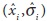 следующим образом. На первом шаге имеется только одно измерение 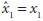 и его неопределенность 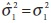. Подставляя эти значения в оптимальное уравнение оценки получается следующее уравнение:

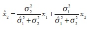

Преобразование данной формулы дает следующюю полезную формулу:

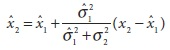

Прежде, чем беспокоиться о полезости этой формулы, необходимо также вычислить аналогичное уравнение для 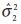. В о первых после подстановки 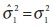 получается следующая формула:

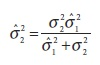

В результате преобразований, схожых с теми, что были сделаны для 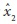, получается итерационное уравнение для оценки дисперсии нового измерения:

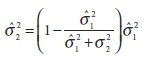

В таком виде данные уравнения позволяют точно отделить "старую" информацию (то, что было известно ранее как новое измерение) от "новой" информации (последенее измерение). Новая информация 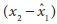, получаемая на втором шаге, именуется новейшей. Коэффициент оптимального итерационного обновления выглядит следующим образом:

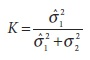

Этот коэффициент более известен как коэффициент *обновления прироста*. После применения данного коэффициента, ранее рассмотренные формулы преобразуются в удобные рекурсивные формулы:

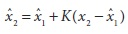

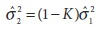

В литературе, когда речь заходит о фильтре Kalman в рамках генеральной выборки измерений второq шаг обозначается k, а первый k - 1.

**Динамичные системы**

В случае с одномерным примером был рассмотрен объект, расположенный в некоторой точке x с рядом последовательных измерений этой точки. В данном случае не было рассмотрено перемещение объекта между измерениями. Данный случай именуется *фазовым прогнозирования*. Во время фазового прогнозирования используются ранее полученные знания для предсказания того, где будет находиться система прежде чем будет интегрировано новое измерение.

На практике фазовое прогнозирование выполняется непосредственно после получения нового измерения, но перед тем, как новое измерение будет включено систему оценки состояния. Например имеется ситуацию, когда измеряется положение автомобиля в момент времени *t*, а потом в момент времени *t + dt*. Если автомобиль имеет некоторую скорость *v*, то второе измерение не так просто добавить в ряд измерений. Для начала необходимо отмотать модель на состояние со знанием о том, что было известно на момент времени *t* таким образом, чтобы имелось состоняие ситемы не только на момент времени *t*, но и на момент *t + dt*, за мгновение до включения новой информации. Таким образом, новую информацию, полученную в момент времени *t + dt*, сливают не со старой моделью системы, а со старой моделью системы за пределами момента времени *t + dt*. Это процесс изображен в виде цикла на рисунке 10-18. В контексте фильтра Kalman существует три вида движения, которые будут рассмотрены далее.

Первый вид движения - *динамическое движение*. Это движение соотносится с состоянием системы на последний момент времени. Если измерить систему в положении *x* со скоростью *v* в момент времени *t*, то система будет находится в момент времени *t + dt* в положении *x + v*dt*, возможно с той же скоростью.

Второй вид движения - *контролируемое движение*. Это движение проявляется в результате некотрого внешнего влияния на систему по какой-то известной причине. Как следует из названия наиболее популярный пример такого движения является 
оценочная функция состояния системы над которой имеется контроль и известна причина приведения данной системы в движение. Наиболее практичный пример использования данного движения проявляется в робототехнике, когда, например, необходимо придать ускорение или направить вперед робот. Очевидно, что в случае с роботом (положение *x*, скорость *v*, момент времени *t*) в момент времени *t + dt* он минует положение *x + v*dt* на чуть дальшее расстояние, т.к. роботу было придано ускорение. 

Третий вид движения - *случайное движение*. Даже в простом одномерном случае при самопроизвольном по какой то причине движении возникает необходимость включения случайного движения в этап прогнозирования. Воздействие такого случайного движения сводиться к увеличению дисперсионной оценки состояния с течением времени. Случайное движение включает в себя любые не известные или подконтрольные движения. Как и все остальное в рамках фильтра Kalman, существует предположение, что случайное движение это либо гауссиана (т.е. своего рода случайные блуждания), либо что-то столь же эффективное, как гауссиана.

Таким образом для добавления динамики к имитационной модели, необходимо вначале выпонить этап "обновление" до включения нового измерения. Этот этап включает в себя в первую очередь применение каких-либо знаний о движении объекта в соответствии с его предыдущим состоянием при задействовании любой дополнительной информации, полученной в результате собственных действий или действий, совершенных в другой системе, а также представление о случайных событиях, которые могут изменить состояние системы во время последенего измерения. После применения всех этих факторов можно совершить добавление нового измерения. 

На практике динамическое движение наиболее важно, когда "состояние" системы более сложное, чем имитационная модель. Зачастую, при движении объекта, "состояние" многокомпонентно: положение и скорость. В этом случае, состояние развивается в соответствии со скоростью. Процесс обработки многокомпонентной системы будет обсуждаться в следующем разделе.

**Уравнения Kalman**

Теперь настало время обобщить эти уравнения движения. Более обобщенное обсуждение покажет, как управлять любой моделей, которая является линейной функцией F состояния объекта. Такая модель может содержать сочетание первых и вторых производных, например, предыдущего движения. Также будет показано, как получить разрешение на управление входом 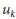 модели. И в заключение будут показаны более реалистичные наблюдения за моделью *z*, в которой можно измерить лишь некоторые из переменных состояния модели и в которой измерения могут быть лишь косвенно связаны с состоянием переменных.

Для начала необходимо рассмотреть, какое влияние *K* (коэффициент прироста из предыдущего раздела) оказывает на оценку. Если неопределенность нового измерения очень большая, то новое измерение по существу не оказывает влияния, а уравнения сводятся к обобщенному результату, точно к такому же, как в момент времени *k - 1*. С другой стороны, если начальное измерение имеет большую дисперсию, а последующее новое измерение будет более точным, то "доверие" будет вызывать более новое измерение. Когда оба измерения имеют равную уверенность (дисперсию), новое ожидаемое значение будет находиться между ними.

На рисунке 10-19 показано, как развивается неопределенность с течением времени при сборе новых наблюдений.


Рисунок 10-19. Сочетание предыдущих знаний 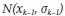 с текущим измерением 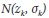; как результат – новая оценка 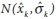

Идея обновления, чувствительная к неопределенности, может быть обобщена на основе множества переменных состояния. Простейшим примером этого может быть процесс отслеживания на видео объекта,  передвигающегося в двух или трех мерном измерении. В общем, состояние может содержать дополнительные элементы, такие как скорость отслеживаемого объекта. Обобщенным описанием состояния в момент времени *k* будет следующая функция состояния в момент времени *k - 1*:

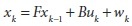

где 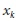 n-мерный вектор состояния компонентов, *F* – это матрица n×n, которую иногда называют *матрицей переноса*. 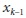 – это новый вектор. За счет него осуществляется внешний контроль над системой и состоит он из c-мерного вектора *управления входами*; *B* - это n×c матрица, которая связывает эти управляемые входы с переменным состоянием. (Внимательный читатель или тот, кто уже что-то знает о фильтрах Kalman, осознает еще одно важное допущение: существует линейная зависимость (за счет перемножения матриц) между управлениями  и изменениями состояния. На практике, данное предположение в первую очередь может сломать приложение.) Переменная  это случайная величина (именуемая *шумом обработки*), ассоциированная со случайными событиями или силами, которые непосредственно влияют на реальное состояние системы. Предполагается, что компонент  имеет гауссово распределение  для некой ковариационной матрицы  размера n×n (со временем *Q* можно изменять, однако, не рекомендуется делать это слишком часто).

В общем, выполняемые измерения  могут быть, а могут и не быть непосредственными измерениями переменной состояния . Обобщить данную ситуацию можно за счет ввода m-мерного вектора измерения :


где  – это матрица m×n,  – это величина погрешности, которая является гауссовым распределением  для некой ковариационной матрицы  размера m×m.

Теперь давайте рассмотрим конкретную реальную ситуацию с автомобилем на парковке. Состояние автомобиля можно свести к двум переменным положения *x* и *y* и скорости  и . Эти четыре переменные составляют вектор состояния . Это означает, что правильная форма *F* следующая:


Тем не менее при использовании камеры для выполнения измерения состояния автомобиля, скорее всего, достаточно измерить только переменные позиции:


Это означает, что структура *H* выглядит следующим образом:


В этом случае точно не возможно поверить в то, что скорость автомобиля постоянна, именно поэтому и происходит присвоение , чтобы отразить это. Выбор падает на , основываясь на оценке того, насколько точно было определено положение автомобиля при помощи (например) методов анализа изображения в видео потоке.

Теперь осталось только разместить полученные выражения в обобщенных уравнениях обновления. Основная идея заключается в следующем. Во-первых, необходимо вычислить априорную оценку состояния . В литературе это относительно распространенный (но не универсальный) шаг, использование минуса в виде верхнего индекса сообщает, что вычисляемая оценка производится "во время непосредственно перед получением нового измерения". Данная априорная оценка определяется следующим образом:


 используется для обозначения ковариационной ошибки, априорная оценка которой в момент времени *k* достигается за счет значения в момент времени *k - 1*:


Это уравнение формирует основу по части прогноза оценки, а также сообщает "чего ожидать", основываясь на том, что уже было увидено. В следствии этого такое состояние (без дифференцирования) зачастую именут *усилением Kalman* или *коэффициентом смешивания*, который сообщает о том, какой вес у новой информации относительно того, что уже известно:


Хотя это уравнение и выглядит устрашающе, в действительности не все уж так и плохо. Данное уравнение можно с легкостью понять, рассмотрев различные простые случаи. В случае одномерного примера, в котором измерялась непосредственно одна переменная позиции,  - это матрица 1x1, содержащая только 1! Таким образом, если ошибка измерения , то  также матрица 1x1, содержащая это значение. Точно также  просто дисперсия . Так что большое уравнение сводится к следующему:


Прирост, впервые показанный в предыдущем разделе, позволяет оптимально рассчитать значение обновления для  и  на момент доступности нового измерения:


Собственно что и требовалось доказать: на первый взгляд устрашающее уравнение оказалось при обсуждении простого одномерного случая не таким устрашающим, как кажеться! Оптимальные веса и приросты получаются тем же методом, что и в одномерном случае, только в данном случае необходимо минимизировать неопределенность положения состояния *x*, установив в 0 частные производные по *x* перед решением. 

Можно показать связь с простым одномерным случаем за счет установки *F = I* (где I единичная матрица), *B = 0* и *Q = 0*. Сходство с одномерным фильтром дифференцирования проявляется за счет выполнения следующих замен (в общих уравнениях): , , , , , , ,  и .

**OpenCV и фильтр Kalman**

На основе всего ранее представленного может сложиться мнение о том, что для выполнения подобного рода задач OpenCV и не нужно или, наоборот, без OpenCV будет невозможно справиться. К счастью, OpenCV поддается любой интерпретации. OpenCV предоставляет четыре функции, которые непосредственно связаны с работой фильтра Kalman:

```cpp
cvCreateKalman(
 int nDynamParams
,int nMeasureParams
,int nControlParams
);

cvReleaseKalman(
 CvKalman** kalman
);
```

Первая функция создает и возвращает указатель на структуру типа *CvKalman*, вторая функция удаляет эту структуру.

```cpp
typedef struct CvKalman {
int MP; // измерение векторного пространства
int DP; // состояние векторного пространства
int CP; // управление векторного пространства
CvMat* state_pre; // Экстраполяция (предсказание) вектора состояния:
// x_k = F x_k-1 + B u_k
CvMat* state_post; // корреляция вектора состояния:
// x_k = x_k’ + K_k (z_k’- H x_k’)
CvMat* transition_matrix; // стохастической матрица состояния
// F
CvMat* control_matrix; // матрица управления
// B
// (не использовать, если нет контроля)
CvMat* measurement_matrix; // матрица наблюдений
// H
CvMat* process_noise_cov; // ковариационная матрица случайного процесса
// Q
CvMat* measurement_noise_cov; // ковариационная матрица шума измерений
// R
CvMat* error_cov_pre; // ковариационная матрица экстраполированного вектора состояния:
// (P_k’=F P_k-1 Ft) + Q
CvMat* gain; // Оптимальная по Kalman матрица коэффициентов усиления:
// K_k = P_k’ H^T (H P_k’ H^T + R)^-1
CvMat* error_cov_post; // ковариационная матрица оценки вектора состояния системы
// P_k = (I - K_k H) P_k’
CvMat* temp1; // временные матрицы
CvMat* temp2;
CvMat* temp3;
CvMat* temp4;
CvMat* temp5;
} CvKalman;
```

Следующие две функции реализуют сам фильтр Kalman. После заполнения структуры данными, можно вычислить вектор состояния на следующем временном шаге за счет вызова *cvKalmanCorrect()* с последующей интеграцией новых измерений за счет вызова *cvKalmanCorrect()*. Результат вызова *cvKalmanCorrect()* размещается в *state_post*, а результат вызова *cvKalmanPredict()* в *state_pre*.

```cpp
cvKalmanPredict(
 CvKalman* kalman
,const CvMat* control = NULL
);

cvKalmanCorrect(
 CvKalman* kalman
,CvMat* measured
);
```

**Пример использования фильтра Kalman**

Например, имеется автомобиль, движущийся по кругу гоночной трассы. Автомобиль движется в основном с постоянной скоростью, хотя присутствуют и некоторые отклонения (т.е. случайные процессы). Для измерения положения автомобиля будут использоваться алгоритмы компьютерного зрения. Это порождает некоторые (несвязанные) шумы (т.е. измерения шума).

Таким образом, модель довольно таки проста: автомобиль имеет положение и угловую скорость в любой момент времени. Вместе эти два коэффициента формируют двумерный вектор состояния . Измерения только положения автомобиля формируют одномерный "вектор" .

Далее будет представлена программа (Пример 10-2), в которой будет рассмотрено перемещение автомобиля, движущего по кругу (красный), а также будут показаны сделанные измерения (желтый) и положения предсказанные фильтром Kalman (белый). 

Программа начинается со строк подключения заголовочных файлов библиотеки. Далее определяется макрос, который будет полезен в момент преобразования угловых координат положения автомобиля в декартовые для отображения их на экране.

Пример 10-2. Пример использования фильтра Kalman

```cpp
// Использование фильтра Kalman для моделирования частицы с круговой траекторией
//
#include “cv.h”
#include “highgui.h”
#include “cvx_defs.h”

#define phi2xy(mat) /
cvPoint( cvRound(img->width/2 + img->width/3*cos(mat->data.fl[0])), /
cvRound( img->height/2 - img->width/3*sin(mat->data.fl[0])) )

int main(int argc, char** argv) {

// Инициализация, создание объекта и окна под фильтр Kalman,  
// генератора случайных чисел
//
cvNamedWindow( “Kalman”, 1 );
... продолжение далее
```

Далее создается генератор случайных чисел, изображение для рисования и структура фильтра Kalman. Стоит обратить внимание на то, что фильтру Kalman необходимо сообщить размерность переменных состояния (2) и переменных измерения (1). 

```cpp
... продолжение ранее
CvRandState rng;
cvRandInit( &rng, 0, 1, -1, CV_RAND_UNI );

IplImage* img = cvCreateImage( cvSize(500,500), 8, 3 );
CvKalman* kalman = cvCreateKalman( 2, 1, 0 );
... продолжение далее
````

Далее создаются матрица (на самом деле вектор, однако в OpenCV все именуется матрицами) состояния *x_k*,  матрица нормального случайного процесса *w_k*, измерение *z_k* и наиболее важная стохастическая матрица состояния *F*. Матрица состояния инициализируется случайными числами близкими к нулю.

Стохастическая матрица состояния очень важна, т.к. она связывает состояние системы в момент времени *k* с состоянием в момент времени *k+1*. В этом случае данная матрица имеет размерность 2×2 (т.к. вектор состояния является двумерным). *x_k* представляет угловое положение (φ) и угловую скорость (ω) автомобиля. В этом случае матрица состояния содержит *[[1, dt], [0, 1]]*. Следовательно, после умножения на *F* состояние (φ, ω) меняется на (φ + ω×dt, ω), то есть угловая скорость остается неизменной, а угловое положение увеличивается на величину равную перемножению угловой скорости и временного шага. В данном примере для удобства используется *dt = 1.0*, но на практике необходимо использовать что-то типа времени между последовательными видеокадрами.

```cpp
... продолжение ранее
// состояние (phi, delta_phi) – угол и угловая скорость
// Инициализация случайными значениями
//
CvMat* x_k = cvCreateMat( 2, 1, CV_32FC1 );
cvRandSetRange( &rng, 0, 0.1, 0 );
rng.disttype = CV_RAND_NORMAL;
cvRand( &rng, x_k );

// матрица нормального случайного процесса
//
CvMat* w_k = cvCreateMat( 2, 1, CV_32FC1 );

// измерения, только один параметр для угла
//
CvMat* z_k = cvCreateMat( 1, 1, CV_32FC1 );
cvZero( z_k );

// Стохастическая матрица состояния ‘F’ связывает параметры модели 
// в момент времени k и в момент времени k + 1
//
const float F[] = { 1, 1, 0, 1 };
memcpy( kalman->transition_matrix->data.fl, F, sizeof(F));
... продолжение далее
```

Помимо этого фильтр Kalman имеет и другие внутренние параметры, которые также должны быть инициализированы. В частности матрица наблюдений *H* размера 1×2 должна быть инициализирована *[1, 0]*. Ковариационная матрица случайного процесса и ковариационная матрица шума измерений должны быть установлены в разумно интересные значения (тут можно поэкспериментировать), ковариационная матрица экстраполированного вектора состояния должна быть инициализирована единичной матрицей (это гарантирует значимость первой итерации; в последствии это значение будет перезаписано).

Таким же образом инициализируется корреляционный вектор состояния (гипотетически на шаге, предшествующий первому!) случайным значением, т.к. отсутствует информация на этот момент времени.

```cpp
... продолжение ранее
// Инициализация других параметров фильтра Kalman
//
cvSetIdentity( kalman->measurement_matrix, cvRealScalar(1) );
cvSetIdentity( kalman->process_noise_cov, cvRealScalar(1e-5) );
cvSetIdentity( kalman->measurement_noise_cov, cvRealScalar(1e-1) );
cvSetIdentity( kalman->error_cov_post, cvRealScalar(1));

// случайный выбор начального состояния
//
cvRand( &rng, kalman->state_post );
while( 1 ) {
... продолжение далее
```

Теперь все готово для проверки работы фильтра в динамике. В начале, отправляется запрос к фильтру для предсказания и обдумывания того, что получается на этом шаге (т.е. перед отдачей какой-либо новой информации); все это обозначено *y_k*. Затем происходит генерация нового значения *z_k* (измерения) для этой итерации. По определению это значение является "реальным " значением *x_k* помноженное на матрицу наблюдений *H* с добавлением случайного измерения шума. Стоит отметить, что только в этом игрушечном приложении генерируется *z_k* от *x_k*; в действительности, генерируемое значение будет браться в зависимости от окружающей среды или датчиков. В рассматриваемом примере значение генерируется на основе "реальной" модели данных с добавленным случайным шумом; в результате можно увидеть эффект от использования фильтра Kalman.

```cpp
. . . продолжение ранее
// предсказанное положение точки
const CvMat* y_k = cvKalmanPredict( kalman, 0 );

// генерация измерения (z_k)
//
cvRandSetRange(
 &rng
,0
,sqrt(kalman->measurement_noise_cov->data.fl[0])
,0
);
cvRand( &rng, z_k );
cvMatMulAdd( kalman->measurement_matrix, x_k, z_k, z_k );
... продолжение далее
```

Далее рисуются три точки, соответствующие наблюдениям, синтезированные ранее и расположенные согласно предсказаниям фильтра Kalman, и основному состоянию (которое случайно становиться известно в момент моделирования).

```cpp
... продолжение ранее
// рисование точек (eg convert to planar coordinates and draw)
//
cvZero( img );
cvCircle( img, phi2xy(z_k), 4, CVX_YELLOW ); // наблюдаемое состояние
cvCircle( img, phi2xy(y_k), 4, CVX_WHITE, 2 ); // “предсказанное” состояние
cvCircle( img, phi2xy(x_k), 4, CVX_RED ); // реальное состояние
cvShowImage( “Kalman”, img );
... продолжение далее
```

Теперь можно перейти к обработке следующей итерации. Для начала необходимо вновь вызвать фильтр Kalman и информировать его о новейших изменениях. Далее генерируется матрица случайного процесса. Затем задействуется стохастическая матрица состояния *F*, чтобы передвинуть *x_k* на один временной шаг вперед с последующим добавлением сгенерируемой матрицы случайного процесса; теперь все готово для совершения очередного круга.

```cpp
. . . продолжение ранее
// Регулирование состояния фильтра Kalman
//
cvKalmanCorrect( kalman, z_k );

// Применение стохастическая матрица состояния ‘F’
// матрицы случайного процесса w_k.
//
cvRandSetRange(
 &rng
,0
,sqrt(kalman->process_noise_cov->data.fl[0])
,0
);
cvRand( &rng, w_k );
cvMatMulAdd( kalman->transition_matrix, x_k, w_k, x_k );

// выход, если нажата клавиша ‘Esc’
if( cvWaitKey( 100 ) == 27 ) break;
}

return 0;
}
```

Собственно, как оказалось, реализовать фильтр Kalman не так уж и сложно; половина написанного кода служит для создания некоторой дополнительной информации. В любом случае, в заключении необходимо все обобщить, чтобы быть уверенными в том, что все это имеет смысл.

Все начинается с создания матриц для представления состояния системы и измерений, которые будут сделаны. Далее определяется стохастическая матрица состояния и ковариационная матрица шума измерений, а затем инициализируется ковариационная матрица случайного процесса и другие параметры фильтра.

После инициализации вектора состояния случайными значениями, вызывается фильтр Kalman для получения первого предсказания. После того, как предсказание (которое не очень важно на первой итерации) будет прочитано, оно выводиться на экран. Параллельно синтезируется новое наблюдение и тоже выводиться на экран для сравнения с предсказанным значением. Далее фильтр получает новую информацию в виде нового измерения, которое интегрировано во внутреннюю модель. И в заключении, синтезируется новое "реальное" состояние модели и цикл начинается по новой.

Запустив код, можно увидеть маленький красный шар, вращающийся по кругу. Маленький желтый шар, представляющий шум через который фильтр Kalman "пытается смотреть", время от времени появляется и исчезает около красного шара. Белый шар, быстро сходящийся в небольшом пространстве вокруг красного шара, показывает, что фильтр Kalman дает обоснованную оценку движения частицы (машины) в рамках модели.

Единственное, что не было рассмотрено в данном примере, так это использование управляемых входов. Например, если бы был рассмотрен радиоуправляемый автомобиль и имелись некоторые знания о том, каким образом человек управляет данным автомобилем, то можно было бы включить данную информацию в модель. В этом случае скоростью можно было бы управлять. Помимо ранее перечисленных параметров, потребовалось бы задать матрицу *B* (*kalman->control_matrix *), а так же позаботиться о наличии второго аргумента функции *cvKalmanPredict()* - вектора управления *u*.

### Немного о расширенном фильтре Kalman

Динамичная линейная система, состоящая только из основополагающих параметров, дольно таки ограничена. В дальнейшем, при рассмотрении динамичной нелинейной системы, фильтр Kalman будет полезен.

