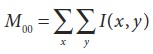
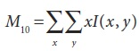
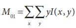
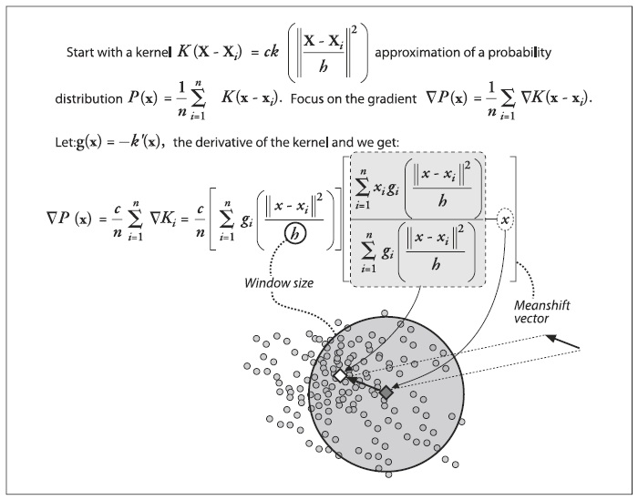
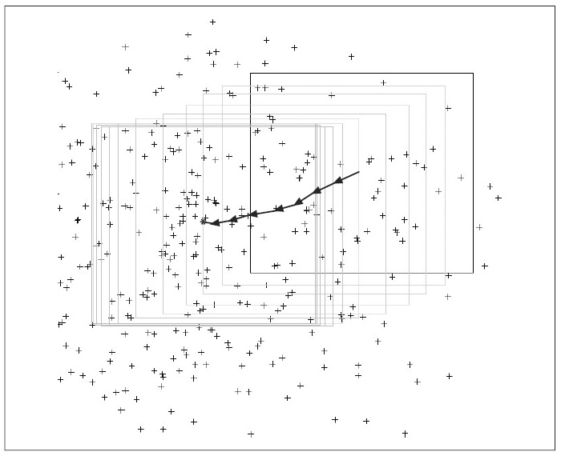

## (П]|(РС)|(РП) Mean-Shift и Camshift слежение

В данном разделе будет рассмотрено два метода: *mean-shift* и *camfhift* (где "camfhift" означает "непрерывно адаптирующийся mean-shift"). Первый является обобщенным методом анализа данных (обсуждался в главе 9, в контексте сегментации). После введения в общую теорию метода, будет рассмотрено, как OpenCV применяет его для отслеживания на изображениях. Второй метод построен на первом методе и обеспечивает слежение за объектами, чей размер может изменяться в течение всей видео последовательности.

### Mean-Shift

Алгоритм mean-shift – это надежный метод нахождения локальных экстремумов в плотном распределении набора данных. Это простой процесс непрерывного распределения; в данном контексте это по существу просто *алгоритм поиска восхождением к вершине* применяемый к плотной гистограмме данных (слово "по существу" используется из-за наличия аспекта, зависящего от масштаба, а точнее: mean-shift эквивалентен применению свертки ядра mean-shift к непрерывному распределению c последующим применением алгоритма поиска восхождением к вершине). Однако, для дискретного набора данных это несколько менее тривиальная проблема.

Дескриптор "надежный" используется в своем формальном статистическом смысле: то есть, mean-shift игнорирует излишки данных. Это означает, что игнорируются точки данных, которые находятся далеко от пиков данных. Это происходит за счет обработки точек только локального окна данных, в котором производится вся работа.

Алгоритм mean-shift работает следующим образом:

1. Выбирается окно поиска:

    * его первоначальное расположение;

    * его тип (равномерное, полиномиальное, экспоненциальное или гауссово);

    * его форма (симметричное или ассиметричное, возможно повернутое, округлое или прямоугольное);

    * его размер (степень, при которой происходит сворачивание или отсечение).

2. Вычисляется центр масс окна (возможно взвешенного).

3. Совмещается центр окна с центром масс.

4. Возвращаться к шагу 2 до тех пор, пока окно не остановится (это происходит всегда). (Количество итераций обычно ограничено каким-то максимальным числом или каким-то эпсилон изменения сдвигаемого центра между итерациями; однако, количество, в конечном счете, гарантированно достигнет установленного значения).

Немного более формальный смысл алгоритма mean-shift: алгоритм связан с оценкой плотности ядра, где "ядро" это функция, имеющая в основном местный фокус (например, распределение Гаусса). С довольно средневзвешенными и отсортированными по величине расположения точек ядрами, можно представить распределение данных исключительно в терминах этих ядер. Mean-shift расходиться с оценкой плотности ядра, т.к. стремится оценить только градиент (направление изменений) распределения данных. Когда это изменение равное 0, то имеем стабильный (возможно локальный) максимум распределения. Около этого максимума могут быть и другие.

На рисунке 10-11 показаны уравнения, задействованные в алгоритме mean-shift. Эти уравнения могут быть упрощены, если ядро будет *прямоугольное*; благодаря данному факту сокращается векторное уравнение mean-shift, вычисляемое центр масс распределения пикселей изображения:


где нулевой момент вычисляется по следующей формуле:



а первые моменты:

 



Рисунок 10-11. Уравнения mean-shift и их смысл

Вектор mean-shift говорит о центрировании окна mean-shift в соответствии с рассчитанным центром масс этого окна. Перемещение окна изменяет все то, что находиться "под" ним, именно поэтому процесс центрирования итерационный. Такое центрирование всегда будет обеспечивать сходимость вектора mean-shift в 0 (т.е. когда центрирование более не возможно). Расположение сходимости является локальным максимумом распределения под окном. Различные размеры окна порождают различные пики, т.к. "пик" зависит от масштаба.

На рисунке 10-12 представлен пример двумерного распределения данных и инициализация (в данном случае прямоугольного) окна. Стрелки показывают процесс сходимости распределения (пик) в автономном режиме. Найденный пик статистически надежен в том смысле, что точки вне окна mean-shift не влияют на сходимость – алгоритм просто не "отвлекается" на далекие точки.



Рисунок 10-12. Алгоритм mean-shift в действии: исходное окно находиться над двумерным массивом точек и последовательно центрирует его распределение данных до сходимости

В 1998 году стало ясно, что этот алгоритм может быть использован для отслеживания движущихся объектов в видеопотоке; с тех пор алгоритм был значительно расширен. Функция OpenCV, представляющая алгоритм mean-shift, реализована в контексте анализа изображения. Это, в частности, означает, что вместо некоторого произвольного набора точек (возможно, с какой-то произвольной размерностью), в OpenCV реализован mean-shift, ожидающий в исходное изображение, представляющее плотное распределение для анализа. Это может быть представлено, как некое изображение двумерной гистограммы измерения плотности точек в некотором двумерном пространстве. Как оказалось, в рамках компьютерного зрения, это именно то, что необходимо делать большую часть времени: а именно то, как отслеживать движения кластера с интересными особенностями.

```cpp
int cvMeanShift(
 const CvArr* prob_image
,CvRect window
,CvTermCriteria criteria
,CvConnectedComp* comp
);
```

