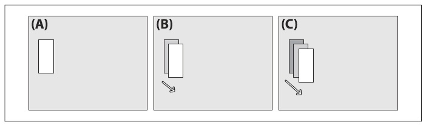
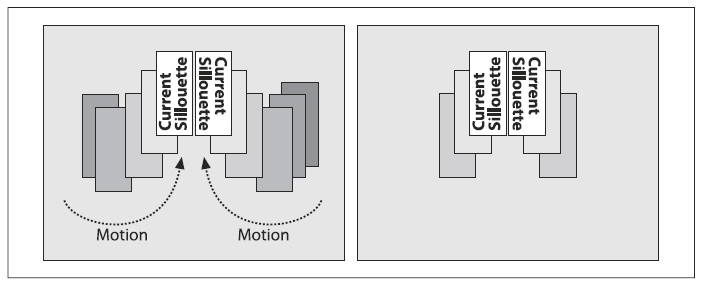
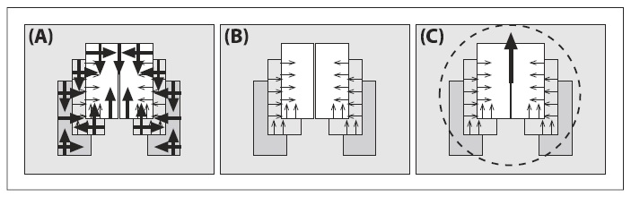
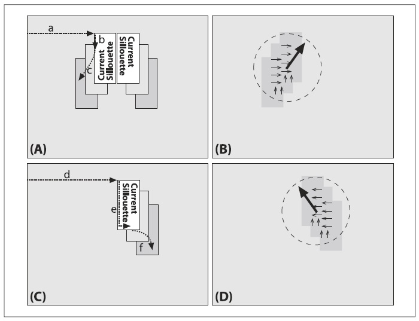
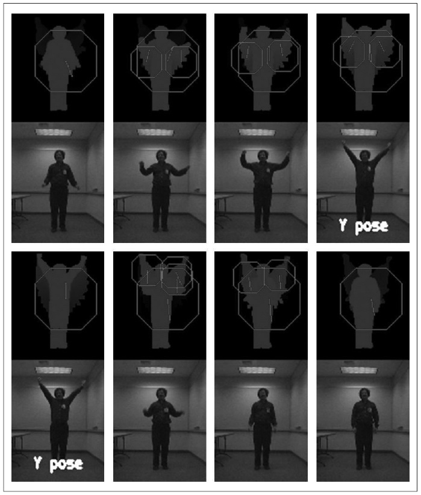

## [П]|(РС]|(РП) Шаблоны движения

Шаблоны движения были изобретены в MIT Media Lab Bobick и Davis и получили дальнейшее развитие совместно с одним из авторов: Davis, Bradski. Это довольно таки новая работа формирует основу реализации шаблонов движения в OpenCV.

Шаблоны движения являются эффективным способом отслеживания общих движений, особенно применимы при распознавании жестов. При использовании шаблонов движения необходимо наличие силуэта (или части силуэта) объекта. Силуэты объекта могут быть получены несколькими способами.

1. Простейший способ получения силуэтов объектов – это разумное использование стационарной камеры и последующего использования разностей между кадрами (как было описано в главе 9). Эти действия приводят к получению движущихся контуров объектов, которых вполне достаточно для производства работоспособных шаблонов движения.

2. Можно использовать цветные манипуляции. Например, при знании того, что фоном является все ярко зеленое, можно принять в качестве переднего плана все то, что не ярко зеленого цвета. 

3. Другой способ (также обсуждаемый в главе 9) заключается в изучении фоновой модели, благодаря которой можно выделить новые объекты/людей на переднем плане как силуэты.

4. Можно использовать активный метод определения силуэта – например, создавая стену вблизи инфракрасного света при наличии инфракрасной камеры смотрящей на эту стену. Любое попадание объекта в данное поле зрения будет отображаться как силуэт.

5. Можно использовать тепловизоры; то любой горячий объект (например, лицо) может быть рассмотрен как объект переднего плана.

6. И в заключение, можно использовать методы сегментации для создания силуэтов (например, пирамидальную или mean-shift сегментацию), описанные в главе 9.

Пусть имеется хорошо сегментированный силуэт лица в виде белого прямоугольника, рисунок 10-13(A). Белый цвет используется для указания того, что все пиксели имеют значения типа float в самый последний момент времени. Движение прямоугольника свидетельствует о захвате нового силуэта и перекрытии им (новым) предыдущего в текущий момент времени; новый силуэт соответствует белому прямоугольнику на рисунке 10-13(B) и рисунке 10-14(C). Старые перемещения показаны на рисунке 10-13 последовательно затемненные прямоугольники. Эти последовательно исчезающие силуэты фиксируются в истории, именуемая  "изображением истории перемещений", как предыдущие перемещения.



Рисунок 10-13. Диаграмма шаблона движения: (A) сегментированный объект в текущий момент времени (белый); (B) следующий временной шаг, объект переместился и был зафиксирован новый силуэт, старый отошел на задний план; (C) следующий временной шаг, объект вновь переместился, оставив старые сегменты позади в виде последовательности темных прямоугольников, тем самым сформировав изображении истории перемещений

Силуэты, временные отметки которых больше заданного значения устанавливаются в 0, рисунок 10-14. Функция, выполняющая шаблоны движения, выглядит следующим образом:

```cpp
	void cvUpdateMotionHistory(
		 const CvArr* 	silhouette
		,CvArr* 		mhi
		,double 		timestamp
		,double 		duration
	);
```



Рисунок 10-14. Шаблон движения силуэтов двух движущихся объектов (слева); силуэты, чьи временные отметки превышают заданного значения, устанавливаются в 0 (справа)

В *cvUpdateMotionHistory()* все массивы изображений содержат только одноканальные изображения.  *silhouette* - это изображение, в котором ненулевые пиксели представляют собой недавно сегментированные силуэты объектов переднего плана. Изображение *mhi* это вещественное изображение, которое представляет шаблон движения. Параметр *timestamp* - это текущая отметка времени (как правило, в миллисекундах), а так же продолжительность, на протяжении которой силуэт должен оставаться в *mhi*. Другими словами, любые пиксели *mhi* у которых временная отметка старше (меньше), чем *timestamp* минус *duration* устанавливаются в 0. 

После получения коллекции силуэтов объекта наложенных во времени, можно получить представлении о перемещении в целом, взяв градиент *mhi* изображения. После взятия этих градиентов (например, при помощи функций Scharr или Sobel, описанных в главе 6), некоторые градиенты будут большими и неработоспособными. Градиенты будут неработоспособными, когда старые или неактивные части изображения *mhi* будут установлены в 0, в результате чего будут получаться большие градиенты вокруг внешних границ силуэтов, рисунок 10-15(A). Поэтому, зная продолжительность временного шага, с которым заносятся новые силуэты в *mhi* через *cvUpdateMotionHistory()*, можно узнать насколько большим должен быть градиент. Таким образом, можно использовать данную величину градиента, что удалить градиенты, которые слишком велики, рисунок 10-15 (B). И в заключение, из коллекции можно выявить общее направление перемещения, рисунок 10-15(C). Все что показано на частях (A) и (B) изображения выполняет функция *cvCalcMotionGradient()*:

```cpp
	void cvCalcMotionGradient(
		 const CvArr* 	mhi
		,CvArr* 		mask
		,CvArr* 		orientation
		,double 		delta1
		,double 		delta2
		,int 			aperture_size = 3
	);
```



Рисунок 10-15. Градиенты перемещения mhi изображения: (A) величины и направления градиентов; (B) устранение больших градиентов; (C) поиск общего направления движения

В *cvCalcMotionGradient()* все массивы изображения являются одноканальными. Входное изображение *mhi* является вещественным изображением истории перемещения, а входные переменные *delta1* и *delta2* являются (соответственно) минимальным и максимальным значениями градиента. Ожидаемая величина градиента – это среднее значение временной отметки между каждым силуэтом при последовательном вызове *cvUpdateMotionHistory()*; хорошие результаты можно получить при *delta1* установленного в (среднее значение)/2, а *delta2* в 3×(среднее значение)/2. Переменная *aperture_size* задает размер оператора градиента по ширине и высоте. Это значение может быть установлено в -1 (градиент 3×3, фильтр *CV_SCHARR*), 3 (по умолчанию фильтр Sobel 3×3), 5 (фильтр Sobel 5×5) или 7 (фильтр 7×7). Выходной параметр *mask* - это одноканальное 8-битное изображение, в котором ненулевые элементы указывают на валидные градиенты, *orientation* - это вещественное изображение, содержащие угол направления градиента в каждой точке.

Функция *cvCalcGlobalOrientation()* определяет общее направление движения как векторную сумму действующих направлений градиента.

```cpp
	double cvCalcGlobalOrientation(
		 const CvArr* 	orientation
		,const CvArr* 	mask
		,const CvArr* 	mhi
		,double 		timestamp
		,double 		duration
	);
```

При использовании функции * cvCalcGlobalOrientation()*, в нее передаются вычисленные в * cvCalcMotionGradient()* *orientation* и * mask* вместе с *timestamp*, *duration* и конечным *mhi* из * cvUpdateMotionHistory()*; в результате будет возвращен суммарный вектор общего направления, рисунок 10-15(C). *timestamp* вместе с *duration* сообщают функции склько движений необходимо рассмотреть от изображений *mhi* и *orientation*. Вычислить общее направление передвижения можно за счет центра масс каждого силуэта *mhi*, однако, суммирование заранее вычисленнх векторов передвижения приводит к результату гораздо быстрее.

Помимо этого, можно изолировать определенный регион изображения *mhi* и определить локальное перемещение этого региона, рисунок 10-16. На рисунке изображение *mhi* сканируется на текущих регионах силуэта. После того, как будет найден регион, помеченный последеней отметкой времени, за счет его периметра ищется недавнее премещение (последние силуэты) простым использованием пространства за пределами периметра данного региона. Когда такие движения будут найдены, низходяще-пошаговое потоковое заполнение изолирует локальный регион передвижения, который "разливается" от текущего расположения интересующего объекта. После того, как поиск будет произведен, можно переходить к вычислению локального направления градиента перемещения в "разлитой"" области, а затем удалить этот регион и повторить процесс до тех пор, пока все регионы не будут найдены (как показано на рисунке 10-16).



Рисунок 10-16. Сегментация регионов перемещения на изображении mhi: (A) сканирование изображения mhi для текущих силуэтов (a) и если найден результат, то выйти за периметр в поисках других недавних силуэтов (b); когда будет найден последний силуэт, выполнить низходяще-пошаговое потоковое заполнение для изоляции локального перемещения; (B) использовать градиенты, найденные в изолированных локальных регионах перемещения, для вычисления локального перемещения; (C) удалить ранее найденный регион и выполнить поиск для следующего региона силуэта (d), выполнить по нему сканирование (e) с последующим применением низходяще-пошагового потокового заполнения (f); (D) вычислить перемещение в рамках недавно изолированного региона и повторять процессы (A)-(C) до тех пор, пока не закончатся силуэты

*cvSegmentMotion()* - это функция, которая изолирует и вычисляет локальное перемещение:

```cpp
	CvSeq* cvSegmentMotion(
		 const CvArr* 	mhi
		,CvArr* 		seg_mask
		,CvMemStorage* 	storage
		,double 		timestamp
		,double 		seg_thresh
	);
```

Параметр *mhi* - это одноканальное вещественное изображение. Параметр *storage* - это структура типа *CvMemoryStorage* под которую заранее необходимо выделить память при помощи *cvCreateMemStorage()*. Другой входной параметр *timestamp* содержит значение последенего силуэта из *mhi* в котором необходимо выделить сегмент локальных передвижений. И в завершении, необходимо передавать значение *seg_thresh*, указывающее на максимально возможное уровень спуска (от текущего момента времени и в сторону предыдущих передвижений). Этот параметр необходимо задавать для избежания ситуаций, при которых перекрывающиеся предыдущие силуэты не сливались вместе с намного старыми передвижениями.

Как правило, лучше всего устанавливать *seg_thresh* в 1.5 от средней разницы между отметками времени  силуэтов. Эта функция возвращает последовательность *CvSeq* структур *CvConnectedComp*, по одной для каждого отдельно найденного движения, очерченного локально перемещающимися регионами; в дополнение к этому, функция также возвращает *seg_mask* - одноканальное, вещественное изображение, в котором каждый регион изолирует передвижения за счет отметки ненулевым значением (нулевое значение указывает на отсутствие передвижения). Для вычисления локальных передвижений по одному за раз, необходимо вызывать *cvCalcGlobalOrientation()* c использованием соответствующей маски региона, которая выбирается из соответствующей структуры *CvConnectedComp* или обособленной части *seg_mask*; например, так:

```cpp
	cvCmpS(
		 seg_mask
		// ,[value_wanted_in_seg_mask]
		// ,[your_destination_mask]
		,CV_CMP_EQ
	)
```

Теперь, с учетом всего рассмотренного материала данного раздела главы, должен быть понятен пример *motempl.c*, который поставляется с OpenCV в разделе *…/opencv/samples/c/*. Функция *update_mhi()* извлекает шаблоны согласно пороговым различиям между кадрами с последующей передачей полученных силуэтов в *cvUpdateMotionHistory()*:

```cpp
	...
	cvAbsDiff( buf[idx1], buf[idx2], silh );
	cvThreshold( silh, silh, diff_threshold, 1, CV_THRESH_BINARY );
	cvUpdateMotionHistory( silh, mhi, timestamp, MHI_DURATION );
	...
```

В результате градиенты размещаются в изображение *mhi*, а маска валидных градиентов получается за счет использования *cvCalcMotionGradient()*. Затем под *CvMemStorage* выделяется память (если уже выделена, то только очищается) и в результате локальные передвижения размещаются в структурах *CvConnectedComp* последовательности *seq* типа *CvSeq*:

```cpp
	...
	cvCalcMotionGradient(
		 mhi
		,mask
		,orient
		,MAX_TIME_DELTA
		,MIN_TIME_DELTA
		,3
	);

	if( !storage )
		storage = cvCreateMemStorage(0);
	else
		cvClearMemStorage(storage);

	seq = cvSegmentMotion(
		 mhi
		,segmask
		,storage
		,timestamp
		,MAX_TIME_DELTA
	);
```

Цикл "for" работает до выполнения условия достижения значения *seq->total* структур *CvConnectedComp*, извлекая при этом ограничительные прямоугольники для каждого перемещения. Итерационный процесс начинается с -1, что соответствует особому случаю для нахождения общего перемещения на изображении. Для сегментов локальных перемещений, сначала отбрасываются малые сегментированные участки, а затем рассчитывается ориентация для оставшихся при помощи *cvCalcGlobalOrientation()*. Вместо использования точных масок, эта функция ограничивает расчеты перемещения за счет использования ROIs, которые ограничивают локальные перемещения. Любые малые участки отбрасываются. В заключении, функция рисует перемещения. Пример человека, хлопающего в ладони, показан на рисунке 10-17 в виде четырех последовательных кадров (полный пример кода можно найти в *…/opencv/samples/c/motempl.c*). В той же последовательности, также представлена поза "Y"  дескрипторами (Hu моментами) из главы 8, однако, данный пример отсутствует в директории примеров *samples*.

```cpp
for( i = -1; i < seq->total; i++ ) {
	if( i < 0 ) { // case of the whole image
		// ...[does the whole image]...
	else 
	{ // i-th motion component
		comp_rect = ((CvConnectedComp*)cvGetSeqElem( seq, i ))->rect;
		// [reject very small components]...
	}

	...[set component ROI regions]...
	angle = cvCalcGlobalOrientation( orient, mask, mhi, timestamp, MHI_DURATION );
	...[find regions of valid motion]...
	...[reset ROI regions]...
	...[skip small valid motion regions]...
	...[draw the motions]...
}
```



Рисунок 10-17. Результаты работы функции шаблонов движения: определение движений по горизонтали и сверху вниз, совершаемые человеком, а также общего направления перемещения (отмеченного большим восьмиугольником) и локальных перемещений (отмеченные небольшими восьмиугольниками); поза «Y» может быть распознана при помощи дескрипторов (Hu моментов)