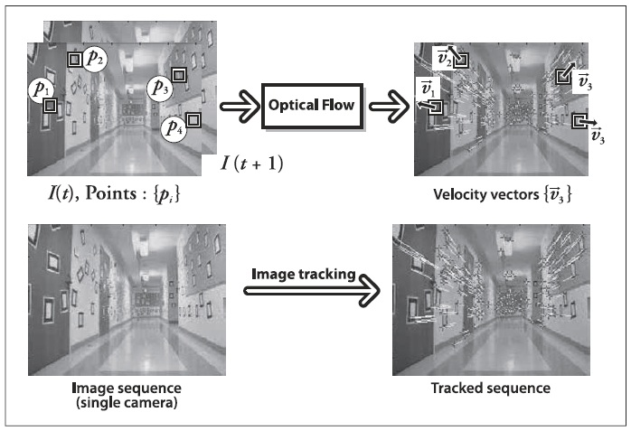
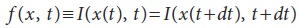
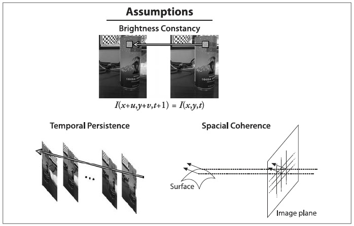
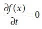
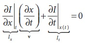
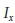
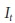
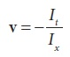

## (П]|(РС)|(РП) Оптические потоки

Ранее уже было сказано, что иногда возникает необходимость в оценке движений между двумя кадрами (или последовательностью кадров) без каких-либо других предварительно полученных знаний о содержании этих кадров. Как правило, само движение является знаком того, что происходит что-то интересное. Оптический поток представлен на рисунке 10-3.

Рисунок 10-3. Оптический поток: целевые особенности (сверху слева) отслеживаются в течение долгого времени, а их движения преобразуются в вектор скорости (сверху справа); на нижней панели представлен общий вид коридора (слева) и вектора потока (справа) того, как движется камера по коридору

Можно связать некую скорость каждого пикселя в кадре или, что эквивалентно, некоторое смещение, представляющее собой расстояние на которое сместиться пиксель при сравнении предыдущего и текущего кадра. Такая конструкция обычно именуется *плотным оптическим потоком*, который связывает скорость с каждым пикселем изображения. *Метод Horn-Schunck* пытается вычислять только скорости полей. Еще один, казалось бы, простой метод – просто пытается сопоставить окна вокруг каждого пикселя от кадра к кадру –  так же реализован в OpenCV; этот метод также известен как *блок сопоставления*. Оба представленных метода будут более детально представлены в разделе "Методы плотного слежения".

На практике рассчитать плотный оптический поток не так то и легко. Рассмотрим пример движения белого листа бумаги. Многие белые пиксели из предыдущего кадра остаются белыми и в последующем кадре. При этом изменениям могут быть подвержены лишь края и то только те, что перпендикулярны направлению движения. Как результат, плотные методы должны иметь в наличии некоторые методы интерполяции между точками, которые легче отследить для вычисления неоднозначных точек. Эти проблемы наиболее ярко проявляются в виде высоких вычислительных затратах плотного оптического потока.

Это порождает альтернативный вариант, *разряженный оптический поток*. Алгоритмы такого рода опираются на заранее заданное некоторым образом подмножество точек, которое подлежит отслеживанию. Если точки обладают заранее определенными подходящими свойствами, такими как ранее обсуждаемые "углы", то отслеживание будет относительно прочным и надежным. OpenCV может помочь при решении данного вопроса, путем предоставления процедур для выявления лучших возможностей отслеживания. На практике вычислительная стоимость от использования разряженного потока намного меньше, чем от использования плотного потока, поэтому интерес к последнему лишь академический. (Black и Anadan создали методы плотного оптического потока, которые зачастую используются при создании фильмов, в которых упор делается на получения качественной картинки. Эти методы планируется включить в более поздние версии OpenCV, глава 14).

В следующих нескольких разделах будет представлено несколько различных методов отслеживания. Вначале будет представлена наиболее популярная разряженная техники слежения, Lucas-Kanade (LK) оптический поток; этот метод также имеет вариант реализации для работы со снимками пирамид, позволяющие отслеживать быстрые движения. Затем будут представлены две плотные техники слежения, метод Horn-Schunck и метод сопоставления блоков.

### Метод Lucas-Kanade

Первоначально предполагалось (в 1981 году), что алгоритм Lucas-Kanade (LK) будет использоваться для создания плотных потоков. Но, т.к. метод было легко применить к подмножеству точек исходного изображения, он стал более важен для создания  разряженных потоков. Алгоритм LK может быть применен в контексте разряженного потока, т.к. опирается только на локальную информацию, которая является производной от некоторого небольшого окна, окружающего каждую точку, вызывающей интерес. Это главное отличие от алгоритма Horn и Schunck, где используется глобальная характеристика (подробнее об этом позже). Недостаток использования небольших локальных окон в методе Lukas-Kanade заключается в том, что большие сдвиги могут переместить точки вне локального окна, в результате чего невозможно будет осуществить поиск. Эта проблема привела к появлению "пирамидального" алгоритма LK, который начинает отслеживать от наивысшего (с низкой детализацией) к более низшему (с высокой детализацией) уровню пирамиды. Слежение при помощи пирамид позволяет поймать большие перемещения в пределах локального окна. 

Т.к. это важный и эффективный метод, то вначале будут представлены математические детали; читатели, которым данные детали не интересны, могут сразу перейти к описанию функий и разбору кода. Однако, рекомдуется все же изучить эти детали хотя бы для того, чтобы интуитивно понимать, что делать, если отслеживание работает плохо. 

**Принципы работы алгоритма Lucas-Kanade**

Основная идея алгоритма LK заключена в трех предположениях.

1. *Постоянство яркости*. Пиксель объекта на изображении не изменяется внешне (по возможности) при перемещении от кадра к кадру. Для серого изображения (LK так же можно применять и для цветного изображения) это предположение означает, что яркость пикселя не изменяется при слежении от кадра к кадру.

2. *Временное постоянство или "малые перемещения"*. Изменение движущейся поверхности патча изображения во времени происходит очень медленно. На практике это означает, что приращение времени достаточно велико относительно масштаба движения в изображении, то есть объект мало перемещается от кадра к кадру.

3. *Пространственная когерентность*. Соседние точки на сцене принадлежат одной поверхности, имеют аналогичные движения и проектируются к соседним точкам на плоскости изображения.

Представленные предположения, проиллюстрированые на рисунке 10-4, дают эффективный алготирм слежения. Первое требование, постоянство яркости, является требованием, которое свидетельствует о том, чтобы пиксели в одном отслеживаемом патче выглядели одинаково в течение долгого времени:

Рисунок 10-4. Предположения, составляющие основу оптического потока Lucas-Kanade: яркость патча, с отслеживаемым объектом в сцене, не меняется (сверху); перемещения медленные относительно частоты кадров (снизу слева); соседние точки остаются соседними (снизу справа)

Это достаточно просто и означает лишь то, что отслеживаемая интенсивность пикселя не изменяется в течение долгого времени:

Второе предположение, временное постоянство, по существу означает, что движения малы от кадра к кадру. Другими словами, можно рассматривать эти изменения как аппрокисмацию производной интенсивности по времени (т.е. изменения между текущим и следующим кадром малы). Для понимания данного предположения, рассмотрим случай с участием одной пространственной размерности.

В этом случае, все начинается с уравнения постоянства яркости с заменой яркости f(x, t) (принимая во внимание неявную зависимость x от t) на I(x(t), t) и последующим применением правила частичного дифференцирования. Все это даёт: 

где  пространственная производная первого изображения,  производная между изображениями на определенном промежутке времени и **v** скорось, которую необходимо найти. В результате получаем простое уравнение скорости оптического потока в простом одномерном случае:

Для начала необходимо разобраться с некоторыми интуитивными вещами одномерной задачи слежения. На рисунок 10-5 изображен "край" - состоящий из большого значения слева и малого значениях справа - движущиеся вправа вдоль оси x. Цель заключается в том, чтобы определить скорость **v** с которой перемещается край, что собственно изображено в верхней части рисунка 10-5. В нижней части рисунка показано, что измерение этой скорости это просто "прирост движения", где прирост это время, а движение это наклон (пространственная производная). Отрицательный знак корректирует наклон относительно x.

