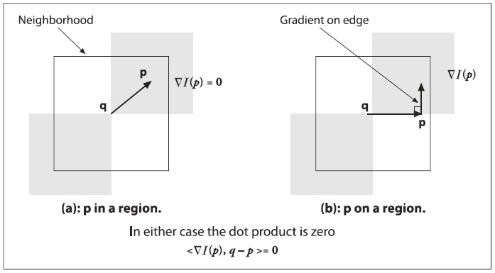

## (П]|(РС)|(РП) Углы субпикселя

Если изображения обрабатываются с целью извлечения геометрических измерений, то в отличии от выделения особенностей необходимо выполнить нечто большее, чем просто выделить пиксель. К тому при работе с пикселями приходиться иметь дело с целочисленными координатами, хотя иногда возникает необходимость и в вещественных координатах (например, пиксель (8.25, 117.16)).

Если допустить, что необходимо взглянуть на острый пик в значениях изображения, то окажеться, что расположение пика почти никогда не будет точно в центре пикселя камеры. Чтобы это исправить, можно подобрать кривую (например, параболу) к значениям изображения, а затем использовать немного математики, чтобы найти местоположение пика между пикселями. Все методы обнарежения субпикселя используют данную хитрость. В общем измерерния изображения используются для отслеживания трехмерных перестроений, калибровки камеры, деформации частично перекрытых сцен для того, чтобы сшить их вместе в более естественый вид, и для поиска внешнего сигнала (например, точного местоположения здания на изображении со спутника).

Местоположение угла субпикселя является обобщенным измерением и используется для калибровки камер, или для отслеживания перестроений траектории камеры или трехмерной структуры отслеживаемого объекта. Теперь, зная как искать местоположение угла в целочисленной сетке пикселей, вот хитрость, которую необходимо использовать для уточнения местоположения субпикселя: все сводится к использованию математического факта - сколярное произведение между вектором и ортоганалью вектора равно 0; данный факт имеет место для местоположения углов, показанных на рисунке 10-2.



Рисунок 10-2. Поиск углов с точностью до субпикселей: (a) область изображения вокруг точки p является однородной и потому её градиент равен 0; (b) градиент края это ортоганальный вектор q-p; в любом случае, сколярное произведение между градиентом p и вектором q-p равно 0

На рисунке начальные координаты местоположения угла q находятся вблизи фактического местоположения угла субпикселя. Рассматривая вектор q-p и принимая во внимание, что p расположено вблизи обнородного или "ровного" региона, градиент равен 0. С другой стороны, если вектор q-p совпадает с краем, то градиент p этого края ортоганален вектору q-p. В любом случае, сколярное произведение между градиентом p и вектором q-p равно 0. Можно собрать много таких пар градиента для соседей точки p и связанных с ней векторов q-p, задать скалярное произведение в 0 и решить получившуюся систему уравнений; решение предоставит более точную информацию о местоположении субпикселя q и о его corner (угол).

Функция, которая осуществляет поиск угла выглядит следующим образом:

```cpp
void cvFindCornerSubPix(
	 const CvArr* 		image
	,CvPoint2D32f* 		corners
	,int 				count
	,CvSize 			win
	,CvSize 			zero_zone
	,CvTermCriteria 	criteria
);
```

*image* - это исходное одноканальное 8-битное серое изображение. 