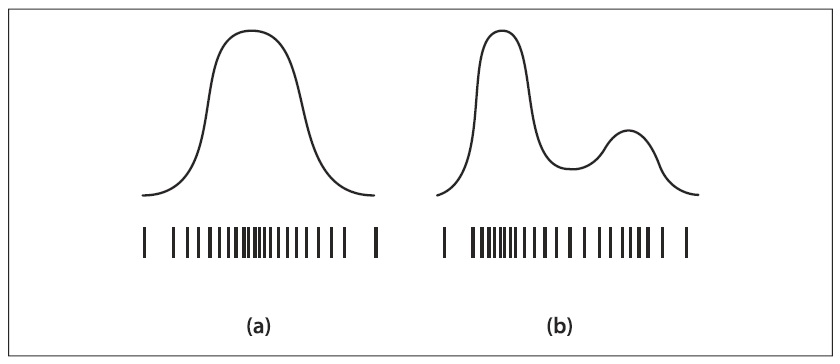

## [П]|[РС]|(РП) Алгоритм условно плотного распространения

Модели фильтра Kalman могут иметь только одно предположение. Из-за того, что базовая модель распределения вероятности является унимодальной гауссианой, нельзя представить несколько предположений одновременно при использовании фильтра Kalman. Несколько более расширенный метод, известный как *алгоритм condensation* (**Cond**itional **Dens**ity Propag**ation** - условно плотное распространение), основанный на широком классе оценок именуемых *фильтром particles*, позволит преодолеть данную проблему.

Для осознания назначения алгоритма условно плотного распространения, необходимо рассмотреть предположение, что объект движется с постоянной скоростью. Любые измеренные данные, по существу, должны быть интегрированы в модель, как если бы эта модель поддерживала данное предположение. Теперь пусть имеется объект, двигающийся по траектории с преградами. Для этого случая не известно, что объект делает; он может двигаться с постоянной скоростью, может остановиться и/или двигаться в противоположном направлении. Фильтр Kalman не может быть представлен этими несколькими вероятностями, просто расширив неопределенность, связанную с (гауссиана) распределением положений объекта. Фильтр Kalmana – это обязательно гауссиана, поэтому он не может быть представлен мультмодальными распределениями.

Как и в случае с фильтром Kalman имеется две функции для создания и уничтожения структуры данных, используемой в фильтре *condensation*. Разница между этими функциями заключается в том, что в случае функции создания *cvCreateConDensation()* имеется дополнительный параметр. Введенное значение для этого параметра задает число предположений, которые фильтр будет поддерживать в любой момент времени. Это число должно быть достаточно большим (50 или 100; возможно и больше для более сложных случаев), т.к. набор отдельных предположений занимает место в параметризованном распределении вероятности Гаусса фильтра Kalman (Рисунок 10-20).



Рисунок 10-20. Распределение, которое может (a) и не может (b) быть представлено в виде непрерывного параметризованного распределения Гаусса со значениями среднего и неопределенности; оба распределения в качестве альтернативы могут быть представлены набором *particles*, плотность которых приблизительно соответствует представленному распределению

```cpp
	CvConDensation* cvCreateConDensation(
		 int 	dynam_params
		,int 	measure_params
		,int 	sample_count
	);

	void cvReleaseConDensation(
	 	CvConDensation** 	condens
	);
```

Структура данных *CvConDensation* имеет следующие внутренние элементы:

```cpp
	typedef struct CvConDensation
	{
		int 			MP; 			// Размерность вектора измерений
		int 			DP; 			// Размерность вектора состояния
		float* 			DynamMatr; 		// Матрица линейной динамики системы
		float* 			State; 			// Вектор состояния
		int 			SamplesNum; 	// Число образцов
		float** 		flSamples; 		// массив векторов-образцов
		float** 		flNewSamples; 	// временный массив векторов-образцов
		float* 			flConfidence; 	// Confidence для каждого образца
		float* 			flCumulative; 	// Cumulative confidence
		float* 			Temp; 			// Временный вектор
		float* 			RandomSample; 	// RandomVector для обновления образца
		CvRandState* 	RandS; 			// массив структур, генерируемый случайными векторами
	} CvConDensation;
```

После выделения памяти под структуру данных фильтра *condensation* необходимо инициализировать эту структуру. Это делается за счет использования функции *cvConDensInitSampleSet()*. При создании структуры *CvConDensation* указывается количество *particles*, плюс для каждого *particle* размерность. Инициализация всех этих *particle* может быть довольно таки хлопотным занятием. К счастью для всего этого есть функция *cvConDensInitSampleSet()*; нужно только указать диапазоны для каждой размерности.

```cpp
	void cvConDensInitSampleSet(
		 CvConDensation* 	condens
		,CvMat* 			lower_bound
		,CvMat* 			upper_bound
	);
```

Данная функция запрашивает две ранее проинициализированные структуры *CvMat*. Обе переменные являются векторами (т.е. матрица с одним столбцом) и имеют записи, количество которых равно размерности системы состояния. Эти вектора используются для установки диапазонов, которые в последующем будут задействованы при инициализации векторов образцов в структуре *CvConDensation*.

Ниже представленный код создает две матрицы размером *Dim* и инициализирует их значениями -1 и +1, соответственно. При вызове *cvConDensInitSampleSet()* первоначальные образцы инициализируются случайными числами, каждое из которых находится в пределах от -1 до +1. Таким образом, если *Dim = 3*, то фильтр будет проинициализирован *particles*, равномерно распределенными внутри куба с центром в нуле и со сторонами длинною 2.

```cpp
	CvMat LB = cvMat(Dim,1,CV_MAT32F,NULL);
	CvMat UB = cvMat(Dim,1,CV_MAT32F,NULL);
	cvmAlloc(&LB);
	cvmAlloc(&UB);
	ConDens = cvCreateConDensation(Dim, Dim,SamplesNum);

	for( int i = 0; i<Dim; i++) {
		LB.data.fl[i] = -1.0f;
		UB.data.fl[i] = 1.0f;
	}
	cvConDensInitSampleSet(ConDens,&LB,&UB);
```

И в заключении следующая функция позволяет обновить состояние фильтра *condensation*:

```cpp
	void cvConDensUpdateByTime( CvConDensation* condens );
```

Эта функция делает немного больше, чем может показаться на первый взгляд. В частности необходимо обновлять *confidences* всех *particles* в свете того, что новая информация становиться доступной после предыдущего обновления. К сожалению, в OpenCV удобной функции для этого не предусмотрено. Причина в том, что отношение между новым *confidence* для *particle* и новой информацией зависит от контекста. Пример обновления, который просто применяет обновление *confidence* для каждой *particle*, представлен далее:

```cpp
	// Обновление confidences всех particles в фильтре
	// на основе нового измерения M[], где M имеет размерность
	// particles в фильтре
	//
	void CondProbDens( CvConDensation* CD, float* M ) {
		for( int i=0; i<CD->SamplesNum; i++ ) {
			float p = 1.0f;
			for( int j=0; j<CD->DP; j++ ) {
				p *= (float) exp( -0.05*(M[j] - CD->flSamples[i][j])*(M[j] - CD->flSamples[i][j]) );
			}
			CD->flConfidence[i] = Prob;
		}
	}
```

После обновления *confidences* можно вызывать *cvCondensUpdateByTime()* для обновления *particles*. Термин "обновление" означает *передискретизацию*, которая должна сообщить, что новый набор *particles* будет сгенерирован в соответствии с рассчитанными *confidences*. После обновления все *confidences* вновь будут установлены в *1.0f*, однако, распределение *particles* теперь будет включать ранее модифицированные *confidences* непосредственно в плотности *particles* на следующей итерации.