## [П]|(РС]|(РП) Калибровка

!!! Заменить слово квадрат на угол или угловой !!!

Теперь, после получения некоторого представления о том, как описать внутренние свойства и искажения камеры математически, можно перейти к рассмотрению того, как использовать OpenCV для вычисления внутренней матрицы и вектора искажений. (Онлайн руководство по использованию калибровки камеры можно найти на сайте [Jean-Yves Bouguet](http://www.vision.caltech.edu/bouguetj/calib_doc/))

OpenCV предоставляет несколько алгоритмов для вычисления внутренних параметров. Калибровка выполняется при помощи функции *cvCalibrateCamera2()*. В данной функции метод калибровки предоставленной камеры заключается в формировании структуры, содержащей множество индивидуальных и идентифицируемых точек. При рассмотрении данной структуры под разными углами можно в последующем вычислить (относительное) положение и ориентацию камеры во время каждого получаемого кадра, а также внутренние параметры камеры (рисунок 11-9, раздел "Шахматная доска"). Для получения набора представлений, необходимо поворачивать и смещать объект, поэтому вначале необходимо рассмотреть эти процессы более подробно.

### Матрица поворота и вектор смещения

Для каждого кадра, содержащего определенный объект, существует возможность описать позу данного объекта по отношению к системе координат камеры в условиях вращения и смещения, рисунок 11-7.


Рисунок 11-7. Преобразование объекта в систему координат камеры: точка P объекта рассматривается как точка p на плоскости изображения; точка p связана с точкой P за счет матрицы вращения R и вектора смещения t к P

В общем, вращении в любом n-мерном измерении может быть описано как перемножение координат вектора квадратной матрицы соответствующего размера. В конечном счете, вращение эквивалентно введению нового расположения точи в другой системе координат. Поворот системы координат на угол θ эквивалентен вращению в противоположном направлении целевой точки вокруг исходной системы координат на тот же угол θ. Двумерное вращение можно представить как перемножение матриц представленных на рисунке 11-8. Трехмерное вращение можно разложить на двумерное вращение вокруг каждой оси при условии, что ось вращения остается неизменной. При последовательном вращении (в представленном описании вращения сначала выполняется вращение вокруг оси z, затем вокруг нового положения оси y и, наконец, вокруг нового положения оси x) вокруг x-, y- и z-осей на углы ψ, φ и θ соответственно, общую матрицу поворота R можно получить в результате перемножения трех матриц , 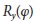 и 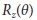, где:

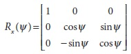

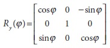

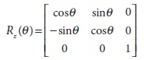


Рисунок 11-8. Поворот точек на θ (для данного случая, вокруг оси Z) это тоже самое, что и противоположное вращение оси координат на θ; за счет простой тригонометрии можно увидеть, как вращение меняет координаты точек

Общая матрица вращения R имеет свойство, что обратная ей матрица является транспонированной матрицей; следовательно 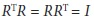, где *I* это единичная матрица (элементы по диагонали равны 1, а все остальные элементы равны 0).

*Вектор смещения* представляет собой переход от одной системы координат к другой как результат смещения в новое положение; другими словами, вектор смещения – это просто смещение относительно первоначальной системы координат. Таким образом, при переходе от системы координат с центрированием на объекте к центрированию на камере, соответствующий вектор смещения будет выглядеть следующим образом 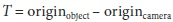. В результате (рисунок 11-7) точка в системе координат объекта с координатами 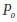 имеет координаты 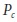 в системе координат камеры:

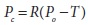

Объединение данного уравнения с выше представленными исправлениями внутренних параметров камеры формирует базовую систему уравнений, которую необходимо передавать OpenCV для калибровки камеры.

 Как уже было сказано ранее, для описания трехмерного вращения достаточно указать 6 параметров: три параметра положения и три параметра углов вращения. Вдобавок к этому в OpenCV матрица встроенных параметров камеры имеет ещё четыре параметра (, ,  и ), что в общей сложности дает десять параметров, которые должны быть получены для каждого представления в отдельности (при этом внутренние параметры камеры остаются неизменными). В случае двумерного вращения задействуются восемь параметров. Шесть параметров для описания вращения и смещения между представлениями и два для матрицы внутренних параметров камеры. И ещё, по крайней мере, в двух представлениях необходимо найти все геометрические параметры.

Далее будут более подробно рассмотрены эти параметры и накладываемые на них ограничения, но для начала необходимо уделить немного времени рассмотрению *калибровочного объекта*. Калибровочным объектом в OpenCV является плоская сетка с чередующимися черными и белыми квадратами, которую обычно называют "шахматной доской" (хотя и не обязательно иметь восемь квадратов или даже равное количество квадратов в каждом из направлений).

### Шахматная доска

В принципе, любой достаточно характерный объект может быть использован в качестве калибровочного объекта, однако, практичней всего использовать такой шаблон, как шахматная доска. В литературе некоторые методы калибровки полагаются на трехмерные объекты (например, коробка накрытая ориентиром), однако, плоская модель шахматной доски гораздо легче в обращении; трудно сделать (а так же хранить и распространять) точные калибровочные 3D объекты. В результате, OpenCV работает с несколькими представлениями плоского калибровочного объекта (шахматная доска), а не с одним специально сконструированным 3D объектом. В дальнейшем будет использован шаблон, состоящий из сменяющихся черных и белых квадратов (рисунок 11-9), который гарантирует, что нет никакого смещения к той или иной стороне измерения. Кроме того, результирующие углы сетки можно передать в функцию локализации субпикселей, обсуждаемую в главе 10.

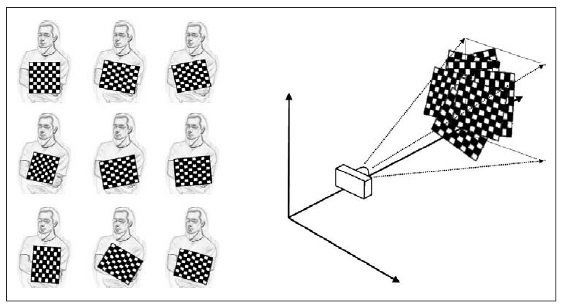

Рисунок 11-9. Изображения шахматной доски, получаемые в различных ориентациях (слева), предоставляют достаточное количество информации для понимания положения этих изображений в глобальной системе координат (относительно камеры), а также получения встроенных параметров камеры

Изображение шахматной доски (или изображение человека, держащего шахматную доску) можно использовать в функции OpenCV *cvFindChessboardCorners()* для поиска углов шахматной доски:

```cpp
int cvFindChessboardCorners(
	 const void* 		image
	,CvSize 			pattern_size
	,CvPoint2D32f* 		corners
	,int* 				corner_count 	= NULL
	,int 				flags 			= CV_CALIB_CB_ADAPTIVE_THRESH
);
```

На вход данной функции в качестве первого аргумента передается одно изображение шахматной доски. Это должно быть 8-битное одноканальное в градациях серого изображение. Второй аргумент *pattern_size* указывает на количество углов в каждой строке и столбце доски. Иными словами это счетчик числа углов в *пределах* доски; таким образом, для стандартной игровой шахматной доски это значение будет равно *CvSize(7, 7)*. (На практике, чаще всего бывает удобнее использовать ассиметричную шахматную доску четно-нечетного размера, например (5, 6). Ассиметричная доска имеет только одну ось симметрии, поэтому ориентация доски может быть определена однозначно). Следующий аргумент *corners* является указателем на массив, в который можно будет записать расположение углов. Этот массив должен быть инициализирован перед вызовом функции и, конечно же, должен обладать достаточным размером для размещения всех углов доски (для стандартной игровой шахматной доски это значение равно 49). Элементы массива это положения углов в пиксельных координатах. Аргумент *corner_count* не обязателен; если *corner_count != NULL*, то это указатель на *integer* для указания числа углов, которые необходимо записать. Если функция успешно нашла все углы (на самом деле условие успешного выполнения немного строже: должны быть найдены не только все углы, но и они же должны быть упорядочены в строках и столбцах в соответствии с ожиданиями), то возвращаемое значение будет не нулевым числом. Если функция завершилась с ошибкой, то будет возвращен 0. Последний аргумент *flags* может быть использован для реализации одного или нескольких шагов фильтрации для улучшения процесса поиска углов. Флаги могут быть объединены при помощи логического *OR*.

*CV_CALIB_CB_ADAPTIVE_THRESH*

По умолчанию в функции применяется пороговые преобразования на основе средней яркости, но если установлен этот флаг, то будут использованы адаптивные пороговые преобразования

*CV_CALIB_CB_NORMALIZE_IMAGE*

За счет этого флага изображение нормализуется при помощи *cvEqualizeHist()* перед применением пороговых преобразований

*CV_CALIB_CB_FILTER_QUADS*

После выполнения пороговых преобразований, алгоритм попытается найти четырехугольники как результат перспективного представления черных квадратов шахматной доски. Это приближенный результат, т.к. предполагается, что ребра четырехугольника прямые, но это не совсем верно, потому что имеют место радиальные искажения. Если этот флаг установлен, то к четырехугольникам применяются множество дополнительных ограничений для отброса ложных четырехугольников.

**Субпиксельные углы**

Углы, возвращаемые *cvFindChessboardCorners()* являются приблизительными. На практике это означает, что положения точны только в пределах устройства обработки изображения, т.е. с точностью до пикселя. Функция разделения должна быть использованы для вычисления точного расположения углов (после получения приблизительного положения и исходного изображения) с точностью до субпикселя. Для этого необходимо использовать функцию *cvFindCornerSubPix()*, которая уже была рассмотрена в главе 10. Использование данной функции в данном контексте не должно вызывать удивления, т.к. углы шахматной доски это всего на всего частный случай более общего случая углов Harris; просто углы шахматной доски проще найти и отследить. Пренебрежение субписельным уточнением может привести в существенным ошибкам в калибровке.

**Отрисовка углов шахматной доски**

В частности, при отладке, зачастую желательно нарисовать найденные углы шахматной доски на изображение (обычно на том, по которому производился поиск); таким образом, можно сравнить прогнозируемые и наблюдаемые углы. Для выполнения данной задачи OpenCV предоставляет удобную функцию *cvDrawChessboardCorners()*, которая соответственно и рисует углы, найденные *cvFindChessboardCorners()* на предоставленном изображении. Если в результате не все углы будут найдены, то имеющиеся углы будут нарисованы в виде маленьких красных кругов. Если найдены все углы, то они будут окрашены в разные цвета (на каждую строку по одному цвету) и соединены линиями, представляющие порядок определения углов.

```cpp
void cvDrawChessboardCorners(
	 CvArr* 		image
	,CvSize 		pattern_size
	,CvPoint2D32f* 	corners
	,int 			count
	,int 			pattern_was_found
);
```

Первый аргумент *cvDrawChessboardCorners()* - это изображение, на которое будут наноситься углы. Т.к. углы будут представлены в виде цветных кругов, то это должно быть 8-битное цветное изображение и, в большинстве случаев, это будет копия исходного изображения, которое передавалось в *cvFindChessboardCorners()* (при этом необходимо предварительно выполнить преобразование в трехканальное изображение). Следующие два аргумента *pattern_size* и *corners* имеют точно такой же смысл, как и соответствующие аргументы функции *cvFindChessboardCorners()*. Аргумент *count* это целое число и равно числу углов. Аргумент *pattern_was_found* указывает на успех в поиске углов и может быть установлен при помощи *cvFindChessboardCorners()*. На рисунке 11-10 представлен результат применения *cvDrawChessboardCorners()* к изображению шахматной доски.

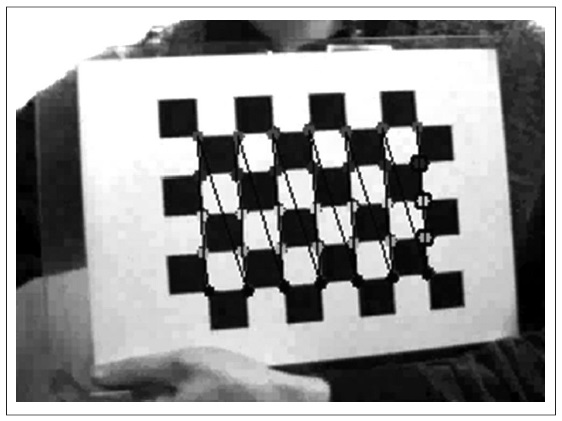

Рисунок 11-10. Результат применения *cvDrawChessboardCorners()*: после того, как углы были найдены при помощи *cvFindChessboardCorners()*, можно нарисовать эти углы (мелкие круги по углам) и порядок определения этих углов (показано линиями между углами)

Теперь можно перейти к рассмотрению плоского объекта. Точки на плоскости подвергаются перспективному преобразованию после прохождения через отверстие камеры обскуры или через объектив. Параметры данного преобразования содержаться в матрице гомографии размера 3x3, которая в следующем разделе будет рассмотрена более подробно.

### Гомография

В компьютерном зрении *плоская гомография* определяется как проективное отображение из одной плоскости в другую. Таким образом, отображение точек на двумерную плоскую поверхность фотоприёмника камеры является примером плоской гомографии. Данный пример можно показать в виде перемножения матриц при условии, что будут использованы однородные координаты для отображения точек Q и q на фотоприёмнике. Если определить:

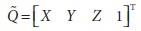

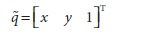

тогда действие гомографии можно выразить следующим образом:

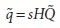

Введённый параметр s - это произвольный масштабный коэффициент (предназначенный для того, чтобы явно показать, что гомография определяется только этим коэффициентом). Условно этот коэффициент вынесен из H и в дальнейшем при рассмотрении материала данное правило будет выполняться.

За счет небольшого применения геометрии и матричной алгебры можно найти решение для этой матрицы преобразования. Наиболее важным моментом является то, что H состоит из двух частей: материальных преобразований, которые по существу определяют положение объекта на рассматриваемой плоскости; и проекции, которая выводит матрицу встроенных параметров камеры (рисунок 11-11).

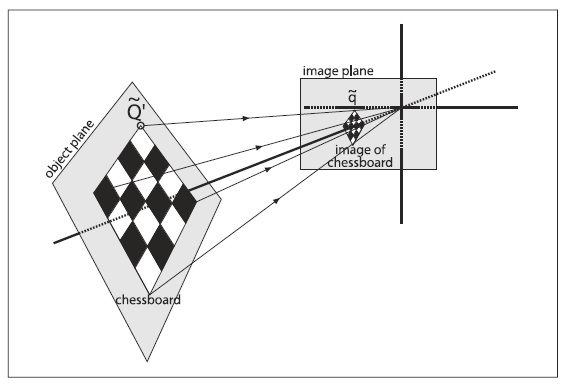

Рисунок 11-11. Представление плоского объекта, построенное гомографией: отображение - от плоскости объекта до плоскости изображения - одновременно охватывает относительное расположение этих двух плоскостей, а также матрицу проекции камеры

По части материальных преобразований - это суммарное действие некоторого вращения *R* и некоторого сдвига *t*, которые относятся к плоскости, на которой рассматривается плоскость изображения. Т.к. используются однородные координаты, то можно выполнить объединение в пределах одной матрицы следующим образом (*W* - это матрица 3x4, первые три колонки которой включают девять элементов *R*, а последняя колонка содержит три компонента вектора *t*):

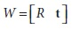

И в заключении перемножив матрицу *M* действий камеры (выраженную в проекционных координатах) и 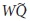, получим следующее:


Казалось бы, что все это значит. Оказывается, на практике интерес вызывает не координата , которая определена для всех пространств, а координата 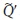, которая определена только для рассматриваемой плоскости. Это возможно только при небольшом упрощении.

Без ограничения общности, необходимо выбрать определенную плоскость объекта так, чтобы Z = 0. Это необходимо, т.к. при разбиении матрицы вращения на три 3x1 столбца (т.е. 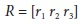), один из этих столбцов не потребуется. В частности:

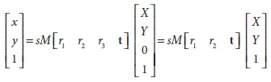

Матрицу гомографии H, которая отображает точки объекта на плоскости фотоприёмника, можно описать выражением 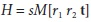, тогда: 

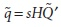

При этом стоит отметить тот факт, что теперь матрица *H* имеет размерность 3x3.

OpenCV использует предыдущее уравнение для расчета матрицы гомографии. Библиотека использует несколько изображений одного объекта для вычисления преобразований и вращений для каждого представления, а также встроенных параметров камеры (которые одинаковы для всех представлений). Как уже была сказано ранее, вращение описывается тремя углами, а перемещение тремя смещениями; соответственно имеется шесть неизвестных для каждого представления. Это нормально, т.к. известно, что плоский объект (например, шахматная доска) дает восемь уравнений - т.е. отображение квадрата в четырехугольник можно описать четырьмя *(x, y)* точками. Каждый новый кадр дает восемь уравнений за счет шести новых внешних неизвестных, так что при наличии достаточного количества изображений имеется возможность вычислить любое количество собственных неизвестных (более подробно об этом чуть позже).

Матрица гомографии H связывает положения точек плоскости исходного изображения с точками плоскости конечного изображения (как правило, плоскости фотоприёмника) следующими уравнениями:

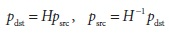

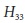

Стоит обратить внимание на тот факт, что существует возможность вычислить H, ничего не зная о встроенных параметрах камеры. На самом деле, вычисление множества гомографий из нескольких представлений - это метод, который использует OpenCV для вычисления внутренних параметров камеры.

OpenCV предоставляет удобную функцию *cvFindHomography()*, которая принимает список соответствий и возвращает матрицу гомографии, которая наилучшим образом описывает эти соответствия. Необходимо как минимум четыре точки, чтобы найти H, однако, всегда имеется возможность предоставить гораздо большее количество точек (при условии рассмотрения шахматной доски размера большего, чем 3x3). Использование большего количества точек гораздо выгоднее, т.к. всегда имеется шум и иные несоответствия, влияние которых необходимо сводить к минимуму.

```cpp
void cvFindHomography(
	 const CvMat* 	src_points
	,const CvMat* 	dst_points
	,CvMat* 		homography
);
```

Входные массивы *src_points* и *dst_points* могут быть матрицами Nx2 или Nx3. В первом случае координаты пикселей, во втором однородные координаты. Последний аргумент *homography* это матрица 3x3, заполненная при помощи данной функции таким образом, чтобы минимизировать ошибку обратной проекции. Т.к. матрица гомографии имеет только восемь свободных параметров, то лучше всего нормализовать  = 1. Масштабирование гомографии может быть применено к девятому параметру гомографии, но обычно масштабирование выполняется за счет умножения всей матрицы гомографии на коэффициент масштабирования.

### Калибровка камеры

Теперь всё готово для калибровки камеры и получения встроенных параметров и параметров искажений. Данный раздел будет посвящен вычислению этих параметров за счет использования *cvCalibrateCamera2()*, а также тому, как исправлять искажения на изображениях, получаемых с калибровочной камеры. Вначале будет немного более подробно рассказано о том, как много представлений шахматной доски необходимо предоставить для вычисления внутренних параметров камеры и искажений. Затем будет высокоуровневый обзор того, как OpenCV на самом деле решает данную систему уравнений. И в заключении будет представлен код, который позволяет с лёгкостью справиться с данной задачей.

**Сколько углов шахматной доски для скольких параметров?**

Теперь необходимо рассмотреть ранее представленные неизвестные. Т.е. параметры, которые необходимо найти путем калибровки. В случае OpenCV имеется четыре внутренних параметра камеры (, , , ) и пять параметров искажений: три для радиальных (, , ) и два для тангенциальных (, ). Внутренние параметры камеры напрямую связаны с трехмерной геометрией (и, следовательно, с внешними параметрами) шахматной доски в пространстве; параметры искажений связаны с двухмерной геометрией набора искаженных точек, в результате имеем ограничение на эти два класса параметров по отдельности. Три угловые точки известной модели дают шесть наборов информации – в принципе, это все, что необходимо для вычисления пяти параметров искажения (хотя на практике используется гораздо большее количество углов). Таким образом, одного представления шахматной доски вполне достаточно для вычисления параметров искажения. Это же представление шахматной доски можно использовать для вычисления внутренних параметров, которые вычисляются после получения внешних параметров. В случае с *внешними* параметрами необходимо знать положение шахматной доски. Для этого требуется три параметра вращения (ψ, ϕ, θ) и три параметра перемещения (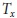, 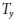, 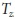), в общей сложности шесть на одно представление шахматной доски, т.к. в каждом изображении шахматной доски присутствуют перемещения. Итого, четыре внутренних и шесть внешних параметра дают десять параметров, которые необходимо вычислять для каждого представления.

Теперь пусть имеется N углов и K изображений шахматной доски (в различных позициях). Как много представлений и углов необходимо иметь для преодоления ограничений всех ранее представленных параметров?

* K изображений шахматной доски обеспечивает 2NK ограничений (коэффициент 2 используется в связи с тем, что каждая точка изображения имеет две координаты x и y)

* Не принимая во внимание параметры искажения, имеется 4 внутренних параметра и 6K внешних параметра (т.к. необходимо найти 6 параметров положения шахматной доски для каждого представления K)

* Для решения также необходимо, чтобы 2NK ≥ 6K + 4 (или, что эквивалентно (N – 3) K ≥ 2)

Может показаться, что для N = 5 необходимо только K = 1 изображений. Однако это не так, K (количество представлений) должно быть больше 1. Причина, по которой K > 1 заключается в том, что используемая для калибровки шахматная доска должна соответствовать матрице гомографии для каждого K представления. Как уже было сказано ранее гомография может дать не более восьми параметров от четырех пар (x, y). Это всё из-за того, что необходимо иметь лишь четыре точки для выражения всего того, что может дать плоское перспективное представление: растянуть квадрат в четырех различных направлениях, превратив его тем самым в абсолютно любой четырехугольник (перспективные преобразования, глава 6). Таким образом, независимо от количества найденных углов на плоскости, ценными являются только четыре из них. Согласно уравнению одного представления шахматной доски, предоставляющее только четыре информативных угла или (4 - 3)K > 1, получается, что K > 1. Это означает, что два представления шахматной доски 3x3 (считая только внутренние углы) являются минимальным набором для решения проблемы калибровки. Принимая во внимание шум и вычислительную устойчивость, как правило, необходимо собирать больше изображений шахматной доски большего размера. На практике для получения наилучшего результата необходимо как минимум десять изображений 7x8 или большего размера шахматной доски (и это при условии, что будет предоставлен "богатый" набор представлений шахматной доски).

**Что под капотом?**

Этот раздел предназначен для тех, кто хочет более детально во всем разобраться; остальные могут благополучно пропустить этот раздел и сразу перейти к разбору функции калибровки. Итак, возникает вопрос: как вся эта математика используется для калибровки? При наличии множества способов найти параметры камеры, в OpenCV выбран один, который хорошо отрабатывает на плоских объектах. Алгоритм, используемый OpenCV для нахождения фокусного расстояния и смещения, основан на методе Zhang, а метод, основанный на методе Brown, используется для поиска параметров искажения.

Для начала пусть при поиске других параметров калибровки не существует искажений камеры. Для каждого представления шахматной доски вычисляется гомография H, как уже было показано ранее. В результате H будет состоять из столбцов векторов, т.е. H = [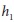, 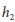, 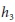], где каждая h это вектор 3x1. Тогда, в силу ранее представленного материала по гомографии, можно установить, что H равна перемножению матрицы внутренних параметров M, комбинации первых двух столбцов матрицы вращения 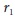, 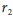 и вектора смещения t, и масштабного коэффициента s:

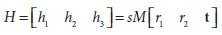

Разбор данного уравнения выглядит следующим образом:

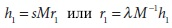

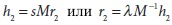

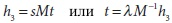

где λ = 1/s.

Т.к. вектора вращения ортогональны относительно друг друга по своей конструкции и поскольку извлекается масштабный коэффициент, следовательно  и  ортонормированы. Ортонормированность подразумевает две вещи: скалярное произведение векторов вращения равно 0 и величины векторов равны. Согласно первому утверждению:

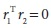

Для любых векторов a и b справедливо 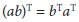, поэтому заменяя на  и  получаем первое ограничение:


где 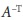 более короткая запись 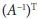. Согласно второму утверждению:

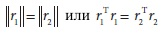

Подставляя  и  получаем второе ограничение:


Для упрощения 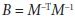. Тогда:

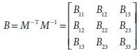

Помимо этого, матрица B может иметь более общую замкнутую форму:

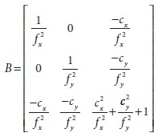

Используя матрицу B, получаем более общую форму двух ограничений 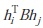. Т.к. B симметрична, то может быть записана в виде скалярного произведения шестимерных векторов. Скомпоновав необходимые элементы B в новый вектор b, получим:

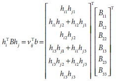

Используя 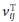, два ограничения могут записаны как:

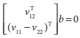

Если собрать K изображений шахматной доски вместе, то можно скомпоновать K уравнений вместе:

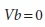

где V - это матрица 2Kx6. Если K ≥ 2, то уравнение может быть решено для . Внутренние параметры камеры в таком случае берутся непосредственно из замкнутой формы матрицы B:


где


Внешние параметры (вращение и перемещение) вычисляются из уравнений, полученных из условий гомографии:


Здесь масштабный коэффициент определен исходя из условия ортонормальности .

При этом необходимо соблюдать осторожность, т.к. при использовании реальных данных и, размещении r-векторов вместе (R = []), нет никакой гарантии того, что матрица вращения будет точной, т.е. будет ли выполняться условие .

Для того чтобы обойти данную проблему, необходимо использовать сингулярное разложение (SVD) матрицы R. Как уже было сказано в главе 3, SVD - это метод разложения матрицы на две ортонормированные матрицы U и V, и на прямоугольную диагональную матрицу D. Это позволяет выполнить преобразование R в . Т.к. R - это ортонормированная матрица, то матрица D должна быть единичной матрицей I, поэтому . Таким образом, можно "принудительно" преобразовать вычисленную матрицу R в другую матрицу вращения, применив сингулярное разложение к R, тем самым преобразовав её D в единичную матрицу; последующее умножение вновь на SVD дает новую матрицу, соответствующую матрице вращения R'.

Несмотря на всю проделанную работу, все ещё не были рассмотрены искажения линзы. Использование внутренних параметров камеры, найденных ранее - совместно с параметрами искажения, установленных в 0 - для начального приближения, дает толчок к началу решения большой системы уравнений.

Точки, "воспринимаемые" на изображении, действительно имеют неверное положение вследствие искажений. Пусть  будет соответствовать положению точки при условии, что отверстие камеры идеально, и пусть  это искаженное положение той же точки; тогда:


При этом использование результатов калибровки без учета искажений, уравнение примет следующий вид:


Для нахождения параметров искажения необходимо собрать список таких уравнений и решить их, в результате чего будут получены приблизительные внутренние и внешние параметры. Для выполнения всех этих сложных вычислений в OpenCV есть функция *cvCalibrateCamera2()*. (Как будет показано в главе 12, данная функция используется внутри функции стерео-калибровки. При стерео-калибровки, одновременно калибруются и соединяются вместе через матрицу вращения и вектор сдвига сразу две камеры).

**Функция калибровки**

После получения углов от нескольких изображений можно вызывать функцию *cvCalibrateCamera2()*. Эта функция производит математические вычисления и предоставляет необходимую информацию. В частности, в результате будет получена *матрица внутренних параметров камеры*, *коэффициенты искажения*, *вектор вращения* и *вектор перемещения*. Первые два измерения представляют внутренние параметры камеры, а последние два внешние (сообщают, где объект располагается и какая у него ориентация). Коэффициенты искажения (, , ,  и ) (Третий компонент радиальных искажений идет последним, т.к. был добавлен в OpenCV после для получения наилучшей поправки для сильно искажающих линз типа "рыбий глаз" и должен быть использован только для таких случаев. В последующем будет показано, что этот коэффициент может быть установлен в 0 при первой инициализации за счет флага *CV_CALIB_FIX_K3*) - это коэффициенты радиальных и тангенциальных уравнений искажения, которые уже были рассмотрены ранее; за счет этих коэффициентов существует возможность исправить искажения. Матрица внутренних параметров камеры вызывает, скорее всего, наивысший интерес, т.к. именно она позволяет перейти от трехмерных координат к двумерным координатам изображения. Помимо этого, данную матрицу можно использовать для выполнения обратной операции, однако, для рассматриваемого случая можно вычислить только трехмерную линию, которой должна соответствовать точка данного изображения. В последующем данный момент будет рассмотрен более подробно.

Теперь пришло время рассмотреть непосредственно саму функцию калибровки камеры:

```cpp
void cvCalibrateCamera2(
	 CvMat* 	object_points
	,CvMat* 	image_points
	,int* 		point_counts
	,CvSize 	image_size
	,CvMat* 	intrinsic_matrix
	,CvMat* 	distortion_coeffs
	,CvMat* 	rotation_vectors 		= NULL
	,CvMat* 	translation_vectors 	= NULL
	,int 		flags 					= 0
);
```

Для получения верного результата функция *cvCalibrateCamera2()* вызывается с большим набором параметров. Почти все из них уже были рассмотрены ранее, и на данный момент уже должно было сложиться некоторое представление о них.

Первый аргумент *object_points* - это матрица Nx3, содержащая материальные координаты каждой K точки каждого изображения M объекта (т.е. N = KxM). Эти точки располагаются в системе координат объекта. Этот аргумент немного сложней, чем кажется, т.к. описание точек объекта будет неявно определяться материальными единицами и структурой системы координат. В случае с шахматной доской, например, можно определить координаты таким образом, чтобы все точки имели для z значение 0, а для x и y измерялись в сантиметрах. Если будут выбраны дюймы, то все вычисленные параметры (неявно) тоже будут в дюймах. Аналогичным образом, если установить для всех координат x (а не z) значение 0, то расположение шахматной доски относительно камеры будет в значительной степени вдоль оси x, а не z. Квадрат это одна единица, поэтому, если квадрат имеет длину стороны 90 мм, то мир камеры, объект и координаты единиц камеры будут иметь размерность 90/мм. В принципе, можно использовать любые другие объекты, нежели только шахматную доску, поэтому, на самом деле, не нужно, чтобы все точки объекта лежали на плоскости, однако, это, как правило, самый простой способ калибровки камеры. В самом простом случае, необходимо просто определить каждый квадрат шахматной доски, который бы являлся "единицей" измерений, а координаты углов шахматной доски были бы целыми значениями углов строк и столбцов.  - количество квадратов по ширине, а  - количество квадратов по высоте:


Второй аргумент *image_points* - это матрица Nx2, содержащая пиксельные координаты всех точек, находящихся в *object_points*. Если выполняется калибровка с использованием шахматной доски, то этот аргумент состоит просто из возвращаемых значений M при вызове *cvFindChessboardCorners()*, но уже перестроенных в несколько ином формате.

Аргумент *point_counts* указывает на число точек в каждом изображении и это матрица Mx1. *image_size* - это размер, в пикселях, изображений из которых извлекаются точки (например, это изображения шахматной доски).

Следующие два аргумента *intrinsic_matrix* и *distortion_coeffs* представляют собой внутренние параметры камеры. Эти аргументы одновременно являются и выходными (их заполнение является основной причиной калибровки) и входными. Использование данных аргументов в качестве входных аргументов оказывает влияние на вычисляемый результат. Какая из этих матриц будет использована в качестве входного параметра, зависит от выбранного флага (будет показано чуть позже). Как уже было сказано ранее матрица внутренних параметров камеры полностью определяет идеальное поведение камеры, в то время как коэффициенты искажения характеризуют большую часть неидеального поведения камеры. Матрица внутренних параметров камеры всегда имеет размерность 3x3, а коэффициентов искажения всегда пять, поэтому аргумент *distortion_coeffs* должен быть указателем на матрицу 5x1 (порядок записи , , ,  и ).

В то время как предыдущие два аргумента включают в себя информацию о внутренних параметрах камеры, следующие два включают в себя информацию о внешних параметрах, т.е. информацию о положение объекта калибровки (например, шахматной доски) относительно камеры для каждого изображения. Положения объектов определяются вращением и перемещением. Вращения *rotation_vectors* определяются трехкомпонентными векторами M, расположенные в матрице Mx3 (где M количество изображений). При этом стоит понимать, что это не матрица 3x3, о которой ранее шла речь; в данном случае каждый вектор представляет собой ось в трехмерном пространстве системы камеры, вокруг которой вращается шахматная доска и где длина или величина вектора кодируется на угол поворота против часовой стрелки. Каждый из векторов вращения может быть преобразован в матрицу вращения 3x3 при помощи функции *cvRodrigues2()*. Перемещения *translation_vectors* аналогичным образом располагаются в матрице Mx3, в системе координат камеры. Как уже было сказано ранее, единицей системы координат камеры в точности те, что предполагались для шахматной доски. То есть, если квадрат шахматной доски 1 дюйм на 1 дюйм, то единицы в дюймах.

Определение параметров за счет оптимизации может показаться в некотором роде искусством. Иногда, попытка определить все параметры за раз может привести к неточным или противоречивым результатам, если первоначальная стартовая позиция в пространстве параметров далека от фактического решения. Таким образом, лучше использовать решение "подкрадывания" к хорошему показателю начальной позиции в несколько этапов. По этой причине зачастую некоторые параметры фиксируются, пока ищутся другие параметры, а затем вычисления производиться для фиксированных параметров, а не фиксированные становятся фиксированными и т.д. И в заключении, когда параметры становятся довольно таки близкими к фактическим, эти самые приближенные значения задействуются в решении в качестве отправной точки. OpenCV позволяет контролировать данный процесс за счет флагов. Аргумент *flags* предназначен для более точного управления процессом выполнения калибровки. Значения флага могут быть объединены вместе за счет использования логической операции OR.

!!! Редактура не завершена !!!

*CV_CALIB_USE_INTRINSIC_GUESS*

Обычно матрица внутренних параметров вычисляется пр ипомощи *cvCalibrateCamera2()* без дополнительнйо информации. В частности, начальные значения параметров  и  (центра изображения) берутся непосредственно из аргумента *image_size*. Если флаг установлен в данное значение, то предполагается, что *intrinsic_matrix* содержит действительные значения, которые будут использованы в качестве начального приближения для дальнейшей оптимизации в *cvCalibrateCamera2()*.

*CV_CALIB_FIX_PRINCIPAL_POINT*

Этот флаг может быть использован с и без *CV_CALIB_USE_INTRINSIC_GUESS*. Если без, то точка устанавливается, как правило, в центре изображения; если с. то точка устанавливается, как правило, на предполагаемое начальное значение *intrinsic_matrix*.

*CV_CALIB_FIX_ASPECT_RATIO*

Если утановлен данный флаг, то процедура оптимизации одновременно изменяет только  и  и фиксирует их соотношение какой-либо величиной, установленной в *intrinsic_matrix* при вызове функции калибровки. (Если флаг *CV_CALIB_USE_INTRINSIC_GUESS* не установлен, то значения  и  в *intrinsic_matrix* могут быть любыми произвольными значениями и только их соотношение будет считаться релевантным.)

*CV_CALIB_FIX_FOCAL_LENGTH*

Этот флаг задействует функцию оптимизации за счет использования  и , переданных в *intrinsic_matrix*.

*CV_CALIB_FIX_K1*, *CV_CALIB_FIX_K2* и *CV_CALIB_FIX_K3*

Фиксирование параметров радиального искажения ,  и . Радиальные параметры могут быть установлены за счет любого совместного сочетания этих флагов. В общем, последний параметр должен быть зафиксирован в 0, только если не используется объектив типа "рыбий глаз".

*CV_CALIB_ZERO_TANGENT_DIST*

Этот флаг очень важен в случае калибровки высококачественных камер, которые в результате соблюдения точности при изготовлении имеют очень малые тангенциальные искажения. Попытки подгона параметров, которые близки к 0, могут привести зашумленно ложным значениям и проблемам вычислительной устойчивости. Установка данного флага приводит к тому, что параметры тангенциального искажения  и  устанавливаются в 0.

**Вычисление только внешних параметров**

В некоторых случаях внутренние параметры уже имеются, следовательно остаётся вычислить только положение рассматриваемого объекта (-ов). Этот сценарий несомненно отличается от обычной калибровки камеры и потому знания о выполнении данной задачи являются чрезвычайно полезными.

```cpp
	void cvFindExtrinsicCameraParams2(
		 const CvMat* 	object_points
		,const CvMat* 	image_points
		,const CvMat* 	intrinsic_matrix
		,const CvMat* 	distortion_coeffs
		,CvMat* 		rotation_vector
		,CvMat* 		translation_vector
	);
```

Аргументы *cvFindExtrinsicCameraParams2()* идентичны соответствующим аргументам *cvCalibrateCamera2()* за исключением того, что матрица внутренних параметров и коэффициенты искажения подставляются, а не вычисляются. Функция возвращает вектор вращения *rotation_vector* 1x3 или 3x1, который представляет трехмерную ось, вокруг которой шахматную доску или точки поворачивают, а значение или длина вектора представляет из себя поворот на определенный угол против часовой стрелки. Этот вектор вращения может быть преобразован в матрицу вращения 3x3 при помощи *cvRodrigues2()*. Вектор перемещения является смещением координат камеры в первоначальное положение шахматной доски.