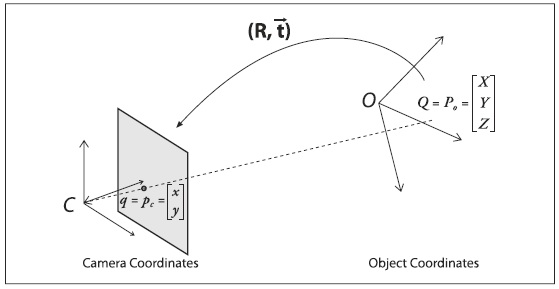

## (П]|(РС)|(РП) Калибровка

Теперь, после получения некоторого представления о том, как описать внутренние свойства и искажения камеры математически, можно перейти к рассмотрению того, как использовать OpenCV для вычисления внутренних матриц и вектора искажений. (Онлайн руководство по использованию калибровки камеры можно найти на сайте [Jean-Yves Bouguet](http://www.vision.caltech.edu/bouguetj/calib_doc/))

OpenCV предоставляет несколько алгоритмов для вычисления этих внутренних параметров. Калибровка выполняется при помощи функции *cvCalibrateCamera2()*. В данной функции метод калибровки предоставленной камеры заключается в формировании известной структуры, содержащей множество индивидуальных и идентифицируемых точек. При рассмотрении данной структуры под разными углами можно в последующем вычислить (относительное) местоположение и ориентацию камеры во время каждого получаемого кадра, а также внутренние параметры камеры (рисунок 11-9, раздел "Шахматная доска"). Для получения набора представлений, необходимо поворачивать и смещать объект, поэтому вначале необходимо рассмотреть эти процессы более подробно.

### Матрица поворота и вектор смещения

Для каждого кадра, содержащего определенный объект, существует возможность описать позу данного объекта по отношению к системе координат камеры в условиях вращения и смещения, рисунок 11-7.

Рисунок 11-7. Преобразование объекта в систему координат камеры: точка P объекта рассматривается как точка p на плоскости изображения; точка p связана с точкой P за счет применения матрицы вращения R и вектора смещения t к P

В общем, вращении в любом n-мерном измерении может быть описано как перемножение координат вектора квадратной матрицы соответствующего размера. В конечном счете, вращение эквивалентно введению новых расположений точи в другой системе координат. Поворот системы координат на угол θ эквивалентно вращению в противоположном направлении целевой точки вокруг исходной системы координат на тот же угол θ. Двумерное вращение можно представить как перемножение матриц показанных на рисунке 11-8. Трехмерное вращение можно разложить на двумерное вращение вокруг каждой оси при условии, что ось вращения остается неизменной. При вращении в последовательности (представленное описание вращения выполняет вращение сначала вокруг оси z, затем вокруг нового положения оси y и, наконец, вокруг нового положения оси x) вокруг x-, y- и z-осей на углы ψ, φ и θ соответственно, общую матрицу поворота R можно получить в результате перемножения трех матриц ,  и , где:

Рисунок 11-8. Вращение точек на θ (в данном случае, вокруг оси Z) это тоже самое, что и противоположное вращение  оси координат на θ; за счет простой тригонометрии можно увидеть, как вращение меняет координаты точек

Общая матрица вращения R имеет свойство, что обратная ей матрица является транспонированной матрицей (повернутая назад); следовательно , где *I* это единичная матрица (элементы по диагонали равны 1, а все остальные элементы равны 0).

*Вектор смещения* представляет собой переход от одной системы координат к другой, полученный в результате смещения в новое положение; другими словами, вектор сдвига – это просто смещение относительно первоначальной системы координат. Таким образом, при переходе от системы координат с центрированием на объекте к центрированию на камере, соответствующий вектор сдвига будет выглядеть следующим образом . В результате (рисунок 11-7) точка в системе координат объекта с координатами  имеет координаты  в системе координат камеры:

Объединение данного уравнения с выше представленными исправлениями внутренних параметров камеры формируют базовую систему уравнений, которую необходимо передавать OpenCV для калибровки камеры.

 Как уже было сказано ранее, для описания трехмерного вращения достаточно указать 6 параметров: три параметра положения и три параметра углов вращения. Вдобавок к этому в OpenCV матрица встроенных параметров камеры имеет ещё четыре параметра (, ,  и ), что в общей сложности дает десять параметров, которые должны быть получены для каждого представления в отдельности (при этом внутренние параметры камеры остаются неизменными). В случае двумерного вращения задействуются восемь параметров. Шесть параметров для описания вращения и смещения между представлениями и два для матрицы внутренних параметров камеры. И, по крайней мере, в двух представлениях необходимо найти все геометрические параметры.

Далее будут более подробно рассмотрены эти параметры и накладываемые на них ограничения, но для начала необходимо уделить немного времени рассмотрению *калибровочного объекта*. Калибровочным объектом в OpenCV является плоская сетка с чередующимися черными и белыми квадратами, которую обычно называют «шахматной доской» (хотя не обязательно имеющая восемь квадратов или даже равное количество квадратов в каждом из направлений).

### Шахматная доска

