## [П]|[РС]|(РП) Модель камеры

В простой модели, модели камеры обскуры, свет представляет из себя, начинающийся от сцены или удаленного объекта, единичный луч, поступающий из какой-либо конкретной точки. С точки зрения физики, эта точка затем "проецируется" на поверхность изображения. В результате, изображение на этой *плоскости изображения* (также известной как *плоскость проекции*) всегда находится в фокусе, а размер изображения относительно удаленного объекта задается одним параметром камеры: *фокусным расстоянием*. Для идеализированной камеры обскуры расстояние от диафрагмы до экрана является фокусным расстоянием. Это продемонстрировано на рисунке 11-1, где *f* - фокусное расстояние камеры, *Z* - расстояние от камеры до объекта, *X* - длина объекта и *x* - изображение объекта на плоскости изображения. На рисунке можно отметить, согласно подобию треугольников, факт того, что *-x/f = X/Z* или


Рисунок 11-1. Модель камеры обскура: диафрагма пропускает только лишь те световые лучи, которые пересекают определенную точку в пространстве; затем эти лучи формируют изображение за счет "проекции" на плоскости изображения

Далее будет выполнено преобразование модели камеры обскура в эквивалентную модель для упрощения математических действий. Согласно рисунку 11-2 для этого необходимо произвести перестановку плоскости с отверстием и плоскости изображения. Основное отличие в результате произведенного действия заключается в том, что объект окажется на лицевой стороне. Точка на плоскости камеры обскура становиться *центром проекции*. В этом случае, каждый луч оставляет точку на удаленном объекте и направляется к центру проекции. Точка пересечения плоскости изображения и оптической оси называется *главной точкой*. На этой новой фронтальной плоскости изображения (рисунок 11-2), которая эквивалентна старой проективной плоскости или плоскости изображения, изображение удаленного объекта имеет точно такие же размеры, как и плоскость изображения на рисунке 11-1. Изображение формируется при пересечении этих лучей с плоскостью изображения, что происходит точно на расстоянии *f* от центра проекции. Это делает отношение *x/f = X/Z*, полученное из подобия треугольников, более очевидным, чем раньше. Знак минус отсутствует, т.к. изображение объекта больше не перевернутое.


Рисунок 11-2. Точка Q = (X, Y, Z) проецируется на плоскость изображения лучом, проходящим через центр проекции в результирующую точку на изображении q = (x, y, z); плоскость изображения в действительности это просто проекционный экран "установленный" перед плоскостью камеры обскура

Можно подумать, что основная точка эквивалентна центру фотоприёмника, однако это будет означать, что какой-то парень с пинцетом и тюбиком клея сможет установить фотоприемник в камере с микро точностью. На самом деле, центр чипа, как правило, располагается не на оптической оси. В результате, для дальнейших объяснений будут введены два новых параметра,  и  для моделирования возможных перемещений (вдалеке от оптической оси) центра координат на проекционном экране. В результате относительно простая модель, в которой точка Q материального мира с координатами (X, Y, Z) проецируется на экран в какой-то заранее заданный пиксель (, ) в соответствии со следующим уравнением (термин "экран" употребляется для напоминания о том, что координаты вычисляются в системе координат экрана (т.е. фотоприёмника); разница между (, ) в уравнении и (x, y) на рисунке 11-2 отображена в точке  и ):


Стоит обратить внимание на то, что были введены два разных фокусных расстояния; причина этого в том, что одиночные пиксели на типичном недорогом фотоприемнике образуют прямоугольник, а не квадрат. Фокусное расстояние  (например) на самом деле является результатом материального фокусного расстояния объектива, а  размером отдельного элемента фотоприёмника (это имеет смысл, т.к.  измеряется в *пиксели/миллиметр*, а *F* в *миллиметрах* (это всего лишь удобная физическая величина; ничего не мешает воспользоваться, например, "метром" или "микроном"; в любом случае  преобразует материальные единицы в пиксели), что означает -  в необходимых единицах пикселей). Тоже самое справедливо и для  и . Однако, необходимо иметь ввиду, что  и  не могут быть измерены в результате процесса калибровки камеры, и ни одна материальная фокусная длина *F* не может быть непосредственно измерена. Только комбинации  и  могут быть получены без разбора камеры и непосредственного измерения её компонентов.

### Основы геометрии проецирования

Соотношение отображения точки 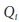 с координатами 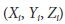 в материальном мире к точкам с координатами 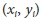 на проекционном экране называется *проекционным преобразованием*. В работе с такими преобразованиями удобнее всего использовать так называемые *однородные координаты*. Однородные координаты, связанные с точкой из проекционного пространства размерности *n*, как правило, выражается в *(n + 1)* - мерный вектор (например, *x, y, z* становится *x, y, z, w*) с дополнительным ограничением, что любые две точки, значения которых пропорциональны, эквивалентны. Для рассматриваемого случая, плоскость изображения является пространством проекции и имеет два измерения, поэтому точка будет представлена на этой плоскости в виде трехмерных векторов q = (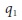, 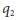, 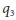). Как уже было сказано ранее, все точки, имеющие пропорциональные значения в пространстве проекции, эквивалентны, поэтому можно восстановить действительные координаты пикселя за счет деления на . Это в свою очередь позволит организовать параметры, определяющие камеру (т.е. , , , ), в одну матрицу 3×3, которая именуется *матрицей встроенных параметров камеры* (OpenCV требует, чтобы встроенные параметры камеры происходили от Heikkila и Silven). Точки проекции в материальном мире для камеры обобщаются следующим образом:

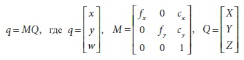

В результате перемножения можно увидеть, что *w = Z*, т.к. точка *q* имеет однородные координаты, вследствие чего необходимо разделить на *w* (или *Z*) для получения предыдущего определения. (Знак минус пропал, т.к. теперь рассматривается неперевернутое изображение на плоскости проекции в передней части камеры обскура вместо перевернутого изображения на плоскости проекции за камерой обскура.)

В связи с вводом понятия однородных координат, целесообразно будет рассмотреть функцию OpenCV *cvConvertPointsHomogenious()* (да, именно *Homogenious*, в наименование функции присутствует ошибка), удобную для преобразования в и из однородных координат; помимо этого, данная функция выполняет ещё ряд полезных вещей.

```cpp
void cvConvertPointsHomogenious(
 const CvMat* src
,CvMat* dst
);
```

На первый взгляд может показаться, что у данной функции слишком простой набор аргументов; но это не так – на самом деле данная функция выполняет массу полезных вещей. Исходный массив *src* может быть 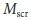×N или N× (для  = 2, 3 или 4); он также может быть 1×N или N×1 в массиве с  = 2, 3 или 4 канала (N может быть любым числом; по существу это точки для преобразования, которые заполняют матрицу *src*). Конечный массив *dst* может быть любого типа с дополнительным ограничением по размерности 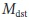 – она должна быть равна ,  – 1 или  + 1.

Когда размерность исходного  и конечного  равны, происходит просто копирование (и, если необходимо, транспонирование). Если  > , то элементы *dst* вычисляются за счет деления всех кроме последних элементов соответствующего вектора *src* на последний элемент этого вектора (т.е. предполагается, что *src* содержит однородные координаты). Если  < , то происходит копирование точек, только каждый вектор массива *dst* на конце будет содержать 1 (т.е. вектора из *src* расширяются до однородных координат). 

Одним словом, при работе с данной функцией стоит принимать во внимание, что могут быть случаи (при N < 5), когда исходная и конечная размерность неодинакова. В этом случае функция вернет ошибку. Столкнувшись с данной ситуацией, необходимо дополнить матрицы фиктивными значениями. Кроме того, пользователь может передавать многоканальные матрицы Nx1 и 1xN, с числом каналов  (). Функция *cvReshape()* может быть использована для преобразования одноканальной матрицы к многоканальной без копирования данных.

Случай с идеальной камерой обскура - это полезная модель для некоторой трехмерной геометрии зрения. При этом стоит помнить, что через камеру обскура проходит очень малое количество света; таким образом, на практике изображение будет формироваться крайне медленно из-за ожидания получения достаточного количества света. Для ускорения процесса формирования изображения в камере необходимо собирать свет более широкой области и изгиба (т.е. фокуса), т.е. в точке проекции, где сходится свет. Для достижения этой цели необходимо использовать объектив. Объектив может фокусировать большее количество света в точке, что соответственно ускоряет визуализацию, однако, это приводит также и к появлению искажений.

### Искажения объектива

В теории, можно определить объектив, который воспроизводит без искажений. На практике, однако, объективы не идеальны. Главная причина кроется в процессе производства объективов; гораздо легче сделать более "сферический", чем более математически идеальный "параболический" объектив. Так же технически сложно точно совместить объектив и фотоприёмник. В данном разделе будут рассмотрены два основных типа искажения объектива и их моделирование. *Радиальные искажения* возникают в результате формы объектива, в то время как *тангенциальные искажения* возникают как результат сборки камеры в целом.

**Радиальные искажения**. Линзы реальных камер часто искажают расположении пикселей вблизи краев фотоприёмника. Это выпуклое явление появляется в результате эффекта "бочка" или *рыбий глаз* (хороший пример данного эффекта представлен в верхней части рисунка 11-12). Рисунок 11-3 подталкивает к пониманию возникновения радиальных искажений. У некоторых объективов лучи далекие от центра более изогнуты, чем те, которые ближе к центру. Типичный недорогой объектив обладает именно таким эффектом. Искажение "бочка" особенно заметно в недорогих веб-камерах и менее очевидно в высококачественных камерах, где за счет использования причудливой системы линз минимизируются радиальные искажения.

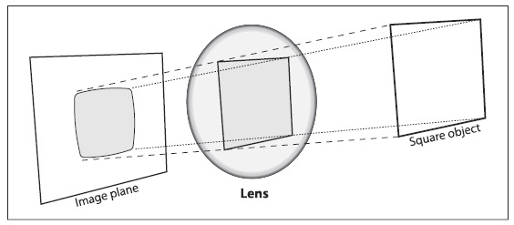

Рисунок 11-3. Радиальные искажения: лучи, отдаленные от центра, искажены в большей степени, чем лучи, проходящие ближе к центру; таким образом, стороны квадрата скругляются на плоскости изображения (это также известно, как эффект "бочка")

Для радиальных искажений характерно, что искажение в (оптическом) центре фотоприёмника 0 и увеличивается по мере продвижения к окраине. На практике данное искажение не велико и может быть охарактеризовано несколькими первыми членами разложения в ряд Тейлора вокруг *r = 0*. (Ряд Тейлора – это математический метод для представления (потенциально) сложной функции в виде полинома подобного значения приближенной функции, по меньшей мере, в малой окрестности некоторой определенной точки (чем больше элементов будет задействовано, тем более точный результат будет получен). В рассматриваемом случае возникла необходимость расширения искажений до полинома в окрестности *r = 0*. Данный полином имеет следующий общий вид: 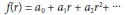, а для рассматриваемого случая при *f(r) = 0* и *r = 0* следует, что 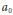 = 0. Кроме того, функция должна быть симметричной в *r*, поэтому только коэффициенты четных степеней *r* должны быть отличны от нуля. Из всего этого следует, что для описания радиальных искажений необходимо использовать коэффициенты 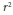, 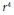 и (иногда) 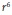). Для дешевых веб-камер обычно используются первые два члена; первый условно именуется 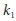, а второй 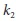. Для сильно искаженных веб-камер, также необходимо задействовать и третий член 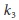. В общем, радиально расположенные точки будут масштабированы в соответствии со следующими уравнениями:

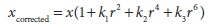

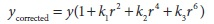

где (x, y) - это оригинальное положение (на фотоприёмнике) искаженной точки, а (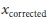, 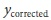) – это новое положение после коррекции. На рисунке 11-4 показано смещение прямоугольной сетки, которое вызвано радиальными искажениями. Внешние точки на внешней стороне прямоугольной сетки все больше смещаются внутрь при увеличении радиального расстояния от оптического центра.

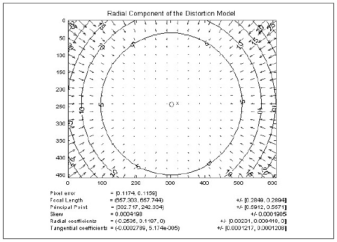

Рисунок 11-4. Сетка радиальных искажений для конкретного объектива камеры: стрелками показано, где точки на внешней прямоугольной сетки смещаются в радиально искаженном изображении (фото предоставлено Jean-Yves Bouguet)

**Тангенциальное искажение**. Эти искажения возникают в результате производственных дефектов, возникающих от не точно параллельно установленных линз к плоскости изображения, рисунок 11-5.

Тангенциальное искажение минимально характеризуется двумя дополнительными параметрами 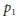 и 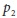:

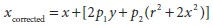

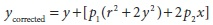

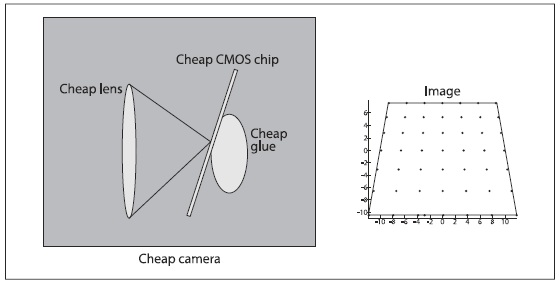

Рисунок 11-5. Тангенциальные искажения появляются, когда объектив не полностью параллелен плоскости изображения; в дешевых камерах это может произойти, когда фотоприёмник клеится к задней поверхности камеры (фото предоставлено Sebastian Thrun)

Таким образом, в общей сложности в работе с данными искажениями будут необходимы только пять коэффициентов. В работе с OpenCV все пять коэффициентов образуют *вектор искажений*; этот вектор просто матрица 5×1, содержащая , , ,  и  (именно в таком порядке). На рисунке 11-6 показано влияние тангенциального искажения на фронтально внешнюю прямоугольную сетку точек. Точки смещаются эллиптически согласно функции положения и радиуса.


Рисунок 11-6. Сетка тангенциальных искажений для конкретного объектива камеры: стрелками показано, где точки на внешней прямоугольной сетке смещаются по касательной к искаженному изображению (фото предоставлено Jean-Yves Bouguet)

Существует ещё множество других видов искажений, которые возникают в системах визуализации, но они, как правило, имеют малый эффект по сравнению с радиальным и тангенциальным искажениями. С вязи с эти данные (другие) искажения далее рассматриваться не будут.