## (П]|(РС)|(РП) Модель камеры

В простой модели, модели камеры обскуры, свет представляет из себя начинающийся от сцены или удаленного объекта, единичный луч поступающий из какой-либо конкретной точки. С точки зрения физики, эта точка затем "проецируется" на поверхность изображения. В результате, изображение на этой *плоскости изображения* (также известной как *плоскость проекции*) всегда находится в фокусе, а размер изображения относительно удаленного объекта задается одним параметром камеры: *фокусным расстоянием*. Для идеализированной камеры обскуры расстояние от диафрагмы до экрана является фокусным расстоянием. Это продемонстрировано на рисунке 11-1, где *f* - фокусное расстоянеи камеры, *Z* - расстояние от камеры до объекта, *X* - длина объекта и *x* - изображение объекта на плоскости иозображения. На рисунке можно отметить факт, согласно подобию треугольников, того, что *-x/f = X/Z* или 

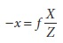

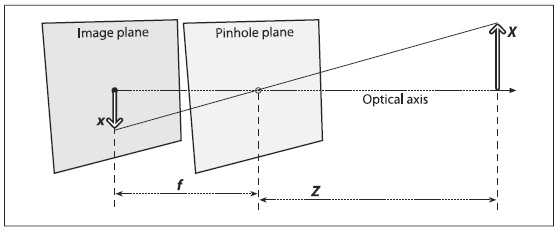

Рисунок 11-1. Модель камеры обскура: диафрагма пропускает только лишь те световые лучи, которые пересекают определенную точку в пространстве; затем эти лучи формируют изображение за счет "проекции" на плоскости изображения

Далее будет выполнено преобразование модели камеры обскура в эквивалентную для упрощения математических действий. Согласно рисунку 11-2 для этого необходимо произвести перестановку плоскости с отверстием и плоскости изображения. Основное отличие в результате произведенного действия заключается в том, что объект окажется на лицевой стороне. Точка на плоскости камеры обскура становиться *центром проекции*. В этом случае, каждый луч оставляет точку на удаленном объекте и направляется к центру проекции. Точка пересечения плоскости изображения и оптической оси называется *главной точкой*. На этой новой фронтальной плоскости изображения (рисунок 11-2), которая эквивалентна старой проективной плоскости или плоскости изображения, изображение удаленного объекта имеет точно такие же размеры как и плоскость изображения на рисунке 11-1. Изображение формируется при пересечении этих лучей с плоскостью изображения, что происходит точно на расстоянии *f* от центра проекции. Это делает отношение *x/f = X/Z*, полученное из подобия треугольников, более очевидным, чем раньше. Знак минус отсутствует, т.к. изображение объекта больше не перевернутое. 

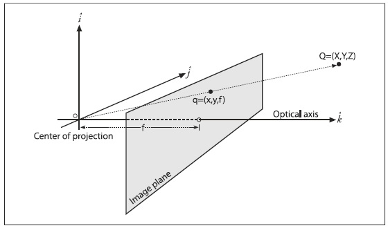

Рисунок 11-2. Точка Q = (X, Y, Z) проецируется на плоскость изображения лучом, проходящим через центр проекции в результирующую точку на изображении q = (x, y, z); плоскость изображения в действительности это просто проекционный экран "установленный" перед плоскостью камеры обскура

Можно подумать, что основная точка эквивалентна центру фотоприёмника, однако это будет означать, что какой-то парень с пинцетом и тюбиком клея сможет установить фотоприемник в камере с микроточностью. На самом деле, центр чипа, как правило, располагается не на оптической оси. В результате, для дальнейших объяснений будут введены два новых параметра, 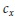 и 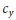 для моделирования возможных перемещений (вдалеке от оптической оси) центра координат на проекционном экране. Результатом является то, что относительно простая модель, в которой точка Q материального мира с координатами (X, Y, Z) проецируется на экран в какой-то заранее заданный пиксель (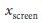, 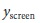) в соответствии со следующим уравнением (термин "экран" употребляется для напоминания о том, что координаты вычисляютя в системе координат экрана (т.е. фотоприёмника); разница между (, ) в уравнении и (x, y) на рисунке 11-2 отображена в точке  и :

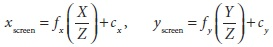

Стоит обратить внимание на то, что были введены два разных фокусных расстояния; причина этого в том, что одиночные пиксели на типичном недорогом фотоприемнике образуют прямоугольник, а не квадрат. Фокусное расстояние 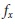 (например) на самом деле является результатом материального фокусного расстояния объектива, а 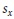 размером отдельного элемента фотоприёмника (это имеет смысл, т.к.  измеряется в *пиксели/миллиметр*, а *F* в *миллиметрах* (это всего лишь удобная физическая величина; ничего не мешает воспользоваться, например, "метром" или "микроном"; в любом случае  преобразует физичеческие единицы в пиксели), что означает -  в необходимых единицах пикселей). Тоже самое справедливо и для 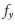 и 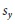. Однако, необходимо иметь ввиду, что  и  не могут быть измерены в результате процесса калибровки камеры, и ни одна материальная фокусная длина *F* не может быть непосредственно измерена. Только комбинация 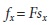 и 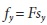 могут быть получены без разборки камеры и непосредственного измерения её компонентов.

### Основы геометрии проецирования

