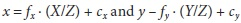
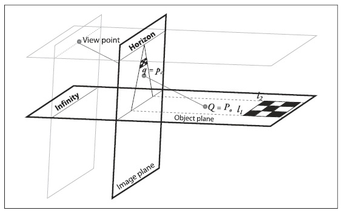

## [П]|[РС]|(РП) Упражнения

1. Используйте рисунок 11-2 для получения уравнения  за счет подобия треугольников со смещенным центром.

2. Влияет ли ошибочная оценка правильного положения цента (, ) на оценку других параметров, таких как фокус?
 	
    Подсказка: Обратите внимание на уравнение q = MQ.

3. Нарисуйте изображение квадрата:
    
    a. Под радиальными искажениями.

    b. Под тангенциальными искажениями.
    
    c. Под обоими искажениями.
    
4. Обратитесь к рисунку 11-13. Для перспективных представлений, объясните следующее:

    a. Откуда начинается "линия в бесконечность"?
    
    b. Почему параллельные точки на плоскости объекта сходятся в точке на плоскости изображения?
    
    c. Пусть объект и изображение плоскости перпендикулярны друг к другу. На плоскости объекта, начиная от точки , передвиньтесь на 10 единиц непосредственно от плоскости изображения в точку . Чему соответствует расстояние передвижения на плоскости изображения?

5. На рисунке 11-3 представлено наружно выпуклый эффект радиального искажения "бочка", что особенно заметно в левой части рисунка 11-12. Могут ли какие-либо объективы порождать внутренне выпуклый эффект? Как это возможно?

6. Используя дешевую веб-камеру или камеру мобильного телефона, создайте примеры радиального и тангенциального искажений в изображениях концентрических квадратов или шахматных досок.

7. Откалибруйте камеру из упражнения 6. Отобразите изображение с камеры до и после калибровки. 
8. Поэкспериментируйте с вычислительной устойчивостью и шумом, собрав множество изображений шахматной доски и выполнив "хорошую" калибровку для них. Затем подумайте над тем, как изменить параметры калибровки для сокращения количества изображений шахматной доски. Отобразите результаты: параметры камеры в зависимости от количества изображений шахматной доски.      

    

    Рисунок 11-13. Диаграмма гомографии, показывающая пересечение плоскости объекта с плоскостью изображения и точку, представляющая центр проекции

9. Как изменятся параметры калибровки из упражнения 8 при использовании (например) 10 изображений шахматной доски размера 3x5, 4x6 и 5x7? Отобразите результаты.

10. Высококачественные камеры, как правило, имеют систему линз, которые физически исправляют искажения на изображениях. Что может произойти, если все-таки использовать multiterm ((!)много элементную(!)) модель искажений для такой камеры?
    
    Подсказка: это состояние известно, как переобучение.

11. *Трюк с трехмерным джойстиком*. Откалибруйте камеру. Используйте видео, где машут шахматной доской, и используйте *cvFindExtrinsicCameraParams2()* в качестве трехмерного джойстика. При этом помните, что *cvFindExtrinsicCameraParams2()* предоставляет поворот как 3x1 или 1x3 вектор вращения вокруг оси, где величина вектора представляет из себя вращение против часовой стрелки на угол совместно с перемещением трехмерного вектора.

    a. (!)Выходная ось шахматной доски и угол вращения совместно с перемещением в реальном времени - все это вращения доски вокруг оси. Управляйте в таком случае - это когда шахматная доска не на виду.(!)
    
    b. (!)Используйте *cvRodrigues2()* для преобразования результата *cvFindExtrinsicCameraParams2()* в виде матрицы вращения 3x3 в вектор перемещения. Используйте это, чтобы оживить простые трехмерные фигуры самолета вновь воссозданные на изображении в реальном времени при перемещении доски в новое представление.(!)