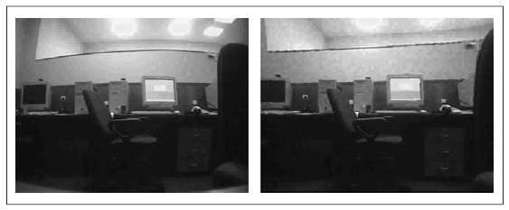

## [П]|[РС]|(РП) Удаление искажений

Как уже было сказано ранее при калибровки камеры зачастую возникает необходимость в выполнении двух вещей. Во-первых, в корректировке эффектов искажения, во-вторых в построении трехмерного представления получаемых изображений. В данном разделе будет рассмотрена корректировка эффектов искажения, в то время, как решение второй задачи будет рассмотрено в главе 12.

OpenCV предоставляет готовый к использованию алгоритм удаления искажений, который принимает необработанное изображение и коэффициенты искажений от функции *cvCalibrateCamera2()* и выполняет исправления данного изображения (рисунок 11-12). Для того, чтобы воспользоваться данным алгоритмом необходимо воспользоваться функцией *cvUndistort2()*, которая выполняет все необходимое для одного кадра, или парой функций *cvInitUndistortMap()* и *cvRemap()*, которые позволяют обрабатывать некоторые вещи в видео немного более эффективно или ситуации, в которых имеется множество изображений от одной и той же камеры. (При этом стоит понимать разницу между исправлением искажений объектива и исправлением изображений относительно друг к друга).



Рисунок 11-12. Изображение с камеры до удаления искажений (слева) и после удаления искажений (справа)

Основу метода составляет *карта искажений*, которая в последующем используется для исправления изображения. Функция *cvInitUndistortMap()* вычисляет карту искажений, а *cvRemap()* используется для применения карты искажений к произвольному изображению. Функция *cvUndistort2()* использует эти две функции при каждом вызове. Т.к. процесс вычисления карты искажений является трудоемкой операцией, то крайне не эффективно использовать *cvUndistort2()*, если карта искажений остается не изменой. И, если имеется список двумерных точек, то необходимо использовать функцию *cvUndistortPoints()* для преобразования их первоначальных координат к неискаженным координатам.

```cpp
	// Удаление искажений с изображений
	void cvInitUndistortMap(
		 const CvMat* 	intrinsic_matrix
		,const CvMat* 	distortion_coeffs
		,cvArr* 		mapx
		,cvArr* 		mapy
	);
	void cvUndistort2(
		 const CvArr* 	src
		,CvArr* 		dst
		,const cvMat* 	intrinsic_matrix
		,const cvMat* 	distortion_coeffs
	);
	// Удаление искажений двумерных точек
	void cvUndistortPoints(
		 const CvMat* 	src
		,CvMat* 		dst
		,const CvMat* 	intrinsic_matrix
		,const CvMat* 	distortion_coeffs
		,const CvMat* 	R = 0
		,const CvMat* 	Mr = 0
	);
```

Функция *cvInitUndistortMap()* вычисляет карту искажений, которая касается каждой точки изображения в месте, где данная точка находится на карте. Первые два аргумента - это матрица внутренних параметров камеры и коэффициенты искажения, получаемые от *cvCalibrateCamera2()*. В результате, карта искажений представляет из себя два отдельных 32-разрядных, одноканальных массива: первый предназначен для x-значений, а второй для y-значений. В данном случае может возникнуть вопрос, почему бы в таком случае не использовать один двухканальный массив. И причина вот в чём: результаты *cvUnitUndistortMap()* должны быть переданы непосредственно в *cvRemap()*.

Функция *cvUndistort2()* исполняет все эти действия в один проход. Она принимает начальное (искаженное) изображение, а также матрицу внутренних параметров и коэффициенты искажения камеры, а затем выводит неискаженное изображение того же размера. Как уже было сказано ранее, функция * cvUndistortPoints()* использует список координат двумерных точек исходного изображения и вычисляет связанные с ними неискаженные координаты. Так же эта функция имеет два дополнительных параметра, которые используются в случае со стерео зрением, о чём более подробно будет рассказано в главе 12. Дополнительные параметры: матрица вращения между двумя камерами *R* и матрица внутренних параметров камеры *Mr*. Матрица *Mr* может иметь размеры 3x3 или 3x4 и формируется из первых трех или четырех столбцов возвращаемых *cvStereoRectify()* матриц *P1* и *P2* (для левой и правой камеры, глава 12). Эти параметры по умолчанию имеют значение NULL, что функция интерпретирует как единичная матрица.