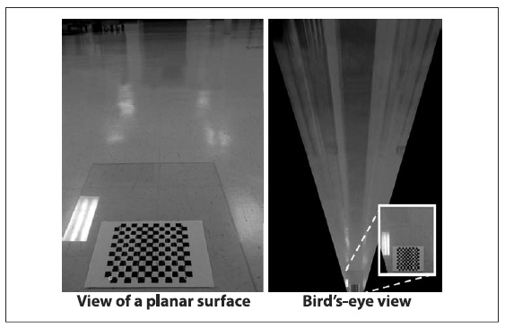

## [П]|[РС]|(РП) Аффинные и перспективные преобразования

Двумя наиболее используемыми преобразованиями являются аффинные и перспективные преобразования. Впервые об этом было сказано в главе 6. В зависимости от реализации соответствующих функций OpenCV оказывает влияние на список точек или на целое изображение, отображая точки, расположенные в одном месте, в другое место, при этом зачастую выполняя субпиксельную интерполяцию по пути. В результате аффинных преобразований из прямоугольников можно получить параллелограммы любой формы, а в результате перспективных преобразований (более общих) из прямоугольника можно получить трапецию любой формы.

*Перспективные преобразования* тесно связаны с *перспективным проецированием*. При перспективном проецировании карта точек трехмерного материального мира проецируется на двумерную плоскость изображения вдоль набора проекционных линий, сходящихся в так называемом центре проецирования. Перспективные преобразования, которые являются разновидностью *гомографии*, связывают два различных изображения, которые являются альтернативными проекциями одного и того же трехмерного объекта на двух различных *проекционных плоскостях* (и, таким образом, невырожденные формы, такие как материальная плоскость пересекающихся трехмерных объектов, как правило, имеют два различных центра проекции).

Эти функции проекционно связанных преобразований подробно обсуждались в главе 6; для удобства все полученные знания обобщены в таблице 12-1.

Таблица 12-1. Функции аффинных и перспективных преобразований

| Функция | Использование |
| -- | -- |
| cvTransform() | Аффинные преобразования списка точек |
| cvWarpAffine() | Аффинные преобразования целого изображения |
| cvGetAffineTransform() | Заполнение параметров матрицы аффинных преобразований |
| cv2DRotationMatrix() | Заполнение параметров матрицы аффинных преобразований |
| cvGetQuadrangleSubPix() | Низко затратные аффинные преобразования целого изображения |
| cvPerspectiveTransform() | Перспективные преобразования списка точек |
| cvWarpPerspective() | Перспективные преобразования целого изображения |
| cvGetPerspectiveTransform() | Заполнение параметров матрицы перспективных преобразований |

### Пример преобразования с высоты птичьего полета

Общей задачей по навигации в робототехнике, обычно используемой для планирования целей, является преобразование сцены взгляда камеры на роботе в представление с "высоты птичьего полета". На рисунке 12-1 представлено данное преобразование, которое впоследствии может быть покрыто альтернативным представлением мира, созданного при помощи сканирования лазерным дальномером. Далее, при использовании ранее полученных знаний, будет более детально показано, как использовать откалиброванную камеру для вычисления данного представления ("с высоты птичьего полёта").


Рисунок 12-1. Представление с высоты птичьего полета: автомобильная камера смотрит на дорогу, где лазерный дальномер определяет область "дороги" в передней части автомобиля и выделяет участок прямоугольником (верхняя часть изображения); алгоритмы компьютерного зрения сегментируют данный участок (центральная часть изображения); сегментируемые участки дороги преобразуются в представление с высоты птичьего полёта, которое объединяется с представлением с высоты птичьего полета карты лазера (нижняя часть изображения)

Для получения представления с высоты птичьего полета (данная техника так же работает и для перспективных преобразований представлений любых плоскостей, например, стены или потолок, во фронтально параллельные представления) необходимы вычисленные в функции калибровки внутренние параметры камеры и матрицы искажений. Для разнообразия данные параметры будут читаться из файла на диске. Доска, положенная на пол, будет использована для получения горизонтальной плоскости изображения робота повозки; в последующем данное изображение преобразуется в изображение с высоты птичьего полета. Алгоритм работает следующим образом:

1. Чтение внутренних параметров и модели искажений для камеры.

2. Поиск известного объекта на горизонтальной плоскости (в данном случае шахматная доска). Получение как минимум четырех точек с субпиксельной точностью.

3. Ввод найденных точек в *cvGetPerspectiveTransform()* (глава 6) для вычисления матрицы гомографии H представления горизонтальной плоскости.

4. Использование *cvWarpPerspective()* (глава 6) с флагами *CV_INTER_LINEAR + CV_WARP_INVERSE_MAP + CV_WARP_FILL_OUTLIERS* для получения представления фронтально параллельного горизонтальной плоскости.

Пример 12-1 показывает полностью процесс получения представления с высоты птичьего полета.

Пример 12-1. Представление с высоты птичьего полёта

```cpp
// Вызов:
// birds-eye board_w board_h instrinics distortion image_file
// Изменение высоты осуществляется при помощи клавиш:
// 'u' - отдалиться, 'd' - приблизиться, 'ESC' - выход
// 
int main( int argc, char* argv[] ) {
    
    if( argc != 6 ) return -1;
    
    // Входные параметры:
    //
    int         board_w     = atoi( argv[1] );
    int         board_h     = atoi( argv[2] );
    int         board_n     = board_w * board_h;
    CvSize      board_sz    = cvSize( board_w, board_h );
    CvMat*      intrinsic   = (CvMat*)cvLoad(argv[3]);
    CvMat*      distortion  = (CvMat*)cvLoad(argv[4]);
    IplImage*   image       = 0;
    IplImage*   gray_image  = 0;
    
    if( (image = cvLoadImage(argv[5])) == 0 ) {
        printf("Error: Couldn’t load %s\n", argv[5]);
        return -1;
    }
    
    gray_image = cvCreateImage( cvGetSize(image), 8, 1 );
    cvCvtColor( image, gray_image, CV_BGR2GRAY );
    
    // Удаление искажений
    //
    IplImage* mapx = cvCreateImage( cvGetSize(image), IPL_DEPTH_32F, 1 );
    IplImage* mapy = cvCreateImage( cvGetSize(image), IPL_DEPTH_32F, 1 );
    
    // Инициализация матриц исправления
    // 
    cvInitUndistortMap(
         intrinsic
        ,distortion
        ,mapx
        ,mapy
    );
    IplImage *t = cvCloneImage(image);
    
    // Исправление изображений
    // 
    cvRemap( t, image, mapx, mapy );
    
    // Получение плоскости шахматной доски
    // 
    cvNamedWindow("Chessboard");
    CvPoint2D32f* corners = new CvPoint2D32f[ board_n ];
    int corner_count = 0;
    int found = cvFindChessboardCorners(
         image
        ,board_sz
        ,corners
        ,&corner_count
        ,CV_CALIB_CB_ADAPTIVE_THRESH | CV_CALIB_CB_FILTER_QUADS
    );
    
    if(!found){
        printf("Couldn’t aquire chessboard on %s, only found %d of %d corners\n"
               ,argv[5],corner_count,board_n
        );
        return -1;
    }
    
    // Субпиксельная коррекция найденных углов
    // 
    cvFindCornerSubPix(
         gray_image
        ,corners
        ,corner_count
        ,cvSize(11,11)
        ,cvSize(-1,-1)
        ,cvTermCriteria( CV_TERMCRIT_EPS | CV_TERMCRIT_ITER, 30, 0.1 )
    );
    
    // Получение точек изображения и объекта:
    // Выбор точек объекта на шахматной доске (r,c):
    // (0,0), (board_w-1,0), (0,board_h-1), (board_w-1,board_h-1).
    //
    CvPoint2D32f objPts[4], imgPts[4];
    objPts[0].x = 0;            objPts[0].y = 0;
    objPts[1].x = board_w - 1;  objPts[1].y = 0;
    objPts[2].x = 0;            objPts[2].y = board_h - 1;
    objPts[3].x = board_w - 1;  objPts[3].y = board_h - 1;
    imgPts[0]   = corners[0];
    imgPts[1]   = corners[board_w - 1];
    imgPts[2]   = corners[(board_h - 1)*board_w];
    imgPts[3]   = corners[(board_h - 1)*board_w + board_w - 1];
    
    // Отображенеи точек в порядке: B,G,R,YELLOW
    //
    cvCircle( image, cvPointFrom32f(imgPts[0]), 9, CV_RGB(0,0,255),   3 );
    cvCircle( image, cvPointFrom32f(imgPts[1]), 9, CV_RGB(0,255,0),   3 );
    cvCircle( image, cvPointFrom32f(imgPts[2]), 9, CV_RGB(255,0,0),   3 );
    cvCircle( image, cvPointFrom32f(imgPts[3]), 9, CV_RGB(255,255,0), 3);
    
    // Отображенеи шахматной доски
    //
    cvDrawChessboardCorners(
         image
        ,board_sz
        ,corners
        ,corner_count
        ,found
    );
    cvShowImage( "Chessboard", image );
    
    // Поиск матрицы гомографии
    //
    CvMat *H = cvCreateMat( 3, 3, CV_32F );
    cvGetPerspectiveTransform( objPts, imgPts, H );
    
    // Позволить пользователю регулировать высоту представления Z
    //
    float Z = 25;
    int key = 0;
    IplImage *birds_image = cvCloneImage(image);
    cvNamedWindow("Birds_Eye");
    
    // Цикл, позволяющий пользователю играться с высотой
    //
    // ESC - выход
    //
    while(key != 27) {
        
        // Установка высоты
        //
        CV_MAT_ELEM(*H,float,2,2) = Z;
        
        // Вычисление фронтально параллельного или с высоты птичьего 
        // полета представления за счет использования матрицы гомографии
        //
        cvWarpPerspective(
             image
            ,birds_image
            ,H
            ,CV_INTER_LINEAR | CV_WARP_INVERSE_MAP | CV_WARP_FILL_OUTLIERS
        );
        cvShowImage( "Birds_Eye", birds_image );
    
        key = cvWaitKey();
        if(key == 'u') Z += 0.5;
        if(key == 'd') Z -= 0.5;
    }
    
    cvSave("H.xml", H); // Сохранение матрицы гомографии для повторного использования
    return 0;
}
```

После получения матрицы гомографии и установки параметра высоты, можно убрать доску и начать перемещать повозку, тем самым делая видео пути с высоты птичьего полёта, однако, на данный момент выполнение данной задачи остаётся за читателем. На рисунке 12-2 слева показано исходное изображение, а справа с высоты птичьего полёта.



Рисунок 12-2. Пример представления с высоты птичьего полёта