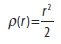
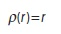
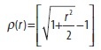
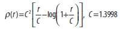
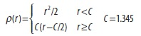
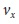
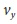
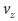
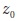

## [П]|(РС]|(РП) Конструирование двух и трех мерных линий

!!! Fitting - конструирование

В заключении будет рассмотрено конструирование линий. Данная задача может возникнуть по многих причинам и во многих контекстах. Данная тема выбрана не случайно, т.к. одной из наиболее часто возникающей ситуацией, с которой связано конструирование линии, является анализ трехмерных точек (хотя описываемые в данном разделе функции могут конструировать и двумерные линии). Алгоритмы конструирования линии как правило используют статистически надежные методы. В OpenCV алгоритм конструирования линии представлен функцией *cvFitLine()*.

```cpp
	void cvFitLine(
		 const CvArr* 	points
		,int 			dist_type
		,double 		param
		,double 		reps
		,double 		aeps
		,float* 		line
	);
```

Массив *points* может быть матрицей вещественных значений размера Nx2 или Nx3 (вмещающая двух или трех мерные точки) или последовательностью структур *cvPointXXX*. (В данном случае *XXX* может быть заменено на *2D32f* или *3D64f*). Аргумент *dist_type* это метрика расстояния, которая должна быть сведена к минимуму для всех точек (таблица 12-3).

Таблица 12-3. Метрики, используемые для вычисления значений dist_type

| Значение dist_type | Метрика |
| -- | -- |
| CV_DIST_L2 |  |
| CV_DIST_L1 |  |
| CV_DIST_L12 |  |
| CV_DIST_FAIR |  |
| CV_DIST_WELSCH |  |
| CV_DIST_HUBER |  |

Параметр *param* используется для установки параметра C из таблицы 12-3. В случае установки данного параметра в 0, значение будет соответствовать табличному в зависимости от выбора.

Аргумент *line* это место, куда будет сохранен результат. Если *points* это массив Nx2, то *line* должен быть указателем на вещественный массив размера четыре (т.е. *float array[4]*). Если *points* это массив Nx3, то *line* должен быть указателем на вещественнй массив размера шесть (т.е. *float array[6]*). В первом случае возвращаемыми значениями будут (, , , ), где (, ) это нормированный вектор параллельный конструируемой линии, а (, ) это точка на линии. Аналогичным образом, для трехмерного случая, возвращаемыми значениями будут (, , , , , ), где (, , ) это нормированный вектор параллельный конструируемой линии, а (, , ) является точкой на этой линии. Учитывая представление линии, оценка точности параметров *reps* и *aeps* следующая: *reps* требуются оценки точности *x0, y0[, z0]*, а *aeps* требуется угловая точность *vx, vy[, vz]*. В документации по OpenCV рекомендуется использовать значение точности 0.01 в обоих случаях.

*cvFitLine()* может конструировать двух или трех мерные линии. Конструирование двумерных линий обычно важно в общем (пример 12-4, автор книги выражает благодарность за предоставленный пример **Vadim Pisarevsky**), а конструирование трехмерных линий крайне важно в OpenCV в частности (глава 14). В начале представленного примера синтезируются некоторые двумерные шумовые точки вокруг линии, а затем добавляются случайные точки, которые не имеют ничего общего с линией (и именуемые *выбросами*), а в заключении конструируется линия по полученным точкам и отображается на экране. Функция *cvFitLine()* хорошо справляется с выбросами; это крайне важно в реальных приложениях, где некоторые измерения могут быть сильно повреждены из-за шума, отказа датчика или по каким-либо другим причинам.

Пример 12-4. Конструирование двумерной линии

```cpp
#include "cv.h"
#include "highgui.h"
#include <math.h>

int main( int argc, char** argv ) {
	IplImage* img = cvCreateImage( cvSize( 500, 500 ), 8, 3 );
	CvRNG rng = cvRNG( -1 );

	cvNamedWindow( "fitline", 1 );
	
	for(;;) {
		char 		key;
		int 		i;
		int 		count 		= cvRandInt(&rng)%100 + 1;
		int 		outliers 	= count/5;
		float 		a 			= cvRandReal(&rng)*200;
		float 		b 			= cvRandReal(&rng)*40;
		float 		angle 		= cvRandReal(&rng)*CV_PI;
		float 		cos_a 		= cos(angle);
		float 		sin_a 		= sin(angle);
		CvPoint 	pt1, pt2;
		CvPoint* 	points 		= (CvPoint*)malloc( count * sizeof(points[0]) );
		CvMat 		pointMat 	= cvMat( 1, count, CV_32SC2, points );
		float 		line[4];
		float 		d, t;

		b = MIN( a*0.3, b );
		
		// Генерация точек, близких к линии
		//
		for( i = 0; i < count - outliers; i++ ) {
			float x = (cvRandReal(&rng)*2-1)*a;
			float y = (cvRandReal(&rng)*2-1)*b;
			points[i].x = cvRound(x*cos_a - y*sin_a + img->width/2);
			points[i].y = cvRound(x*sin_a + y*cos_a + img->height/2);
		}

		// Генерация "completely off" точек
		//
		for( ; i < count; i++ ) {
			points[i].x = cvRandInt(&rng) % img->width;
			points[i].y = cvRandInt(&rng) % img->height;
		}

		// Поиск оптимальной линии
		//
		cvFitLine( &pointMat, CV_DIST_L1, 1, 0.001, 0.001, line );
		cvZero( img );

		// Отображение точек
		//
		for( i = 0; i < count; i++ )
		cvCircle( 
					 img
					,points[i]
					,2
					,(i < count – outliers) ? CV_RGB(255, 0, 0) : CV_RGB(255, 255, 0)
					,CV_FILLED
					,CV_AA
					,0
		);

		// ... и достаточно длинной линии, чтобы пересечь все изображение
		// 
		d = sqrt( (double)line[0]*line[0] + (double)line[1]*line[1] );
		line[0] /= d;
		line[1] /= d;
		t = (float)(img->width + img->height);
		pt1.x = cvRound(line[2] - line[0]*t);
		pt1.y = cvRound(line[3] - line[1]*t);
		pt2.x = cvRound(line[2] + line[0]*t);
		pt2.y = cvRound(line[3] + line[1]*t);
		cvLine( img, pt1, pt2, CV_RGB(0,255,0), 3, CV_AA, 0 );

		cvShowImage("fitline", img );
		
		key = (char) cvWaitKey(0);
		
		if( key == 27 || key == ‘q’ || key == ‘Q’ ) // ‘ESC’
			break;

		free( points );
	}

	cvDestroyWindow( "fitline" );
	
	return 0;
}
```