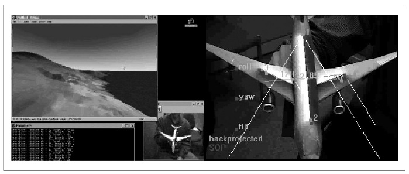

## [П]|[РС]|(РП) POSIT: оценивание трехмерного представления

Прежде, чем переходить к стерео зрению, необходимо рассмотреть довольно таки интересный алгоритм, который может оценивать положения известного трехмерного объекта. POSIT (или "Pose from Orthography and Scaling with Iteration") – это алгоритм, первоначально предложенный в 1992 для вычисления представления (положение T и ориентация R описывается шестью параметрами) трехмерного объекта, размеры которого точно известны. Для вычисления этого представления необходимо найти на изображении соответствующие места, по крайней мере, четыре некомпланарные точки на поверхности объекта. В первой части алгоритма, *pose from orthography and scaling*(POS), предполагается, что все точки объекта располагаются на одной и той же глубине и что изменения размера зависит только от расстояния до камеры. В этом случае существует закрытая форма решения для трехмерного представления объекта на основе масштабирования. Предположение, что точки объекта расположены на одной и той же глубине фактически означает, что объект находится достаточно далеко от камеры, поэтому можно пренебречь любыми внутренними разногласиями глубины в пределах объекта; это предположение более известно, как *слабо-перспективное* приближение.

Учитывая знания о внутренних параметрах камеры, можно найти перспективное масштабирование известного объекта и, следовательно, вычислить его приблизительное представление. Эти вычисления не будут особо точными, однако они помогут найти четыре точки, как если бы истинный трехмерный объект имел представление, вычисленное POS. В последующем эти точки будут входами для алгоритма POS. Процесс сходимости к истинному положению объекта, как правило, наступает в четыре или пять итераций – отсюда и название "итерационный алгоритм POS". При этом стоит не забывать, что внутренняя глубина объекта мала по сравнению с расстоянием до камеры. Если это предположение не верно, то алгоритм будет либо не сходиться, либо сходиться к "плохому представлению". Реализация алгоритма в OpenCV предполагает отслеживание более четырех (некомпланарных) точек объекта для улучшения точности оценки.

Алгоритм POSIT в OpenCV представлен тремя функциями: одна выделяет память под структуры данных положения отдельного объекта, одна освобождает память из-под той же структуры данных, и оставшаяся реализует сам алгоритм.

```cpp
    CvPOSITObject* cvCreatePOSITObject(
         CvPoint3D32f*  points
        ,int            point_count
    );
    void cvReleasePOSITObject(
        CvPOSITObject** posit_object
    );
```

Функция *cvCreatePOSITObject()* просто берет *points* (трехмерные точки) и *point_count* (целое число, указывающее на количество точек) и возвращает указатель на выделенную структуру POSIT объекта. *cvReleasePOSITObject()* принимает указатель на указатель структуры и освобождает занимаемую им память (в процессе указатель устанавливается в NULL).

```cpp
    void cvPOSIT(
         CvPOSITObject*     posit_object
        ,CvPoint2D32f*      image_points
        ,double             focal_length
        ,CvTermCriteria     criteria
        ,float*             rotation_matrix
        ,float*             translation_vector
    );
```

Стилистически список аргументов в функции *cvPOSIT()* несколько отличается от того, что было представлено многократно ранее, т.к. тут используется «старый стиль» аргументов, распространенный в старых версиях OpenCV (как было не трудно заметить, многие имена функций оканчивались на "2"; это в большинстве случаев связано с тем, что в новых версиях библиотеки меняется стилистика записи списка аргументов). Аргумент *posit_object* это указатель на POSIT объект, которые необходимо отследить, а *image_points* это список положений соответствующих точек на плоскости изображения (при этом это 32-битные значения, позволяющие задать положения субпикселей). Текущая реализация *cvPOSIT()* предполагает передачу квадрата пикселей и тем самым передаётся только один параметр *focal_length* вместо двух параметров для направлений x и y. Именно поэтому *cvPOSIT()* является итерационным алгоритмом с критерием завершения *criteria* - достижение довольно таки "хорошей подгонки". Последние два параметра *rotation_matrix* и *translation_vector* аналогичны таким же параметрам из предыдущих функций; при этом стоит отметить, что эти указатели имеют тип *float* и представляют из себя часть матриц, полученных в результате вызова (например) функции *cvCalibrateCamera2()*. В этом случае, полученная матрица M, может быть использована в качестве входного параметра для *cvPOSIT()* в виде *M->data.fl*.

При использовании POSIT, необходимо иметь в виду, что алгоритм не извлекает выгоду из дополнительных точек поверхности, компланарных с другими точками этой же поверхности. Любая точка, лежащая на поверхности и определяемая тремя другими точками, не будет приносить алгоритму пользы. На самом деле, дополнительные компланарные точки могут стать причиной вырождения, что причиняет ущерб производительности алгоритма. Дополнительные некомпланарные точки наоборот помогают алгоритму. На рисунке 12-3 представлен пример реализации алгоритма POSIT с использованием игрушечного самолета. Самолет имеет линию-метку, благодаря которой и происходит определение четырех некомпланарных точек. Эти точки передаются в *cvPOSIT()* и в результате *rotation_matrix* и *translation_vector* используются для управления симуляцией самолёта.



Рисунок 12-3. Использование алгоритма POSIT: четыре некомпланарные точки игрушки используются для управления симуляцией полёта