## [П]|(РС]|(РП) Стерео зрение

Теперь все готово для рассмотрения *стерео зрения*. (В данном разделе будет рассмотрена только "верхушка айсберга". Для получения более подробной информации лучше всего обратиться к статьям: Trucco и Verri, Hartley и Zisserman, Forsyth и Ponce, Shapiro и Stockman.) Всем нам знакомы возможности стерео зрения, которые дают нам наши глаза. Возникает вопрос: до какой степени возможно подражать этой возможности в вычислительных системах? Компьютеры выполняют данную задачу за счет нахождения соответствия между точками, которые видны на одном фотоприёмнике и теме же точками на другом фотоприёмнике. За счет этого соответствия и заранее известного базового разделения между камерами, возможно вычислить трехмерное расположение точек. Хотя поиск соответствующих точек вычислительно дорогая операция, можно воспользоваться знаниями о геометрии системы для наиболее возможного сужения пространства поиска. На практике, стерео зрение реализуется в четыре этапа при помощи двух камер.

1. Математически удаляются радиальные и тангенциальные искажения объектива (глава 11). На выходе будет получено неискаженное изображение.

2. Настраиваются углы и расстояния между камерами, так называемый процесс *уточнения*. На выходе будут получены выровненные по строкам (это означает, что два изображения плоскости компланарны и что строки изображения будут выровнены точно, т.е. в одном направлении имеют одинаковую y-координату) и уточненные изображения.

3. Ищутся особенности на представлениях левой и правой камер (каждый раз при упоминании левой и правой камеры также подразумевается вертикально ориентированные верхняя и нижняя камеры, где диспропорция возникает по y-координате, а не по x), так называемый процесс *сопоставления*. На выходе будет получена *карта несоответствий*, где различия будут соответствовать различиям в x-координате плоскости изображения для одного и того же рассматриваемого признака левой и правой камер: 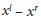.

4. Зная геометрическое расположение камер, развертывается карта несоответствий за счет *триангуляции*. Это так называемое *перепроецирование*, в результате чего получается карта глубины.

Для начала будет рассмотрен последний шаг, являющийся причиной появления первых трех.

### Триангуляция

Пусть имеется совершенно неискаженная, выравненная и измеренная стерео установка, показанная на рисунке 12-4: две камеры, чьи плоскости изображения компланарны с точно параллельными оптическими осями (оптическая ось - это луч, выходящий из центра проекции *O* и проходящий через основные точки *c*, более известный как *основной луч*), для которых известно расстояние между ними, и с одинаковыми фокальными расстояниями 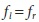. Кроме того, пусть *основные точки* 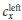 и 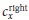 уже откалиброваны, чтобы иметь те же координаты пикселей, что и соответствующие левому и правому изображениям. При этом ни в коем случае не нужно путать основные точки с центром изображения. Основной точкой является та, что соответствует пересечению основного луча и плоскости изображения. Это пересечение зависит от оси объектива. Как уже было показано в главе 11, плоскость изображения крайне редко выравнивается именно с объективом, поэтому почти всегда центр фотоприёмника не совпадает с основной точкой. 

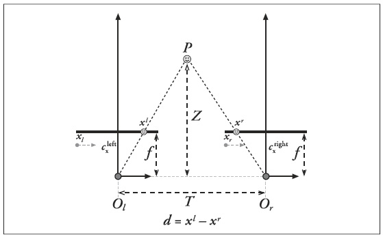 

Рисунок 12-4. Совершенно неискаженная, выравненная стерео установка с известными соответствиями, глубина Z может быть найдена при помощи подобия треугольников; основные лучи начинаются от центра проекции  и 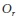 и проходят через основные точки двух плоскостей изображения 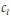 и 

Теперь пусть строки изображений выровнены, т.е. пиксель строки одной камеры выровнен в соответствии с пикселем строки другой камеры. Таким образом, такая камера именуется *фронтально параллельно расположенной*. Так же пусть имеется возможность найти точку P материального мира на левом и правом изображениях 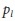 и 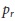, которая имеет соответствующие горизонтальные координаты 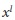 и 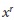.

Для данного упрощенного случая  и  - это горизонтальные позиции точек левого и правого фотоприёмника (соответственно), позволяющие показать, что глубина обратно пропорциональна различию между этими представлениями, где различие определяется довольно таки просто 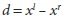. Данный случай показан на рисунке 12-4 и благодаря которому можно с легкостью вывести глубину Z из подобия треугольников. Ссылаясь на рисунок, имеем:

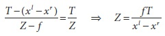

(Эта формула основывается на основных лучах, пересекающихся в бесконечности. Однако, как будет показано в следующем разделе, стерео исправления получаются по отношению к основным точкам  и . Для данной формулы основные лучи пересекаются в бесконечности, а основные точки имеют одинаковые координаты. Тем не менее, если основные лучи пересекаются на конечном расстоянии, то основные точки имеют разные координаты и потому уравнение глубины принимает следующий вид Z = fT / (d – ( - )).)

Так как глубина обратно пропорциональна d, то очевидна нелинейная связь между этими двумя элементами. Когда d близко к 0, то небольшие различия приводят к большим различиям глубины. Когда d велико, то небольшие различия не на много изменяют глубину. Как следствие из всего этого, системы стерео зрения имеют высокое разрешение глубины только в случае объектов, расположенных неподалеку от камеры (рисунок 12-5).

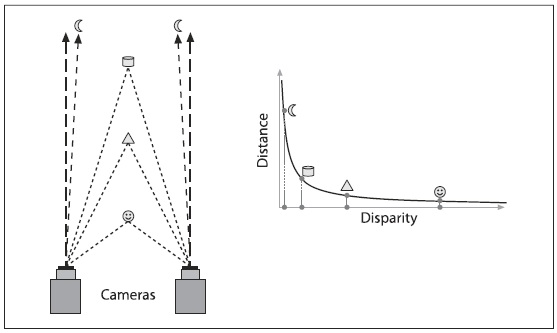

Рисунок 12-5. Глубина и различия связаны обратно пропорционально, поэтому измерения глубины ограничиваются близлежащими объектами

До этого уже были показаны многие системы координат в рамках обсуждения процесса калибровки в главе 11. На рисунке 12-6 показаны двух и трех мерные системы координат, используемые в OpenCV для стерео зрения. При этом стоит обратить внимание на тот факт, что это правые системы координат: если направить указательный палец правой руки вдоль оси X, а средний палец правой руки согнуть в направлении оси Y, то большой палец будет указывать в направлении основного луча. Пиксели левого и правого изображений фотоприёмников представлены на рисунке в верхнем левом углу и обозначаются координатами 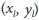 и 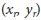, соответственно. Центры проекции  и  с основными лучами пересекают плоскость изображения в основной точке (не в центре) (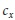, 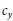). После математических исправлений, камеры становятся выровненными по строкам (компланарными и горизонтально выровненными) и отдаленными друг от друга на расстояние *T* и с фокусным расстоянием *f*.

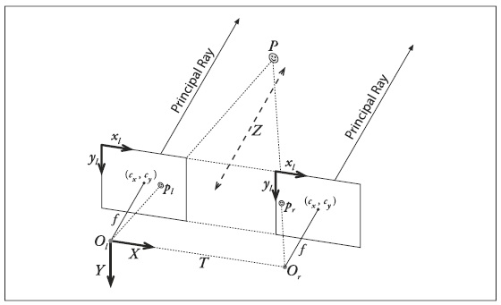

Рисунок 12-6. Системы координат, используемые в OpenCV для неискаженных выпрямленных камер: координаты пикселей относительно верхнего левого угла изображения и две выравненные плоскости; координаты камеры относительно центра проекции левой камеры

При таком расположении относительно легко найти расстояние. Теперь необходимо приложить немного усилий для понимания того, как сопоставить настройки геометрии камеры в реальном времени. В реальном мире камеры почти никогда не выровнены точно фронтально параллельно (рисунке 12-4). Вместо этого, необходимо математически рассчитать проекции изображения и карты искажений, которые поправят левое и правое изображения до фронтально параллельного расположения. При проектировании стерео устройства лучше всего расположить камеры примерно фронтально параллельно и, насколько это возможно, горизонтально ровно.  Физические преобразования благоприятно сказываются на математических вычислениях. Если камеры не выровнены хотя бы приблизительно, то в результате математического выравнивания может быть получено крайне искаженное изображение, тем самым снизиться или пропадет зона стерео перекрытия в конечном изображении. Для получения хорошего результата так же необходимо синхронизировать камеры. Если это не выполняется, то будут возникать проблемы при появлении движений в сцене (в том числе самих камер).

Рисунок 12-7 отражает реальную ситуацию между двумя камерами и необходимость математического выравнивания. Для выполнения математического выравнивания необходима в большей степени информация о геометрии представлений сцен двух камер. После получения данной геометрии и некой терминологии и обозначений, можно вернуть к проблеме выравнивания.

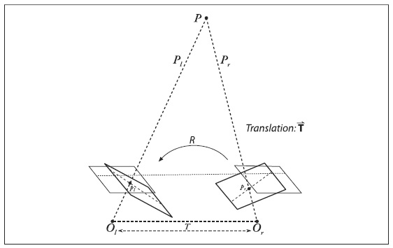

Рисунок 12-7. Целью данного изображения является показать, как математически (а не физически) совместить две камеры в одном представлении плоскости так, что пиксели строк между камерами в точности выровнены друг относительно друга

### Эпиполярная геометрия

В основе геометрии системы компьютерного зрения лежит *эпиполярная геометрия*. В сущности, эта геометрия сочетает в себе две модели камеры обскуры (по одной для каждой камеры) и некоторые интересные новые точки, именуемые как *керновые точки* (рисунок 12-8). Перед объяснением того, чем хороши эти точки, будет рассмотрен процесс их определения и добавлена связанная с ними терминология. После всего этого, будет кратко изложено общее понимание этой геометрии, а также значительно сужен набор точек, соответствующих двум камерам. На практике это дополнение очень важное.


Рисунок 12-8. Эпиполярная плоскость определяется наблюдаемой точкой P и двумя центрами проекции  и ; керновые точки располагаются в точках пересечения линии, соединяющая центры проекции и две проекционные плоскости

Для каждой камеры имеется отдельный центр проекции  и  и пару соответствующих проекционных плоскостей 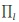 и 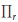. Точка P материального мира проецируется на каждую из проекционных плоскостей  и . Наибольший интерес представляют новые точки – керновые точки. Керновая точка 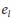 (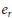) на плоскости  () определяется как центр проекции изображения другой камеры  (). Плоскость пространства, образованная фактическими представлениями точки P и двумя керновыми точками  и  (или, что эквивалентно, двумя центрами проекции  и ), именуется *эпиполярной плоскостью*, а линии   и   (от точки проекции до соответствующей эпиполярной точки) *эпиполярными линиями*.

Для осознания того, насколько полезна эпиполярность, необходимо вспомнить следующий факт: на самом деле точка материального мира, проецирующая на правую (или левую) плоскость изображения, может быть расположена в любом месте вдоль всей линии точек луча, идущего от  через  (или от  через ), т.к. для одной из камер не известно расстояние до рассматриваемой точки. Например, имеется точка P, которую видно на правой камере. Т.к. камера видит только  (проекцию P на ), по факту точка P может быть расположена в любом месте на линии, образованной  и . Очевидно, что эта линия содержит P, но она так же содержит и другие точки. Однако, что интересно, как выглядит проекция этой линии на левой плоскости изображения ; по факту это эпиполярная линия, определяемая  и . Изображение все возможных *точек*, отображенных на одном фотоприёмнике, это *линия*, проходящая через соответствующую точку и керновые точки другого фотоприёмника.

Краткий список некоторых фактов об эпиполярной геометрии стереокамер (и почему этому уделено внимание).

* Каждая трехмерная точка представлений камер располагается на эпиполярной плоскости, которая пересекает каждое изображение по эпиполярной линии.

* Учитывая особенности одного изображения, соответствующее представление другого изображения *должно* лежать вдоль соответствующей эпиполярной линии. Это известно, как *эпиполярное ограничение*.

* Эпиполярное ограничение означает, что возможно преобразовать двумерный поиск для сопоставления особенностей двух фотоприёмников в одномерный поиск вдоль эпиполярных линий при условии наличия знаний о геометрии стереоустановки. Это не только огромное сокращение операций вычисления, но и отбрасывание из рассмотрения точек, которые могли бы привести к ложным соответствиям.

* Порядок сохранения. Если точки A и B видны на обоих изображениях и горизонтально попадают в указанном порядке на один фотоприёмник, то они горизонтально попадают в указанном порядке и на другой фотоприёмник. (Из-за преград и областей перекрытия представления, важно, чтобы обе камеры не видели одни и те же точки. Тем не менее, порядок должен поддерживаться. Так, если точки A, B и C располагаются слева направо на левом фотоприёмнике и если B не видно на правом фотоприёмнике из-за наличия перекрытия, то правый фотоприёмник по-прежнему должен видеть точки A и C слева направо.)

### Существенная и фундаментальная матрицы

Осталось рассмотреть ещё два ингредиента, прежде чем переходить к функциям OpenCV, которые вычисляют эпиполярные линии. Это существенная матрица E и фундаментальная матрица F. Матрица E содержит информацию о перемещении и вращении двух связанных камер в материальном пространстве (рисунок 12-9), а F содержит такую же информацию, как и E плюс информацию о внутренних параметрах, относящихся к двум камерам в пиксельных координатах. Т.к. F содержит информацию о внутренних параметрах, то связь между двумя камерами выражается в пиксельных координатах.

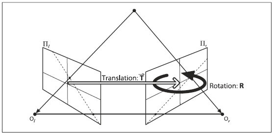

Рисунок 12-9. В основе геометрии стерео зрения лежит существенная матрица E, содержащая всю информацию о перемещении T и вращении R, при помощи которой в свою очередь можно описать положение второй камеры относительно первой в глобальных координатах

Существенная матрица E является чисто геометрической, при этом ничего не знающая о фотоприёмнике. Она сопоставляет расположения, в материальных координатах, точки P в одной точке, в чём можно убедиться при просмотре этой точки с левой и правой камер (т.е. связь  к ). Фундаментальная матрица F связывает точки плоскости изображения одной камеры в координатах изображения (в пикселях) с точками плоскости изображения другой камеры в координатах изображения (в дальнейшем будут использоваться обозначения 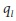 и 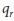).

**Математические действия над существенной матрицы**

Пусть имеется точка P и необходимо получить соотношение, соединяющее отслеживаемые положения  и  точки P на двух фотоприёмниках. Эта связь служит оберткой определения существенной матрицы. Для начала будет рассмотрена связь между  и , при этом материальное расположение точки будет рассматриваться в координатах двух камер. Эта связь может быть представлена при помощи эпиполярной геометрии, как уже было показано ранее. (При этом не стоит путать  и , которые являются точками на проекционной плоскости изображения, с  и , и которые являются положениями точки P в системе координат двух камер.)

Теперь необходимо выбрать один набор координат, левый или правый, для работы и выполнения расчетов. Пусть выбор падет на координаты сосредоточенные на  левой камере. Согласно этим координатам положение отслеживаемой точки будет , а тогда начальное положение другой камеры будет располагаться на расстоянии T. Точка P, как видно на правой камере 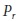, имеет координаты этой камеры, где  = R( - T). Ключевым шагом является введение эпиполярной плоскости, которая как уже известно связывает все эти вещи. Конечно возможно представить плоскость множеством способов, но для рассматриваемого случая необходимо вспомнить, что уравнение для всех точек **x** на плоскости с нормальным вектором **n**, проходящим через точку **a**, необходимо соблюдать следующее ограничение:

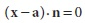

Эпиполярная плоскость содержит векторы  и T; таким образом, если есть перпендикулярный (векторное произведение векторов дает третий вектор, ортогональный к двум первым; направление определяется "правилом правой руки": если указательный палец соответствует направлению *a*, а средний палец направлению *b*, то векторное произведение *axb* перпендикулярно к *a* и *b* и соответствует направлению большого пальца) к обоим векторам вектор (например xT), то можно использовать его в **n** уравнениях плоскости. Так, уравнение для все возможных точек  проходящих через точку T и содержащей оба вектора имеет вид (за счет замены скалярного произведения на матричное перемножение транспонированного и нормального векторов):

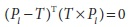

Не стоит забывать, что основная цель заключается в том, чтобы связать  и  для начала в соотношении  и . Отрисовка  на рисунке осуществляется за счет равенства =R( - T), которое для удобства лучше переписать следующим образом ( - T) =  . Выполнив подстановку и используя 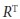 = , уравнение примет следующий вид:

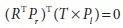

Векторное произведение можно переписать в (несколько громоздкое) перемножение матриц. Таким образом матрица **S** примет следующий вид:


После подстановки уравнение примет следующий вид:

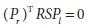

*RS* - это существенная матрица E, тогда уравнение принимает компактный вид:

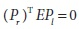

В результате получаем связь между точками, которые наблюдаются на фотоприёмниках, но это только первый шаг. За счет выполнения замены при помощи проекционных уравнений 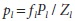 и 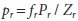 и последующего разделения на 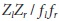, уравнение примет окончательный вид:

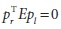

На первый взгляд может показаться, что уравнение определяется элементом *p*, если остальное известно, но E это обертка ранг-неполной матрицы (существенная матрица 3x3 ранга 2) и как следствие все заканчивается линейным уравнением. (Для квадратной nxn матрицы E, ранг неполная оценка означает, что имеется менее чем n ненулевых собственных значения. В результате система линейных уравнений, указанных в ранг-неполной матрице, не имеет единственного решения. Если ранг (число ненулевых собственных значений) n-1, то это будет строка, образованная набором точек, которые все без исключения удовлетворяют системе уравнений. Система определяется матрицей ранга n-2, образуя плоскость, и так далее.) Существенная матрица содержит пять параметров - три для вращения и два для направленного перемещения (без установки масштаба) - и два ограничения: (1) определитель равен 0, т.к. это ранг-неполная матрица (3x3 с рангом 2); (2) два ненулевых сингулярных разложения равны, потому что матрица S кососимметричная, а R это матрица вращения. В общей сложности это даёт семь ограничений. При этом, ещё раз, не стоит путать данную матрицу E с внутренними параметрами E камеры; таким образом, связанные точки выражаются в материальных координатах или координатах камеры, а не в пиксельных координатах.

**Математические действия над фундаментальной матрицей**

Матрица E содержит всю информацию о геометрии двух камер относительно друг друга, но не о самих камерах. На практике, наибольший интерес вызывают пиксельные координаты. Для поиска связи между пикселем одного изображения и соответствующей эпиполярной линией другого изображения, необходимо ознакомиться с внутренней информацией о двух камерах. Для того, чтобы это сделать необходимо подставить вместо *p* (в пиксельных координатах) *q* и матрицу внутренних параметров камеры. *q = Mp* (где M - это матрица внутренних параметров камеры) или, что эквивалентно, 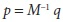. В результате уравнение для E принимает следующий вид:

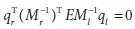

Это выглядит несколько беспорядочно, однако введение фундаментальной матрицы:

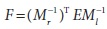

устраняет этот беспорядок

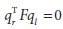

Вкратце: фундаментальная матрица F это существенна матрица E с той лишь разницей, что F работает с пиксельными координатами изображения, тогда как E работает с материальными координатами (при этом стоит обратить внимание на уравнение, связывающее фундаментальную и существенную матрицы; если выровнять изображение и нормализовать точки за счет деления на фокусное расстояние, то матрица внутренних параметров M становится единичной и тогда *F = E*). Матрицы E и F имеют ранг 2. Фундаментальная матрица содержит семь параметров, два для каждой эпиполярной точки и три для гомографии, которая связывает две плоскости изображения (как правило масштаб не влияет на четыре параметра).

**То, как обрабатывает все рассмотренные вещи OpenCV**

Можно вычислить F точно так же, как и гомографию изображения в предыдущем разделе за счет предоставления набора известных соответствий. В этом случае не требуется выполнять отдельную калибровку камеры, потому что можно найти решение непосредственно для F, которая неявно содержит фундаментальные матрицы обеих камер. Функция, выполняющая все эти вещи, именуется *cvFindFundamentalMat()*:

```cpp
	int cvFindFundamentalMat(
		 const CvMat* 	points1
		,const CvMat* 	points2
		,CvMat* 		fundamental_matrix
		,int 			method = CV_FM_RANSAC
		,double 		param1 = 1.0
		,double 		param2 = 0.99
		,CvMat* 		status = NULL
	);
```

Первые два аргумента это вещественные указатели (одинарной точности) Nx2 или Nx3 матрицы, содержащие соответствующие собранные N точки (это так же могут быть N-1 многоканальные матрицы с двумя или тремя каналами). Результирующая матрица *fundamental_matrix* должна быть матрицей 3x3 той же точностью, что и точки (в частности размерность может быть 9x3).

Следующий аргумент определяет метод, который будет использоваться при вычислении фундаментальной матрицы по соответствующим точкам; может принимать одно из четырех значений. Для каждого значения есть определенное ограничение по количеству необходимых (или разрешенных) точек в *points1* и *points2*, как показано в таблице 12-2.

Таблица 12-2. Ограничения на аргумент метода

| Значение метода | Количество точек | Алгоритм |
| -- | -- | -- |
| CV_FM_7POINT | N = 7 | Семи-точечный алгоритм |
| CV_FM_8POINT | N ≥ 8 | Восьми-точечный алгоритм |
| CV_FM_RANSAC | N ≥ 8 | Алгоритм RANSAC |
| CV_FM_LMEDS | N ≥ 8 | Алгоритм LMedS |

Семи-точечный алгоритм задействует ровно семь точек, а также тот факт, что матрица F имеет ранг 2 для полного ограничения матрицы. Преимущество этого ограничения в том, что F всегда имеет ранг 2, поэтому не имеет очень малое собственное число, близкое к 0. Недостатком является то, что это ограничение не является абсолютно уникальным, и потому результирующая матрица может быть трех экземпляров (в этом случае *fundamental_matrix* должна быть матрицей 9x3, чтобы вместить все три варианта). Восьми-точечный алгоритм находит F в виде линейной системы уравнений. Если задействуются более 8 точек, то возникающие ошибки устраняются по методу наименьших квадратов совместно с минимизацией всех точек. Проблема семи-точечного и восьми-точечного алгоритмов в том, что они чрезвычайно чувствительны к выбросам (даже, если имеется более восьми точек в случае с восьми точечным алгоритмом). Алгоритмы *RANSAC* и *LMedS* как правило классифицируются как надежные методы, потому что они способны распознавать и удалять выбросы. Для каждого алгоритма важно иметь более восьми точек.

Следующие два аргумента - это параметры, используемые только *RANSAC* и *LMedS*. Первый *param1* - это максимальное расстояние от точки до эпиполярной линии (в пикселях), за пределами которой точка считается выбросом. Второй параметр *param2* является желаемым доверительным интервалом (значение между 0 и 1), который по существу сообщает алгоритму количество итераций.

Последний аргумент *status* не обязателен; если используется, то это должна быть матрица Nx1 типа *CV_8UC1*, где N соответствует *points1* и *points2*. Если эта матрица не NULL, то *RANSAC* и *LMedS* используют данную матрицу для хранения информации о том, какие точки являются выбросами, а какие нет. В частности, соответствующая запись будет установлена в 0, если точка является выбросом и в 1 в противном случае.

Возвращаемое значение - это целое число, указывающее на количество найденных матриц. Это будет 1 или 0 для всех случаев, кроме семи-точечного алгоритма, где так же возможно значение 3. Значение 0 указывает на невозможность вычисления матрицы. Ниже представленный пример, взятый из руководства по OpenCV, поможет окончательно разобраться с этой функцией.

Пример 12-2. Вычисление фундаментальной матрицы при помощи RANCAS

```cpp
	int 	point_count = 100;
	CvMat* 	points1;
	CvMat* 	points2;
	CvMat* 	status;
	CvMat* 	fundamental_matrix;

	points1 	= cvCreateMat( 1, point_count, CV_32FC2 );
	points2 	= cvCreateMat( 1, point_count, CV_32FC2 );
	status 		= cvCreateMat( 1, point_count, CV_8UC1 );

	/* Заполнение точек ... */
	for( int i = 0; i < point_count; i++ ) {
		points1->data.fl[i*2] 		= <x1, i>;
		points1->data.fl[i*2+1] 	= <y1, i>;
		points2->data.fl[i*2] 		= <x2, i>;
		points2->data.fl[i*2+1] 	= <y2, i>;
	}

	fundamental_matrix = cvCreateMat( 3, 3, CV_32FC1 );
	int fm_count = cvFindFundamentalMat(
		 points1
		,points2
		,fundamental_matrix
		,CV_FM_RANSAC
		,1.0
		,0.99
		,status
	);
```

Пару слов предупреждений - связанных с возвращением 0 - алгоритмы могут быть провальными, если точки поставляются в *вырожденной форме*. Вырожденная форма возникает тогда, когда поставляемые точки предоставляют меньше информации, чем требуется, например, когда одна точка повторяется более одного раза или, когда несколько точек коллинеарны или компланарны с чересчур многими другими точками. Важно всегда проверять возвращаемое значение *cvFindFundamentalMat()*.

### Вычисление эпиполярных линий

Теперь, имея фундаментальную матрицу, появляется возможность для вычисления эпиполярных линий. Функция OpenCV *cvComputeCorrespondEpilines()* вычисляет по списку точек одного изображения эпиполярную линию на другом изображении. При этом стоит отметить, что для любой заданной точки одного изображения существует соответствующая эпиполярная линия на другом изображении. Каждая вычисляемая линия кодируется в виде вектора из трех точек (a, b, c), который определяется следующим уравнением:

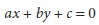

Для вычисления эпиполярных линий, функция запрашивает фундаментальную матрицу, которая вычисляется *cvFindFundamentalMat()*.

```cpp
	void cvComputeCorrespondEpilines(
		 const CvMat* 	points
		,int 			which_image
		,const CvMat* 	fundamental_matrix
		,CvMat* 		correspondent_lines
	);
```

Первый аргумент *points*, как правило, Nx2 или Nx3 массив точек (который может быть Nx1 для многоканального массива с двумя или тремя каналами). Аргумент *which_image* может быть либо 1, либо 2 и указывает на то, какие точки определяются на изображении (относительно массивов *points1* и *points2* функции *cvFindFundamentalMat()*). *fundamental_matrix* это матрица 3x3, возвращаемая *cvFindFundamentalMatrix()*. *correspondent_lines* является массивом вещественных чисел Nx3, в который записывается результат. Легко заметить, что уравнение линии ax + by = c = 0 не зависит от общей нормализации параметров a, b и c. По умолчанию они нормированы так, что 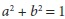.

### Стерео калибровка

Уже было представлено достаточно теории и техник, касаемо камер и трехмерных точек, для рассмотрения стерео калибровки (в этом разделе) и стерео исправления (в следующем разделе). *Стерео калибровка* - это процесс вычисления геометрической связи между двумя пространствами камер. В отличии от этого *стерео исправления* - это процесс *исправления* отдельно взятых изображений так, чтобы казалось будто бы они взяты от двух камер с выравненными плоскостями изображения (рисунок 12-4 и 12-7). При таком исправления, оптические оси (или основные лучи) двух камер параллельны и потому они пересекаются в бесконечности. Можно было бы конечно калибровать две камеры иначе, но в данном случае (и в OpenCV) используется более общий и простой случай установки основных лучей, пересекающихся в бесконечности.

Стерео калибровка зависит от матрицы вращения R и вектора перемещения T между двумя камерами, как показано на рисунке 12-9. И R и T вычисляются функцией *cvStereoCalibrate()*, которая схожа с *cvCalibrateCamera2()*, и которая была рассмотрена в главе 11, за исключением того факта, что теперь имеется две камеры и новая функция может вычислить (или использовать какие-либо предварительные вычисления) для камеры искажения существенной или фундаментальной матрицы. Другое отличие стерео калибровки от калибровки одной камеры в том, что в *cvCalibrateCamera2()* используется законченный список вращений и перемещений между камерой и представлением шахматной доски. В случае с *cvStereoCalibrate()* ищется одна матрица вращения и один вектор перемещения, которые связывают правую и левую камеры.

Уже было показано, как вычислять существенную и фундаментальную матрицы, однако не было показано как вычислять R и T, связывающие левую и правую камеры. Для любой заданной трехмерной точки P в координатах объекта можно отдельно использовать единичную калибровку двух камер для перевода P в координаты камеры 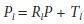 и 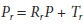 для левой и правой камер, соответственно. Из рисунка 12-9 так же видно, что два представления P (от двух камер) можно связать уравнением 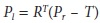, где R и T матрица вращения и вектор перемещения между камерами, соответственно. Имея эти три уравнения получаем решение для матрицы вращения и вектора перемещения по отдельности:

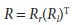

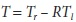

Имея множество совместных представлений углов шахматной доски, *cvStereoCalibrate()* использует *cvCalibrateCamera2()* чтобы найти решение для параметров матрицы вращения и вектора перемещения представления шахматной доски для каждой камеры в отдельности (глава 11, раздел "Что под капотом?"). Затем найденные решения подставляются в ранее рассмотренные уравнения для нахождения матрицы вращения и вектора перемещения между двумя камерами. Из-за присутствия шума в изображении и ошибок округления каждая шахматная доска попарно объединяет различия в значениях для R и T. Функция *cvStereoCalibrate()* принимает найденные средние значения R и T в качестве начального приближения для поиска истинных значений за счет использования надежного *Levenberg-Marquardt* итеративного алгоритма поиска (локального) минимума ошибки перепроецирования углов шахматной доски для обоих представлений камер и возвращает решение для R и T. Итак, чтобы было ясно, что дает стерео калибровка: матрица вращения размещается в правой камере в той же плоскости, что и в левой камере; это объединяет две плоскости в одну не выровненную плоскость (выравнивание будет рассматриваться в следующем разделе "Стерео исправления").

Функция *cvStereoCalibrate()* имеет много параметров, но они все довольно таки просты и к тому же многие схожи с параметрами функции *cvCalibrateCamera2()* из главы 11.

```cpp
	bool cvStereoCalibrate(
		 const CvMat* 		objectPoints
		,const CvMat* 		imagePoints1
		,const CvMat* 		imagePoints2
		,const CvMat* 		npoints
		,CvMat* 			cameraMatrix1
		,CvMat* 			distCoeffs1
		,CvMat* 			cameraMatrix2
		,CvMat* 			distCoeffs2
		,CvSize 			imageSize
		,CvMat* 			R
		,CvMat* 			T
		,CvMat* 			E
		,CvMat* 			F
		,CvTermCriteria 	termCrit
		,int 				flags = CV_CALIB_FIX_INTRINSIC
	);
```

Первый параметр *objectPoints* это матрица Nx3, содержащая материальные координаты каждой из K точек на каждом M изображении трехмерного объекта таким образом, что N = KxM. Когда используется шахматная доска как трехмерный объект, эти точки находятся в системе координат, связанной с объектом - при установки необходимо сообщить, что левый верхний угол шахматной доски является исходным (и, как правило, выбранный так, что бы координата Z была равна 0), при этом какие-либо известные трехмерные точки могут быть использованы, как описано в *cvCalibrateCamera2()*.

Для разграничения одинаковых по смыслу параметров двух камер параметры оканчиваются на "1" и "2". В результате, следующие параметры *imagePoints1* и *imagePoints2* - это матрицы Nx2, содержащие левые и правые координаты пикселей (соответственно) всех опорных точек объекта из *objectPoints*. Если выполнить калибровку при помощи шахматной доски для двух камер, то *imagePoints1* и *imagePoints2* это соответственно возвращаемые значения для M, которые получаются после вызова **imagePoints1* и *imagePoints2* для левого и правого представления камер.

Аргумент *npoints* содержит число точек для каждого изображения и является матрицей Mx1.

Параметры *cameraMatrix1* и *cameraMatrix2* это матрицы проекций камер 3x3, а *distCoeffs1* и *distCoeffs2* это матрицы искажения 5x1 для 1 и 2 камер, соответственно. При этом два параметра радиальных искажений содержаться в первой матрице, а два параметра тангенциального искажения и два радиальных искажений во второй (глава 11, коэффициенты искажения). Три параметра радиальных искажений завершают матрицу, т.к. были добавлены по ходу развития OpenCV; эти параметры, как правило, используются в случае с широкоугольными (с эффектом рыбий глаз) объективами. Использование матриц внутренних параметров камер контролируется параметром *flags*. Если *flags = CV_CALIB_FIX_INTRINSIC*, то эти матрицы используются в процессе калибровки. Если *flags = CV_CALIB_USE_INTRINSIC_GUESS*, то эти матрицы используются в качестве отправной точки по оптимизации матриц внутренних параметров и искажений для каждой камеры и будут установлены в более точные значения после выполнения *cvStereoCalibrate()*. Другие значения параметра *flags*, которые соответствуют аналогичному параметру функции *cvCalibrateCamera2()*, можно аддитивно объединить; в этом случае эти параметры будут вычисляться с нуля в *cvStereoCalibrate()*. Т.е. можно вычислить матрицу внутренних параметров, матрицу внешних параметров и стерео параметры за один проход функцией *cvStereoCalibrate()*.

Параметр *imageSize* - это размер изображения в пикселях. Используется только если необходимо уточнить или вычислить внутренние параметры, когда *flags != CV_CALIB_FIX_INTRINSIC*.

Элементы R и T - это выходные параметры, которые заполняются функцией и которые являются матрицей вращения и вектором перемещения (связывающие левую и правую камеры), соответственно. Параметры E и F являются необязательными. Если они не установлены в NULL, то функция будет вычислять и заполнять их 3x3 существенной и фундаментальной матрицами. Параметр *termCrit* уже неоднократно рассматривался. Он отвечает за внутреннюю оптимизацию за счет сообщения о прекращении после определенного числа итераций или, когда вычисляемые параметры становятся меньше заданного порога в структуре *termCrit*. Типичный пример использования данного параметра выглядит следующим образом: *cvTermCriteria(CV_TERMCRIT_ITER + CV_TERMCRIT_EPS, 100, 1e-5)*.

И в заключении, параметр *flags*, о котором уже было сказано пару слов ранее. Если камеры откалиброваны и результат внушает доверие, то можно "закрепить неподвижно" результаты калибровки одной из камер при помощи *CV_CALIB_FIX_INTRINSIC*. Если начальные результаты калибровки хорошие, но не замечательные, то можно выполнить уточнение внутренних параметров и параметров искажения при помощи *CV_CALIB_USE_INTRINSIC_GUESS*. Если раздельная калибровка камер не выполнялась, то можно использовать те же настройки параметра *flags*, что и в *cvCalibrateCamera2()* главы 11.

После получения матрицы вращения и вектора перемещения (R, T) или фундаментальной матрицы F, можно их использовать для исправления двух стереоизображений таким образом, чтобы эпиполярные линии расположились вдоль строк изображений, а линии сканирования были одинаковыми на обоих изображениях. Несмотря на то, что R и T не определяют уникальность стерео исправлений, в следующем разделе будет показано как их (совместно с другими ограничениями) можно использовать.

### Стерео исправления

Легче всего вычислить стерео несоответствия, когда обе плоскости изображения точно выровнены (рисунок 12-4). К сожалению, как уже было сказано ранее, редко удаётся добиться точно выравненной в реальности стерео системы, т.к. две камеры почти никогда точно не компланарные, построчно-выровненные плоскости изображений. На рисунке 12-7 показана цель стерео исправлений: необходимость перепроецирования плоскостей изображения двух камер так, чтобы они находились точно в одной и той же плоскости с совершенно выравненными строками во фронтально-параллельной форме. Возникает вопрос, как выбрать конкретную плоскость, в которой математическое выравнивание камеры зависит от используемого алгоритма? В дальнейшем будут показаны два случая, используемые в OpenCV.

Необходимо, чтобы строки изображения между двумя камерами были выровнены после исправлений так, чтобы стерео соответствия (поиск одной и то же точки на двух различных представлениях камеры) были более надежными и легко вычисляемыми. Надежность и эффективность вычислений можно повысить за счет выполнения поиска только по одной строке для сопоставления с точкой другого изображения. Результатом горизонтального выравнивания строк в пределах общей плоскости изображения, которые содержит каждое изображение, является то, что керновые точки перемещаются в бесконечность. Т.е. изображение центра проекции одного изображения параллельно другой плоскости изображения. Но т.к. имеет место бесконечное число возможных фронтально-параллельных плоскостей для выбора, то необходимо большее количество ограничений: максимизация перекрывающих представлений и/или минимизация искажений, выбор которых зависит от используемого алгоритма.

В результате выравнивания двух плоскостей изображения будут получены восемь элементов, по четыре для каждой камеры. Для каждой камеры также вычисляется вектор искажений *distCoeffs*, матрица вращения 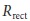 и выравненная и неочищенная матрицы ( и M, соответственно). Благодаря этим элементам можно построить карту за счет *cvInitUndistortRectifyMap()*, где применяется интерполяция пикселей исходного изображения для создания нового исправленного изображения. (Стерео исправления в OpenCV возможны только тогда, когда эпиполярные точки находятся за пределами изображения прямоугольника. Следовательно, алгоритмы исправления могут не работать со стерео конфигурациями, которые характеризуются либо очень широкими базисными линиями, либо тем, что камеры могут указывают друг на друга в значительной степени).

Есть множество путей вычисления элементов исправления, но OpenCV использует только два: (1) алгоритм Hartley, который на выходе дает неоткалиброванное стерео за счет использования только фундаментальной матрицы; (2) алгоритм Bouguet, который использует параметры вращения и перемещения от двух откалиброванных камер. Алгоритм Hartley может быть использован для получения структуры движения, записанного одной камерой, но вместе с тем может (при стерео исправлениях) привести к появлению большого количества искаженных изображений, чем откалиброванный алгоритм Bouguet. В ситуациях, когда возможно использование откалиброванных образцов - такие, как рука робота или камер безопасности - наиболее естественно использование алгоритма Bouguet.

**Неоткалиброванное стерео исправление: алгоритм Hartley**

Алгоритм Hartley пытается найти матрицу гомографии, отображающая эпиполярные точки в бесконечности и сводящая к минимуму расчетные несоответствия между двумя стерео изображениями; это достигается за счет сопоставления точек между двумя парами изображения. Таким образом, необходимость в вычислении внутренних параметров камеры отпадает, т.к. эта информация в неявном виде содержится в сопоставлениях. Следовательно необходимо вычислить только фундаментальную матрицу, которая может быть получена от любого набора сопоставлений из семи или более точек между двумя представлениями сцены за счет *cvFindFundamentalMat()*. Как вариант, фундаментальная матрица может быть вычислена при помощи *cvStereoCalibrate()*.

Преимущество от использования алгоритма Hartley заключается в том, что стерео калибровка в реальном времени может быть выполнена за счет наблюдения только за точками сцены. Недостаток заключается в том, что отсутствует чувствительность к изменению масштаба изображения. Например, если использовать шахматную доску для генерации точек сопоставления, то не имеется возможности сказать далеко (если доска размером 100 метров) или близко (если доска размером 100 см). Так же не имеется явного определения матрицы внутренних параметров без которой камеры могут иметь разные фокусные расстояния, перекошенные пиксели, различные центры проекций и/или различные основные точки. Как результат, можно определить трехмерные объекты реконструировав только проекционные преобразования. Это означает, что различные масштабы или проекции объекта могут показаться одним и тем же (т.е. особые точки имеют одинаковые двумерные координаты при различных трехмерных объектах). Обе проблемы показаны на рисунке 12-10.


Рисунок 12-10. Реконструкция стерео неоднозначности: если размер объекта не известен, то различные размеры объектов могут дать один и тот же результат независимо от расстояния до камеры (слева); если матрица внутренних параметров камеры не известна, то различные проекции могут выглядеть одинаково - например, имеющие различные фокусные расстояния основные точки

При наличии фундаментальной матрицы F, которой требуется семь или более точек, алгоритм Hartley будет выглядеть следующим образом:

1. Использование фундаментальной матрицы для вычисления двух эпиполярных точек при помощи соотношения F  = 0 и F = 0 для левой и правой эпиполяной точки, соответственно.

2. При получении первой матрицы гомографии , которая будет отображать правую эпиполярную точку к двумерной однородной точке в бесконечности . Поскольку матрица гомографии имеет семь ограничений (для масштаба отсутствует), три для отображения в бесконечности, четыре для левой . Эти четыре ограничения в основном приводят к беспорядку, т.к. большинство  приводят к весьма искаженным изображениям. Для поиска хорошей , необходимо выбрать точку на изображении, где минимальны искажения и разрешены только строгие вращения и перемещения без сдвига. Разумным местом выбора такой точки является исходное изображение и в дальнейшем нужно считать, что эпиполярная точка  = (f, 0, 1) лежит на оси x. Учитывая эти координаты, матрица 


будет использовать эпиполярные точки до бесконечности.

3. Для выбранной точки на правом (исходном) изображении вычисляется вектор перемещения T, который будет воспринимать эту точку как начало координат (0 в данном случае) и матрицу вращения R, которая использует эпиполярные точки  = (f, 0, 1). Тогда матрица гомографии  = GRT.

4. Далее ищутся соответствия для матрицы гомографии , которая отправляет левые эпиполярные точки в бесконечность и выравнивает строки двух изображений. Отправку левых эпиполярных точек в бесконечность легко выполнить, используя три ограничения из шага 2. Для выравнивания строк необходимо использовать факт того, что выравнивание строк минимизирует общее расстояние между всеми сопоставляемыми точками двух изображений. То есть, найденная  минимизирует общее неравенство лево-правого сопоставления точек . Эти две матрицы гомографии определяют стерео исправления.

Несмотря на то, что детали алгоритма несколько сложнее, *cvStereoRectifyUncalibrated()* выполняет всю эту работу за нас. Функция немного неверно названа, т.к. она не исправляет неоткалиброванные стерео изображения, она лишь вычисляет матрицы гомографии, которые в дальнейшем могут быть использованы для исправления. 

```cpp
	int cvStereoRectifyUncalibrated(
		 const CvMat* 	points1
		,const CvMat* 	points2
		,const CvMat* 	F
		,CvSize 		imageSize
		,CvMat* 		Hl
		,CvMat* 		Hr
		,double 		threshold
	);
```

Входным параметром функции является массив 2xK, соответствующий точкам между левым и правом изображениями массивов *point1* и *point2*. Заранее рассчитанная фундаментальная матрица передается как массив F. Параметр *imageSize* указывает на ширину и высоту изображения, которое будут использовано во время калибровки. Функция возвращает матрицы гомографии в *Hl* и *Hr*. И в заключении, если расстояние от этих точек до соответствующих эпиполярных точек превышает установленное пороговое значение *threshold*, то соответствующая точка исключается из алгоритма.

Если камеры имеют примерно одинаковые параметры и устанавливаются в приблизительно горизонтально выравненную фронтально-параллельную форму, то конечные исправления алгоритма Hartley будут схожи со случаем калибровки, описанным далее. Если известен размер или трехмерная геометрия объекта сцены, то можно получить те же результаты, как и в случае с калибровкой.

**Откалиброванные стерео исправления: алгоритм Bouguet**

Учитывая матрицу вращения и вектор перемещения (R, T) между стерео изображениями, алгоритм Bouguet для стерео исправлений просто пытается минимизировать количества изменений перепроецирования для каждого из двух изображений (тем самым свести к минимуму результирующие перепроецирования искажений) при максимальной площади охвата.

Для сведения к минимуму искажений перепроецирования изображения, матрица вращения R, которая вращает плоскость изображения правой камеры относительно плоскости изображения левой камеры, делится пополам между двумя камерами; как результат две матрицы вращения  и  для левой и правой камеры, соответственно. Каждая камера вращается в пол вращения так, что каждый основной луч в конечном итоге становится параллелен суммарному вектору, где указаны их исходные основные лучи. Как уже было сказано ранее, такое вращение выставляет камеры компланарно, но при этом не выравнивает строки. Вычисленная матрица , которая принимает эпиполярные точки левой камеры в бесконечности и совмещает эпиполярные линии по горизонтали, это матрица вращения, начинающаяся с направления эпиполярной точки . Принимая основную точку (, ) за исходное левое изображение, направление эпиполярной точки совпадает с вектором перемещения между двумя центрами проекции камер:


Следующий вектор  должен быть ортогонален , в остальном этот вектор ограничений не имеет. Для  выбранное направление ортогонально основному лучу (который имеет тенденцию к расположению вдоль плоскости изображения), что является хорошим выбором. Это достигается за счет векторного произведения  в направлении основного луча и последующей нормализацией так, что получается ещё один единичный вектор:


Третий вектор должен быть ортогонален  и ; он может быть найден при помощи векторного произведения:


В результате матрица, принимающая эпиполярные точки левой камеры в бесконечности, примет следующий вид:


Эта матрица вращает левую камеру относительно центра проекции так, что эпиполярные линии принимают горизонтальное положение, а эпиполярные точки располагаются в бесконечности. Последующее выравнивание строк двух камер достигается следующим образом:


Так же необходимо вычислить исправления для левой и правой матриц камеры  и , при этом результат должен содержать так же проекционные матрицы  и 


и


где  и  коэффициенты смещения пикселей, которые в современных камерах почти всегда равны 0. Проекционная матрица преобразует трехмерные точки в однородных координатах в двумерные точки в однородных координатах следующим образом:


где экранные координаты могут быть вычислены как (*x/w*, *y/w*). Двумерные точки могут быть так же перепроецированы в трехмерные за счет координат экрана и матрицы внутренних параметров камеры. Матрица перепроецирования:


где все параметры соответствуют левому изображению, кроме , который является координатой x основной точкой правого изображения. Если основные лучи пересекаются в бесконечности, то  = , а элемент в правом нижнем углу равен 0. При наличии двумерной однородной точки и связанного с ней разрыва *d* можно спроецировать трехмерную точку при помощи:


Трехмерные координаты тогда будут выглядеть следующим образом (*X/W*, *Y/W*, *Z/W*).

Применение описанного метода исправления Bouguet, дающий идеальную стерео конфигурацию, показано на рисунке 12-4. В последующем новые центры и оценки изображения выбираются для вращающихся изображений таким образом, чтобы максимизировать области перекрытия представлений. В основном происходит просто установление единого центра камеры и общей максимальной высоты и ширины от двух областей изображений как новых стерео представлений плоскостей.

```cpp
	void cvStereoRectify(
		 const CvMat* 	cameraMatrix1
		,const CvMat* 	cameraMatrix2
		,const CvMat* 	distCoeffs1
		,const CvMat* 	distCoeffs2
		,CvSize 		imageSize
		,const CvMat* 	R
		,const CvMat* 	T
		,CvMat* 		Rl
		,CvMat* 		Rr
		,CvMat* 		Pl
		,CvMat* 		Pr
		,CvMat* 		Q = 0
		,int 			flags = CV_CALIB_ZERO_DISPARITY
	);
```

Входными значениями *cvStereoRectify()* (опять же не совсем точное именование функции; на самом деле происходит вычисление элементов за счет которых в дальнейшем можно произвести исправление, а не само исправление) являются уже знакомые матрицы камер и векторы искажения, возвращаемые *cvStereoCalibrate()*. Параметр *imageSize* содержит размеры шахматной доски, используемые при калибровке камеры. Так же передаются матрица вращения R и вектор перемещения T между правой и левой камерами, возвращаемые *cvStereoCalibrate()*.

Возвращаемые параметры *Rl* и *Rr* - это 3x3 построчно выравненные исправленные матрицы вращения для левой и правой плоскостей изображения, а также связанные с ними 3x4 проекционные матрицы *Pl* и *Pr*. Необязательный возвращаемый параметр *Q* - это 4x4 матрица перепроецирования, описанная ранее.

Параметр *flags* по умолчанию устанавливает разрыв в бесконечности, что соответствует нормальному случаю, показанному на рисунке 12-4. Сброс *flags* означает, что камеры сближены относительно друг друга (что-то типа "косоглазия"), так что нулевой разрыв происходит на конечном расстоянии (это может быть полезно при большой глубине разрешения в непосредственной близости на конкретном расстоянии).

Если параметр *flags* не установлен в *CV_CALIB_ZERO_DISPATIRY*, то необходимо соблюдать осторожность при достижении исправленной системы. А исправляется система по отношению к основным точкам (, ) левой и правой камер. Таким образом, измерения на рисунке 12-4 должны так же зависеть и от положения. В принципе, необходимо изменить расстояния следующим образом  и . При установке разрыва в бесконечности  =  (т.е. когда *flags = CV_CALIB_ZERO_DISPARITY*) обычные координаты пикселя (или разрыв) передаются с формулой глубины. Но если *cvStereoRectify()* вызывается без *CV_CALIB_ZERO_DISPARITY*, то  ≠ . Поэтому даже если формула Z = fT/ остается той же, следует иметь ввиду, что  и  рассчитываются не от центра изображения, а от соответствующих основных точек  и , которые могут отличаться от  и . Поэтому, если разрыв вычислен как , то он должен быть отрегулирован перед вычислением Z: Z = fT/(d – ( - )).

**Карта исправлений**

После получение элементов стерео калибровки, можно предварительно вычислить левую и правую карты исправлений для левого и правого представления камер, используя *cvInitUndistortRectifyMap()*. Как и в любой другой функции отображения изображения к изображению, переднего отображения (в котором происходит вычисление перехода пикселей от исходного изображения к целевому) не будет в связи с тем, что конечное положение имеет тип float, а все положения попадающих пикселей на конечное изображение придают вид швейцарского сыра этому (конечному) изображению. В результате работа выполняется в обратном порядке: для каждого целочисленного положения пикселя конечного изображения смотрится какая вещественная координата поступила от исходного изображения, а затем интерполируется в зависимости от окружающих значений исходных пикселей для получения целочисленного положения на конечном изображении. Данное преобразование обычно использует билинейную интерполяцию, которая уже была рассмотрена в главе 6 при обсуждении *cvRemap()*.

Процесс исправления показан на рисунке 12-11. На рисунке уравнение потока фактически показывает, что процесс исправления выполняется в обратном порядке от (c) к (a) и именуется как *процесс обратного отображения*. Для каждого целочисленного пикселя на исправленном изображении (c) ищутся соответствующие координаты на неискаженном изображении (b), которые в последующем используются для показа фактических (вещественных) координат на необработанном изображении (a). Затем эти вещественные координаты пикселя интерполируются за счет ближайших целочисленных положений пикселей на исходном изображении; полученное значение используется для заполнения конечного изображения (c). После заполнения исправленного изображения, оно, как правило, обрезается с акцентом на область пересечения между левым и правым изображениями.

*cvInitUndistortRectifyMap()* - это функция, реализующая математику представленную на рисунке 12-11. Данную функцию необходимо применить дважды для левой и один раз для правой стерео пары.


Рисунок 12-11. Стерео исправление: для левой и правой камер необработанное изображение (a) становится неискаженным (b), исправленным (c) и в конечном счете обрезанным (d) для сосредоточения на области перекрытия между двумя камерами; вычисление исправлений на самом деле работает в обратном порядке от (c) к (a)

```cpp
	void cvInitUndistortRectifyMap(
		 const CvMat* 	M
		,const CvMat* 	distCoeffs
		,const CvMat* 	Rrect
		,const CvMat* 	Mrect
		,CvArr* 		mapx
		,CvArr* 		mapy
	);
```

Входными параметрами функции являются матрица камеры *M* размера 3x3, исправленная матрица камеры *Mrect* размера 3x3 и матрица вращения *Rrect* размера 3x3, и параметр искажений камеры *distCoeffs* размера 5x1.

Если стерео камеры откалиброваны при помощи *cvStereoRectify()*, то можно указать входные параметры *cvInitUndistortRectifyMap()* полученные от *cvStereoRectify()*, используя при этом сначала левые параметры для исправления левой камеры, а затем правые параметры для исправления правой камеры. Для *Rrect* используется *Rl* или *Rr* от *cvStereoRectify()*; для *M* используется *cameraMatrix1* или *cameraMatrix2*. Для *Mrect* используются первые три колонки 3x4 *Pl* или *Pr* от *cvStereoRectify()*, но для удобства функция позволяет передать прямо *Pl* или *Pr* и *Mrect* будет читаться из них.

С другой стороны, если используется *cvStereoRectifyUncalibrated()* для калибровки стерео камер, то необходимо предварительно немного обработать матрицу гомографии. Хотя можно - и на практике, в принципе, тоже - выполнить стерео исправления и без использования внутренних параметров камеры, однако, в OpenCV нет для такого случая подходящей функции. Если не имеется возможности получения *Mrect* в результате выполнения предварительной калибровки, то правильнее всего будет установить *Mrect = M*. Тогда для *Rrect* в *cvInitUndistortRectifyMap()* необходимо вычислить  (или просто , если не имеется ) и  (или просто , если не имеется ) для левого и правого исправления, соответственно. И в заключении, необходимо заполнить матрицу коэффициентов искажения *distCoeffs* размера 5x1 для каждой камеры.

Функция *cvInitUndistortRectifyMap()* возвращает найденные карты в *mapx* и *mapy*. Эти карты указывают на то, как необходимо интерполировать исходные пиксели относительно каждого пикселя конечного изображения; карты могут быть заглушками непосредственно в *cvRemap()*. Так как функция *cvInitUndistortRectifyMap()* вызывается непосредственно для левой и правой камеры по отдельности, то параметры *mapx* и *mapy* можно получить по отдельности. Функция *cvRemap()* может быть вызвана, используя левую, а затем и правую карты каждый раз, когда появляются новые левые и правые стереоизображения для исправления. На рисунке 12-12 показаны результирующие неискаженное стерео и исправленная стереопара изображения. При этом стоит обратить внимание на то, как особенные точки становятся горизонтально выпрямленными в неискаженном исправленном изображении.


Рисунок 12-12. Стерео исправление: исходная пара левого и правого изображений (верхняя часть рисунка) и стерео исправленная пара левого и правого изображений (нижняя часть рисунка); при этом стоит отметить тот факт, что исправлено искажение "бочка", а линии сканирования выравнены в исправленных изображениях

### Стерео соответствие

Стерео соответствие - сопоставление трехмерных точек с двух различных представлений камеры - может быть вычислено только в визуальных областях, где представления двух камер совпадают. Опять же, это одна из причин, почему для получения наилучших результатов необходимо добиваться того, чтобы камеры были максимально фронтально параллельными. Тогда, при знании физических координат камер или размеров объектов на сцене, можно получить размерность глубины за счет триангуляции измерений разрыва  (или  – ( - ) при условии, что основные лучи пересекаются на конечном расстоянии) между соответствующими точками с двух различных представлениях камер. Не имея такой информации, возможно вычисление глубины только до момента формирования коэффициентов масштабирования. Если нет той матрицы внутренних параметров камеры, которая использовалась в алгоритме Hartley, то вычисление расположения точки возможно только до момента проекционных преобразований (рисунок 12-10).

В OpenCV реализован быстрый и эффективный алгоритм блочного стерео сопоставления *cvFindStereoCorrespondenceBM()*, который схож с тем, что разработал Kurt Konolige; он работает, используя небольшое "суммирование абсолютных разностей" (SAD) окон для поиска соответствующих точек между левым и правым стерео исправленными изображениями. Этот алгоритм находит только сильно соответствующие (высоко текстурированные) точки между двумя изображениями. Таким образом, в сильно текстурированной сцене, такой как лес на открытом воздухе, для каждого пикселя может быть вычислена глубина. В низко текстурированной сцене, такой как коридор внутри дома, для немногих точек можно вычислить глубину. Данный алгоритм выполняется в три этапа, при этом применяется к неискаженной, выпрямленной паре изображений:

1. Предварительная фильтрация для нормализации яркости изображения и повышения текстурности.

2. Поиск сопоставлений вдоль горизонтальной эпиполярной линии за счет использования SAD окон.

3. Пост-фильтрация для устранения плохих сопоставлений.

На первом шаге исходное изображение нормализуется за счет снижения различий в освещении и повышении текстурности на изображении. Это достигается за счет применения окна - размера 5x5, 7x7 (по умолчанию), ..., 21x21 (максимально) - на изображении. Центр пикселя  под окном заменяется минимумом min[max( -  - ), ], где  среднее значение окна, а  - это положительный числовой предел, значение которого по умолчанию равно 30. Данный подход достигается за счет использования флага *CV_NORMALIZED_RESPONSE*. Помимо этого, флаг также может принимать значение *CV_LAPLACIAN_OF_GAUSSIAN*, что в свою очередь приводит в обнаружению пикового значения на сглаженном изображении.

Соответствия вычисляются за счет скольжения SAD окна. Для каждой особенности на левом изображении ищется соответствующая строка на правом изображении для наилучшего совпадения. После исправления, каждая строка становится эпиполярной линией, так что положения соответствий на правом изображении должны расположиться вдоль той же строки (одинаковые y-координаты) что и на левом изображении; эти положения совпадений могут быть найдены, если особенность достаточно текстурирована для обнаружения и если она не перекрыта на правом представлении камеры (рисунок 12-16). Если особенность левого пикселя имеет координаты (, ), то для горизонтально фронтально параллельно расположенной камеры, совпадения (если таковые имеются) должны быть найдены в той же строке и в, или слева от, , рисунок 12-13. Для фронтально параллельных камер,  нулевое несоответствие, а все что слева соответствует огромным несоответствиям. Для камер, расположенных под углом друг к другу, совпадения могут возникнуть при отрицательных несоответствиях (т.е. справа от ). Первый параметр, который контролирует поиск совпадений это *minDisparity*, откуда начинается поиск совпадений. По умолчанию *minDisparity* равен 0. Поиск несоответствий продолжается до момента *numberOfDisparities* подсчета пикселей (по умолчанию 64 пикселя). Различия являются дискретными, разрешение субпикселей которых устанавливается параметром *subPixelDisparities* (по умолчанию 16 субразличий на пиксель). Уменьшение количества различий при поиске может помочь сократить время вычисления за счёт ограничения длины поиска для совпадающих точек вдоль эпиполярной линии. При этом стоит помнить, что чем ближе расстояние, тем больше различия.


Рисунок 12-13. Любые особенности левого представления должны совпадать с особенностями на правом представлении в одних и тех же строках и в (или слева от) тех же координатах точки, при этом поиск совпадений начинается с точки minDisparity (в данном случае 0) и движется влево до заданного количества различий; характеристика функции, основанной на окнах, сопоставления особенностей показана в нижней части рисунка.

Установку минимума различий и количества шагов поиска различий задает *horopter*, 3D объём которого покрывает диапазон поиска стерео алгоритма. На рисунок 12-14 показан предел поиска различий в 5 пикселей, начиная с трех различных пределов различий: 20, 17 и 16. Каждый предел различий определяет плоскость на фиксированной глубине от камеры (рисунок 12-15). Как показано на рисунке 12-14, каждый предел различий - вместе с числом различий - устанавливает различия *horopter* при которых глубина может быть определена. За пределами данного диапазона теряется возможность определения глубины и как результат "дыра" на карте глубины, где глубина не известна. *Horopters* могут быть больше за счет уменьшения расстояния базисной линии T между камерами, уменьшения фокусного расстояния за счет увеличения диапазона поиска стерео различий или за счет увеличения ширины пикселя.


Рисунок 12-14. Каждая строка представляет собой плоскость константных различий целых пикселей от 20 до 12; поиск диапазона различий в пять пикселей охватывает различные диапазоны horopter, что показано вертикальными стрелками, а также различные максимальные пределы различий за счет установки различных horopters


Рисунок 12-15. Фиксированные различия формируют плоскость на фиксированном расстоянии от камеры

Соответствия в пределах *horopter* имеют одно встроенное ограничение, именуемое *ограничением порядка*, согласно которому порядок особенностей не может быть изменен от левого представления до правого. Особенности могут быть *пропущены* - где благодаря перекрытию или шуму некоторые особенности, найденные на левом представлении, не могут быть найдены на правом - но порядок найденных особенностей остается прежним. Точно так же возможно сформировать особенности справа, которые в свою очередь не были определены слева (это именуется *вставкой*), при этом вставка не изменяет *порядок* особенностей, хоть и может распространять эти внешние особенности. Процедура, показанная на рисунке 12-16, отражает ограничение порядка при сопоставлении особенностей на горизонтальной линии сканирования.


Рисунок 12-16. Стерео сопоставление начинается с назначения точки совпадений между соответствующими строками на левом и правом изображениях: левое и правое изображения лампы (верхняя часть); увеличенная линия сканирования (средняя часть); визуализация сопоставлений (нижняя часть)

Учитывая минимально допустимый прирост различий ∆d, можно определить наименее достижимую глубину разрешенного диапазона ∆Z по следующей формуле:


Эту формулу полезно запомнить, т.к. благодаря ей определяется и устанавливается глубина стерео установки.

После сопоставления выполняется пост-фильтрация. В нижней части рисунка 12-13 показана типичная функция сопоставления особенностей как "развертка" от минимального различия к максимальному. Стоит обратить внимание на тот факт, что сопоставление характеризуется наличием сильного центрального пика в окружении боковых lobes ((!)долей(!)). После получения кандидатов в особенности, за счет сопоставления двух представлений, пост-фильтрация используется для предотвращения ложных сопоставлений. В OpenCV используется шаблонная функция сопоставления при помощи параметра *uniquenessRatio* (значение по умолчанию 12), которая отфильтровывает совпадения по условию *uniquenessRatio > (match_val – min_match)/min_match*.

Чтобы убедиться в том, что имеется достаточно текстур для преодоления случайного шума во время сопоставления, OpenCV также использует *textureThreshold*. Это просто ограничивает отклик окна SAD так, что не учитываются все сравнения, у которых отклик ниже *textureThreshold* (по умолчанию значение равно 12). И в заключении, при блочном сопоставлении имеются проблемы вблизи границ объектов, т.к. окно ловит сопоставления на переднем плане с одной стороны и на заднем плане, с другой. В результате это приводит к большим и малым различиям, именуемые *speckle*. Для предотвращения пограничных сопоставлений, можно установить детектор speckle над окном speckle (размера от 5x5 до 21x21) и *speckleWindowsize* (по умолчанию равно 9 для окна 9x9). В пределах окна speckle, пока минимально и максимально обнаруженные различия укладываются в пределах *speckleRange*, сопоставление допустимо (диапазон по умолчанию равен 4).

Стерео зрение является важной частью систем видеонаблюдения, навигации и робототехники, а так же систем с высокими требованиями к производительности в режиме реального времени. Таким образом процедуры стерео соответствия предназначены для быстрого запуска. Следовательно, не имеется возможности удержать все выделенные внутренние временные буферы, которые соответствуют процедуре *cvFindStereoCorrespondenceBM()*.

Параметры блочного сопоставления и внутренние временные буферы хранятся в структуре данных *CvStereoBMState*:

```cpp
	typedef struct CvStereoBMState {
		// предварительная фильтрация (нормализация исходных изображений):
		int preFilterType;
		int preFilterSize; // от 5x5 до 21x21
		int preFilterCap;

		// при сопоставлении используется Sum of Absolute Difference (SAD):
		int SADWindowSize; 			// Может быть 5x5,7x7, ..., 21x21
		int minDisparity;
		int numberOfDisparities; 	// Число пикселей при поиске
		
		// пост фильтрация (исключение плохих сопоставлений):
		int textureThreshold; 	// Минимально допустимый порог
		float uniquenessRatio; 	// Фильтрация при условии:
								// [ match_val - min_match <
								// uniqRatio*min_match ]
								// над областью corr окна
		int speckleWindowSize; 	// Изменение различий окна
		int speckleRange; 		// Приемлемый диапазон изменения в окне
		
		// временные буфферы
		CvMat* preFilteredImg0;
		CvMat* preFilteredImg1;
		CvMat* slidingSumBuf;
	} CvStereoBMState;
```

Состояние структуры выделяется и возвращается функцией *cvCreateStereoBMState()*. Эта функция принимает параметр *present*, который может принимать одно из следующих значений:

*CV_STEREO_BM_BASIC*
Установка всех параметров в значения по умолчанию

*CV_STEREO_BM_FISH_EYE*
Установка параметров для работы с широкоугольными объективами

*CV_STEREO_BM_NARROW*
Установка параметров для стерео камер с узким полем зрения

Эта функция так же имеет необязательный параметр *numberOfDisparities*; если он не равен нулю, то перекрывает значение по умолчанию для *preset*.

```cpp
	CvStereoBMState* cvCreateStereoBMState(
		 int 	presetFlag 				= CV_STEREO_BM_BASIC
		,int 	numberOfDisparities 	= 0
	);
```

Освобождение занимаемой структурой памяти выполняется при помощи *cvReleaseBMState()*:

```cpp
	void cvReleaseBMState(
		 CvStereoBMState 	**BMState
	);
```

Любые параметры стерео соответствия могут быть скорректированы в любой момент между вызовом *cvFindStereoCorrespondenceBM()* и непосредственным присвоением новых значений полям структуры. Функция сопоставления позаботится о выделении/перераспределении памяти для необходимых внутренних буферов.

*cvFindStereoCorrespondenceBM()* принимает исправленную пару изображений и отдает карту различий согласно структуре состояния:

```cpp
	void cvFindStereoCorrespondenceBM(
		 const CvArr 		*leftImage
		,const CvArr 		*rightImage
		,CvArr 				*disparityResult
		,CvStereoBMState 	*BMState
	);
```

### Пример стерео калибровки, исправления и сопоставления

Теперь настало время рассмотреть пример реализации всего ранее рассмотренного материала. В качестве примера будет рассмотрена шахматная доска с прочтением её структуры из файла *list.txt*. Этот файл содержит список чередующихся левых и правых стерео пар изображений (шахматной доски), которые используются при калибровке камер и последующем исправлении изображений. При этом камеры расположены таким образом, что их линии сканирования изображения приблизительно физически выравнены, а также каждая камера имеет по существу одно и тоже поле зрения. Благодаря этому можно избежать эпиполярных проблем начиная с изображения, а также максимизировать площадь стерео перекрытия при минимизации искажений от перепроецирования.

В далее представленном коде (пример 12-3) вначале происходит чтение левых и правых пар изображений, поиск углов шахматной доски с субпиксельной точностью и установка объекта и изображения точек для изображений, где все шахматные доски могут быть найдены. Существует возможность скрыть данный процесс (т.е. не отображать на экране). Учитывая список найденных точек на найденных хороших изображениях шахматной доски, вызывается *cvStereoCalibrate()* для калибровки камеры. В результате калибровки будут получены матрица камеры *_M* и вектор искажения *_D* для двух камер; так же матрица вращения *_R*, вектор перемещения *_T*, существенная матрица *_E* и фундаментальная матрица *_F*.

Далее следует небольшая проверка точности калибровки за счет оценки попадания точек одного изображения на эпиполярную линию другого изображения. Для этого исходные точки исправляются при помощи *cvUndistortPoints()* (глава 11), эпиполярные линии вычисляются при помощи *cvComputeCorrespondEpilines()* и затем вычисляется скалярное произведение точек с линиями (в идеальном случае, почти все результаты перемножения равны 0). Накопленное абсолютное расстояние формирует ошибку.

Затем необязательное вычисление карты исправлений при помощи неоткалиброванного (Hartley) метода *cvStereoRectifyUncalibrated()* или откалиброванного (Bouguet) метода *cvStereoRectify()*. Если задействуется неоткалиброванный метод, то в коде дополнительно предусмотрено вычисление необходимой фундаментальной матрицы с нуля или использование фундаментальной матрицы от стерео калибровки. Исправленные изображения затем вычисляются при помощи *cvRemap()*. В рассматриваемом примере линии рисуются сквозь пару изображений, тем самым помогая увидеть, как исправлено выравненное изображение. Пример возможного результата показан на рисунке 12-12, где собственно можно увидеть исправленное исходное изображение с искажением типа "бочка" сверху вниз и то, как выравнены изображения горизонтальными линиями сканирования.

И в заключении, если изображения исправлены, инициализируется блочное сопоставление (внутреннее выделение памяти и инициализация параметров) при помощи *cvCreateBMState()*. Далее имеется возможность вычисления карт искажения при помощи *cvFindStereoCorrespondenceBM()*. Рассматриваемый пример позволяет использовать либо горизонтально выравненные (слева направо), либо вертикально выравненные (сверху вниз) камеры; при этом в случае вертикально выравненных камер функция *cvFindStereoCorrespondenceBM()* может вычислить искажения только для неоткалиброванного исправленного случая, если конечно не добавить код транспонирования изображения. В случае горизонтально выравненных камер *cvFindStereoCorrespondenceBM()* может найти искажения для откалиброванных или неоткалиброванных исправленных пар стерео изображений.

Пример 12-3. Пример стерео калибровки, исправления и сопоставления

```cpp
#include "cv.h"
#include "cxmisc.h"
#include "highgui.h"
#include "cvaux.h"
#include <vector>
#include <string>
#include <algorithm>
#include <stdio.h>
#include <ctype.h>

using namespace std;

// Учитывая список изображений шахматной доски, количество углов (nx, ny)
// и флаг useCalibrated (0 для Hartley или 1 для Bouguet стерео методов).
// калибровка камеры и отображение результатов исправления совместно
// с рассчитанным различиями изображений
//
static void StereoCalib(
							const char* imageList
						   ,int nx
						   ,int ny
						   ,int useUncalibrated
					   )
{
	int 			displayCorners 		= 0;
	int 			showUndistorted 	= 1;
	bool 			isVerticalStereo 	= false; 	// Выравнивание сверху-вниз 
													// или слева-направо
	const int 		maxScale 			= 1;
	const float 	squareSize 			= 1.f; 		// Установить реальные размеры квадрата
	
	FILE* f = fopen(imageList, "rt");
	int i, j, lr, nframes, n = nx*ny, N = 0;

	vector<string> 			imageNames[2];
	vector<CvPoint3D32f> 	objectPoints;
	vector<CvPoint2D32f> 	points[2];
	vector<int> 			npoints;
	vector<uchar> 			active[2];
	vector<CvPoint2D32f> 	temp(n);

	CvSize imageSize = {0,0};

	// Хранилища под массивы и вектора:
	// 
	double M1[3][3], M2[3][3], D1[5]  , D2[5];
	double R[3][3] , T[3]    , E[3][3], F[3][3];
	CvMat 	_M1 	= cvMat( 3, 3, CV_64F, M1 );
	CvMat 	_M2 	= cvMat( 3, 3, CV_64F, M2 );
	CvMat 	_D1 	= cvMat( 1, 5, CV_64F, D1 );
	CvMat 	_D2 	= cvMat( 1, 5, CV_64F, D2 );
	CvMat 	_R 		= cvMat( 3, 3, CV_64F, R );
	CvMat 	_T 		= cvMat( 3, 1, CV_64F, T );
	CvMat 	_E 		= cvMat( 3, 3, CV_64F, E );
	CvMat 	_F 		= cvMat( 3, 3, CV_64F, F );

	if( displayCorners )
		cvNamedWindow( "corners", 1 );

	// Чтение файла со структурой шахматной доски
	// 
	if( !f )
	{
		fprintf(stderr, "can not open file %s\n", imageList );
		return;
	}

	for( i = 0; ;i++ ) {
		char buf[1024];
		int count = 0, result=0;
		lr = i % 2;
		vector<CvPoint2D32f>& pts = points[lr];
		
		if( !fgets( buf, sizeof(buf)-3, f ) )
			break;
		
		size_t len = strlen(buf);
		while( len > 0 && isspace(buf[len-1]) )
			buf[--len] = '\0';
	
		if( buf[0] == '#')
			continue;

		IplImage* img = cvLoadImage( buf, 0 );
		if( !img )
			break;
	
		imageSize = cvGetSize(img);
		imageNames[lr].push_back(buf);
	
		// Поиск углов шахматной доски
		// 
		for( int s = 1; s <= maxScale; s++ ) {
			IplImage* timg = img;
			
			if( s > 1 ) {
				timg = cvCreateImage(
										 cvSize(img->width*s,img->height*s)
										,img->depth
										,img->nChannels
									);
				cvResize( img, timg, CV_INTER_CUBIC );
			}

			result = cvFindChessboardCorners( 
												 timg
												,cvSize(nx, ny)
												,&temp[0]
												,&count
												,CV_CALIB_CB_ADAPTIVE_THRESH |
												 CV_CALIB_CB_NORMALIZE_IMAGE
											);
		
			if( timg != img )
				cvReleaseImage( &timg );

			if( result || s == maxScale )
				for( j = 0; j < count; j++ )
				{
				temp[j].x /= s;
				temp[j].y /= s;
				}

			if( result )
				break;
		}

		if( displayCorners ) {
			printf("%s\n", buf);
			IplImage* cimg = cvCreateImage( imageSize, 8, 3 );
			cvCvtColor( img, cimg, CV_GRAY2BGR );

			cvDrawChessboardCorners( 
										 cimg
										,cvSize(nx, ny)
										,&temp[0]
										,count
										,result
									);

			cvShowImage( "corners", cimg );
			cvReleaseImage( &cimg );
			
			if( cvWaitKey(0) == 27 ) // ESC для выхода
				exit(-1);
		}
		else
			putchar('.');

		N = pts.size();
		pts.resize( N + n, cvPoint2D32f(0,0) );
		active[lr].push_back( (uchar)result );
		
		// assert( result != 0 );

		if( result ) {
			// Калибровка будет не совсем корректной без субпиксельной интерполяции
			// 
			cvFindCornerSubPix(
									 img
									,&temp[0]
									,count
									,cvSize(11, 11)
									,cvSize(-1,-1)
									,cvTermCriteria(CV_TERMCRIT_ITER+CV_TERMCRIT_EPS, 30, 0.01)
							  );

			copy( temp.begin(), temp.end(), pts.begin() + N );
		}

		cvReleaseImage( &img );
	}

	fclose(f);
	printf("\n");

	// Сбор трехмерных точек шахматной доски в список
	// 
	nframes = active[0].size(); // Количество найденных хороших шахматных досок
	objectPoints.resize(nframes*n);
	for( i = 0; i < ny; i++ )
		for( j = 0; j < nx; j++ )
			objectPoints[i*nx + j] = cvPoint3D32f(i*squareSize, j*squareSize, 0);
	
	for( i = 1; i < nframes; i++ )
		copy( 
				 objectPoints.begin()
				,objectPoints.begin() + n
				,objectPoints.begin() + i*n
			);
	
	npoints.resize(nframes,n);
	N = nframes*n;

	CvMat 	_objectPoints 	= cvMat( 1, N, CV_32FC3, &objectPoints[0] );
	CvMat 	_imagePoints1 	= cvMat( 1, N, CV_32FC2, &points[0][0] );
	CvMat 	_imagePoints2 	= cvMat( 1, N, CV_32FC2, &points[1][0] );
	CvMat 	_npoints 		= cvMat( 1, npoints.size(), CV_32S, &npoints[0] );
	
	cvSetIdentity(&_M1);
	cvSetIdentity(&_M2);
	cvZero(&_D1);
	cvZero(&_D2);

	// Калибровка стерео камер
	// 
	printf("Running stereo calibration ...");
	fflush(stdout);

	cvStereoCalibrate( 
						 &_objectPoints
						,&_imagePoints1
						,&_imagePoints2
						,&_npoints
						,&_M1
						,&_D1
						,&_M2
						,&_D2
						,imageSize
						,&_R
						,&_T
						,&_E
						,&_F
						,cvTermCriteria(CV_TERMCRIT_ITER + CV_TERMCRIT_EPS, 100, 1e-5)
						,CV_CALIB_FIX_ASPECT_RATIO
						 + CV_CALIB_ZERO_TANGENT_DIST
						 + CV_CALIB_SAME_FOCAL_LENGTH
					);

	printf(" done\n");

	// Проверка качества калибровки
	// т.к. конечная фундаментальная матрица неявно содержит
	// всю конечную информацию, то оценка качества калибровки 
	// может быть проведена при помощи эпиполярной геометрии:
	// m2^t*F*m1=0
	// 
	vector<CvPoint3D32f> lines[2];
	points[0].resize(N);
	points[1].resize(N);
	_imagePoints1 = cvMat(1, N, CV_32FC2, &points[0][0] );
	_imagePoints2 = cvMat(1, N, CV_32FC2, &points[1][0] );
	lines[0].resize(N);
	lines[1].resize(N);
	CvMat _L1 = cvMat(1, N, CV_32FC3, &lines[0][0]);
	CvMat _L2 = cvMat(1, N, CV_32FC3, &lines[1][0]);
	
	// Исправление искажений
	// 
	cvUndistortPoints(
						 &_imagePoints1
						,&_imagePoints1
						,&_M1
						,&_D1
						,0
						,&_M1
					);
	cvUndistortPoints(
						 &_imagePoints2
						,&_imagePoints2
						,&_M2
						,&_D2
						,0
						,&_M2
					);

	cvComputeCorrespondEpilines( &_imagePoints1, 1, &_F, &_L1 );
	cvComputeCorrespondEpilines( &_imagePoints2, 2, &_F, &_L2 );
	
	double avgErr = 0;
	for( i = 0; i < N; i++ ) {
		double err = fabs(
							points[0][i].x*lines[1][i].x
						  +	points[0][i].y*lines[1][i].y
						  + lines[1][i].z
						 ) + 
					 fabs(
							points[1][i].x*lines[0][i].x
						  + points[1][i].y*lines[0][i].y
						  + lines[0][i].z
						 );
		
		avgErr += err;
	}

	printf( "avg err = %g\n", avgErr/(nframes*n) );

	// Вычисление и отображение исправленных изображений
	// 
	if( showUndistorted ) {
		CvMat* 	mx1 	= cvCreateMat( imageSize.height, imageSize.width, CV_32F );
		CvMat* 	my1 	= cvCreateMat( imageSize.height, imageSize.width, CV_32F );
		CvMat* 	mx2 	= cvCreateMat( imageSize.height, imageSize.width, CV_32F );
		CvMat* 	my2 	= cvCreateMat( imageSize.height, imageSize.width, CV_32F );
		CvMat* 	img1r 	= cvCreateMat( imageSize.height, imageSize.width, CV_8U );
		CvMat* 	img2r 	= cvCreateMat( imageSize.height, imageSize.width, CV_8U );
		CvMat* 	disp 	= cvCreateMat( imageSize.height, imageSize.width, CV_16S );
		CvMat* 	vdisp 	= cvCreateMat( imageSize.height, imageSize.width, CV_8U );

		CvMat* pair;
		double R1[3][3], R2[3][3], P1[3][4], P2[3][4];
		CvMat _R1 = cvMat(3, 3, CV_64F, R1);
		CvMat _R2 = cvMat(3, 3, CV_64F, R2);

		// Если откалибровано (метод Bouguet)
		if( useUncalibrated == 0 ) {
			CvMat _P1 = cvMat(3, 4, CV_64F, P1);
			CvMat _P2 = cvMat(3, 4, CV_64F, P2);

			cvStereoRectify(
								 &_M1
								,&_M2
								,&_D1
								,&_D2
								,imageSize
								,&_R
								,&_T
								,&_R1
								,&_R2
								,&_P1
								,&_P2
								,0
								,0 /*CV_CALIB_ZERO_DISPARITY*/
							);

			isVerticalStereo = fabs(P2[1][3]) > fabs(P2[0][3]);
			
			// Предвычисление карт для cvRemap()
			// 
			cvInitUndistortRectifyMap( &_M1, &_D1, &_R1, &_P1, mx1, my1 );
			cvInitUndistortRectifyMap( &_M2, &_D2, &_R2, &_P2, mx2, my2 );
		}
		// иначе метод Hartley
		else if( useUncalibrated == 1 || useUncalibrated == 2 ) {
			// использование внутренних параметров камеры, при этом
			// вычисление исправленных преобразований непосредственно
			// за счет фундаментальной матрицы
			// 
			double H1[3][3], H2[3][3], iM[3][3];
			CvMat _H1 = cvMat(3, 3, CV_64F, H1);
			CvMat _H2 = cvMat(3, 3, CV_64F, H2);
			CvMat _iM = cvMat(3, 3, CV_64F, iM);
			
			// Просто, чтобы показать независимое использование F
			// 
			if( useUncalibrated == 2 )
				cvFindFundamentalMat(
										 &_imagePoints1
										,&_imagePoints2
										,&_F
									);

			cvStereoRectifyUncalibrated(
											 &_imagePoints1
											,&_imagePoints2
											,&_F
											,imageSize
											,&_H1
											,&_H2
											,3
										);
			cvInvert( &_M1, &_iM );
			cvMatMul( &_H1, &_M1, &_R1 );
			cvMatMul( &_iM, &_R1, &_R1 );
			cvInvert( &_M2, &_iM );
			cvMatMul( &_H2, &_M2, &_R2 );
			cvMatMul( &_iM, &_R2, &_R2 );

			// Пред вычисление карт для cvRemap()
			// 
			cvInitUndistortRectifyMap( &_M1, &_D1, &_R1, &_M1, mx1, my1 );
			cvInitUndistortRectifyMap( &_M2, &_D1, &_R2, &_M2, mx2, my2 );
		}
		else
			assert(0);

		cvNamedWindow( "rectified", 1 );

		// Исправление изображений и поиск карт искажений
		// 
		if( !isVerticalStereo )
			pair = cvCreateMat( imageSize.height, imageSize.width*2, CV_8UC3 );
		else
			pair = cvCreateMat( imageSize.height*2, imageSize.width, CV_8UC3 );

		// Установки для поиска стерео соответствий
		// 
		CvStereoBMState *BMState = cvCreateStereoBMState();
		assert( BMState != 0 );

		BMState->preFilterSize 			= 41;
		BMState->preFilterCap 			= 31;
		BMState->SADWindowSize 			= 41;
		BMState->minDisparity 			= -64;
		BMState->numberOfDisparities 	= 128;
		BMState->textureThreshold 		= 10;
		BMState->uniquenessRatio 		= 15;

		for( i = 0; i < nframes; i++ ) {
			IplImage* img1=cvLoadImage(imageNames[0][i].c_str(),0);
			IplImage* img2=cvLoadImage(imageNames[1][i].c_str(),0);
			if( img1 && img2 ) {
				CvMat part;
				cvRemap( img1, img1r, mx1, my1 );
				cvRemap( img2, img2r, mx2, my2 );
				
				if( !isVerticalStereo || useUncalibrated != 0 ) {
					// При вертикальной ориентации стерео камеры,
					// useUncalibrated == 0, а изображение не транспонировано, 
					// таким образом эпиполярные линии исправленных изображений
					// вертикальны. Функция стерео соответствия в таком случае 
					// не поддерживается
					// 
					cvFindStereoCorrespondenceBM(
													 img1r
													,img2r
													,disp
													,BMState
												);

					cvNormalize( disp, vdisp, 0, 256, CV_MINMAX );
					cvNamedWindow( "disparity" );
					cvShowImage( "disparity", vdisp );
				}

				if( !isVerticalStereo )	{
					cvGetCols( pair, &part, 0, imageSize.width );
					cvCvtColor( img1r, &part, CV_GRAY2BGR );
					cvGetCols( pair, &part, imageSize.width, imageSize.width*2 );
					cvCvtColor( img2r, &part, CV_GRAY2BGR );

					for( j = 0; j < imageSize.height; j += 16 )
						cvLine( 
									 pair
									,cvPoint(0,j)
									,cvPoint(imageSize.width*2,j)
									,CV_RGB(0,255,0)
							  );
				}
				else {
					cvGetRows( pair, &part, 0, imageSize.height );
					cvCvtColor( img1r, &part, CV_GRAY2BGR );
					cvGetRows( pair, &part, imageSize.height, imageSize.height*2 );
					cvCvtColor( img2r, &part, CV_GRAY2BGR );

					for( j = 0; j < imageSize.width; j += 16 )
						cvLine(
									pair
									,cvPoint(j,0)
									,cvPoint(j,imageSize.height*2)
									,CV_RGB(0,255,0)
							  );
				}

				cvShowImage( "rectified", pair );
				if( cvWaitKey() == 27 )
					break;
			}

			cvReleaseImage( &img1 );
			cvReleaseImage( &img2 );
		}

		cvReleaseStereoBMState(&BMState);
		cvReleaseMat( &mx1 );
		cvReleaseMat( &my1 );
		cvReleaseMat( &mx2 );
		cvReleaseMat( &my2 );
		cvReleaseMat( &img1r );
		cvReleaseMat( &img2r );
		cvReleaseMat( &disp );
	}
}

int main(void) {
	StereoCalib( "list.txt", 9, 6, 1 );
	return 0;
}
```

### Карты глубины трехмерного перепроецирования

Многие алгоритмы напрямую работают с картами различий - например, для обнаружения наличия объекта на столе. Но для сопоставления трехмерных форм, обучения трехмерной модели, обучению хватанию робота и так далее необходимо трехмерное реконструирование или карта глубины. К счастью, все ранее рассматриваемые стерео оборудования с легкостью с этим справляются. Учитывая матрицу перепроецирования Q размера 4x4, различия d и двумерную точку (x, y) можно получить трехмерную глубину при помощи:


где трехмерные координаты представляют собой (*X/W*, *Y/W*, *Z/W*). Примечательно, что матрица Q может кодировать, а может и не кодировать, линии камер, где сходится поле зрения (перекрестный взгляд), так же как и базовую линию камеры и основные точки на обоих изображениях. Как результат, не нужно явно учитывать сходящиеся или параллельно фронтальные камеры, а вместо этого можно просто извлечь глубину в результате перемножения матриц. В OpenCV для всего это имеется две функции. Первая, которая уже должна быть знакома, работает с массивом точек и связанными с ними различиями. 

```cpp
	void cvPerspectiveTransform(
		 const CvArr 	*pointsXYD
		,CvArr* 		result3DPoints
		,const CvMat 	*Q
	);
```

Вторая функция работает с целыми изображениями:

```cpp
	void cvReprojectImageTo3D(
		 CvArr 	*disparityImage
		,CvArr 	*result3DImage
		,CvArr 	*Q
	);
```

Эта функция принимает одноканальное изображение *disparityImage* и преобразует координаты (x, y) каждого пикселя наряду с пикселями различий (т.е. вектором ) в соответствующие трехмерные точки (*X/W*, *Y/W*, *Z/W*) при помощи матрицы перепроецирования Q размера 4x4. Конечное трехканальное вещественное (или 16-ти битное целое) изображение получается того же размера, что и исходное изображение.

При этом, обе функции позволяют передавать произвольные перспективные преобразования, вычисленные *cvStereoRectify()*, или совмещать их для трехмерного вращения, перемещения и т.д.

Результаты использования *cvReprojectImageTo3D()* на изображении кружки и кресла показаны на рисунке 12-17.


Рисунок 12-17. Пример карт глубины (для кружки и кресла), вычисленные при помощи cvFindStereoCorrespondenceBM() и cvReprojectImageTo3D()