## [П]|(РС]|(РП) Boosting

Decision trees являются крайне полезными, однако, они зачастую не являются наиболее эффективными классификаторами. В этом и следующем разделах будут представлены два метода, *boosting* и *random trees*, которые используют деревья в их внутреннем цикле, тем самым наследуя многие полезные свойства деревьев (например, возможно работать со смешанными и ненормализованными типами данных и отсутствующими особенностями). Реализация этих методов сопоставимо с искусством; поэтому зачастую лучше использовать реализацию этих методов "из коробки" (реализация данных методов в библиотеке присутствует). (На само деле стоит понимать, что не существует "лучшего" классификатора. При этом на многих наборах данных, в которых возникает интерес в vision,  boosting и random trees работают достаточно хорошо).

В области контролируемого обучения существует алгоритм *мета-обучения* (впервые описан Michael Kerns в 1988), именуемый *statistical boosting*. Изначально Kerns интересовало: возможно ли получить сильный классификатор из набора слабых классификаторов (Мощность "слабого классификатора" слабо коррелирует с истинной классификацией, в то время, как "сильный классификатор" сильно коррелирует с истинной классификацией. Таким образом, слабые и сильные можно определить в статистическом смысле). Вскоре после этого был сформулирован первый boosting алгоритм Freund и Schapire, известный как *AdaBoost* (Y. Freund и R. E. Schapire, "Эксперементы с новым алгоритмом Boosting", Машинное обучение: 30 международная конфеернция (Morgan Kauman, San Francisco, 1996), 148–156.). С OpenCV поставляются четыре типа boosting:

* CvBoost :: DISCRETE (discrete AdaBoost)

* CvBoost :: REAL (real AdaBoost)

* CvBoost :: LOGIT (LogitBoost)

* CvBoost :: GENTLE (gentle AdaBoost)

Каждый является вариантом оригинального AdaBoost и зачастую *real AdaBoost* и *gentle AdaBoost* работают лучше всего. *Real AdaBoost* использует доверительно-рейтинговые прогнозы и работает с категориальными данными. *Gentle AdaBoost* устанавливает меньшие веса для выбросов и как следствие зачастую получение хороших данных регрессии. *LogitBoost* так же может приводить к получению хороших данных регрессии. Так для выбора одного из методов необходимо использовать только флаг, то стоит на этапе разработки поробовать все четыре варианта и выбрать тот, которй дает наилучший результат (Данный подход использования метатехники известен как *voodoo обучение* или *voodoo программирование*. Несмотря на беспринципность, данный подход является эффективным способом достижения наилучшей производительности. Иногда за счет более тщательное осмысление можно понять почему тот или иной метод даёт наилучший результат и как следствие более глубокое понимание данных. А иногда нет). Данный раздел посвящен описанию ориганльного AdaBoost. С точки зрения классификации стоит отметить тот факт, что в OpenCV boosting реализован как двуклассовый (да-или-нет) классификатор (в отличие от decision tree или random tree, которые могут обрабатывать несколько классов за раз). (Существует трюк, именуемый как *развертка*, который может быть использован для адаптации любого двоичного классификатора (включая boosting) для N-классовой классификации проблемы, при этом операции обучения и предсказания не становятся дороже (*.../opencv/samples/c/letter_recog.cpp*)). Из различных boosting методов, *LogitBoost* и *GentleBoost* могут быть использованы (подраздел "Boosting Code") для выполнения регрессии в дополнение к двоичной классификации.


### AdaBoost

Алгоритм boosting используется для обучения T слабых классификаторов 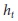, 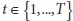. Эти классификаторы по отдельности, как правило, просты. В большинстве случаев данные классификаторы получаются в результате использования алгоритма decision trees с одним единственным разделителем (именуемый *decision stumps*) или с разделителем с небольшим уровнями разделения (возможно до трех). Каждому из классификаторов назначается вес 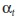 в момент окончательного принятия решения. Используется меченный набор исходных векторов особенностей 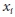, каждый из которых содержит скалярную метку 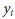 (где i=1,...,M). Для AdaBoost метки бинарные, 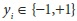, в случае с другими алгоритмами метка может быть любым вещественным числом. Наблюдения инициализируются весами из распределения 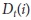, которые сообщают алгоритму "стоимость" неправильного наблюдения. Ключевой особенностью boosting является то, что в ходе выполения алгоритма эта стоимость должна меняться таким образом, чтобы обученные позже слабые классификаторы сосредоточились на наблюдениях, которые ранее обученные слабые классификаторы обработали плохо. Алгоритм выглядит следующим образом:

1. 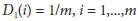

2. Для 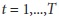:

a. Ищется классификатор , который минимизирует взвешанную ошибку 

b. 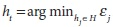, где 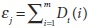 (для 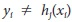) до тех пор, пока 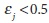, иначе выход

c. Для  задается вес , где 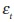 - это средняя минимальная ошибка на шаге 2b

d. Обновляются веса наблюдений: 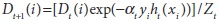, где 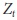 уравнение нормализации всех наблюдений *i*.

Если на шаге 2b не будет найден классификатор с ошибкой менее 50%, то алгоритм завершает свою работу (скорее всего необходимо предоставить более лучшие особенности).

Когда алгоритм завершается, полученный сильный классификатор принимает новый исходный вектор *x* и классифицирует его, используя взвешенную сумму слабых классификаторов :

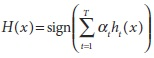

Функция *sign* преобразует положительное значение в 1, а отрицательное значение в -1 (значение 0 преобразование не подвергается).

### Код boosting

Код из примера *.../opencv/samples/c/letter_recog.cpp* показывает как использовать boosting, random trees и back-propagation (multilayer perception, MLP). Код boosting схож с кодом decision trees, но только имеет собственные параметры управления:

```cpp
	struct CvBoostParams : public CvDTreeParams {
		int boost_type; 	// CvBoost:: DISCRETE, REAL, LOGIT, GENTLE
		int weak_count; 	// Количество слабых классификаторов
		int split_criteria; // CvBoost:: DEFAULT, GINI, MISCLASS, SQERR
		double weight_trim_rate;
		CvBoostParams();
		CvBoostParams(
			 int boost_type
			,int weak_count
			,double weight_trim_rate
			,int max_depth
			,bool use_surrogates
			,const float* priors
		);
	};
```

В CvDTreeParams *boost_type* задаёт один из четырех алгоритмов boosting, описанные ранее. Параметр *split_criteria* может быть одним из четырех:

* CvBoost :: DEFAULT (используется разделитель специфичный для конкретного метода *boosting*)

* CvBoost :: GINI (значение по умолчанию для *real AdaBoost*)

* CvBoost :: MISCLASS (значение по умолчанию для discrete AdaBoost)

* CvBoost :: SQERR (ошибка метода наименьших квадратов; опция доступна только для *LogitBoost* и *gentle AdaBoost*)

Последний параметр *weight_trim_rate* используется для вычислительной экономии и его использование будет описано чуть далее. В процессе обучения многие наблюдения становятся несущественными. Тем самым вес для  *i*-ого наблюдения становится очень малым. Параметр *weight_trim_rate* является порогом между 0 и 1 (включительно), который неявно используется для отсечения некоторых обучающих образцов на текущей итерации *boosting*. Например, *weight_trim_rate = 0.95*. Это означает, что образцы с суммарным весом <= 1.0 - 0.95 = 0.05 (5%) не участвуют в следующей итерации обучения. При этом стоит понимать смысл выращения "следующая итерация". Это означает, что образцы не отбрасываются навсегда. Когда следующий слабый классификатор подвергается обучению веса вычисляются для всех образцов и потому некоторые ранее отброшенные незначительные образцы могут быть возвращены в следующий набор для обучения. Для отключения данного параметра необходимо, чтобы *weight_trim_rate = 0*.

*CvBoostParams{}* наследуется от *CvDTreeParams{}*, что позволяет устанавливать другие парамтеры, связанные с *decision trees*. В частности, если обрабатываются особенности, которые могут быть исключены (Что касается компьютерного зрения, то особенности вычисляются по изображению, а затем передаются классификатору; следовательно они почти никогда не "теряются". Потерянные особенности зачастую появляются в данных, собранные людьми - например, при сборе измерений температуры пациента по дням), то можно задать *use_surrogates* *CvDTreeParams::use_surrogates*, который гарантирует, что альтернативные особенности будут разделены и сохранены в каждом узле. Важным момент является установление "стоимости" ложно положительных определений. Опять же, если рассматривать пример с грибами, то можно установить *priors* как *float priors[] = {1.0, 10.0}*; тогда стоимость каждой ошибки маркировки ядовитых грибов как съедобные в 10 раз больше стоимости маркировки съедобных грибов как ядовитые.

Класс *CvBoost* содержит поле *weak*, которое является указателем CvSeq* на слабый классификатор, который наследуется от *decision trees* *CvDTree* (Имена у данных объектов несколько не интуитивны. Объект типа *CvBoost* является boosted tree классификатором. Объекты типа *CvBoosTree* являются слабыми классификаторами, которые образуют сильный классификатор. Предположительно, слабые классификаторы имеют тип *CvBoostTree*, т.к. наследуются от *CvDTree* (т.е. они содержат в себе маленькие деервья, настолько. что являются просто stumps). Поле *weak* это указатель CvBoost последовательности пронумерованных слабых классификаторов типа *CvBoostTree*). Для *LogitBoost* и *GentleBoost* являются деревьями регрессии (деревьями, которые предсказывают значения типа float); *decision trees* для других методов возвращают только класс: 0 (для положительного значения) или 1 (для негативного значения). Класс содержащий эту последовательность имеет следующий прототип:

```cpp
	class CvBoostTree: public CvDTree {
	public:
		CvBoostTree();
		virtual ~CvBoostTree();
		virtual bool train(
			 CvDTreeTrainData* 	_train_data
			,const CvMat* 		subsample_idx
			,CvBoost* 			ensemble
		);
		virtual void scale( double s );
		virtual void read(
			 CvFileStorage* 	fs
			,CvFileNode* 		node
			,CvBoost* 			ensemble
			,CvDTreeTrainData* 	_data
		);
		virtual void clear();

	protected:
		...
		CvBoost* 	ensemble;
	};
```

Процесс обучения почти такой же, как и в случае с decision trees, за исключением параметра *update*, который по умолчанию имеет значение false (0). При помощи этого параметра в процессе обучения новой ансамбль слабых классификаторов обнуляется. Если параметр *update* установлен в true (1), то новый слабый классификатор просто добавляется в существующую группу. Прототип функции обучения классификатора boosting имеет следующий вид:

```cpp
	bool CvBoost::train(
		 const CvMat* 	_train_data
		,int 			_tflag
		,const CvMat* 	_responses
		,const CvMat* 	_var_idx 		= 0
		,const CvMat* 	_sample_idx 	= 0
		,const CvMat* 	_var_type 		= 0
		,const CvMat* 	_missing_mask 	= 0
		,CvBoostParams 	params 			= CvBoostParams()
		,bool 			update 			= false
	);
```

Пример обучения классификатора boosting можно найти в *.../opencv/samples/c/letter_recog.cpp*. Фрагмент обучения показан в примере 13-3.

Пример 13-3. Фрагмент обучения классификаторов boosting

```cpp
	var_type = cvCreateMat( var_count + 2, 1, CV_8U );
	
	cvSet( var_type, cvScalarAll(CV_VAR_ORDERED) );

	// the last indicator variable, as well
	// as the new (binary) response are categorical
	//
	cvSetReal1D( var_type, var_count, CV_VAR_CATEGORICAL );
	cvSetReal1D( var_type, var_count+1, CV_VAR_CATEGORICAL );

	// Обучение классификатора
	//
	boost.train(
		 new_data
		,CV_ROW_SAMPLE
		,responses
		,0
		,0
		,var_type
		,0
		,CvBoostParams( CvBoost::REAL, 100, 0.95, 5, false, 0 )
	);

	cvReleaseMat( &new_data );
	cvReleaseMat( &new_responses );
```

Функция предсказания для boosting схожа с функцией предсказания для decision trees:

```cpp
	float CvBoost::predict(
		 const CvMat* 	sample
		,const CvMat* 	missing = 0
		,CvMat* 		weak_responses = 0
		,CvSlice 		slice = CV_WHOLE_SEQ
		,bool 			raw_mode = false
	) const;
```

Для выполения простого прогнозирования, достаточно просто передать вектор особенностей *samples* и функция вернет предсказание. Однако, существуют и множество дополнительных параметров. Первый необязательный параметр *missing* это маска особенностей, точно такая же, как и в случае с decision trees; он состоит из вектора байт той же размерности, что и *samples*, где ненулевые значения указывают на отсутствующие особенности. (Маска не может быть использована, если классификатор обучался с параметром *use_surrogates*.)

Если необходимо получить ответы от каждого слабого классификатора, то необходимо использовать параметр *weak_responses*, длина которого равна числу слабых классификаторов. В процессе выполения функция *CvBoost::predict* заполнит *weak_responses* ответами от каждого слабого классификатора следующим образом:

```cpp
	CvMat* weak_responses = cvCreateMat(
		 1
		,boostedClassifier.get_weak_predictors()->total
		,CV_32F
	);
```

Следующий необязательный параметр *slice* указывате какое смежное подмножество слабых классификаторов использовать; параметр может быть задан следующим образом:

```cpp
inline CvSlice cvSlice( int start, int end );
```

Но, как правило, используется значение по умолчанию (CV_WHOLE_SEQ). Последний необязательный параметр *row_mode* имеет значение по умолчанию false. Этот параметр точно такой же, как для decision trees и указывает на то, что данные предварительно нормализованы для экономии времени вычислений. Как правило, данный параметр не должен быть использован. Пример вызова функции предсказания для boosting:

```cpp
	boost.predict( temp_sample, 0, weak_responses );
```

Кроме всего ранее представленного, имеются ещё набор вспомогательных функций, которые могут быть использованы время от времени. Удалить слабый классификатор из обучаемой модели можно при помощи:

```cpp
	void CvBoost::prune( CvSlice slice );
```

Получить все слабые классификаторы можно при помощи:

```cpp
	CvSeq* CvBoost::get_weak_predictors();
```