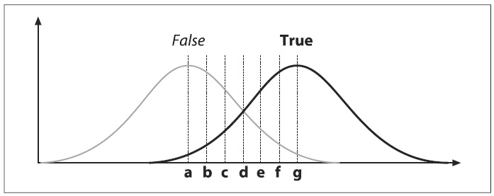
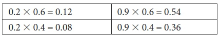

## [П]|(РС]|(РП) Упражнения

1. Для начала рассмотрим попытку изучения последующей стоимости акции на основе нескольких последних цен за акцию. Допустим, имеются данные об акциях за последние 20 лет. Оцените эффект от различных вариантов превращения этих данных в наборы для обучения и тестирования. Какие преимущества и недостатки у далее представленных подходов?

	a. Используйте четные наблюдения как набор для обучения и нечетные наблюдения как набор для тестирования.

	b. Случайным образом распределите наблюдения по наборам для тестирования и для обучения.

	c. Разделите наблюдения пополам, одну половину используйте как набор для обучения, а другую половину как набор для тестирования.

	d. Разделите наблюдения на множество мелких окон, состоящих из нескольких наблюдений из прошлого и одного предсказываемого.

2. На рисунке 13-17 представлено распределение "ложных" и "истинных" типов. На рисунке также показано несколько потенциальных мест (a, b, c, d, e, f, g), где можно было бы задать порог.

    

    Рисунок 13-17. Гаусово распределение из двух типов, "ложный" и "истинный"

	a. Нарисуйте точки a-g на ROC-кривой

	b. Если класс "истинный" соответствует ядовитым грибам, то какие буквы задают порог?

	c. Как decision tree разделило бы эти данные?

3. Рисунок 13-1.

	a. Нарисуйте насколько decision tree приблизится к истинной кривой (показана пунктирной линией), имея три разделителя (в данном случае ищется регрессия, а не модель классификации). "Лучший" разделитель для регрессии берет среднее значение значений, содержащихся в листьях, которые являются результатом разделения. Конечные значения регрессионного дерева похожи на лестницу.

	b. Нарисуйте decision tree, соответствующее истинным данным, с семью разделителями.

	c. Нарисуйте decision tree, соответствующее зашумленным данным, с семью разделителями.

	d. Объясните разницу между b и c с точки зрения переобучения.

4. Почему мера разделения (например, Gini) продолжает работать даже когда изучаются множество типов в единственном decision tree?

5. Изучите рисунок 13-4, на котором изображено двумерное пространство с неровной дисперсией слева и ровной дисперсией справа. Допустим, что это связано с проблемой классификации. Т.е. данные возле одного из "сгустка" принадлежат к одному из двух типов до тех пор, пока данные вблизи другого сгустка принадлежат к тому же или другом из двух типов. Будет ли отличаться важная переменная между левым и правым пространством в случае:

	a. decision trees?
	
	b. K-nearest neighbors?
	
	c. naïve Bayes?

6. Модифицируйте код генерации данных из примера 13-1 - раздел K-means - для создания случайным образом сгенерированного меченного набора. Для этого используйте единое нормальное распределение 10000 наблюдений с координатами пикселя центра (63, 63) на изображении 128x128 со стандартным отклонением (*img->width/6*, *img->height/6*). Чтобы пометить эти данные, разделите пространство на четыре квадранта с центром в пикселе (63, 63). Для получения вероятности маркировки используйте следующую схему. Если x < 64, то с вероятность 20% *тип A*; иначе если x >= 64, то вероятность *типа A* 90%. Если y < 64, то с вероятностью 40% *тип A*; иначе если y >= 64, то вероятность *типа A* 60%. Перемножение вероятностей x и y даёт полную вероятность *типа A* для квадранта, значения которой показанно в матрице 2x2. Если наблюдение не помечается как A, то по умолчанию оно помечается как B. Например, если x < 64 и y < 64, то имеется 8% вероятность того, что наблюдение будет помечено как *тип A* и 92% вероятность того, что наблюдение будет помечено как *тип B*. Четыре квадранта матрицы вероятности того, что наблюдение будет помечено как *тип A* (или как *тип B*) выглядит следующим образом:

    

    Используйте эту матрицу для того, чтобы пометить все наблюдения. Для этого в начале определите принадлежность наблюдения к одному из квадранту. Затем случайным образом сгенерируйте число от 0 до 1. Если полученное значение меньше или равно значения из нечетного квадранта, то помечайте наблюдение как *тип A*; иначе помечайте как *тип B*. В результате получите список меченных наблюдений. При этом можно отметить то факт, что ось x более информативнее, чем ось y. Обучение random forests на этом наборе данных и вычисление важной переменной показывает, что x действительно важнее y.

7. Используя набор данных из упражнения 6 и дискретный AdaBoost, обучите две модели: одну с *weak_count = 20 trees*, а другую с *weak_count = 500 trees*. Сгенерируйте случайным образом выбранные 10000 наблюдений для формирования наборов для обучения и тестирования. Выполните обучение и протестируйте на наборе для обучения, состоящее из:

	a. 150 наблюдений;

	b. 500 наблюдений;

	c. 1200 наблюдений;

	d. 5000 наблюдений.

	e. Объясните полученные результаты.

8. Повторите упражнение 7, используя классификатор random trees с 50 и 500 trees.

9. Повторите упражнение 7, используя 60 trees и сравните random trees и SVM.

10. В каких случаях алгоритм random tree более устойчив к переобучению, чем decision trees?

11. Рисунок 13-2. При каких условиях, если это возможно, у набора для тестирования ошибок меньше, чем у набора для обучения?

12. Рисунок 13-2 отражает проблему регрессии. Отметьте первую точку на графике как тип A, вторую как тип B, третью как тип A, четвертую как тип B и так далее. Нарисуйте линию разделения для этих двух типов (A и B), которая показывает:

	a. смещение;

	b. дисперсию.

13. Рисунок 13-3.

	a. Нарисуйте максимально возможную лучшую ROC кривую.

	b. Нарисуйте максимально возможную худшую ROC кривую.

	c. Нарисуйте кривую для классификатора, который использует случайным образом сформированный набор для тестирования.

14. В теореме "no free lunch" говориться, что классификатор не оптимален по всем распределениям меченных данных. Опишите классификатор (который не был представлен в данной главе), хорошо работающий с распределением меченных данных.

	a. Насколько сложным должно быть распределение для обучения naïve Bayes?

	b. Насколько сложным должно быть распределение для обучения decision trees?

	c. Как нужно выполнить предобработку распределения на части a и b так, чтобы классификатор можно было обучить максимально легко?

15. Настройте и запустите классификатор Haar для распознавания собственного лица, получаемого с веб-камеры.

	a. В каких пределах изменения масштаба может работать данный классификатор?

	b. В каких пределах размытия?

	c. Какой предел наклона головы?

	d. Какой предел наклона подбородка?

	e. Какой максимально возможный поворот (влево или вправо) головы?

	f. Изучите возможность использования 3D поз головы

16. Используйте изображение жеста (статичного) руки с синим или зеленым фоном. Соберите коллекцию изображений, комбинируя различные фоны и жесты. Обучите классификатор Haar для обнаружения жеста. Проведите тестирование полученного классификатора в реальном времени и оцените качество обнаружения.

17. Используя результаты из упражнения 16 и свои знания попытайтесь улучшить результаты.