## [П]|[РС]|(РП) Распознавание лиц или классификатор Хаара

Данный раздел будет посвящен *классификатору Хаара*, который построен на *boosted rejection cascade*. Формат данного классификатора отличается от формата остальной части библиотеки ML, т.к. данный классификатор был написан до её появления как полноценный, готовый к применению распознаватель лиц. Поэтому данный классификатор будет рассмотрен отдельно; будет показано, как его можно обучить распознаванию лиц и других твердых объектов.

Компьютерное зрение - это обширная и быстро меняющаяся область, поэтому OpenCV, реализующая определенные методы, а не компоненты алгоритмической части, подвержена риску устареть. Детектор лиц, который поставляется вместе с OpenCV, соответственно тоже в категории "риска". Тем не менее, детектор лиц находит более обширное применение за счёт наличия техники базовой линии, которая работает достаточно хорошо; к тому же эта техника основана на известной и часто используемой области *statistical boosting*, что так же указывает на более обширное применение данного детектора. По факту, проектированием детектора "лица" в OpenCV занимаются несколько компаний для обнаружения по большей части "твердых" объектов (лица, автомобилей, мотоциклов, тел человека) за счёт обучения новых детекторов на наборе для обучения, состоящего из множества тысяч изображений представлений каждого рассматриваемого объекта. Данная техника была использована для создания state-of-the-art детекторов, даже не смотря на то, что в обучении детектора используются различные представления или положения каждого рассматриваемого объекта. Таким образом, классификатор Хаара является ценным инструментом в решении подобного рода задач распознавания.

В OpenCV реализован вариант детектора лица, впервые разработанный Paul Viola и Michael Jones (более известный как *детектор Viola-Jones*), а в последующем дополненный Rainer Lienhart и Jochen Maydt, использующий *диагональные особенности* (чуть позже об этом будет рассказано более подробно). OpenCV ссылается на этот детектор как на "классификатор Haara", т.к. используются особенности Haara (Технически это не корректно. Классификатор использует суммарный порог и различные прямоугольные области данных, полученные от любого детектора особенностей, которые может включать Haar в случае прямоугольников с необработанными значениями (серого) изображения. В дальнейшем будет использоваться термин "Haar" для подчеркивания этого различия), или, если быть более точным, то *вейвлеты Haara*, которые формируются за счет сложения и вычитания прямоугольных областей изображения перед выполнением порогового преобразования над результатом. Дистрибутив OpenCV включает в себя набор файлов с распознанными объектами, но вместе с тем так же имеется возможность обучать и сохранять новые модели объекта для данного детектора. Итак, код для обучения (*createsamples()*, *haartraining()*) и распознавания (*cvHaarDetectObjects()*) может работать с любыми объектами (не только с лицами), которые текстурированы и в основном твёрдые.

Изученные объекты, поставляемые вместе с OpenCV, располагаются в *.../opencv/data/haarcascades*, где модель наилучшего распознавания фронтально расположенного лица располагается в файле *haarcascade_frontalface_alt2.xml*. Иные расположения лица распознать при помощи данной техники уже труднее. Если Вам удастся получить хорошо обученную модель объекта, то, возможно, Вы захотите поделиться ей с миром! Если модель будет действительно выдающейся, то она может быть включена в следующую версию библиотеки OpenCV!

### Контролируемое обучение и теория Boosting

Классификатор Haar, который включен в OpenCV, является контролируемым классификатором. Это означает, что имеются histogram- и size- скорректируемые патчи изображения для классификатора, помещающееся в дальнейшем как содержащие (или не содержащие) интересующие объекты, которые для данного классификатора чаще всего являются лицами.

Детектор Viola-Jones это разновидность AdaBoost, только организован как * rejection cascade* узлов, где каждый узел - это много древовидный классификатор AdaBoost, обладающий высоким (99,9%) уровнем распознавания (низкие ложно отрицательные срабатывания или отсутствующие лица) за счёт низкого (около 50%) процента брака (высокие ложно положительные срабатывания или ошибочно классифицированные "не лица"). Для каждого узла, если результат не соответствует "классу", то алгоритм прекращает своё выполнение на любой из стадий каскада и сообщает о том, что в заявленном месте лицо не было найдено. Таким образом, алгоритм вернет верно распознанный класс только тогда, когда в процессе вычислений будет совершен обход всего каскада. В случаях, когда верно распознанный класс редкость (например, лицо на изображение), rejection cascades общее время вычислений может значительно сократиться, т.к. большая часть регионов, в которых ищется лицо, будут отброшены.

**Boosting в Haar cascade**

Ранее в этой главе уже были рассмотрены boost классификаторы. Для rejection cascade Viola-Jones слабые классификаторы, которые boosts в каждом узле, являются decision trees, которые зачастую имеют один уровень вложенности (т.е. "decision stumps"). Decision stumps предлагают только одно решение следующего вида: "Узнается выше или ниже значение v конкретной особенности f некоторого порогового значения t"; например, если "да", то лицо найдено, а если "нет", то лицо не найдено":

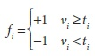

Число особенностей Haar, которое классификатор Viola-Jones использует в каждом слабом классификаторе может быть установлено в процессе обучения, но в большинстве случаях используется единственная особенность (т.е. дерево с единственным разделением) или максимум три. Затем boosting итеративно выстраивает классификатор как взвешенную сумму слабых классификаторов. Классификатор Viola-Jones использует следующую функцию классификации:

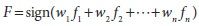

Функция sign вернет -1, если number < 0; 0, если number = 0; +1, если number > 0. При первом проходе по данному набору данных, вычисляются 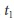 и 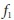, которые наилучшим образом классифицируют исходные данные. Затем boosting использует полученные ошибки для вычисления взвешенного vote 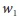. Как и в случае стандартного AdaBoost, для каждой особенности вектора (наблюдения) пересчитывается вес в большую или меньшую сторону, в зависимости от корректности классификации на данной итерации (Иногда возникает путаница с boosting: уменьшение веса классификации свидетельствует о корректной классификации, в то время, как увеличение веса свидетельствует о некорректной классификации. Причина в том, что попытка сосредоточиться на тех моментах, в которых есть "проблемы", приводит к игнорированию наблюдений, которые "известно" как классифицировать.). После того, как путь будет вычислен, оставшиеся данные передаются вверх по каскаду для обучения следующего узла и т.д.

### Классификатор Viola-Jones. Теория

Классификатор Viola-Jones использует AdaBoost в каждом узле каскада для обучения классификатора с высоким уровнем распознавания при низком multitree (в основном multistump) проценте брака в каждом узле каскада. Данный алгоритм включает в себя несколько инновационных особенностей.

1. Использует исходные особенности Haar: порог применяется для суммирования и чтобы различать прямоугольные области изображения.

2. Имеет техника *встраивания изображений*, которая позволяет ускорить процесс вычисления значения прямоугольных областей или разворачивать такие области на 45 градусов (глава 6). Данная структура данных используется для ускорения процесса вычисления исходных особенностей Haar.

3. Использует статистический boosting для создания двоичной (лицо - не лицо) классификации узлов, которая характеризуется высоким уровнем распознавания и малым процентом брака.

4. Организует слабые классификаторы узлов rejection cascade. Другими словами: первая группа классификаторов выбирается таким образом, чтобы наилучшим образом (в силу возможного) распознать области изображения, содержащие объект, допуская при этом множество ошибок распознавания; следующая выбираемая группа (стоит не забывать, что каждый "узел" в rejection cascade является группой классификаторов AdaBoost) классификаторов является следующей лучшей группой с малым процентом брака; и т.д. Объект будет считаться распознанным только в том случае, если будет произведен обход всего каскада (это позволяет ускорить процесс использования каскада, т.к. он почти сразу отвергает области изображения, не содержащие объект; тем самым потребность в обработке остальной части каскада не возникает).

Особенности Haar используются классификатором, который показан на рисунке 13-14. При любом масштабе, эти особенности образуют "сырьё", которое будет использовано boost классификаторами. Они быстро вычисляются по встроенным изображениям (глава 6), представляющие оригинальные изображения в оттенках серого.

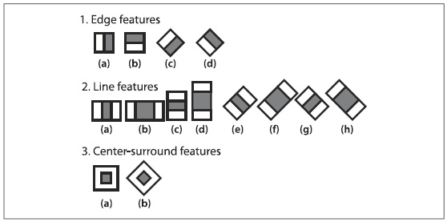

Рисунок 13-14. Особенности Haar из исходного дистрибутива OpenCV (прямоугольные и повернутые регионы легко вычисляются по встроенному изображению): в данных схематично представленных вейвлетах светлая область интерпретируется как "добавить эту область", а темная область как "вычесть эту область"

Viola и Jones организовали каждую группу boost классификаторов в узлах rejection cascade, как показано на рисунке 13-15. На рисунке каждый узел 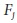 содержит целый boost каскад сгруппированных decision stumps (или trees), обученных на особенностях Haar, лиц и не лиц (или других объектов, в зависимости от выбора пользователя). Как правило, узлы сортируются от наименее к наиболее комплексному так, чтобы минимизировать процесс вычислений (простые узлы обрабатываются в первую очередь), отбрасывая сначала простые области изображения. Как правило, boosting в каждом узле настраивается на очень высокий уровень обнаружения (при обычной стоимости ложно положительных срабатываниях). В случае с лицами, например, распознаются почти все (99.9%) лица, но многие (около 50%) не лица ошибочно "распознаются" в каждом узле. Но это нормально, т.к. при использовании (например) 20 узлов процент распознавания лица (при обходе всего каскада) по прежнему будет 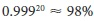 при 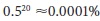 ложно положительных срабатываниях!

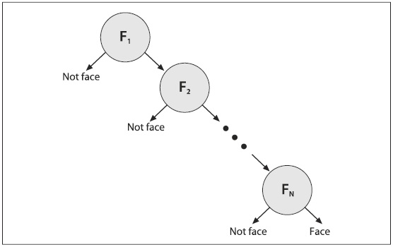

Рисунок 13-15. Использование rejection cascade в классификаторе Viola-Jones: каждый узел представляет из себя ансамбль mutlitree boost классификатор, настроенный таким образом, чтобы почти никогда не пропускать лица при малом проценте брака; при этом, все что является не лицом отброшено в последнем узле, как результат - остались только лица

В рабочем режиме при поиске областей различных размеров охватывается всё изображение. На практике, 70-80% не лиц отбрасываются первыми двумя узлами rejection cascade, где каждый узел использует около 10 decision stumps. За счет "раннего отсечения" процесс распознавания лиц значительно ускоряется.

**Хорошо работает на ...**

Представленная техника специализируется на распознавании лиц, однако, существует возможность использования её и для других целей; данная техника так же показывает хорошие результаты и на других (в основном твердых) объектах, которые имеют характерные представления. То есть, если попытаться распознать фронтальное лицо; машину сзади, сбоку или спереди, то детектор даст хорошие результаты; но если попытаться распознать лицо или машину "под углом", то результаты будут не очень хорошими - это связано с тем, что подобного рода представления вносят изменения в шаблон, состоящий из "блоков" особенностей, используемые данным детектором, который в свою очередь не может справиться с такими изменениями хорошо. Например, в процессе обучения модели представления лица сбоку необходимо охватить часть меняющегося фона для определения кривой профиля. Для распознавания представлений лиц сбоку, можно попробовать использовать *haarcascade_profileface.xml*, но для получения действительно хорошего результата необходимо гораздо больше данных, чем может дать данный файл и, возможно, так же потребуется расширить данные за счёт добавления представлений с различными вариантами фона. Опять же, представления профиля трудно даются данному классификатору, т.к. используются блоки особенностей из-за чего детектор пытается изучить меняющийся фон для "считывания" информации о крае лица. В процессе обучения, эффективней всего узнавать только (скажем) верно ли определился вид профиля. Затем запустить функцию тестирования (1) для распознавания правой стороны профиля, а затем (2) перевернуть изображение по вертикальной оси и вновь запустить детектор правой стороны для распознавания левой стороны профиля.

Как уже было сказано, детекторы, основанные на особенностях Haar, хорошо работают с "блоками" особенностей - такими, как глаза, рот и волосы - и не очень хорошо с ветвями дерева или, когда очертание объекта является главной отличительной характеристикой (как в случае с кружкой кофе).

Если необходимо собрать много хорошо сегментированных данных с действительно твёрдых объектов, то данный классификатор входит в число лучших для выполнения данной задачи, т.к. он основан на rejection cascade, что позволяет ему быстро работать в рабочем режиме (но не в режиме обучения). Фраза "много данных" означает тысячи примеров объекта и десятки тысяч примеров не объектов. Понятие "хорошо" означает, что не следует смешивать, например, лица под наклоном с вертикально расположенными лицами; вместо этого поддерживать разделение данных и использовать два классификатора, один для лиц под наклоном и ещё один для вертикально расположенных лиц. Понятие "сегментированные" данные означает что данные систематизированы в box (прямоугольная область на изображении). Отсутствие должного внимания к границам boxes обучаемых данных зачастую приводит к корректировки фиктивной изменчивости данных классификатора. Например, различие в расположениях мест глаз на лице может привести к тому, что классификатор сочтет расположения глаз геометрически не фиксированной особенностью и потому будет перемещаться. Производительность почти всегда хуже, когда классификатор пытается приспособиться к вещам, которых на самом деле нет в реальном наборе данных.

### Распознавание лиц. Практика

Код представленный в примере 13-4 распознает лица и рисует на изображении места расположения найденных лиц различными цветными прямоугольниками. Как показано в четвертой и шестой строке (комментарии), данный код предполагает, что заранее подготовленный каскад классификатора уже загружен и память под распознаваемые лица уже выделена.

Пример 13-4. Код по распознаванию лиц с отображением результатов

```cpp
// Detect and draw detected object boxes on image
// Presumes 2 Globals:
//  Cascade is loaded by:
//   cascade = (CvHaarClassifierCascade*)cvLoad( cascade_name, 0, 0, 0 );
//  AND that storage is allocated:
//   CvMemStorage* storage = cvCreateMemStorage(0);
//
void detect_and_draw( IplImage* img, Double scale = 1.3 ) {
    // Unknown error buil gitbook
    // Replace ( to {{ and ) to }}
    // 
	// static CvScalar colors[] = {
    //    (0,0,255), (0,128,255), (0,255,255), (0,255,0),
    //    (255,128,0), (255,255,0), (255,0,0), (255,0,255)
    // };
	
	// IMAGE PREPARATION:
	//
	IplImage* gray = cvCreateImage( cvSize(img->width,img->height), 8, 1 );
	IplImage* small_img = cvCreateImage( 
		 cvSize( cvRound(img->width/scale)
		,cvRound(img->height/scale))
		,8
		,1
	);

	cvCvtColor( img, gray, CV_BGR2GRAY );
	cvResize( gray, small_img, CV_INTER_LINEAR );
	cvEqualizeHist( small_img, small_img );
	
	// DETECT OBJECTS IF ANY
	//
	cvClearMemStorage( storage );
	CvSeq* objects = cvHaarDetectObjects(
		 small_img
		,cascade
		,storage
		,1.1
		,2
		,0 /*CV_HAAR_DO_CANNY_PRUNING*/
		,cvSize(30, 30)
	);

	// LOOP THROUGH FOUND OBJECTS AND DRAW BOXES AROUND THEM
	//
	for(int i = 0; i < (objects ? objects->total : 0); i++ ) {
		CvRect* r = (CvRect*)cvGetSeqElem( objects, i );
		cvRectangle(
			 img
			,cvPoint(r.x,r.y)
			,cvPoint(r.x+r.width,r.y+r.height)
			,colors[i%8]
		)
	}

	cvReleaseImage( &graygray );
	cvReleaseImage( &small_img );
}
```

Для удобства представленная функция *detect_and_draw()* имеет статичный массив векторов цвета *colors[]*, который задает цветовое выделение для найденных лиц. Классификатор работает с изображением в оттенках серого, поэтому исходное BGR изображение преобразуется при помощи функции *cvCvtColor()*, а затем (необязательно) уменьшается при помощи *cvResize()*. Так же полученное изображение подвергается выравниванию гистограммы при помощи *cvEqualizeHist()*, которая "размазывает" значения яркости - это выполняется из-за того, что особенности встроенного изображения основаны на различных прямоугольных областях и если гистограмма не будет сбалансирована, то различия между областями могут быть искажены общей освещенностью. Классификатор возвращает результат в виде прямоугольников как последовательность типа *CvSeq*, при этом необходимо воспользоваться функцией *cvClearMemStorage()* для очистки используемого глобального хранилища. Фактически распознавание происходит в цикле *for{}*. В рамках одной итерации происходит поиск прямоугольной области, содержащей лицо, и нанесение результатов на конечное изображение индивидуальным цветом при помощи функции *cvRectangle()*. Функция распознавания используется следующим образом:

```cpp
	CvSeq* cvHaarDetectObjects(
		 const CvArr* 				image
		,CvHaarClassifierCascade* 	cascade
		,CvMemStorage* 				storage
		,double 					scale_factor = 1.1
		,int 						min_neighbors = 3
		,int 						flags = 0
		,CvSize 					min_size = cvSize(0, 0)
	);
```

*CvArr image* это изображение в оттенках серого. Если задан регион интересов (ROI), то функция будет работать только с этим регионом. Таким образом использование региона интереса это один из способов ускорения процесса распознавания лиц. Каскад классификатора это каскад Haar особенностей, которые загружаются при помощи функции *cvLoad()*. Аргумент *storage* в рамках OpenCV это "рабочий буфер" для данного алгоритма; выделение нового участка памяти производиться при помощи *cvCreateMemStorage(0)*, а освобождение при помощи *cvClearMemStorage(storage)*. Функция *cvHaarDetectObjects()* сканирует исходное изображение лица всех масштабов. Параметр *scale_factor* задает шаг перемещения между масштабами; чем выше значение, тем быстрее будет процесс вычисления за счёт пропуска возможно распознанных лиц на пропущенных изображениях определенных масштабов. Параметр *min_neighbors* контролирует процесс предотвращения ложных распознаваний. Реальное расположение лица на изображении, как правило, имеет несколько "hits" в близлежащей области, т.к. соседние пиксели зачастую отчасти указывают на лицо. Установка данного параметра в значение по умолчанию (3) означает, что решение о присутствии лица в определенном месте будет принято только в том случае, если есть не менее трех дублирующих друг друга успешных распознаваний. Параметр *flags* может принимать одно из четырех возможных значений, которые (как обычно) могут быть объединены при помощи *OR*. Значение *CV_HAAR_DO_CANNY_PRUNING* сообщает классификатору о необходимости пропускать ровные регионы (без линий). Значение *CV_HAAR_SCALE_IMAGE* сообщает алгоритму об изменении масштаба изображения, а не детектора (это может повысить производительность с точки зрения использования памяти и кеша). Значение *CV_HAAR_FIND_BIGGEST_OBJECT* сообщает OpenCV о необходимости возвращать только самый большой из найденных объектов (соответственно, число возвращаемых объектов будет равно либо единице, либо нулю). (При этом лучше не использовать *CV_HAAR_DO_CANNY_PRUNING* вместе с *CV_HAAR_FIND_BIGGEST_OBJECT*, т.к. вместе они очень редко дают прирост производительности; зачастую наблюдается диаметрально противоположный эффект). Значение *CV_HAAR_DO_ROUGH_SEARCH* используется только в совокупности с *CV_HAAR_FIND_BIGGEST_OBJECT*. Данное значение флага используется для прекращения поиска при обнаружении первого кандидата независимо от масштаба (при достаточном количестве соседей, чтобы считать их "hit"). Последний параметр *min_size* задаёт минимально возможный размер региона, в котором можно искать лицо. Установка данного параметра в относительно большое значение уменьшает время вычислений за счет отбрасывания лиц малых размеров. На рисунке 13-16 показаны результаты использования представленного примера с задействованием сцены на которой присутствуют лица.

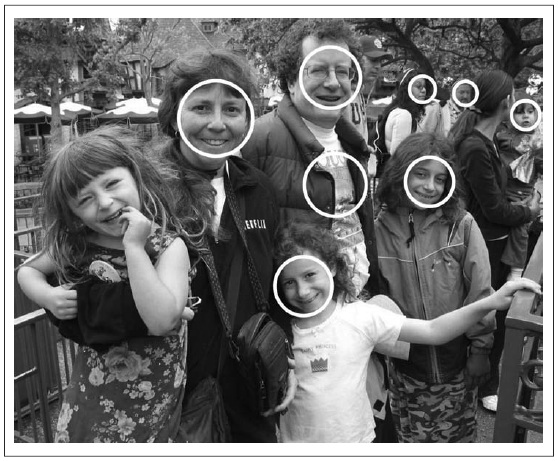

Рисунок 13-16. Результаты из примера 13-4: не удалось распознать некоторые лица под наклоном, а так же есть ложно положительные срабатывания (кофта на мужчине в очках); данный результат был получен за 1,5 секунды на 2 GHz машине при использовании базы, состоящей из более миллиона изображений размера 1054x851

### Обучение новых объектов

Ранее уже было показано как загрузить и запустить заранее обученный каскад классификатора, хранящийся в файле XML. Для загрузки использовалась функция *cvLoad()* с последующим применением *cvHaarDetectObjects()* для поиска объектов, схожих с теме, на которых выполнялось обучение. Теперь будет рассмотрен процесс обучения собственных классификаторов для обнаружения других объектов таких, как глаза, перемещающиеся люди, машины и т.д. В данном разделе будет показано как это сделать при помощи *haartraining*, который создает классификатор, производящий набор для обучения, состоящий из положительных и отрицательных образцов. Весь процесс состоит из четырех шагов (более подробную информацию о *haartraining* можно найти в директории *opencv/apps/HaarTraining/doc*):

1) Собрать набор данных, состоящий из примеров объекта, который необходимо изучить (например, фронтальные представления лиц, представления машины сбоку). Собранные данные могут быть сохранены в одном или нескольких директориях, состоящих из индексных файлов следующего формата:

```
<path>/img_name_1 count_1 x11 y11 w11 h11 x12 y12 ...
<path>/img_name_2 count_2 x21 y21 w21 h21 x22 y22 ...
...
```

Каждая строка содержит путь (если есть) и имя файла изображения, содержащего объект(-ы). Далее указывается число объектов на данном изображении и список прямоугольников, содержащих объекты. Формат прямоугольников следующий: координаты (x,y) верхнего левого угла и ширина с высотой в пикселях.

Например, имея набор данных из расположений лиц в директории *data/faces*, файл индекса *faces.idx* мог бы выглядеть следующим образом:

```
data/faces/face_000.jpg 2 73 100 25 37 133 123 30 45
data/faces/face_001.jpg 1 155 200 55 78
...
```

Для того, чтобы классификатор работал хорошо, необходимо собрать большой объём высококачественных данных (1 000 – 10 000 положительных примеров). Понятие "высококачественные" данные означает, что из рассмотрения исключаются все ненужные отклонения от данных. Например, при изучении лиц, необходимо выровнять глаза (желательно нос и рот тоже) насколько это возможно. В противном случае классификатор будет обучен таким образом, что будет искать глаза в любом месте в пределах заданной области, а не в фиксированном месте лица. Однин из возможных вариантов преодоления данной проблемы заключается в следующем: в начале необходимо обучить каскад по частям, например, на "глазах", которые легче выровнять. Затем, используя детектор глаза, найти глаза и вращать/изменять размер лица до тех пор, пока глаза не будут выровнены. Для ассиметричных данных, "фишка" с вращением изображения вдоль вертикальной оси уже была описана ранее в разделе "Хорошо работает на ...".

2) Воспользоваться *createsamples* для создания выходного файла-вектора, содержащего положительные образцы. Используя полученный файл, можно повторить процедуру обучения несколько раз, перебирая различные параметры. Например:

```
createsamples –vec faces.vec –info faces.idx –w 30 –h 40
```

Данная строка означает, что информация читается из файла *faces.idx*, который был получен на шаге 1, и выходной вектор записывается в файл *faces.vec*. *createsamples* извлекает положительные образцы из изображения перед нормализацией и изменяет их в соответствии с заданной шириной и высотой (в примере указано 30 и 40, соответственно). *createsamples* также может быть использован для синтеза данных за счёт применения геометрических преобразований, добавления шума, изменения цвета и т.д. Данная процедура может быть использована (например), чтобы узнать логотип компании, для которого выбирается только одно изображение, подвергаемое различным искажениям, которые возможно могут проявиться на реальном изображении. Более подробную информацию о *haartraining* можно найти в директории *opencv/apps/HaarTraining/doc*.

3) Каскад Viola-Jones является бинарным классификатором: просто принимается решение о схожести ("yes" или "no") объекта на изображении с предложенным вариантом из набора для обучения. Ранее уже было показано как собирать и обрабатывать образцы "yes", содержащие выбираемый объект. Теперь будет рассмотрено как собирать и обрабатывать образцы "no" для того, чтобы классификатор знал на какие образцы не похож выбранный объект. Любое изображение, которое не содержит интересующий объект можно отнести к образцам "no". Лучше всего во время тестирования использовать в качестве образцов "no" однотипные изображения. Например, для получения наилучших результатов при распознавании лиц на онлайн видео необходимо использовать образцы "no" с сопоставимых кадров (т.е. с других кадров из того же видео). Тем не менее действительно хороших результатов можно добиться за счёт использования образцов "no", взятых со стороннего ресурса (например, с CD или из интернета). И вновь можно использовать схему с индексным файлом, который должен содержать список имен файлов изображений, по одному изображению на строку. Например, индексный файл с именем *backgrounds.idx* может иметь следующее содержимое:

```
data/vacations/beach.jpg
data/nonfaces/img_043.bmp
data/nonfaces/257-5799_IMG.JPG
```

4) *Обучение*. Вот пример обучения, который можно запустить из командной строки или при помощи batch-файла:

```
Haartraining /
–data face_classifier_take_3 /
–vec faces.vec –w 30 –h 40 /
–bg backgrounds.idx /
–nstages 20 /
–nsplits 1 /
[–nonsym] /
–minhitrate 0.998 /
–maxfalsealarm 0.5
```

Результаты классификатора будут сохранены в файле *face_classifier_take_3.xml*. Файл *faces.vec* содержит положительные образцы (размера width-height=30x40), а случайным образом извлеченные из файла *backgrounds.idx* изображения будут использованы в качестве негативных образцов. Задаётся 20 (*-nstages*) уровневый каскад, где каждый уровень обучается с процентом верного обнаружения не ниже 0.998 (*-minhitrate*). Задается процент брака (*-maxfalsealarm*) не превышающий 50% для каждого уровня для достижения показателя верного обнаружения 0.998. Слабые классификаторы заданы как "stumps" - это означает, что они имеют только один разделитель (*-nsplits*); можно попробовать задать больше, т.к. в некоторых случаях это может улучшить результаты. Для более сложных объектов можно использовать до шести разделителей, но в большинстве случаев вполне хватает не более трех.

Даже при наличии хорошего компьютера, на обучение может уйти несколько часов; всё зависит от размера набора данных. Процедура обучения может проверить до 100 000 особенностей в рамках обучения на всех положительных и отрицательных образцах. Данный процесс можно распараллелить на многоядерных машинах (при помощи OpenMP). Версию с распараллеленным обучением можно найти в дистрибутиве OpenCV.