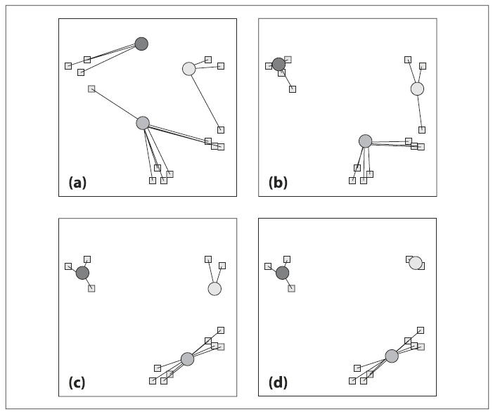
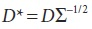

## (П]|(РС)|(РП) K-Means

Алгоритм кластеризации *K-Means* реализован в библиотеке *cxcore* задолго до появления библиотеки ML. K-means пытается найти естественные кластеры или "сгустки" данных. Пользователь задает желаемое число кластеров. а затем K-Means быстро находит хорошие расположения центров для этих кластеров, где термин "хороший" означает, что центр кластера располагается в середине сгустка данных. Данный алгоритм является наиболее часто используемым методом кластеризации и сильно схож с EM-алгоритмом для смеси Гаусса (реализован в библиотеке ML как *CvEM()*), а так же в какой то степени с алгоритмом mean-shift, обсуждаемый в главе 9 (реализован в библиотеке cv как *cvMeanShist()*). Алгоритм K-means является итерационным и, согласно реализации в OpenCV, так же известен как алгоритм Lloyd (S. P. Lloyd, "Least Squares Quantization in PCM", IEEE Transactions on Information Theory 28 (1982),
129–137) или (что эквивалентно) "Итерации Voronoi". Алгоритм работает следующим образом:

1. Береться исходный набор (a) и (b) требуемое число кластеров K (выбранное пользователем).

2. Случайным образом выбираются расположения центров кластера.

3. Каждая из точек связывается с ближайшим центром кластера.

4. Перемещаются центры кластера в центры тяжести точек.

5. Происходит возвращение к пункту 3 до полной сходимости (без перемещения центра тяжести).

На рисунке 13-5 показаны диаграммы работы K-Means; для данного случая, сходимость наступит после двух итераций. В реальных случаях алгоритм зачастую быстро сходиться, при этом в некоторых случаях для этого потребуется боьшое число итераций.



Рисунок 13-5. Работа K-means для двух итераций: (a) центры кластера расположены случайным образом и каждой точке присваивается ближайший центр кластера; (b) центры кластера перемещеются в центр тяжести точек; (c) точкам вновь назначаются ближайшие центры кластера; (d) центры кластера вновь перемещаются в центры тяжести этих точек

### Проблемы и их решения

K-means является чрезвычайно эффективным алгоритмом, но у него есть три проблемы:

1. K-means не гарантирует, что будет найдено лучшее решение для размещения центров кластера. Тем не менее гарантируется сходимость (т.е. число итераций ограничено).

2. K-means не сообщает о том, сколько центров кластера необходимо использовать. Если выбрано 2 или 4 кластера, как показано в примере на рисунке 13-5, то результаты будут различны и, возможно, не интуитивно понятными.

3. K-means предполагает, что либо не имеет значения для ковариации пространства, либо пространство уже нормализовано (более подробная информация в разделе "Расстояние Mahalanobis").

Для каждой проблемы имеется "решение" или, по крайней мере, приблизительное решение. Первые два решения зависят от "объяснения дисперсии". В K-means каждый центр кластера "владеет" точками и вычисляемую дисперсию этих точек. Лучший кластер минимизирует дисперсию не вызывая больших сложностей. Имея это в виду, перечисленные проблемы могут быть "смягчены" следующим образом:

1. Выполнить K-means несколько раз и каждый раз с различным размещением центров кластера (это легко выполнимо, т.к. OpenCV располагает центры случайным образом); затем выбрать то выполнение, чьи результаты дают лучшую дисперсию.

2. Начиная с одного кластера с последующим перебором определенного числа кластеров, использовать на всех кластерах метод #1. Как правило, общая дисперсия будет довольно таки быстро сокращаться, после чего появится "локоть" на кривой дисперсии; это указывает на то, что новый центр кластера не существенно уменьшит общую дисперсию.

3. Умножение на обратную матрицу ковариации (как было описано в разделе "Расстояние Mahalanobis"). Например, исходные векторы данных D организованы в виде строк с одной точкой на строку, то нормализация "растянутого" пространства достигается за счет вычисления нового вектора D*, где .

### Пример использования K-means

Функция, реализующая алгоритм K-means, выглядит следующим образом:

```cpp
	void cvKMeans2(
		 const CvArr* 		samples
		,int 				cluster_count
		,CvArr* 			labels
		,CvTermCriteria 	termcrit
	);
```

Массив *samples* является матрицей многомерных точек, по одной на строку. Есть один тонкий момент относительно этого параметра и заключается он в том, что каждый элемент-точка может быть регулярным векторов вещественных чисел *CV_32FC1* или многомерной точкой типа *CV_32FC2* или *CV_32FC3* или даже *CV_32FC(K)* (это эквивалентно матрице NxK типа *32FC1*, в которой N строк точек и K колонок для отделных компонент каждого расположения точки). Параметр *cluster_count* является выходным и содержит вектор меток, указывающих на окончательный индекс кластера каждой точки. Описание параметра *termcount* можно найти в разделе "Универсальные методы библиотеки ML" и подразделе "Контролирование итераций обучения".

Далее представленный пример (пример 13-1) использования K-means полезен для понимания и освоения других подходов машинного обучения.

Пример 13-1. Пример использования алгоритма K-means

```cpp
#include "cxcore.h"
#include "highgui.h"

void main( int argc, char** argv ) {
	#define MAX_CLUSTERS 5
	
	CvScalar color_tab[MAX_CLUSTERS];
	IplImage* 	img = cvCreateImage( cvSize( 500, 500 ), 8, 3 );
	CvRNG 		rng = cvRNG( 0xffffffff );
	
	color_tab[0] = CV_RGB(255,0,0);
	color_tab[1] = CV_RGB(0,255,0);
	color_tab[2] = CV_RGB(100,100,255);
	color_tab[3] = CV_RGB(255,0,255);
	color_tab[4] = CV_RGB(255,255,0);
		
	cvNamedWindow( "clusters", 1 );

	for(;;) {
		int k, cluster_count = cvRandInt(&rng)%MAX_CLUSTERS + 1;
		int i, sample_count = cvRandInt(&rng)%1000 + 1;
		CvMat* points = cvCreateMat( sample_count, 1, CV_32FC2 );
		CvMat* clusters = cvCreateMat( sample_count, 1, CV_32SC1 );
		
		// генерация случайной выборки по многомерному 
		// распределению Гаусса
		for( k = 0; k < cluster_count; k++ ) {
			CvPoint 	center;
			CvMat 		point_chunk;

			center.x = cvRandInt(&rng)%img->width;
			center.y = cvRandInt(&rng)%img->height;
			
			cvGetRows( 
				 points
				,&point_chunk
				,k*sample_count/cluster_count
				,k == cluster_count - 1 ? sample_count : 
										  (k+1)*sample_count/cluster_count 
			);

			cvRandArr( 
				 &rng
				,&point_chunk
				,CV_RAND_NORMAL
				,cvScalar( center.x,center.y, 0, 0 )
				,cvScalar( img->width/6, img->height/6, 0, 0 ) 
			);
		}

		// перемешивание образцов
		for( i = 0; i < sample_count/2; i++ ) {
			CvPoint2D32f* pt1 = (CvPoint2D32f*)points->data.fl +
							cvRandInt(&rng)%sample_count;
			CvPoint2D32f* pt2 = (CvPoint2D32f*)points->data.fl +
							cvRandInt(&rng)%sample_count;
			CvPoint2D32f temp;
			CV_SWAP( *pt1, *pt2, temp );
		}

		cvKMeans2( 
			 points
			,cluster_count
			,clusters
			,cvTermCriteria( CV_TERMCRIT_EPS+CV_TERMCRIT_ITER, 10, 1.0 )
		);

		cvZero( img );
		
		for( i = 0; i < sample_count; i++ ) {
			CvPoint2D32f pt = ((CvPoint2D32f*)points->data.fl)[i];
			int cluster_idx = clusters->data.i[i];

			cvCircle( 
				 img
				,cvPointFrom32f(pt)
				,2
				,color_tab[cluster_idx]
				,CV_FILLED 
			);
		}

		cvReleaseMat( &points );
		cvReleaseMat( &clusters );

		cvShowImage( "clusters", img );

		int key = cvWaitKey(0);
		if( key == 27 ) // 'ESC'
			break;
	}
}
```

В данном примере используется *highgui.h* для управления интерфейсом окна и *cxcore.h*, содержащий *Kmeans2()*. В функции *main()* задаются цвета отображения кластеров, верхний предел максимально выбираемых случайным образом возможные центры кластера *MAX_CLUSTERS* (равный 5) в *cluster_count* и 1000 точек, случайным образом выбираемые и сохраняемые в *sample_count*. Внешний цикл for повторяется до тех пор, пока не будет нажата клавиша Esc, внутри цикла происходит выделение памяти под указатель на матрицу *points* вещественного типа, содержащая точки *sample_count* (в данном случае одну колонку двумерных точек типа *CV_32FC2*) и выделение памяти под указатель на матрицу *clusters* целочисленного типа, содержащая получаемые метки кластера, от 0 до *cluster_count - 1*.

Следующий вложенный цикл for генерирует вводимые данные, которые могут быть повторно использованы для тестирования других алгоритмов. Для каждого кластера происходит последовательное порционное заполнение массива точек размера *size sample_count / cluster_count*. Каждая порция заполняется в соответствии с нормальным распределением *CV_RAND_NORMAL*, двумерные (*CV_32FC2*) точки сосредоточена в случайно выбранном двумерном центре.

Следующий цикл for просто перемешивает общий результат "пачки" точек. Затем происходит вызов функции *cvKMeans2()*, которая выполняется до тех пор, пока наибольшее перемещение центра кластера не станет меньше 1 (при этом число итераций ограничено 10).

Последний цикл for формирует рисунок результата. Затем происходит освобождение занимаемой памяти и отображение результата на изображении "clusters". В конце управление передается пользователю, который может продолжить выполнение программы или завершить её при помощи нажатия клавиши Esc.