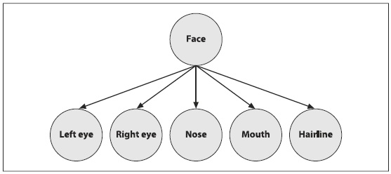
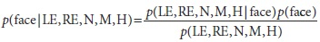
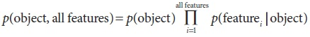

## [П]|[РС]|(РП) Naïve/Normal Bayes Classifier

Ранее обсуждались алгоритмы из библиотеки *cvcore*. Теперь настало время перейти к обсуждению библиотеки машинного обучения (ML). Для начала будет рассмотрен относительно простой классификатор, который именуется как *normal Bayes classifier* (нормальный классификатор Bayes) и *naïve Bayes classifier* (наивный классификатор Bayes) и реализован при помощи класса *CvNormalBayesClassifier*. "Наивный", т.к. предполагается, что все особенности независимы относительно друг друга, хотя иногда случается и обратное (например, при поиске одного глаза, предполагается, что другой глаз располагается где-то поблизости). В статьях Zhang представлены возможные причины (иногда) удивительно хорошей производительности этого классификатора. Naïve Bayes не используется для регрессии, при этом является эффективным классификатором, который может обрабатывать несколько классов, а не только два. Этот классификатор является простейшим из все возможных, что в настоящее время способствует бурному развитию байесовых сетей или "вероятностных графических моделей". Байесовые сети являются причинно-следственными моделями; на рисунке 13-6, например, особенности лица получены в результате наличия лица. Во время использования, переменная лицо считается *скрытой переменной*, а особенности лица - после обработки исходного изображения - составляют доказательство существования лица. Это называется "порождающей" моделью, т.к. лицо является причиной образования особенностей лица. И наоборот, можно начать с предположения, что узел лицо является активом и затем случайным образом формировать выборку из возможно генерируемых особенностей, учитывая, что лицо является активом (Глупо создавать лицо, используя наивный байесовый алгоритм, т.к. он предполагает независимость особенностей. Однако, более общие байесовые сети можно легко построить, по мере необходимости, с зависимыми особенностями). Генерация данных сверху вниз по той же статистике, что и для причинно-следственной модели (лицо), порождает полезные особенности, чем в свою очередь чисто дискриминационные модели не обладают. Например, можно генерировать лица для компьютерной графики или предоставлять роботу возможность буквально "представлять" что он должен делать дальше, генерируя сцены, объекты и взаимодействия. Для понимания отличий (при использовании рисунка 13-6), дискриминационная модель будет иметь направления стрелок в обратную сторону.



Рисунок 13-6. (Наивная) Байесовая сеть, где особенности нижнего уровня образуются в результате наличия объекта (лица)

Байесовые сети являются глубокими и первоначально сложно уяснить поле деятельности, но при этом алгоритм naïve Bayes основан на простом применении закона Байеса. В этом случае, вероятность (обозначено *p*) определения лица по особенностям (показанные на рисунке 13-6 и обозначенные слева направо как LE, RE, N, M, H) определяется по следующей формуле:



Просто, чтобы знать, по-английски это уравнение означает следующее:

posterior probability = (likelihood x prior probability) / evidence

апостериорная вероятность = (вероятность x предварительную вероятность) / признаки

На практике, вычисляется член *evidence*, а затем решается, какой объект стал его причиной. Если вычисляемый член *evidence* остается постоянным для данного объекта, то его можно отбросить. Если же имеется множество моделей, то нужно найти только один максимальный числитель *evidence*. Данный числитель объединяет вероятность модели с данными: *p(face, LE, RE, N, M, H)*. Соответственно можно использовать определенную условную вероятность для получения объединенной вероятности:

p(face, LE, RE, N, M, H) = p(face) p(LE | face) p(RE | face, LE) p(N | face, LE, RE) × p(M | face, LE, RE, N) p(H | face, LE, RE, N, M)

Применяя предположение о независимости особенностей, отпадает необходимость в условных особенностях. Таким образом, обобщая лицо в "object" и особенные особенности в "all features", получается следующее уравнение:



Для использования этого в качестве обобщенного классификатора, необходимо изучить модели требуемых объектов. В режиме использования вычисляются особенности и ищется объект, который максимизирует это уравнение. Как правило, во время тестов происходит определение объекта "победителя" при помощи использования порогового значения. Если условие, согласно пороговому значению, выполняется, то можно считать, что объект найден; в противном случае, объявляется, что объект не распознан.

Если (как это часто бывает) требуется найти только один объект, то может возникнуть вопрос: "Вычисляемая вероятность - это вероятность относительно чего?". В представленном случае неявно имеется ещё один объект - фон, объединяющий в себе все то, что не является объектом, который требуется найти.

Процесс изучения модели довольно таки прост. Собирается множество изображений объектов; затем вычисляются особенности этих объектов и доля того, как часто встречается особенность каждого объекта в набора для обучения. На практике, стараются избежать нулевой вероятности, т.к. это будет означать, что объект не существует; поэтому нулевая вероятность, как правило, задается очень малым значением. В общем, при ограниченном наборе данных, простые модели, такие как naïve Bayes, будут превосходить более сложные модели, которые "выдумывают" о данных больше, чем есть на самом деле (проявляется необъективность).

### Функции, реализующие Naïve/Normal Bayes

Метод обучения классификатора normal Bayes в OpenCV представлен следующей функцией:

```cpp
	bool CvNormalBayesClassifier::train(
		 const CvMat* 	_train_data
		,const CvMat* 	_responses
		,const CvMat* 	_var_idx 		= 0
		,const CvMat* 	_sample_idx 	= 0
		,bool 			update 			= false
	);
```

Данная функция реализует ранее описанный метод обучения, при этом позволяет использовать только те данные, для которых точка обучения храниться в строке (т.е. используется флаг *tflag = CV_ROW_SAMPLE*). Кроме того, входной параметр *_train_data* является вектором-столбцом типа *CV_32FC1*, который должен быть только упорядоченного типа *CV_VAR_ORDERED* (пронумерованным). Выходной параметр *_responses* содержит метки и является вектором-столбцом, который должен быть только типа категория *CV_VAR_CATEGORICAL* (содержит целочисленные значения, даже если вектор является типа *float*). Параметры *_var_idx* и *_sample_idx* являются не обязательными; они позволяют отметить (соответственно) особенности и точки данных, которые требуется использовать. В большинстве случаев достаточно использовать только первые два параметра, а данные векторы можно просто установить в NULL, однако, стоит помнить, что параметр *_sample_idx* может быть использован, например, для разделения наборов для обучения и тестирования. Оба вектора либо одноканальные целочисленные (*CV_32SC1*), либо 8-битные значения маски (*CV_8UC1*), где 0 означает пропуск. И наконец, параметр *update* позволяет просто обновить обученную модель normal Bayes, вместо того, чтобы обучать новую модель с нуля.

Метод прогноза CvNormalBayesClassifier вычисляет наиболее возможный класс исходного вектора. Один или более исходных векторов хранятся в строках матрицы *samples*. Предсказания возвращаются в соответствующих строках вектора *results*. Если имеется только один исходный вектор, то предсказание является возвращаемым значением метода *predict* типа *float*, а матрица *results* в таком случае устанавливается в NULL (значение по умолчанию). Метод прогнозирования выглядит следующим образом:

```cpp
	float CvNormalBayesClassifier::predict(
		 const CvMat* 	samples
		,CvMat* 		results = 0
	) const;
```