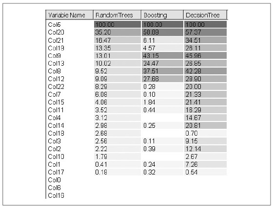

## (П]|(РС)|(РП) Random trees

OpenCV содержит класс *random trees*, который реализует теорию *random forests* Leo Beiman (Большая часть работы Breiman о random trees собрана на одном [сайте](http://www.stat.berkeley.edu/users/breiman/RandomForests/cc_home.htm)). Random trees могут обучать более одного класса в единицу времени просто собирая класс "votes" на листьях каждого из множества деревьев и выбирая класс с макимум "votes". Регрессия получается за счет усреднения значений листьев "леса". Random trees состоят из *randomly perturbed decision trees* и являются одними из наиболее эффективных классификаторов на момент сборки библиотеки ML. Random trees так же обладают потенциалом к параллельной реализации, даже на системах с неразделяемой памятью, что оставляет запас для их более широкого использования в будущем. Основу random trees составляют вновь decision trees. Постоение этих decision trees происходит до тех пор, пока не станет *чисто*. Таким образом (см. верхнюю правую часть рисунка 13-2), каждое дерево является высоко-дисперсионным классификатором, который почти идеально обучается на наборе для обучения. В противовес к высокой дисперсии, множество таких деревьев усредняются (отсюда и такое название random trees).

Конечно, усреднение деревьев не даёт никакой пользы, если все деревья сильно схожи между сосбой. Для того, чтобы это исправить random trees случайным образом выбирают подмножество особенностей из ощего множества особенностей на основе которого дерево в дальнейшем обучает каждый узел. Например, объект, который необходимо распознать, может иметь длинный список потенциальных особенностей: цвет, текстура, величина градиента, направление градиента, дисперсия, значения соотношений и т.д. Каждому узлу дерева разрешено случайным образом выбрать подмножество таких особенностей для определения как лучше всего разделить данные; в дальшейшем, все последующие узлы дерева получают новое, случайным образом выбранное, подмножество особенностей для дальнейшего разделения. Зачастую размер случайным образом выбранных подмножеств выбирается как квадратный корень числа особенностей. Так, если имеется 100 потенциальных особенностей, то каждый узел будет случайным образом выбирать 10 особенностей и искать наилучший разделитель данных из числа выбранных 10 особенностей. Для повышения надежности random trees используют меру *out of bag* для подтверждения разделения. То есть любой выбранный узел, обучение которого происходит при использовании нового подмножества данных, выбираемое случайным образом *с заменой* (это означает, что некоторые случайно выбранные наблюдения могут повторяться), и неиспользуемые данные (не случайно выбранные значения, именуемые "out of bag" (или OOB)) используются для оценки производительности разделения. OOB, как правило, устанавливается равным одной трети всех наблюдений.

Как и все методы, основанные на деревьях, random trees наследуют множество полезных свойств деревьев: суррогатные разделители для отсутствующих значений, обработка категориальных и численных значений, отсутствие необходимотси в нормализации значений и наличие простых методов для поиска переменных, которые необходимы дял выполнения предсказания. Random trees так же используют результаты ошибок OOB для оценки того, насколько хорошо будут обработаны незамечанные данные. Если распределения обучаемых данных и тестовых данных совпадают, то даваемое OOB предсказание может быть достаточно точным.

И наконец, random trees могут быть использованы для определения *близости* (что в данном контексте означает "как одинаковы", а не "как близки") любых двух наблюдений. Алгоритм выполнения данной операции выглядит следующим образом: (1) "сбрасывание" наблюдений в деревья; (2) подсчет количества попаданий на один лист; (3) разделение подсчитанного значения на общее число деревьев. Если результат близости равен 1, то схожи, если 0, то совершенно различны. Данная мера близости может быть использована для идентификации выбросов (данные точки совершенно не похожи на остальные), а так же сгруппированных точек (группа близких точек).

### Реализация random tree в OpenCV

На данный момент уже должно сложиться некое представление о том, как работает библиотека ML и в частности random trees. Все начинается со структуры *CvRTParams*, которая наследуется от decision trees:

```cpp
	struct CvRTParams : public CvDTreeParams {
		bool 			calc_var_importance;
		int 			nactive_vars;
		CvTermCriteria 	term_crit;

		CvRTParams() : CvDTreeParams(
			5, 10, 0, false,
			10, 0, false, false,
			0
		), calc_var_importance(false), nactive_vars(0) {

			term_crit = cvTermCriteria(
				 CV_TERMCRIT_ITER | CV_TERMCRIT_EPS
				,50
				,0.1
			);
		}

		CvRTParams(
			 int 			_max_depth
			,int 			_min_sample_count
			,float 			_regression_accuracy
			,bool 			_use_surrogates
			,int 			_max_categories
			,const float* 	_priors
			,bool 			_calc_var_importance
			,int 			_nactive_vars
			,int 			max_tree_count
			,float 			forest_accuracy
			,int 			termcrit_type
		);
	};
```

Новый ключевой параметр в *CvRTParams* *calc_var_importance* - это просто переключатель вычислений важной перемененной каждой особенности в момент обучения. На рисунке 13-13 показана важная переменная вычисленная на основе подмножества грибов, которое поставляется вместе с OpenCV и располагается в *.../opencv/samples/c/
agaricus-lepiota.data*. Параметр *nactive_vars* задает размер случайно выбранного подмножества особенностей, которое будет тестироваться в любом выбранном узле и, как правило, имеет значение равное квадратному корню от общего числа особенностей; параметр *term_crit* управляет максимальным числом деревьев. Для обучения random trees в *term_crit* параметр *max_iter* устанавливает общее число деревьев; *epsilon* задает критерий *прекращения обучения* для приостановки процесса добавления новых деревьев при достижении значения ошибки ниже значения ошибки OOB; *type* сообщает какой из двух возможных критериев останова использовать (как правило, используют оба: *CV_TERMCRIT_ITER | CV_TERMCRIT_EPS*).

Random trees обучаются точно так же, как и decision trees, за исключением только того, что в рассматриваемом случае используется структура *CvRTParam*:

```cpp
	bool CvRTrees::train(
		 const CvMat* 	train_data
		,int 			tflag
		,const CvMat* 	responses
		,const CvMat* 	comp_idx 		= 0
		,const CvMat* 	sample_idx 		= 0
		,const CvMat* 	var_type 		= 0
		,const CvMat* 	missing_mask 	= 0
		,CvRTParams 	params 			= CvRTParams()
	);
```



Рисунок 13-13. Важная перменная из набора данных грибов для random trees, boosting и decision trees: в случае с random trees так же задействованы менее значимые переменные, за счет чего достигнуто лучшее предсказание (100% верных ответов на случайно выбранном тестовом наборе, охватывающий 20% данных)

Пример использования функции обучения для случая с несколькими классами поставляется вместе с OpenCV и располагается в *.../opencv/samples/c/letter_
recog.cpp*, где классификатор random trees именуется *forest*:

```cpp
	forest.train(
		 data
		,CV_ROW_SAMPLE
		,responses
		,0
		,sample_idx
		,var_type
		,0
		,CvRTParams(10,10,0,false,15,0,true,4,100,0.01f,CV_TERMCRIT_ITER)
	);
```

Функция предсказания для random trees схожа с функцией предсказания для decision trees, но вместо возврата указателя *CvDTreeNode*, рассматриваемая функция возвращает среднее возвращаемое значение всех деревьев из леса. Маска *missing* является необязательным параметром той же размерности. что и вектор *sample*, где ненулевые значения указывают на отсутствующие значения в *sample*.

```cpp
	double CvRTrees::predict(
		 const CvMat* 	sample
		,const CvMat* 	missing = 0
	) const;
```

Пример использования функции предсказания из файла *letter_recog.cpp*:

```cpp
	double 	r;
	CvMat 	sample;

	cvGetRow( data, &sample, i );
	
	r = forest.predict( &sample );
	r = fabs((double)r - responses->data.fl[i]) <= FLT_EPSILON ? 1 : 0;
```

В представленном куске кода происходит преобразование переменной r в число верных предсказаний.

И наконец, для random trees имеются функци для анализа и вспомогательные функции. Если. например, переменная *CvRTParams::calc_var_importance* установлена для обучения, то можно получить относительную важность каждой переменной следующим образом:

```cpp
	const CvMat* CvRTrees::get_var_importance() const;
```

Пример важной переменной набора данных грибов для random trees показан на рисунке 13-13. Так же можно получить меру близости одного наблюдения относительно другого обученной модели random trees следующим образом:

```cpp
	float CvRTrees::get_proximity(
		 const CvMat* 	sample_1
		,const CvMat* 	sample_2
	) const;
```

Как уже было сказано ранее, если возвращаемое значение равно 1, то наблюдения полностью идентичны, если возвращаемое значение равно 0, то совершенно различны. Как правило, это значение находиться между 0 и 1 для двух наблюдений, взятых из распределения, которое аналогично набору для обучению.

Имеется ещё две полезные функции, дающие общее количество деревьев и структуру данных, содержащая данное decision trees:

```cpp
	int get_tree_count() const; 			// Кол-во деревьев в лесу
	CvForestTree* get_tree(int i) const; 	// Получение конкретного decision tree
```

### Использование random trees

Как уже было сказано ранее, алгоритм random trees зачастую работает лучшего всех (или как минимум входит в число лучших) на наборах для тестирования, но лучшее всего все же их применять для объединения множества классификаторов в один имея определенный набор для обучения. Все ранее представленные алгоритмы random trees, boosting и decision trees рассматривались на примере набора данных грибов. Из 8124 наблюдений случайным образом извлекалось 1624 тестовых точек, а остальные использовались как обучающее множество. После обучения этих классификаторов, основанных на деревьях, были получены результаты, показанные в таблице 13-4, при использовании набора для тестирования. Набор данных грибов довольно таки прост и потому нельзя однозначно сказать, какой из трех классификаторов лучшего всего будет работать с данным набором данных (хотя random trees и показали наилучший результат).

Таблица 13-4. Результаты методов, основанные на деревьях, при использовании набора данных грибов (1624 случайно выбранных точек без каких-либо дополнительных штрафов для неверной оценки ядовитости грибов)

| Классификатор | Результаты производительности |
| -- | -- |
| Random trees | 100% |
| AdaBoost | 99% |
| Decision trees | 98% |

Наиболее интересной является важная переменная (которая так же измеряется на основе классификатора), показанная на рисунке 13-13. На рисунке показано, что random trees и boostring используют важную переменную значительно меньше, чем используют её decision trees. Значение свыше 15%, имеют в случае с random trees только три переменные, а в случае с boosting шесть, в то время, как в случае с decision trees  тридцать. Таким образом можно сократить размер набора особенностей для экономии времени вычислений и памяти, не теряя возможности получать хорошие результаты. Конечно для алгоритма decision trees имеется только одно дерево, в то время как random trees и AdaBoost могут оценить сразу несколько деревьев; таким образом, у какого метод время вычислений меньше всего зависит от используемого набора данных.