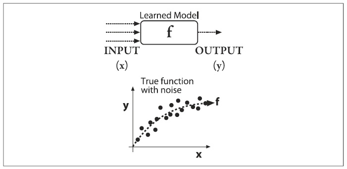
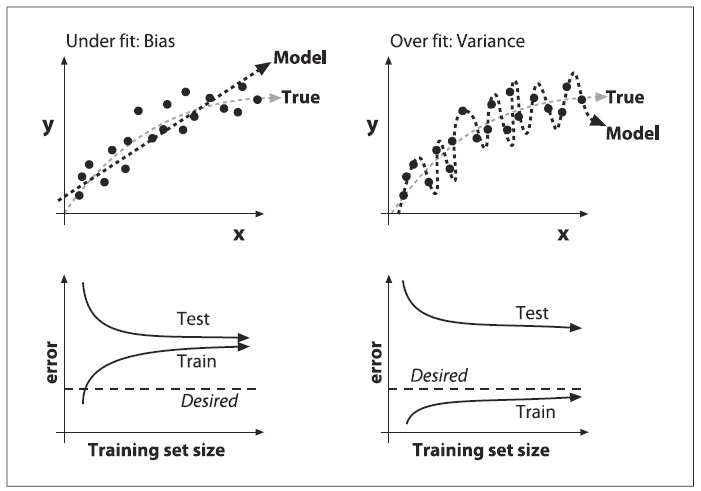
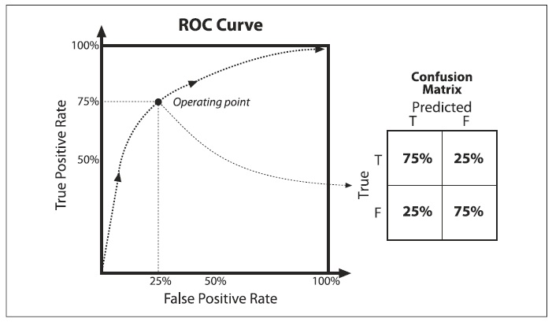

# Машинное обучение

## [П]|[РС]|(РП) Что такое машинное обучение

Целью *машинного обучения (ML)* является преобразование данных в информацию. После изучения набора данных, у машин появляется возможность ответить на вопросы о данных: Какие данные наиболее близки к имеющимся данным? Присутствует ли автомобиль на изображении? На какую рекламу будут реагировать покупатели? Наиболее часто используемой компонентой является стоимость, соответственно возникает следующий вопрос: "Какой продукт, из имеющегося набора, с наивысшей стоимостью будет выбран покупателем при показе рекламы?" Машинное обучение преобразует данные в информацию, извлекая правила и шаблоны из этих данных.

Тема машинного обучения является довольна таки обширной. OpenCV в основном занимается статистикой, а не такими вещами, как "Байесовская сеть", "Марковское случайное поле" или "графические модели". Довольно-таки хорошие статьи по данной теме можно найти у: Hastie, Tibshirani, и Friedman; Duda и Hart; Duda, Hart, и Stork; и Bishop. Можно изучить работы Ranger et al. и Chu et al для того, чтобы узнать, как распараллелить машинное обучение.

### Обучение и тестирование

Машинное обучение работает с такими данными, как температурные значения, цены на акции, интенсивность окраски и т.д. Зачастую данные предварительно перерабатываются в особенности. Можно, например, имея базу данных из 10000 изображений лица, запустить определитель контура лица на этих лицах с целью накопления таких особенностей, как постановка и четкость контура, с целью определения центра лица для каждого лица в отдельности. В результате можно получить, например, 500 таких значений/лиц или вектор особенностей с 500 записями. Таким образом, методы машинного обучения могут быть использованы для построения своего рода модели по данному набору данных. Если же необходимо только сгруппировать лица (широкие, узкие и т.д.), то лучше всего использовать *алгоритм кластеризации*. Если же необходимо научиться предсказывать возраст человека по шаблону контура лица или лица в целом, то лучше всего использовать *алгоритм классификации*. Для достижения всех этих целей, алгоритмы машинного обучения анализируют набор особенностей и регулируют соответствующие веса, пороги и другие параметры для получения наилучшего результата. Этот процесс корректировки параметров для удовлетворения цели именуется *обучением*.

Всегда важно знать, как работают методы машинного обучения, но это ещё и своего рода "ювелирная" работа. Как правило, исходный набор данных разбивается на большую выборку для обучения (например, 9000 лиц из ранее рассмотренного примера) и на малую выборку для тестов (из оставшихся 1000 лиц). В начале необходимо будет запустить классификатор по выборке для обучения с целью получения модели прогнозирования возраста по полученному вектору особенностей. А затем протестировать полученный классификатор на оставшейся выборке для тестов.

Выборка для тестов не используется в обучении. Классификатор запускается на каждом лице (всего 1000 лиц) из выборки для тестов с последующей фиксацией того, насколько хорошим получается предсказание при сопоставлении полученного варианта возраста с реальным показателем возраста. Если классификатор работает плохо, то можно попробовать добавить новые особенности или рассмотреть другой тип классификатора. Далее в данной главе будут рассмотрены некоторые виды классификаторов и алгоритмы для их обучения.

Если классификатор хорошо справляется с поставленной задачей, то можно судить о получении потенциально ценной модели, которая может быть использована на реальных данных. Возможно использование полученной системы, например, для установки режима в видеоигре в соответствии с возрастом. Перед игрой, его или её лицо обрабатывается для получения 500 (постановка и четкость контура, центр лица) особенностей. Затем эти данные передаются в классификатор; возвращаемое значение возраста приводит к установке соответствующего поведения в игре. При развертывание модели, классификатор рассматривает лица, которые не видел ранее и принимает решение в соответствии с тем, что узнал по выборке для обучения.

В заключении, зачастую при развертывании системы классификации, задействуется набор данных для проверки. Иногда испытание системы в самом конце — это слишком трудоёмкая задача. Зачастую требуется настроить параметры именно перед отправкой классификатора на окончательное тестирование. Сделать это можно, разбив исходное множество данных 10000 лиц на три части: на выборку для обучения из 8000 лиц, на выборку для проверки из 1000 лиц и на выборку для тестирования из 1000 лиц. Теперь при запуске классификатора на выборке для обучения, можно "в фоновом режиме" пройтись и по выборке для проверки. И только после подтверждения верности проделанной работы на выборке для проверки можно будет запустить классификатор на выборке для тестирования для получения окончательного решения.

### Контролируемые и неконтролируемые данные

Иногда данные не имеют меток; все что требуется, это просто посмотреть каким образом можно сгруппировать лица, основываясь на информации о крае. А иногда данные имеют метки, например, такую, как возраст. В случае с машинным обучением это означает, что обучение может быть *контролируемым* (т.е. используется обучение "сигнала" или "метки", поступающие от вектора особенностей). Если вектор данных немеченый, то машинное обучение *неконтролируемое*.

Контролируемое обучение может быть *категоричным*, т.к. обучение ассоциируется с именованием лиц, или данные могут быть *пронумерованы* или *упорядочены* метками, такой как возраст. Когда данные поименованы (категоричны), то можно сказать, что выполнена *классификация*. Когда данные пронумерованы, то можно сказать, что выполнена *регрессия*.

Контролируемое обучение сопряжено с преобразованиями в оттенки серого. При таком виде обучения используется попарное сопоставление один к одному меток вектора данных; в добавок к этому может быть использовано *отложенное обучение* (иногда так же именуемое как *подкрепленное обучение*). В подкрепленном обучении, метка данных (так же именуемая *наградой* или *наказанием*) может быть получена намного позже после исследования искомого вектора данных предмета наблюдения. Например, в случае перемещения мыши по лабиринту в поисках пищи, она может сделать несколько кругов, прежде чем найдет пищу, т.е. вознаграждение. В свою очередь, это вознаграждение должно каким-то образом оказать влияние на все предыдущие мнения и действия, которые совершила мышь в процессе поиска еды. Подкрепленное обучение работает аналогичным образом: система получает сигнал с задержкой (награду или наказание) и пытается предсказать поведение для будущих запусков (способ принятия решений; например, в какую сторону идти в лабиринте на каждом последующем шаге). Контролируемое обучение может так же использовать частичную маркировку, т.е. когда не хватает некоторых меток (это так называемое *полу контролируемое обучение*), или шумовые метки, т.е. когда некоторые метки ошибочны. Большинство алгоритмов машинного обучения обрабатывают только одну или две из описанных ситуаций. Например, алгоритмы машинного обучения могут выполнить классификацию, но не могут выполнить регрессию; алгоритм в состоянии выполнить полу контролируемое обучение, но не подкрепленное обучение; алгоритм в состоянии иметь дело с числовыми данными, но не с категоричными; и так далее.

В реальных случаях приходиться иметь дело с немечеными данными и проверкой естественности попадания данных в группы. Алгоритмы, использующие неконтролируемое обучение, именуются *алгоритмами кластеризации*. В этом случае, целью является группировка немеченых данных, которые "близки". В простом случае может возникнуть необходимость просто посмотреть, как распределяются лица: Какие из них тонкие или широкие, длинные или короткие? Например, рассматривая данные, поступающие о раках, возникает вопрос: как кластеризовать различные виды раков на группы, имеющие различные химические сигналы? Неконтролируемые кластеризованные данные зачастую используются при формировании вектора особенностей для высокоуровневых контролируемых классификаторов. Для начала можно сформировать кластер лиц по типу лица (широкие, узкие, длинные, короткие), а затем использовать его в качестве исходных данных для обработки других данных, например, таких, как набор средних вокальных частот для предсказания пола человека.

Эти две общие задачи машинного обучения, классификация и кластеризация, пересекаются с двумя наиболее общими задачами в компьютерном зрении: распознаванием и сегментацией. Эти задачи иногда так же называют как "что" и "где". То есть, зачастую необходимо, чтобы компьютер назвал объекты на изображении (распознал или "что"), а также указал место этого объекта (сегментация или "где"). Так как в компьютерном зрении интенсивно используется машинное обучение, в OpenCV включено множество мощных алгоритмов машинного обучения в виде библиотеки, расположенной в *../opencv/ml*.

Код в OpenCV, отвечающий за машинное обучение, является обобщенным. Т.е. хотя этот код является полезным для задач компьютерного зрения, сам по себе код не специфичен для компьютерного зрения. С его помощью, например, можно узнать геномные последовательности за счет соответствующих процедур. При этом основная задача сводится к управлению объектом, заданный вектором особенностей и полученный от изображения.

### Генеративные и Дискриминативные модели

Многие алгоритмы были разработаны для выполнения обучения и кластеризации. OpenCV поддерживает некоторые наиболее полезные и доступные в настоящее время статистические подходы машинного обучения. Вероятностные подходы машинного обучения, такие как Байесовые сети или графические модели, менее хорошо поддерживаются в OpenCV прежде всего из-за того, что являются более новыми и до сих пор в стадии активного развития. OpenCV стремиться поддерживать *дискриминативные алгоритмы*, для которых характерна вероятность метки относительно данных (P(L|D)), а не *генеративные алгоритмы*, для которых характерна вероятность данных относительно метки (P(D|L)). Хотя различия и не всегда понятны, дискриминативные модели хороши для высокопроизводительных прогнозов по заданным данным, в то время, как генеративные модели хороши для более мощного представления данных или для условного синтеза новых данных (имея "воображаемого" слона, можно сгенерировать данные по условию "слон").

Зачастую проще объяснить генеративную модель, т.к. эти модели являются причиной (правильных или неправильных) данных. Дискриминативное обучение зачастую сводится к принятию решения на основе некоторого порогового значения, которое может быть произвольным. Например, если предположить, что участок дороги определяется в сцене по большому счету потому, что составляющая "красного" цвета меньше 125. При этом возникает вопрос: будет ли участок, составляющая "красного" цвета которого равна 126, соответствовать дороге? Такого рода вопросы довольно таки трудно интерпретировать. В случае с генеративными моделями, как правило, приходиться иметь дело с условными распределениями данных по заданным категориям, что позволит развить чувство "близости" к полученному распределению.

### Алгоритмы машинного обучения в OpenCV

Алгоритмы машинного обучения, реализованные в OpenCV, приведены в таблице 13-1. Все эти алгоритмы находятся в библиотеке **ML**, за исключением *Mahalanobis* и *K-means*, которые находятся в **CVCORE**, и *face detection*, который располагается в **CV**.

Таблица 13-1. Алгоритмы машинного обучения, реализованные в OpenCV

| **Алгоритм** | **Описание** |
| -- | -- |
| Mahalanobis | Мера расстояния, рассчитываемая для "тягучего" пространства данных, разделенное на ковариационные данные. Если ковариация является единичной матрицей (идентичная дисперсии), то эта мера совпадает с мерой Евклидова расстояния |
| K-means | Неконтролируемый алгоритм кластеризации, который представляет собой распределение данных с использованием K центров, где K задается пользователем. Разница между этим алгоритмом и expectation maximization заключается в том, что в этом алгоритме центры не гауссовы и как результат кластеры похожи на мыльные пузыри, т.к. центры конкурируют за "владение" ближайшими точками данных. Эти кластерные области зачастую используются как разряженные гистограммы бинов для представления данных. Изобретен Steinhaus, использован Lloyd |
| Normal/Naïve Bayes classifier | Генеративный классификатор, в котором допускаются особенности с гауссовым распределением и статически независимые друг от друга; сильное предположение, как правило, не верно. По этой причине данный алгоритм зачастую называют "наивно Баейсовым" классификатором. Тем не менее этот метод зачастую работает на удивление хорошо |
| Decision trees | Дискриминативный классификатор. В дереве ищется одна особенность и пороговое значение текущего узла, которое наилучших образом разделяет данные на отдельные классы. Данные разделяются, и данная процедура рекурсивно повторяется вниз слева направо по ветвям дерева. Не так часто результат можно получить на самой вершине дерева, однако, это первое, что необходимо попробовать сделать, т.к. это быстро и имеет высокую функциональность |
| Boosting | Группа дискриминативных классификаторов. Обобщенное классификационное решение получается за счет комбинирования взвешенных классификационных решений группы классификаторов. В ходе обучения изучается группа классификаторов (по одному за раз). Каждый классификатор из группы является "слабым" классификатором (с неким шансом на повышение производительности). Эти слабые классификаторы, как правило, состоят из единой переменной деревьев решений, называемой "stumps". В ходе обучения, найденный stump обучает решения классификатора, а также определяет вес его "голоса". Между обучениями каждый классификатор, один за одним, повторно взвешивает точки так, что наибольшее внимание уделяется точкам, где были сделаны ошибки. Этот процесс продолжается до тех пор, пока суммарное значение ошибок, возникающих от комбинирования взвешенных голосов дерева решений на множестве данных, не станет меньше установленного порога. Этот алгоритм зачастую эффективен, при наличии большого объёма данных |
| Random trees | Дискриминативный лес множества decision trees, каждое из которых построено с большой или максимально расщепленной глубиной. В ходе обучения для каждого узла каждого дерева разрешено выбирать переменные расщепления только из случайного подмножества особенностей. Это гарантирует то, что каждое дерево становится статистически независимым в принятии решения. Во время применения, каждое дерево получает взвешенный голос. Этот алгоритм зачастую очень эффективен, а также позволяет выполнять регрессию за счет усреднения выходных значений каждого дерева |
| Face detector / Haar classifier | Приложение, распознающее некий объект и базирующееся на основе разумного использования алгоритма boosting. OpenCV содержит алгоритм обучения для определения лица, который на удивление хорошо работает. Алгоритм обучения так же можно применить на других объектах за счёт прилагаемого ПО. Данный алгоритм хорошо работает в случае твердых объектов и характерных представлений |
| Expectation maximization (EM) | Генеративный бесконтрольный алгоритм, который используется для кластеризации. Ему соответствует N многомерных Гауссиан, где N задается пользователем. Данный алгоритм может быть эффективным способом представления более сложного распределения у которого только несколько параметров (среднее значение и дисперсия). Зачастую используется в сегментации |
| K-nearest neighbors | Самый простой дискриминативный классификатор. Обучение состоит в простом сохранении меток. После этого контрольная точка классифицируется в соответствии с большинством голосов её ближайших K других точек (в евклидовом смысле близости). Это, скорее всего, самое простое, что можно сделать. Зачастую данный алгоритм является эффективным, но вместе с тем он медленно работает и требует много памяти |
| Neural networks / Multilayer perceptron (MLP) | Дискриминативный алгоритм, который (почти всегда) имеет "скрытые единицы" между выходными и входными узлами для наилучшего представления входного сигнала. Обучение может быть медленным, однако, во время применения данный алгоритм очень быстрый. Тем не менее, главной областью применения является распознавание букв |
| Support vector machine (SVM) | Дискриминативный классификатор, который выполняет регрессию. Функция расстояния определяется между любыми двумя точками многомерного пространства. Алгоритм "узнает" разделенные гиперплоскости, которые максимально разделяют классы в верхнем измерении. Алгоритм стремиться быть в числе лучших на ограниченном наборе данных, проигрывая boosting или random trees в случае большого объема данных |

### Использование машинного обучения в компьютерном зрении

В общем все алгоритмы из таблицы 13-1 в качестве входного значения принимают вектор данных, состоящий из множества особенностей, где число особенностей может исчисляться тысячами. Предположим, имеется задача распознать определенного типа объект, например, человека. Первая проблема, с которой придётся столкнуться, заключается в том, чтобы собрать и обучить метки, которые соответствуют положительным (человек присутствует в сцене) и отрицательным (человек отсутствует в сцене) случаям. Вскоре будет показано, что представление людей может быть разных масштабов: в виде нескольких пикселей на изображении или какой-то части тела, например, ухо. И даже хуже, люди зачастую будут перекрыты: мужчина внутри автомобиля; одна нога, видимая из-за дерева; лицо женщины. К тому же необходимо определение того, что именно имеется ввиду, когда говорят о человеке в сцене.

Сбор данных является следующей проблемой. Возникают следующие вопросы: собирать ли информацию о движениях; собирать ли другую информацию (такую, как время, сезон, температура, открытые ворота в сцене). Алгоритм, который ищет людей на пляже, может неверно работать в случае поиска людей на горнолыжном склоне. Необходимо фиксировать изменчивые данные: различные взгляды людей, различные источники света, погодные условия, тени и т.д.

После выполнения сбора большого объема данных, возникает вопрос как выделить метки? В начале необходимо определить, что такое "метка". При этом необходимо ли знать, где находится человек в сцене? Какие действия (бег, ходьба, ползанье, порядок следования) важны? В конечном счёте может потребоваться обработать миллион или более изображений. И как собственно маркировать всё это? Есть множество способов для выполнения исключения фона в контролируемых условиях и сбора сегментированных передних планов людей в сцене. Для выполнения классификации можно использовать платные или бесплатные сервисы.

После выполнения маркировки данных, необходимо решить, какие особенности необходимо выделять на объектах. Опять же необходимо знать, что делать после этого. Если люди всегда располагаются с правой стороны, то нет причин для использования инвариантно-вращающихся особенностей и выполнения вращения объектов заранее. В общем, необходимо искать особенности, которые выражают некоторую инвариантность объектов, такие как масштабно-независимые гистограммы градиентов или цветов или популярные SIFT особенности (Lowe’s SIFT feature demo (http://www.cs.ubc.ca/~lowe/keypoints/)). Если в сцене присутствует информация о фоне, то в начале может потребоваться удалить его, чтобы потом можно было выделить другие объекты. Затем может потребоваться выполнение обработки изображения, которая в свою очередь может состоять из нормализации изображения (масштабирование, вращение, гистограммы выравнивания и т.д.) и вычислении множества различных типов особенностей. Каждый из полученных векторов данных имеет метку, связанную с объектом, действием или сценой.

Зачастую после того, как данные собраны и размещены в векторах особенностей, возникает необходимость в разбиении полученных данных во время обучения, проверки и тестирования. Это "лучший способ" выполнить обучение, проверку и тестирование в рамках перекрестной проверки. Т.е. данные разбиваются на K подмножеств и выполняется множество итераций обучения (возможно проверки) и тестирования, где каждая итерация состоит из различного набора данных, принимающие на себя роль обучения (проверки) и тестирования (как правило, одно обучение (возможно проверка) и цикл тестирования от 5 до 10 раз). Затем результаты тестирования отдельных итераций усредняются для получения окончательного результата. Перекрёстная проверка даёт более точную картину того, как будет работать классификатор на новом наборе данных. (В дальнейшем об этом будет рассказано более подробно.)

Теперь, когда данные сформированы, необходимо выбрать классификатор. Зачастую выбор классификатора продиктован соображениями в пользу вычислений, данных или памяти. Для некоторых приложений, таких как онлайн строитель модели предпочтений пользователя, необходимо, чтобы обучение классификатора происходило быстро. В таком случае, такие алгоритмы, как nearest neighbors, normal Bayes или decision trees будут хорошим выбором. Если делается упор на память, то decision trees или neural networks наиболее эффективны. Если компонент времени обучения классификатора не критичен, но при этом важна скорость его работы, то neural networks хороший выбор, так же, как и normal Bayes classifiers и support vector machines. Если компонент времени обучения классификатора не критичен, но при этом важна точность, то boosting и random trees то что нужно. Если же необходим простой и понятный способ проверки выбранных особенностей, то decision trees или nearest neighbors хороший выбор. В первую очередь "из коробки" стоит попробовать boosting или random trees. 

Усреднив все возможные типы распределения данных, все классификаторы выполняют одно и тоже. Таким образом, нельзя сказать, какой алгоритм из таблицы 13-1 является "лучшим". Для любого заданного распределения данных имеется наилучший классификатор. Поэтому на реальном наборе данных лучше всего испробовать максимально возможное количество классификаторов. В зависимости от преследуемых целей - произвести верный или быстрый расчёт; интерпретировать данные - различные классификаторы ведут себя по разному. 

### Важная переменная

Два алгоритма из таблицы 13-1 позволяют оценить эту переменную (более известную как "важная переменная"). Возникает вопрос: как, учитывая вектор особенностей, определить важность этих особенностей для точности классификатора? Binary decision trees делают это напрямую: они обучаются за счет выбора переменной, которая наилучшим образом разделяет данные каждого узла. Переменная верхнего узла является наиболее важной переменной; переменные следующего уровня являются следующими важными переменными и так далее. Random trees могут вычислить важную переменную, используя технику Leo Breiman (данная техника описана в работе "Looking Inside the Black Box" (www.stat.berkeley.edu/~breiman/wald2002-2.pdf)); эта техника может быть применима к любому классификатору, но на данный момент в OpenCV реализована только для decision и random trees.

Один из возможных вариантов использования важной переменной сводиться к уменьшению числа особенностей, которые классификатор должен учитывать. Начиная с большого количества особенностей, классификатор обучается и впоследствии ищется важная переменная для каждой особенности относительно других особенностей. Впоследствии можно отбросить незначительные особенности. Исключение незначительных особенностей увеличит скоростные характеристики (т.к. будет исключена обработка для вычисления этих особенностей), тем самым обучение и тестирование становиться быстрее. Кроме того, в случае недостаточного объёма данных, что зачастую и бывает, за счет исключения незначительных переменных можно повысить точность классификации; это ускоряет обработку с последующим получением лучшего результата.

Алгоритм получения важной переменной способом Breiman состоит из следующих шагов:

1. Обучение классификатора на множестве для обучения.

2. Использование множеств для проверки или тестирования для повышения точности классификатора.

3. Для каждой точки данных и выбранной особенности случайным образом выбирается новое значение для этой особенности среди значений особенностей из оставшегося набора данных (так называемая "выборка с заменой"). Это гарантирует, что распределение для этого признака будет оставаться тем же, как и в оригинальном наборе данных, только теперь актуальная структура или значение этой особенности стирается (потому что значение выбирается случайным образом из оставшегося набора данных).

4. Обучение классификатора на измененном множестве для обучения и последующего изменения точности классификатора на измененном множестве для тестирования или проверки. Если случайная особенность оказывает сильное влияние на точность, то эта особенность очень важна. В ином случае случайная особенность не так важна и является кандидатом для удаления.

5. Восстановление исходного набора для тестов или проверки и переход к следующей особенности, пока они не закончились. Результатом является сортировка особенностей в порядке их важности.

Описанный алгоритм базируется на random trees и decision trees. Таким образом, random trees и decision trees можно использовать для определения переменных, которые действительно необходимо использовать в качестве особенностей; в последующем можно использовать облегченный вектор особенностей для обучения того же (или другого) классификатора.

### Диагностика проблем машинного обучения

Хорошо работающее машинное обучение — это скорее искусство, чем наука. Алгоритмы зачастую "вроде" работают, но не так хорошо, как требуется. Именно в этот момент и проявляется искусство - происходит выяснение и исправление того, что происходит не так. Данного раздела не хватит для разъяснения всех подробностей, однако, далее будет дан краткий обзор некоторых из наиболее распространенных проблем (профессор Andrew Ng из Stanford University предоставляет более подробную информацию в веб-лекциях, озаглавленные как "Советы по применению машинного обучения" (http://www.stanford.edu/class/cs229/materials/ML-advice.pdf)). Для начала некоторые эмпирические правила: большой объем данных разбивается на малые объемы данных, а лучшие особенности распределяются по лучшим алгоритмам. В случае введения собственных особенностей - при их максимальной независимости друг от друга и минимальном изменении в различных условиях - почти любой алгоритм будет работать хорошо. Помимо этого, существуют две наиболее распространённые проблемы:

*Необъективность*

Предполагаемая модель слишком устойчивая, поэтому соответствующая модель не очень хорошая.

*Изменчивость*

Алгоритм запоминает данные, *включающие* шум, поэтому он не может быть обобщен

На рисунке 13-1 показана базовая настройка для статистического машинного обучения. Работа сводиться к моделированию истинной функции *f*, которая преобразует основные входы в некий выход. Эта функция может иметь проблемы с регрессией (например, предсказание возраста человека по лицу) или проблему прогнозирования категории (например, идентификация личности по чертам лица). Проблемы, связанные с реальным миром, шум и непродуманные эффекты могут привести к тому, что получаемый выход может не соответствовать теоретическому. Например, при распознавании лица можно изучить модель за счет расстояния между глазами, рта и носа, идентифицирующие лицо. При этом изменения освещения, поступающие от соседней мерцающей лампы, приводят к шуму в измерениях, или плохо изготовленный объектив камеры приводит к систематическому искажению в измерениях, которые не будут рассмотрены как часть модели. Все это так же влияет и на точность.

Рисунок 13-1. Настройки для статистического машинного обучения: классификатор обучается, чтобы соответствовать набору данных; истинная модель *f* почти всегда повреждена шумом или неизвестным воздействием

В двух верхних областях рисунка 13-2 показано недостаточное и чрезмерное обучение, а в двух нижних областях этого же рисунка показаны последствия с точки зрения ошибки в процессе подготовки заданного размера. В левой части рисунка 13-2 показана попытка обучения классификатора для прогнозирования данных из нижней области рисунка 13-1. Если использовать слишком ограниченную модель - показанная четко видимой прямой пунктирной линией - то будет невозможно соответствовать базовой истинной параболе *f*, которая показана неясно видимой пунктирной линией. Таким образом, данные предназначенные для обучения и тестирования будут плохими, даже при наличии большого объема данных. В этом случае возникает *необъективность*, т.к. оба набора данных (для обучения и для тестирования) прогнозируются плохо. Правая часть рисунка 13-2 соответствует точному набору для обучения, но это приводит к бессмысленной функции, которой соответствует немного шума. Таким образом, запоминание набора для обучения приводит и к запоминанию данных, содержащих шум. Как результат, набор данных для тестирования оставляет желать лучшего. Низкая погрешность при обучении в сочетании с большой погрешностью при тестировании указывает на проблему *изменчивости*.

Рисунок 13-2. Плохая модель машинного обучения и её влияние на производительность процессов обучения и тестирования, где истинная функция графически показана неясно видимой пунктирной линией в верхней части рисунка: underfit модель (сверху слева) приводит к большой ошибке прогнозирования наборов данных для обучения и тестирования (снизу слева), в то время как overfit модель (сверху справа) приводит к малой ошибке набора для обучения и большой ошибке набора для тестирования (снизу справа)

Иногда необходимо соблюдать осторожность для нахождения верного решения проблемы. Если наборы данных для обучения и тестирования имеют малую ошибку, а алгоритм работает плохо в реальных условиях, то соответствующие наборы данных выбраны согласно нереальным условиям - возможно из-за того, что согласно этим условиям процессы сбора или моделирования осуществить проще. Если же алгоритм просто не может воспроизвести наборы для обучения или тестирования, то, возможно, используется не тот алгоритм, или не те особенности, которые после извлечения являются неэффективными, или просто нет "связей" в собранных данных. В таблице 13-2 приведены возможные варианты решения описанных проблем. Разумеется, это не полный список возможных проблем и их решений. Для того, чтобы машинное обучение давало хорошие результаты, необходимо более тщательное проектирование и осмысление процесса сбора данных, а также более тщательный подбор функций для выполнения вычислений. Также необходимо систематическое мышление для диагностики проблем машинного обучения.

Таблица 13-2. Проблемы машинного обучения и возможный вариант их решения; достижение наилучших особенностей поможет решить любую проблему

| **Проблема** | **Возможное решение** |
| -- | -- |
| Необъективность | Добавление особенностей для достижения лучшего соответствия. Использование более мощного алгоритма. |
| Изменчивость | Использование большего объема данных для обучения поможет сгладить модель. Использование меньшего количества особенностей для уменьшения переобучения. Использование менее мощного алгоритма |
| Хорошие результаты при тестировании/обучении, плохие в реальных условиях | Сбор более реальных данных |
| Модель не распознает наборы для тестов или обучения | Перепроектирование особенностей для лучшего отслеживания изменчивости данных. Сбор новых, более реальных данных. Использование более мощного алгоритма |

**Перекрестная проверка, самонастройка, ROC-кривая и таблица сопряженности**

В заключении будут рассмотрен инструментарий для оценки результатов машинного обучения. В случае контролируемого обучения, одной из основных проблем является знание того, насколько хорошо алгоритм работает: насколько точна классификация или пригодны ли данные? Возможно, может возникнуть мысль: "Спокойно, можно ведь просто испытать данный алгоритм на наборах для тестов или проверки и получить результат." Однако в реальных условиях необходимо так же учитывать шум, колебания и ошибки выборки. Проще говоря, наборы для тестов или проверки могут не точно отражать фактическое распределение данных. Для того, чтобы приблизиться к истинной производительности классификатора, необходимо использовать технику *перекрестной проверки* и/или тесно связанную с ней технику *самонастройки*.

Основу перекрестной проверки составляет разделение данных на K различных подмножеств. В обучение используется K-1 подмножеств, а оставшееся подмножество используется для тестирования. Данное действие выполняется K раз, где каждое из K подмножеств совершает "виток" становясь подмножеством для проверки, а результат в конечном счете является средней величиной.

Техника самонастройки схожа с техникой перекрестной проверки, за исключением того факта, что набор для проверки выбирается случайным образом из набора для обучения. Выбранные точки для итерации используются для тестового набора, а не для набора для обучения. Затем процесс начинается с нуля. Описанное действие необходимо выполнить N раз, где каждый раз происходит выбор, случайным образом, набора для проверки, а результат в конечном счете является средней величиной. Это означает, что некоторые и/или многие точки повторяются в различных наборах для проверки, но результат зачастую получается лучше в сравнении с результатом от использования техники перекрестной проверки. 

Использование одной из данных техник позволит улучшить результаты машинного обучения. При этом увеличение точности позволит задействовать параметры для настройки системы обучения, которые в последствии можно будет неоднократно менять, обучать и измерять.

Двумя другими очень полезными способами оценки, характеризации и настройки классификатора является построение ROC-кривой - *рабочей характеристики приёмника* - и заполнение таблицы сопряженности (рисунок 13-3). ROC-кривая соответствует соотношению измерений реакции и параметра производительности классификатора на протяжении всего диапазона заданного параметра. Можно сказать, что параметр — это порог. Для понимания данного факта, представьте, что необходимо распознать желтый цвет на изображении при наличии порога, указывающий на желтый цвет, выступающий в роли детектора. Чрезвычайно высокий показатель порога будет означать, что классификатору не удалось распознать желтый цвет, т.е. имеем ложно положительный нулевой уровень, при этом и истинно положительный уровень так же нулевой (нижняя левая часть кривой на рисунке 13-3). С другой стороны, если желтый порог равен 0, то любой сигнал на протяжении всей кривой будет распознан. Это означает, что все истинно положительные (желтые цветы) распознаются так же, как и все ложно положительные тоже (оранжевые или красные цветы); таким образом, имеется 100% показатель ложных срабатываний (верхняя правая часть кривой на рисунке 13-3). Лучшей ROC-кривой является та, что соответствует y-оси на 100%, с последующим измельчанием в правом верхнем углу. В противном случае, чем ближе кривая к верхнему левому углу, тем лучше. Так же можно вычислить долю площади под ROC-кривой относительно общей площади ROC участка как сводную статистику заслуг: чем ближе данное соотношение к 1, тем лучше классификатор.

Рисунок 13-3. Рабочая характеристика приёмника (ROC) и связанная с ней таблица сопряженности: в начале показан отклик корректной классификации ложно положительной оценки вдоль всего диапазона изменений параметра производительности классификатора; затем показана ложно положительная оценка (ложные распознавания) и ложно негативная оценка (пропущенные распознавания)

На рисунке 13-3 так же показана *таблица сопряженности*. Это просто схема положительных и ложных срабатываний с ложно положительной и ложно негативной оценками. А так же это ещё один быстрый способ оценки производительности классификатора: в идеале значения диагонали СЗ-ЮВ равны 100% и 0% в иных случаях. Если имеется классификатор, который может изучить более одного типа (например, многослойный персептрон или random forest классификатор могут изучить множество различных типов меток за раз), то таблица сопряженности обобщает множество типов и остается просто отслеживать тип соответствующей метки.

**Оценка ошибочной классификации**. Собственно, это единственное, что ещё не обсуждалось. Что это значит: например, имеется классификатор для обнаружения ядовитых грибов (в дальнейшем будет показан пример, использующий такой набор данных), имеющий большую ложно негативную оценку (съедобные грибы определяются как ядовитые) до тех пор, пока не минимизируется ложно положительная оценка (ядовитые грибы определяются как съедобные). ROC-кривая может помочь справиться с этим; можно установить ROC-параметр, выбрав рабочую точку ниже кривой - в направлении левой нижней части графика на рисунке 13-3. Другой способ сделать тоже самое заключается в том, чтобы вес ложно положительной ошибки стал больше, чем вес ложно отрицательной при генерации ROC-кривой. Например, можно задать каждую ложно положительную ошибку, рассчитав десять ложно негативных (Это особенно полезно при наличии конкретного априори понятия относительно оценки двух типов ошибок. Например, оценка ошибочной классификации одного продукта как другого продукта поможет определить количественную оценку того заранее). Некоторые алгоритмы машинного обучения в OpenCV, такие как decision trees и SVM, могут регулировать баланс "успешная оценка относительно ложного предупреждения", указав приоритет вероятностей самих типов (каких типов больше, а каких меньше) или указав веса отдельных обучающих выборок. 

**Дисперсия несочетающихся особенностей**. Ещё одна распространенная ошибка при обучении некоторого классификатора возникает, когда вектор особенностей включает особенности с широко различными дисперсиями. Например, если одна особенность представлена символом в нижнем регистре ASCII, то диапазон все возможных значений равен 26. В противопоставление, если особенность представляет число биологических клеток на предметном стекле микроскопа, диапазон возможных значений может измеряться миллиардами. Такой алгоритм, как K-nearest neighbors может рассмотреть первую особенность (с символом) как относительную постоянную (ничего не изучив) по сравнению со второй особенностью (с клетками). Вариант исправления данной проблемы заключается в предварительной обработке переменной нормализации дисперсии каждой особенности. Данная практика является приемлемой при условии, что особенности не коррелируют друг с другом; когда особенности взаимосвязаны, то можно нормализовать их среднюю дисперсию или ковариацию. Некоторые алгоритмы, такие как decision trees (Decision trees не оказывают влияния на различия дисперсии в переменных особенности, т.к. каждая переменная ищется только для эффективно разделяющих порогов. Другими слова, не имеет значения насколько большой диапазон переменной для выяснения значения разделения), не страдают от широких различий дисперсии. Правило гласит, что если алгоритм зависит в какой-то степени от измерения расстояния (например, взвешенные значения), то необходимо нормализовать дисперсию. Можно нормализовать все особенности за раз и рассчитать для них ковариацию при помощи расстояния Mahalanobis, о котором далее в главе будет рассказано более подробно (читатель, знакомый с машинным обучением ил обработкой сигнала может узнать в этой технике "отбеливание данных").

Далее в этой главе будет рассказано более подробно о некоторых представленных алгоритмах машинного обучения, реализованных в OpenCV (большинство из них можно найти в *.../opencv/ml*). В начале будет рассказано о некоторых методах, которые являются универсальными для подбиблиотеки ML.