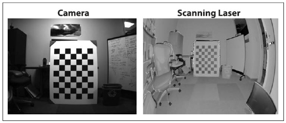

## [П]|[РС]|(РП) Прошлое и будущее

В первой главе была представлена история становления библиотеки OpenCV. В следующих главах 2-13 был представлен детальный разбор основных моментов, связанных с библиотекой. Теперь осталось рассказать о том, что планируется сделать в будущем. Количество приложений, использующие компьютерное зрение, быстро растёт; подобного рода приложения находят своё применение для анализа изображений, видео, медицинских снимков и даже для перемещения по Марсу. Совместно с увеличением потребности в подобного рода запросах развивается и сама библиотека.

OpenCV имеет продолжительную историю поддержки от корпорации Intel и относительно недавнюю от [Willow Garage](www.willowgarage.com), которая финансирует новые разработки в сфере робототехнике и технологический инкубатор. Willow Garage большое внимание уделяет развитию гражданской робототехнике за счёт открытой разработки и поддержки развития аппаратной и программной инфраструктуры, которая на момент написания книги не была частью OpenCV. Благодаря этой поддержке и сохранению связей с несколькими первыми разработчиками, библиотека стала довольно таки быстро развиваться и обновляться. Так же при наличии поддержки стремительно стало развиваться OpenCV сообщество, ускорился процесс оценки и интеграции новых разработок.

Одним из ключевых новых направлений развития в OpenCV является роботизированное восприятие. Сосредоточение происходит на 3D восприятии, а также на распознавании 2D+3D объектов, комбинируя типы для улучшения особенностей, используемые при обнаружении объектов, сегментации и распознавании. Роботизированное восприятие во многом зависит от 3D сканирования, поэтому ведутся работы по улучшению процесса калибровки камеры, исправлению и сопоставлению картинки с нескольких камер и комбинированию камеры и лазера (рисунок 14-1, на момент написания книги данные разработки ещё были не закончены и потому не были включены в OpenCV).

Рисунок 14-1. Новые комбинации 3D сканирования: калибровка камеры (слева) и лазерное сканирование глубины (справа). Фото любезно предоставлено Hai Nguyen и Willow Garage

Если в продажу поступят устройства, имеющие "лазер + камера", то развитие получат flash LIDAR и устройства с инфракрасным излучением. Дополнительные усилия будут направлены на развитие структурированной триангуляции или лазерного света для повышения точности глубины сканирования. Большинство методов после выполнения глубинного сканирования возвращают облако 3D точек. Поэтому дополнительно планируется развивать переработку облака точек, полученных в результате сканирования 3D мира, в 3D сети. 3D сети позволят 3D моделям захватывать объекты среды, сегментировать объекты и как следствие обучение роботов возможности манипулировать этими объектами. Трехмерные сети также могут быть использованы для того, чтобы роботы могли плавно переходить от внешнего к внутреннему 3D восприятию для планирования и последующего выполнения повторяющихся операций регистрации, манипуляции и перемещения объекта.

Наравне с 3D сканированием объектов, роботам нужно будет распознавать 3D объекты и их 3D представления. Для того, чтобы это было возможно необходимо развивать некоторые масштабируемые методы, распознающие 2D+3D объекты. Процесс создания роботов включает в себя большинство областей компьютерного зрения и искусственного интеллекта, начиная от точного 3D реконструирования слежения, идентификации человека, распознавания объекта, сшивки изображений и заканчивая обучением, контролированием, планированием и принятием решений. Любая высокоуровневая задача такая, как планирование, во многом облегчает, ускоряет и повышает точность восприятия глубины и распознавание. Именно этим областям в дальнейшем будет уделяться повышенное внимание либо за счёт поощрения открытого сообщества, либо за счёт использования более эффективных методов решения сложных проблем восприятия реального мира, распознавания и обучения.

При этом безусловно OpenCV не перестанет развиваться в других направлениях, от индексации изображений и видео в интернете до систем безопасности и анализа медицинских данных. В целом, дальнейшее развитие OpenCV будет зависеть от потребностей общества.