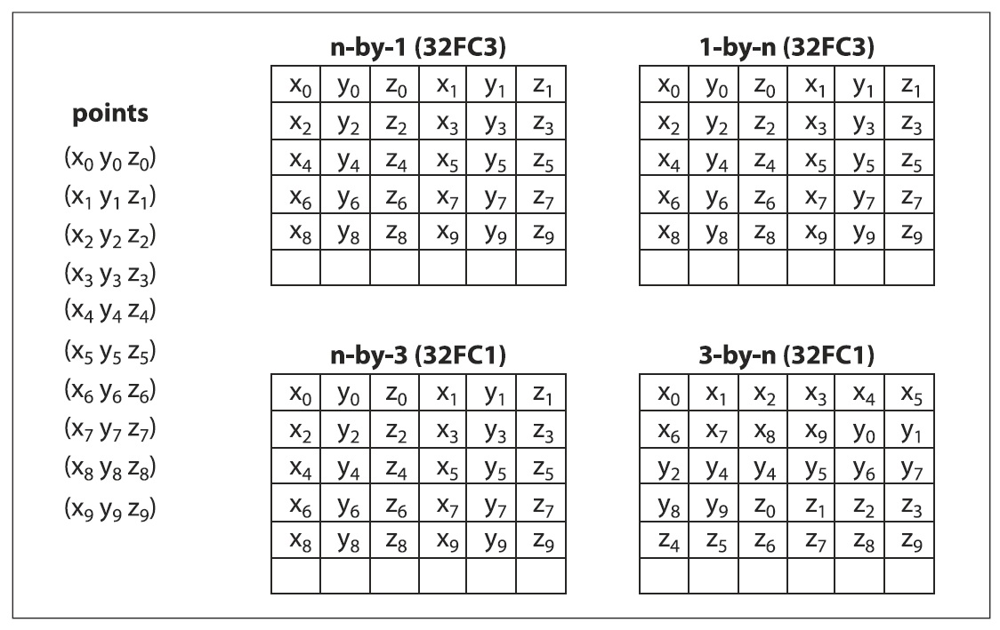

## [П]|[РС]|(РП) Структура CvMat

Прежде, чем приступить к обсуждению данной темы, уточним несколько вещей относительно матриц. Во-первых, в OpenCV нет конструкции "vector". Когда требуется вектор, просто воспользуйтесь матрицей с одной колонкой (или одной строкой, если требуется транспонированный или сопряженный вектор). Во-вторых, понятие матрицы в OpenCV несколько абстрактно, нежели в линейной алгебре. В частности, элементы матрицы не обязательно должны быть просто числами. К примеру, создание новой двумерной матрицы имеет следующий прототип:

```cpp
cvMat* cvCreateMat ( int rows, int cols, int type );
```

Здесь *type* может быть любым из длинного списка предопределенных типов; тип задаётся так: *CV_<глубина в битах>(S|U|F)C<число каналов>*. Например, матрица может состоять из 32-битных чисел с плавающей точкой(*CV_32FC1*), 8-битных без знаковых триплетов(*CV_8UC3*) и из множества других. Элементами *CvMat* могут быть не только числа. Возможность представить один элемент составным значением позволяет делать такие вещи, как представление нескольких цветовых каналов в изображении RGB. С простыми изображениями, содержащие красную, зелёную и синюю составляющую, большинство операторов будут работать с каждым каналом по отдельности (если не указано обратное). 

Внутренняя структура *CvMat* является довольно таки простой, что доказывает пример 3-1 (так же в этом можно убедиться, открыв файл *.../opencv/cxcore/include/cxtypes.h*). Матрицы имеют ширину, высоту, тип, шаг (длина строки в байтах, а не в *int* или *float*) и указатель на массив данных (и еще несколько вещей, о которых пока не будет рассказано). Получить доступ к элементам матрицы можно непосредственно через указатель на *CvMat* или через специальные функции. Например, для получения размера матрицы можно либо вызвать функцию *cvGetSize(CvMat\*)*, либо непосредственно обратиться к соответствующим полям через указатель как *matrix->height* и *matrix->width*.

Пример 3-1. Структура CvMat

```cpp
typedef struct CvMat {
    int type;       // Тип элементов
    int step;       // Шаг
    int* refcount;  // Только для внутреннего использования	
    union {
        uchar*  ptr;
        short*  s;
        int*    i;
        float*  fl;
        double* db;
    } data; // Данные матрицы
    union {
        int rows;   // Кол-во строк
        int height; // Высота
    };
    union {
        int cols;   // Кол-во столбцов
        int width;  // Ширина
    };
} CvMat;
```

Эта информация обычно именуется заголовком матрицы. Многие подпрограммы разделяют заголовок и данные, причем данные представлены указателем. 

Матрицы могут быть созданы несколькими способами. Наиболее распространенным является подход с использованием *cvCreateMat()*, которая по существу использует более элементарные функции *cvCreateMatHeader()* и *cvCreateData()*. *cvCreateMatHeader()* создает структуру *CvMat*, без выделения памяти под данные, в то время, как *cvCreateData()* выделяет память под данные. По тем или иным причинам, порой, требуется создание лишь заголовка матрицы. Ещё один метод заключается в вызове функции *cvCloneMat(CvMat\*)*, которая создает новую матрицу на основе существующей. Когда матрица больше не нужна, память из под неё может быть освобождена вызовом функции *cvReleaseMat(CvMat\*\*)*.

В примере 3-2 представлен список функций, которые только что были описаны, а так же некоторые другие, связанные с ними.

Пример 3-2. Создание и уничтожение матриц

```cpp
// Создание rows by cols матрицы типа 'type'.
CvMat* cvCreateMat( int rows, int cols, int type );

// Создание только заголовка матрицы
CvMat* cvCreateMatHeader( int rows, int cols, int type );

// Инициализация заголовка уже существующей матрицы
CvMat* cvInitMatHeader(
     CvMat* mat
    ,int    rows
    ,int    cols
    ,int    type
    ,void*  data = NULL
    ,int    step = CV_AUTOSTEP
);

// Схожа с cvInitMatHeader()
CvMat cvMat(
     int    rows
    ,int    cols
    ,int    type
    ,void*  data = NULL
);

// Создание новой матрицы на основе существующей
CvMat* cvCloneMat( const cvMat* mat );

// Освобождение памяти из-под матрицы
void cvReleaseMat( CvMat** mat );
```

По аналогии с другими структурами OpenCV для *CvMat* также есть конструктор *cvMat()*. Конструктор не выделяет память под данные, а лишь создаёт заголовок (по аналогии с *cvInitMatHeader()*). Хороший способ создать матрицу из уже имеющихся данных показан в примере 3-3. 

Пример 3-3. Создание матрицы из уже существующих данных

```cpp
float vals[] = { 0.866025, -0.500000, 0.500000, 0.866025 }; // Данные
CvMat rotmat;
cvInitMatHeader(
     &rotmat    // Матрица
    ,2          // Кол-во строк
    ,2          // Кол-во столбцов
    ,CV_32FC1   // Тип
    ,vals       // Данные
);
```

После того, как матрица создана, можно производить над ней множество интересных действий. 
	
```cpp
cvGetElemType( const CvArr* arr )
cvGetDims( const CvArr* arr, int* sizes = NULL )
cvGetDimSize( const CvArr* arr, int index )
```

Первая функция возвращает тип элемента матрицы (например, *CV_8UC1*, *CV_64_FC4* и т.д.). Вторая принимает указатель на массив и дополнительный указатель на целое число, а возвращает количество измерений (в примере матрица 2х2). Если указатель на число не NULL, то будет возвращена размерность принимаемого массива. Последняя функция принимает целое число, указывающее размер в процентах и просто возвращает степень матрицы в указанном измерении.


### Доступ к данным матрицы

Существует три варианта получения данных матрицы: простой, сложный и правильный.

**Простой способ**

Самый простой способ получить данные матриц это воспользоваться макросом *CV_MAT_ELEM()*. Этот макрос (пример 3-4) принимает в качестве аргументов указатель на матрицу, тип элементов, сроку и столбец, а возвращает запрашиваемый элемент.

Пример 3-4. Доступ к данным матрицы через макрос CV_MAT_ELEM

```cpp
CvMat* mat = cvCreateMat( 5, 5, CV_32FC1 );             // Создание матрицы
float element_3_2 = CV_MAT_ELEM( *mat, float, 3, 2 );   // Получение элемента матрицы
```

"Под капотом" этот макрос просто вызывает другой макрос *CV_MAT_ELEM_PTR()*. Этот макрос (пример 3-5) принимает в качестве аргументов указатель на матрицу, номер строки и столбца запрашиваемого элемента и возвращает указатель на нужный элемент. Одно важное отличие *CV_MAT_ELEM()* от *CV_MAT_ELEM_PTR()* в том, что *CV_MAT_ELEM()* преобразует указатель в соответствии с типом. Если требуется задать значение элементу матрицы, то нужно непосредственно вызвать *CV_MAT_ELEM_PTR()*; при этом, однако, необходимо сделать приведение типов в явном виде.

Пример 3-5. Установка значения элемента матрицы, используя макрос *CV_MAT_ELEM_PTR()*

```cpp
CvMat* mat = cvCreateMat( 5, 5, CV_32FC1 );                 // Создание матрицы
float element_3_2 = 7.7;                                    // Значение элемента в строке #3 и в столбце #2
*( (float*)CV_MAT_ELEM_PTR( *mat, 3, 2 ) ) = element_3_2;   // Установка элемента
```

К сожалению эти макросы пересчитывают смещение указателя каждый раз при их вызове. Это означает, что указатель каждый раз указывает на первый элемент матрицы; происходит вычисление смещения и добавление полученного значения смещения к указателю на первый элемент матрицы. Таким образом, хоть эти макросы и просты в использовании, это не лучший способ получения доступа к данным матрицы. Лучшим примером "против" использования данного подхода является вариант последовательного перебора элементов матрицы. 

**Сложный способ**

Два макроса, которые были рассмотрены в простом способе, могут работать только с одно- и двумерными матрицами (одномерные массивы или вектора, на самом деле, просто 1xn матрица). OpenCV предоставляет механизмы для обработки многомерных массивов. Фактически OpenCV позволяет обрабатывать n-мерные матрицы "условно любого" размера.

Для получения доступа к элементам матрицы используется семейство функций *cvPtr\*D* и *cvGet\*D* описанные в примере 3-6 и 3-7. Семейство *cvPtr\*D* содержит функции *cvPtr1D()*, *cvPtr2D()*, *cvPtr3D()* и *cvPtrND()*. Каждая из первых трех принимает указатель на матрицу *CvArr*, соответствующий количеству целых индексов, и необязательный параметр, указывающий на тип выходного параметра. Все эти процедуры возвращают указатель на необходимый элемент. *cvPtrND()* вторым аргументом принимает указатель на массив, содержащий соответствующее количество индексов. 

Пример 3-6. Доступ к элементам матрицы через указатель

```cpp
uchar* cvPtr1D(
     const CvArr*   arr
    ,int            idx0
    ,int*           type = NULL
);

uchar* cvPtr2D(
     const CvArr*   arr
    ,int            idx0
    ,int            idx1
    ,int*           type = NULL
);

uchar* cvPtr3D(
     const CvArr*   arr
    ,int            idx0
    ,int            idx1
    ,int            idx2
    ,int*           type = NULL
);

uchar* cvPtrND(
     const CvArr*   arr
    ,int*           idx
    ,int*           type            = NULL
    ,int            create_node     = 1
    ,unsigned*      precalc_hashval = NULL
);
```

Для простого чтения данных есть и другое семейство функций *cvGet\*D*, описанные в примере 3-7 и возвращающие фактическое значение элемента матрицы.

Пример 3-7. Функции для работы с *CvMat* и *IplImage*

```cpp
double cvGetReal1D( const CvArr* arr, int idx0 ); 						// Для одно-
double cvGetReal2D( const CvArr* arr, int idx0, int idx1 ); 			// двух-
double cvGetReal3D( const CvArr* arr, int idx0, int idx1, int idx2 ); 	// трёх-
double cvGetRealND( const CvArr* arr, int* idx ); 						// N-канальных матриц
CvScalar cvGet1D( const CvArr* arr, int idx0 );
CvScalar cvGet2D( const CvArr* arr, int idx0, int idx1 );
CvScalar cvGet3D( const CvArr* arr, int idx0, int idx1, int idx2 );
CvScalar cvGetND( const CvArr* arr, int* idx );
```

Тип возвращаемого значения для первых четырех функций - число типа *double*, для других четырех *CvScalar*. Это означает, что имеет место значительное увеличение ненужных расходов при использовании этих функций. Они должны быть использованы только там, где это уместно и эффективно; иначе лучше использовать *cvPtr\*D*.

Причин, по которой лучше использовать *cvPtr\*D()* заключается в том, что эти функции возвращают указатель на необходимый элемент, что в свою очередь позволяет использовать арифметику указателей для перемещения по матрице. Важно помнить, что каналы в многоканальной матрице являются смежными. Например, трехканальная двумерная матрица, представляющая байты для красного, зеленого, синего цветов (RGB), хранит данные как: rgbrgbrgb .... Поэтому для перемещения указателя на следующий канал, необходимо увеличить указатель на единицу. Если потребуется перейти к следующему "пикселю" или набору элементов, увеличьте указатель на число равное числу каналов (в приведенном примере на 3).

Иной способ узнать шаг элемента матрицы (примеры 3-1 и 3-3) заключается в получении длины строки матрицы в байтах. В структуре *CvMat*, колонок или ширины не достаточно для перемещения между строками матрицы, т.к. эффективное выделение памяти под матрицы или изображения выполняется до ближайшей границы в четыре байта. Таким образом под матрицы шириной в три байта будет выделено четыре байта и последний байт не будет использован. По этой причине, после получения указателя на элемент, необходимо увеличить его на соответствующий шаг. Если имеется матрица типа *int* или *float* и соответствующий указатель на элемент, то шаг для получения следующей строки: для *int* - *step/4*, для *double* - *step/8* (при этом C будет автоматически умножать смещение в соответствии с типом данных).

Семейства функций *cvSetReal\*D()* и *cvSet\*D()*, описанные в примере 3-8, устанавливают значения элементов матрицы или изображения.

Пример 3-8. Функции для установки значений элементам *CvMat* или *IplImage*

```cpp
void cvSetReal1D( CvArr* arr, int idx0, double value );
void cvSetReal2D( CvArr* arr, int idx0, int idx1, double value );
void cvSetReal3D(
     CvArr* arr
    ,int idx0
    ,int idx1
    ,int idx2
    ,double value
);
void cvSetRealND( CvArr* arr, int* idx, double value );
void cvSet1D( CvArr* arr, int idx0, CvScalar value );
void cvSet2D( CvArr* arr, int idx0, int idx1, CvScalar value );
void cvSet3D(
     CvArr* arr
    ,int idx0
    ,int idx1
    ,int idx2
    ,CvScalar value
);
void cvSetND( CvArr* arr, int* idx, CvScalar value );
```

Для удобства также имеются функции *cvmSet()* и *cvmGet()*, которые имеют дело с числами с плавающей точкой одно-канальных матриц. 

```cpp
double cvmGet( const CvMat* mat, int row, int col )
void cvmSet( CvMat* mat, int row, int col, double value )
```

Так, вызов функции *cvmSet()*

```cpp
cvmSet( mat, 2, 2, 0.5000 );
```

эквивалентен вызову функции *cvSetReal2D*

```cpp
cvSetReal2D( mat, 2, 2, 0.5000 );
```

**Правильный способ**

Со всеми этими функциями можно подумать, что больше не о чем говорить. На самом деле, на практике данный перечень функций крайне редко используется. На протяжение всей работы программы компьютерного зрения интенсивно используют процессор. Использование ранее перечисленных функций сказывается на эффективности. Вместо использования ранее описанных способов нужно разрабатывать собственную арифметику для работы с указателями. Управлять указателями особенно важно, когда требуется произвести изменения каждого элемента матрицы. 

Для прямого доступа к элементам матрицы все, что нужно знать, это то, что данные хранятся последовательно в порядке растрового сканирования, где переменные колонок наиболее быстро обрабатываются.  Каналы чередуются, что в случае с многоканальной матрицей означает еще более быструю обработку. Пример 3-9 показывает то, как это может быть сделано.

Пример 3-9. Суммирование всех элементов трехканальной матрицы

```cpp
float sum( const CvMat* mat ) {
    float s = 0.0f;

    // Перебор строк матрицы
    // 
    for(int row=0; row<mat->rows; row++ ) {
        // Указатель на начало соответствующей строки
        // 
        const float* ptr = (const float*)(mat->data.ptr + row * mat->step);

        // Перебор элементов строки
        // 
        for( col=0; col<mat->cols; col++ ) {
            s += *ptr++;
        }
    }
    
    return( s );
}
```

На первом шаге происходит получение указателя данных и изменение его в соответствии со смещением. Как было сказано ранее, смещение в байтах. Для обеспечения безопасности, лучше всего сначала произвести арифметику над указателем, а затем произвести приведение типов (в указанном примере к типу *float*). Хотя структура *CvMat* и содержит поля *width* и *height*, для совместимости со старой структурой *IplImage*, предпочтительней использовать поля *rows* и *cols*. В заключении, обратите внимание на то, что *ptr* пересчитывается для каждой строки, а не просто берется с самого начала и затем смещается. Это может показаться лишним, но, указывая на *ROI* внутри большого массива, нет никакой гарантии, что данные будут непрерывны по строкам.


### Массив точек

Один вопрос который может часто возникать - и который важно понимать – сводится к разнице между многомерным массивом (или матрицей) из многомерных элементов, и многомерным массивом с одномерными элементами. Предположим есть n точек в трехмерном измерении, которые необходимо передать некоторой функции OpenCV в виде *CvMat\** (скорее *CvArr\**). Есть четыре очевидных способа сделать это, при этом не все эквиваленты друг другу. Первый способ: использовать двумерный массив типа *CV32FC1* из n строк и трех столбцов (nx3). Второй способ: использовать двумерный массив типа *CV32FC1* с 3 строками и n столбцов (3xn). Третий и четвертый способы: использовать массив типа *CV32FC3* с n строк и одного столбца (nx1) или массив с одной строкой и n столбцов (1xn). В некоторых случаях эти способы взаимозаменяемы, чтобы понять почему, посмотрим на рисунок 3-2.



Рисунок 3-2. Набор из 10 точек, каждая из которых представлена тремя числами типа *float*; в трех случаях из четырех распределение памяти одинаково

Как можно видеть на рисунке, точки отображаются в памяти одинаковым образом в трех из четырех случаев, описанных ранее. Ситуация становится еще более запутанной для N-мерного массива c-мерных точек. Главное помнить, что расположение точек определяется по формуле:

```
δ = (row) ⋅ Ncols ⋅ Nchannels + (col) ⋅ Nchannels + (channel)
```

где *Ncols* и *Nchannels* количество колонок и каналов, соответственно. По этой формуле можно сказать, что N-мерный массив с c-мерными элементами не то же самое, как (N+c)-мерный массив одномерных объектов. В частном случае при N=1 (т.е. вектор вида 1xn или nx1) матрица является специально вырожденной (данный случай представлен на рисунке 3-2), что может быть иногда использовано для повышения производительности. 

В заключении пару слов о типах *CvPoint2D* и *CvPoint2D32f*. Эти типы данных определены как структуры C и, следовательно, имеют строго определенную компоновку памяти. В частности, числа типа *int* или *float*, которые содержат эти структуры образуют последовательный "канал". Как результат одномерный массив в стиле C этих объектов имеет такое же распределение памяти, как и n-by-1 или 1-by-n массивы типа *CV32FC2*. Тоже самое справедливо и для массивов структур типа *CvPoint3D32f*.

