## (П]|(РС)|(РП) Операции над матрицами и изображениями

В таблице 3-3 перечислены различные процедуры манипуляции с матрицами, многие из которых также хорошо работают и с изображениями. Они выполняют такие "обычные" вещи, как приведение к диагональной форме и транспонирование матрицы, а также некоторые более сложные операции, такие как вычисление статистики изображения.

Таблица 3-3. Базовые операции

| Функция | Описание |
| -- | -- |
| cvAbs | Абсолютное значение всех элементов матрицы |
| cvAbsDiff | Абсолютное значение разницы между двумя элементами матрицы |
| cvAbsDiffS | Абсолютное значение разницы между элементом матрицы и скаляром |
| cvAdd | Поэлементное складывание двух матриц |
| cvAddS | Поэлементное складывание элементов матрицы и скаляра |
| cvAddWeighted | Поэлементное взвешенное складывание двух матриц (альфа-смешивание) |
| cvAvg | Среднее значение всех элементов матрицы |
| cvAvgSdv | Абсолютное значение стандартного отклонения всех элементов матрицы |
| cvCalcCovarMatrix | Вычисление ковариации набора n-мерных векторов |
| cvCmp | Применение выбранной операции сравнения для всех элементов в двух матрицах |
| cvCmpS | Применение выбранной операции сравнения отношения матрицы и скаляра |
| cvConvertScale | Изменение типа матрицы с изменением масштаба |
| cvConvertScaleAbs | Изменение типа матрицы с абсолютными значениями с изменением масштаба |
| cvCopy | Копирование элементов из одной матрицы в другую |
| cvCountNonZero | Количество ненулевых элементов матрицы |
| cvCrossProduct | Вычисление векторного произведения двух трехмерных векторов |
| cvCvtColor | Преобразование каналов матрицы из одного цветового пространства в другое |
| cvDet | Вычисление определителя квадратной матрицы |
| cvDiv | Поэлементное деление одной матрицы на другую |
| cvDotProduct | Вычисление скалярного произведения двух векторов |
| cvEigenVV | Вычисление собственных чисел и собственных векторов квадратной матрицы |
| cvFlip | Обратный порядок матрицы по выбранной оси |
| cvGEMM | Обобщенная матрица умножения |
| cvGetCol | Копирование элементов колонки частичной матрицы |
| cvGetCols | Копирование элементов из нескольких соседних столбцов матрицы |
| cvGetDiag | Копирование элементов из диагональной матрицы |
| cvGetDims | Возвращает количество измерений матрицы |
| cvGetDimSize | Возвращает размеры всех измерений матрицы |
| cvGetRow | Копирование элементов строки частичной матрицы |
| cvGetRows | Копирование элементов из нескольких соседних строк матрицы |
| cvGetSize | Получение размера двумерной матрицы и возвращение в виде CvSize |
| cvGetSubRect | Копирование элементов из выделенного региона изображения |
| cvInRange | Тестирование попадания элементов матрицы в пределы значений двух других матриц |
| cvInRangeS | Тестирование попадания элементов матрицы между двумя скалярами |
| cvInvert | Невырожденная матрица |
| cvMahalanobis | Вычисление расстояния Махаланобиса между двумя векторами |
| cvMax | Поиск максимального значения, среди двух матриц |
| cvMaxS | Поиск максимального значения, среди матрицы и скаляра |
| cvMerge | Слияние нескольких одноканальных изображений в одно многоканальное |
| cvMin | Поиск минимального значения, среди двух матриц |
| cvMinS | Поиск минимального значения, среди матрицы и скаляра |
| cvMinMaxLoc | Поиск максимального и минимального значения матрицы |
| cvMul | Поэлементное перемножение двух матриц |
| cvNot | Побитовое инвертирование всех элементов матрицы |
| cvNorm | Вычисление (!) нормальной взаимокорреляционной функции (Normalized cross-correlation) (!) между двумя матрицами |
| cvNormalize | Нормализация элементов массива до некоторого значения |
| cvOr | Поэлементная побитовая операция OR между двумя матрицами |
| cvOrS | Поэлементная побитовая операция OR между матрицей и скаляром |
| cvReduce | Преобразование двумерной матрицы в вектор |
| cvRepeat | Заполнение выходной матрицы копиями входной матрицы |
| cvSet | Установка всех элементов матрицы в заданное значение |
| cvSetZero | Установка всех элементов матрицы в 0 |
| cvSetIdentity | Установка диагональных элементов матрицы в 1, остальных в 0 |
| cvSolve | Решение системы линейных уравнений |
| cvSplit | Разделение многоканального изображения на несколько одноканальных |
| cvSub | Поэлементное вычитание одной матрицы из другой |
| cvSubS | Поэлементное вычитание скаляра из матрицы |
| cvSubRS | Поэлементное вычитание матрицы из скаляра |
| cvSum | Суммирование всех элементов матрицы |
| cvSVD | Вычисление сингулярного разложения двумерной матрицы |
| cvSVBkSb | Вычисление сингулярного разложения методом обратной замены |
| cvTrace | Вычисление следа матрицы |
| cvTranspose | Транспонирование всех элементов матрицы через диагональ |
| cvXor | Поэлементная битовая операция XOR между двумя матрицами |
| cvXorS | Поэлементная битовая операция XOR между матрицей и скаляром |
| cvZero | Установка всех элементов матрицы в 0 |

**cvAbs, cvAbsDiff, and cvAbsDiffS**
```cpp
	void cvAbs(
		 const CvArr* 	src
		,const 			dst
	);

	void cvAbsDiff(
		 const CvArr*	src1
		,const CvArr*	src2
		,const 			dst
	);

	void cvAbsDiffS(
		 const CvArr*	src
		,CvScalar		value
		,const 			dst
	);
```

Функция *cvAbs()* вычисляет абсолютные значения элементов *src* и запиcывает результат в *dst*. Функция *cvAbsDiff()* сначала вычисляет разницу между *src2* и *src1* и потом записывает абсолютное значение  в *dst*. Функция *cvAbsDiffS()* делает почти тоже самое, что и *cvAbsDiff()*, только разница находится между элементами *src* и значением скаляра *value*.

**cvAdd, cvAddS, cvAddWeighted и альфа-смешивание**
```cpp
	void cvAdd(
		 const CvArr* 	src1
		,const CvArr* 	src2
		,CvArr* 		dst
		,const CvArr* 	mask = NULL
	);

	void cvAddS(
		 const CvArr* 	src
		,CvScalar 		value
		,CvArr* 		dst
		,const CvArr* 	mask = NULL
	);

	void cvAddWeighted(
		 const CvArr*	src1
		,double 		alpha
		,const CvArr*	src2
		,double 		beta
		,double 		gamma
		,CvArr* 		dst
	);
```

Функция *cvAdd()* складывает все элементы из *src1* с элемнтами из *src2* и кладет результат в *dst*. Если *mask* не NULL, тогда некоторые элементы *dst* останутся неизменными там, где элемент масrи равен 0. Функция *cvAddS()* делает почти тоже самое, что и *cvAdd()*, за исключением того, что значение скаляра добавляется к каждому элементу *src*. 

Функция *cvAddWeighted()* аналогична *cvAdd()* за исключением того, что результат записывается в *dst* и вычисляется по формуле:
	
	dst(x,y) = α ⋅ src1(x,y) + β ⋅ src2(x,y) + γ

Эта функция может быть использована для реализации альфа-смешивания. Функция принимает два источника изображения *src1* и *src2*. Эти изображения могут быть различного типа, при этом оба изображения одинакового типа. Они также могут быть одноканальными и трехканальными (серыми или цветными), при этом оба изображения с одинаковым кол-вом каналов. Результирующее изображение *dst* также должно быть тогоже типа, что и исходные изображения. Исходные изображения могут быть разных размеров. поэтому предварительно нужно согласовать этот момент при помощи ROI, иначе OpenCV выдаст ошибку. Параметр *alpha* альфа смешивания относится к *src1*, а *beta* бетта смешивания к *src2*. Уравнение альфа смешивания:

	dst(x,y) = α ⋅ src1(x,y) + β ⋅ src2(x,y) + γ

Стандартное уравнение альфа смешивания получается путем выбора *α* между 0 и 1, *β=1-α*, *γ=0*:

	dst(x,y) = α ⋅ src1(x,y) + (1−α) ⋅ src2(x,y)

В общем случаи, требуется, чтобы ** и ** были более 0 и меньше 1; ** может быть установлена в зависимости от среднего или максимального значения изображения для увеличения масштаба пикселей. 

Пример 3-14. Альфа смешивание, смещение ROI в src2 (0,0), в src1 (x,y)
```cpp
#include <cv.h>
#include <highgui.h>

int main(int argc, char** argv)
{
	IplImage *src1, *src2;
	
	// Проверка наличия изображений по указанным путям
	// Проверка необходимого кол-ва аргументов
	if ( 
		( argc == 9 ) && 
		( (src1=cvLoadImage(argv[1],1)) != 0 ) && 
		( (src2=cvLoadImage(argv[2],1)) != 0 )
	   )
	{
		int x = atoi(argv[3]);		// Смещение по оси x
		int y = atoi(argv[4]);		// Смещение по оси y
		int width = atoi(argv[5]);	// Ширина области ROI
		int height = atoi(argv[6]);	// Высота области ROI
		double alpha = (double)atof(argv[7]);	// Значение альфа
		double beta = (double)atof(argv[8]);	// Значение бетта
		
		// Установка области ROI
		// Примечание: отсутствует логика установки областей
		// 			   одинакового размера
		cvSetImageROI(src1, cvRect(x,y,width,height));
		cvSetImageROI(src2, cvRect(0,0,width,height));

		// src1 = src1
		// src2 = src2 
		// α = alpha
		// β = beta
		// γ = 0.0
		// dst = src1
		cvAddWeighted(src1, alpha, src2, beta, 0.0, src1);
		
		// Сброс ROI для src1
		cvResetImageROI(src1);
		cvNamedWindow( “Alpha_blend”, 1 );
		cvShowImage( “Alpha_blend”, src1 );
		
		cvWaitKey();
	}

	return 0;
}
```

Результат выполнения примера 3-14 представлен на рисунке 3-4.


Рисунок 3-4. Лицо ребенка альфа смешано с лицом кошки

**cvAnd и cvAndS**
```cpp
	void cvAnd(
		 const CvArr*	src1
		,const CvArr*	src2
		,CvArr*			dst
		,const CvArr*	mask = NULL
	);

	void cvAndS(
		 const CvArr*	src1
		,CvScalar		value
		,CvArr*			dst
		,const CvArr*	mask = NULL
	);
```

Эти две функции вычисляют побитовое *AND* на массиве *src1*. В случае *cvAdd()* каждый элемент *dst* вычисляется как побитовое *AND* двух соответствующих элементов *src1* и *src2*. В случае *cvAndS* побитовое *AND* вычисляется с значением скаляра. Если *mask != NULL*, то элементы *dst* соответствуют ненулевым элементам маски.

*src1* и *src2* должны быть любого одинакового типа данных. (!) Если элементы вещественного типа, то результат тоже будет состоять из элементов вещественного типа. (!)

**cvAvg**
```cpp
	CvScalar cvAvg(
		 const CvArr*	arr
		,const CvArr*	mask = NULL
	);
```

Функция *cvAvg()* вычисляет среднее значение пикселей в *arr*. Если *mask != NULL*, то среднее будет рассчитано только на тех пикселях, для которых соответствующее значение маски отлично от нуля. 

В настоящее время функция является устаревшим псевдонимом *cvMean()*.

**cvAvgSdv**
```cpp
	void cvAvgSdv(
		 const CvArr*	arr
		,CvScalar*		mean
		,CvScalar*		std_dev
		,const CvArr*	mask = NULL
	);
```

Эта функция похожа на *cvAvg()*, но в дополнение к ней вычисляет еще стандартное отклонение.

В настоящее время функция является устаревшим псевдонимом *cvMean_StdDev()*.

**cvCalcCovarMatrix**
```cpp
	void cvAdd(
		 const CvArr**	vects
		,int 			count
		,CvArr* 		cov_mat
		,CvArr*			avg
		,int 			flags
	);
```

Учитывая любое количество векторов, *cvCalcCovarMatrix()* вычисляет среднее и матрицу ковариаций для аппроксимации гауссового распределения. Это может пригодится при решенире множества задач, на этот случай в OpenCV есть специальные флаги, которые помогут при решении конкретной задачи (таблица 3-4). Возможно объединение нескольких флагов с использованием логической операции *OR*. 

Таблица 3-4. Возможные варианты флагов *cvCalcCovarMatrix()*

| Наименование флага | Значение |
| -- | -- |
| CV_COVAR_NORMAL | Среднее значение и ковариационная матрица |
| CV_COVAR_SCRAMBLED | Быстрый PCA (principal component analysis - метод главных компонент) |
| CV_COVAR_USE_AVERAGE | Использование вычисленного среднего значения |
| CV_COVAR_SCALE | Масштабирование матрици ковариаций |

Во всех случаях вектора представлены как массив массивов *vects* (т.е. указатель на список указателей на массивы). Матрица ковариаций будет размещена в *cov_mat*, а значение среднего *avg* будет зависить от флага (таблица 3-4).

Флаги *CV_COVAR_NORMAL* и *CV_COVAR_SCRAMBLED* являются взаимоисключающими; совместное использование не допустимо. В случае *CV_COVAR_NORMAL* функция вычисляет среднее значение  матрицу ковариаций.


Таким образом нормальная ковариация  вычисляется из *m* векторов длиной *n*, где  - определяет *n*-ый элемент среднего вектора . Результирующая ковариационная матрица имеет размерность *nxn*. Коэффициент *z* является необязательным масштабным коэффициентом; он будет равен 1, если не использовать флаг *CV_COVAR_SCALE*.

В случае *CV_COVAR_SCRAMBLED* функция *cvCalcCovarMatrix()* вычисляет матрицу ковариаций по следующей формуле:


Эта матрица не является обычной ковариационной матрицей (обратите внимание на расположение оператора транспонирования). Эта матрица вычисляется из тех же *m* вектров длинной *n*, но результирующая матрица уже будет размерностью *mxm*. Эта матрица используется, например, в быстрых PCA для очень больших векторов (техника *eigenfaces* для распознавания лица). 

Флаг *CV_COVAR_USE_AVG* используется, когда среднее значение входных векторов уже известно. В этом случае аргумент *avg* используется в качестве входного сигнала, а не выходного, что снижает время выполнения вычислений.

Флаг *CV_COVAR_SCALE* применяется для равномерного масштабирования результирующей ковариационной матрицы. За это овечает переменная *z*. При использовании в сочетании с флагом *CV_COVAR_NORMAL*, масштабный коэффициент будет равен *1.0/m* (что эквивалентно *1.0/count*). При использовании в сочетании с флагом *CV_COVAR_SCRAMBLED*, масштабный коэффициент будет равен *1.0/n*.

Входные и выходные массивы функции *cvCalcCovarMatrix()* должны быть одинакового вещественного типа. Размер результирующей матрицы *cov_mat* должен быть  *nxn* или *mxm*, в зависимости от типа вычисляемой ковариационной матрицы (стандартная или нет). Стоит отметить, что входные вектора *vects* не должны быть одномерными; они могут быть и двумерными (например, в случае с изображениями).

**cvCmp и cvCmpS**
```cpp
	void cvCmp(
		 const CvArr*	src1
		,const CvArr*	src2
		,CvArr*			dst
		,int 			cmp_op
	);

	void cvCmpS(
		 const CvArr*	src
		,double			value
		,CvArr*			dst
		,int 			cmp_op
	);
```

Обе эти функции выполняют сравнение, либо между соответствующими пикселями двух изображений, либо между пикселями изображения и значением скаляра. Функции *cvCmp()* и *cvCmpS()* принимают в качестве последнего аргумента оператор сравнения, который определен как флаг (таблица 3-5).

Таблица 3-5. Значения cmp_op используемые в cvCmp() и cvCmpS() и результат выполняемого сравнения

| Значение cmp_op | Сравнение |
| -- | -- |
| CV_CMP_EQ | (src1i == src2i) |
| CV_CMP_GT | (src1i > src2i) |
| CV_CMP_GE | (src1i >= src2i) |
| CV_CMP_LT | (src1i < src2i) |
| CV_CMP_LE | (src1i <= src2i) |
| CV_CMP_NE | (src1i != src2i) |

Данные функции работают только с одноканальными изображениями. Эти функции полезны в программах, где используется какая-то версия вычитания фона, чтобы замаскировать результат.

**cvConvertScale**
```cpp
	void cvConvertScale(
		 const CvArr* 	src
		,CvArr* 		dst
		,double 		scale = 1.0
		,double 		shift = 0.0
	);
```

Функция *cvConvertScale()* на самом деле состоит из нескольких вложенных функций; при этом может быть использован весь набор вложенных функций, а может и не весь. На первом шаге происходит преобразование типа данных исходного изображения в тип результирующего изображения. Например, имея 8-битное RGB изображение в оттенках серого, можно преобразовать его в 16-битное изображение.

На втором шаге выполняется линейное преобразование данных изображения. После преобразования к новому типу данных, каждое значение пикселя будет умножено на значение *scale*, с добавлением значения смещения *shift*. 

Важно понимать, что хоть операция "Конвертирования" и предшествует операции "Масштабирования" в имени функции, фактически эти операции выполняются в противоположном порядке. Это означает, сто операция умножения на *scale* и добавления *shift* происходит до операции преобразования типов.

Использование значений *scale* и *shift* по умолчанию (*scale = 1.0, shift = 0.0*) приведет к пропуску соответствующих операций. Для такого случая в OpenCV предусмотрен макрос *CvConvert()*. Функция ** может работать со всеми типами данных и любым количеством каналов, однако, количество каналов в исходном изображении и результирующем должно быть одинаково. (Если же требуется преобразовать цветное изображение в изображение с оттенками серого, то необходимо использовать функцию *cvCvtColor()*, о которой речь пойдет чуть далее).

**cvConvertScaleAbs**
```cpp
	void cvConvertScaleAbs(
		 const CvArr*	src
		,CvArr* 		dst
		,double			scale = 1.0
		,double			shift = 0.0
	);
```

Функция *cvConvertScaleAbs()* идентична *cvConvertScale()*, за исключением того, что *dst* содержит абсолютные значению полученных данных. Это означает, что функция *cvConvertScaleAbs()* сначала применяет *scale* и *shift*, затем вычисляет абсолютное значение и в завершении выполняет преобразование типов.

**cvCopy**
```cpp
	void cvCopy(
		 const CvArr*	src
		,CvArr* 		dst
		,const CvArr*	mask = NULL
	);
```

Функция выполняет копирование одного изображения в другое. Оба массива должны быть одинакового типа, размера и иметь одинаковое количество измерений. Данную функцию можно использовать для копирования разряженных массивов, но при этом невозможно задействовать маску. Для разряженных массивов и изображений. Эффект от маски (если *mask != NULL*) будет такой, что будут изменены только те пиксели в *dst*, которым соответствуют ненулевые элементы в маске.

**cvCountNonZero**
```cpp
	int cvCountNonZero( const CvArr* arr );
```

Функция *cvCountNonZero()* возвращяет количество ненулевых пикселей в массиве *arr*.

**cvCrossProduct**
```cpp
	void cvCrossProduct(
		 const CvArr* 	src1
		,const CvArr* 	src2
		,CvArr* 		dst
	);
```

Эта функция вычисляет векторное произведение двух трехмерных векторов. Не имеет значение, вектор-столбец или вектор-строка. *src1* и *src2* должны быть одноканальными массивами, массив *dst* должен быть одноканальным и длинною точно 3. Все три массива должны быть одного типа.

**cvCvtColor**
```cpp
	void cvCvtColor(
		 const CvArr* 	src
		,CvArr* 		dst
		,int 			code
	);
```

Ранее была представлена функция, которая преобразует из одного типа данных в другой, при этом количество каналов должно быть одинаково для исходных и результирующих изображений. Функция *cvCvtColor()* преобразует из одного цветового пространства в другое, при этом тип данных исходного и результирующего изображений совпадают. Флаг *code*, значения которого перечислены в таблице 3-6, задает процесс преобразования для конкретного случая.

Таблица 3-6. Значения флага для функции cvCvtColor()

| Флаг | Значение |
| -- | -- |
| CV_BGR2RGB | Преобразования между RGB и BGR (с и без альфа канала) |
| CV_RGB2BGR | |
| CV_RGBA2BGRA | |
| CV_BGRA2RGBA | |
| CV_RGB2RGBA | Добавление альфа канала к RGB или BGR изображению |
| CV_BGR2BGRA | |
| CV_RGBA2RGB | Удаление альфа канала из RGB или BGR изображения |
| CV_BGRA2BGR | |
| CV_RGB2BGRA | Преобразования RGB в BGR при добавлении или удалении альфа канала |
| CV_RGBA2BGR | |
| CV_BGRA2RGB | |
| CV_BGR2RGBA | |
| CV_RGB2GRAY | Преобразование RGB или BGR в оттенки серого |
| CV_BGR2GRAY | |
| CV_GRAY2RGB | Преобразование из оттенков серого в RGB или BGR (необязательное удаление альфа канала в процессе преобразования) |
| CV_GRAY2BGR | |
| CV_RGBA2GRAY | |
| CV_BGRA2GRAY | |
| CV_GRAY2RGBA | Преобразование из оттенков серого в RGB или BGR и добавление альфа канала |
| CV_GRAY2BGRA | |
| CV_RGB2BGR565 | Преобразование из RGB или BGR в BGR565 с добавлением или удалением альфа канала (16-битные изображения) |
| CV_BGR2BGR565 | |
| CV_BGR5652RGB | |
| CV_BGR5652BGR | |
| CV_RGBA2BGR565 | |
| CV_BGRA2BGR565 | |
| CV_BGR5652RGBA | |
| CV_BGR5652BGRA | |
| CV_GRAY2BGR565 | Преобразование из оттенков серого в BGR565 и наоборот (16-битные изображения) |
| CV_BGR5652GRAY | |
| CV_RGB2BGR555 | Преобразование из RGB или BGR в BGR555 с необязательным добавлением или удалением альфа канала (16-битные изображения) |
| CV_BGR2BGR555 | |
| CV_BGR5552RGB | |
| CV_BGR5552BGR | |
| CV_RGBA2BGR555 | |
| CV_BGRA2BGR555 | |
| CV_BGR5552RGBA | |
| CV_BGR5552BGRA | |
| CV_GRAY2BGR555 | Преобразование из оттенков серого в BGR555 и наоборот (16-битные изображения) |
| CV_BGR5552GRAY | |
| CV_RGB2XYZ | Преобразование RGB или BGR в CIE XYZ и наоборот (Rec 709 with D65 white point) |
| CV_BGR2XYZ | |
| CV_XYZ2RGB | |
| CV_XYZ2BGR | |
| CV_RGB2YCrCb | Преобразование RGB или BGR в luma-chroma (также известный как YCC) |
| CV_BGR2YCrCb | |
| CV_YCrCb2RGB | |
| CV_YCrCb2BGR | |
| CV_RGB2HSV | Преобразование RGB или BGR в HSV (тон, насыщенность, значение) и наоборот |
| CV_BGR2HSV | |
| CV_HSV2RGB | |
| CV_HSV2BGR | |
| CV_RGB2HLS | Преобразование RGB или BGR в HLS (тон, светлота, насыщенность) и наоборот |
| CV_BGR2HLS | |
| CV_HLS2RGB | |
| CV_HLS2BGR | |
| CV_RGB2Lab | Преобразование RGB или BGR в CIE Lab и наоборот |
| CV_BGR2Lab | |
| CV_Lab2RGB | |
| CV_Lab2BGR | |
| CV_RGB2Luv | Преобразование RGB или BGR в CIE Luv |
| CV_BGR2Luv | |
| CV_Luv2RGB | |
| CV_Luv2BGR | |
| CV_BayerBG2RGB | Преобразование из Bayer pattern (один канал) в RGB или BGR |
| CV_BayerGB2RGB | |
| CV_BayerRG2RGB | |
| CV_BayerGR2RGB | |
| CV_BayerBG2BGR | |
| CV_BayerGB2BGR | |
| CV_BayerRG2BGR | |
| CV_BayerGR2BGR | |

Реализация многих из этих преобразований нетривиальны. OpenCV содержит достаточный инструментарий для преобразования "в" и "из" этих различных цветовых пространств.

При преобразованиях цветовое пространство (диапазон значений) изображений  должно соответствовать следующим правилам: для 8-битных изображений 0-255; для 16-битных изображений 0-65536; для вещественных чисел 0.0-1.0. Когда изображения в оттенках серого преобразуются в цветные изображения, все компоненты результирующего изображения (!) взяты равными (!); в обратной случае (из RGB или BGR в оттенки серого), значения результирующего изображения вычисляются по перцептивно взвешенной формуле:

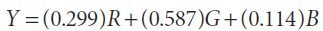

В случае HSV и HLS, тон представляет диапазон [0, 360). Это может привести к проблемам с 8-битными изображениями, поэтому при преоброзовании к HSV, тон делится на 2, когда выходное изображение 8-битное.

**cvDet**
```cpp
	double cvDet( const CvArr* mat );
```

Функция *cvDet()* вычисляет детерминант квадратной матрицы. Матрица может быть любого типа, но только одноканальной. Если матриц мала, то определитель вычисляется по стандартной формуле. Для больших матриц это не особо эффективно, поэтому используется метод Гаусса. 

При этом стоит отметить, что если матрица симметрична и имеет положительный определитель, можно воспользоваться решением с помощью сингулярного разложения (SVD). Для получения более подробной информации обратитесь к функции "cvSVD()".

**cvDiv**
```cpp
	void cvDiv(
		const CvArr*	src1
		const CvArr*	src2
		CvArr*			dst
		double			scale = 1
	);
```

*cvDiv()* это функция деления; она просто поэлементно делит элементы *src1* на элементы *src2* и записывает результат в *dst*. (!) Если *mask != NULL*, то любые элементы в *dst*, соответствующие нулевому элементу маски, не подвергаются операции деления. Если потребуется инвертировть все элементы матрицы src2, то передайте src1, у которог все элементы NULL-ы; процедура расценит это как массив с элементами 1s. (!)

**cvDotProduct**
```cpp
	double cvDotProduct(
		 const CvArr* src1
		,const CvArr* src2
	);
```

Эта функция вычисляет вектор скалярного произведения двух N-мерных векторов. Не имеет значение, если это будут вектор-строка или вектор-столбец. *src1* и *src2* должны быть одноканальными и быть одного типа. 

**cvEigenVV**
```cpp
	double cvEigenVV(
		 CvArr*	mat
		,CvArr*	evects
		,CvArr*	evals
		,double	eps = 0
	);
```

Имея симметричную матрицу *mat*, функция *cvEigenVV()* вычисляет собственные вектора и соответствующие собственные числа матрицы. Для небольших матриц используется метод *Jacobi*. Этот метод запрашивает остановочный параметра, который является максимальным значением размера недиагональных элементов в результирующей матрице. Необязательный параметр *eps* устанавливает этот остановочный параметр. В процессе вычислений, значения матрицы *mat* будут изменены. По завершению выполнения функции, собственные вектора будут помещены в переменную *evects*; собственные числа в переменную *evals*. Порядок собственных векторов всегда будет в порядке убывания величин собственных чисел. На вход функции *cvEigenVV()* необходимо передавать сразу три массива.

Также, как и в случае с функцией *cvDet()*, если известно, что матрица симметрична и имеет положительный определитель, то лучше использовать SVD для нахождения собственных векторов и собственных чисел.

**cvFlip**
```cpp
	void cvFlip(
		const CvArr*	src
		CvArr*			dst	= NULL
		int 			flip_mode = 0
	);
```

Эта функция переворачивает изображение вокруг оси x, оси y или обоих. В частности, если аргумент *flip_mode* равен 0, то изображение будет перевернуто по оси x. Если *flip_mode* равен положительному числу (например, +1), изображение будет повернуто по оси y. Если *flip_mode* равен отрицательному числу (например, -1) изображение будет повернуто по обоим осям.

При обработке видео в системах Win32, необходимо самостоятельно переключаться между форматами изображения, в зависимости от расположения начала координат (верхний левый или нижний левый угол).

**cvGEMM**
```cpp
	double cvGEMM(
		 const CvArr*	src1
		,const CvArr*	src2
		,double			alpha
		,const CvArr*	src3
		,double			beta
		,CvArr*			dst
		,int 			tABC = 0
	);
```

Обобщенная матрица умножения (GEMM) в OpenCV представлена функцией *cvGEMM()*; она выполняет умножение матриц, транспонированное умножение, масштабированное умножение и т.д. В наиболее общей форме, *cvGEMM()* вычисляется по следующей формуле:

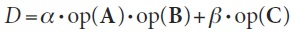

*A*, *B* и *C* матрицы *src1*, *src2* и *src3* соответственно, *α* и *β* числовые коэффициенты, *op()* необязятельное транспонирование матрицы. Аргумент *src3* может быть установлен в NULL. Транспонирование контролируется с помощью дополнительного аргумента *tABC*, который может быть равен 0 или любой комбинации (с помощью OR) из флагов *CV_GEMM_A_T*, *CV_GEMM_B_T* и *CV_GEMM_C_T* (каждый флаг указывает транспонирование соответствующей матрицы).

Ранее OpenCV содержал функции *cvMatMul()* и *cvMatMulAdd()*, но это часто приводило к путанице с функцией *cvMul()*. В настоящее время эти функции существуют в виде макросов, которые неявно вызывают *cvGEMM()* (таблица 3-7).

Таблица 3-7. Макросы для обобщенной функции *cvGEMM()*
```cpp
	cvMatMul( A, B, D ) 		cvGEMM( A, A, 1, NULL, 0, D, 0 )
	cvMatMulAdd( A, B, C, D )	cvGEMM( A, A, 1, C, 1, D, 0 )
```

Все матрицы должны быть соответствующего размера и вещественного типа. Функция *cvGEMM()* поддерживает двухканальные матрицы.

**cvGetCol и cvGetCols**
```cpp
	CvMat* cvGetCol(
		 const CvArr*	arr
		,CvMat*			submat
		,int 			col
	);
	CvMat* cvGetCols(
		 const CvArr*	arr
		,CvMat*			submat
		,int 			start_col		
		,int 			end_col
	);
```

Функция *cvGetCol()* используется для получения одного столбца из матрицы в виде вектора (т.е. матрицы с одной колонкой). В этом случае заголовок матрицы *submat* будет изменен таким образом, чтобы указывать на конкретный столбец матрицы *mat*. При этом не происходит выделение дополнительной памяти или копирование данных. Содержание *submat* изменяется таким образом, чтобы правильно указывать на выбранный столбец в *arr*. Поддерживаются все типы данных.

Функция *cvGetCols()* работает похожим образом, только выбирает все столбцы из диапазона *[start_col, end_col]*. Обе функции возвращяют указатель на заголовок, соответствующий выбранному столбцу или диапазону столбцов (т.е. *submat*).

**cvGetDiag**
```cpp
	CvMat* cvGetDiag(
		 const CvArr*	arr
		,CvMat*			submat
		,int 			diag = 0
	);
```

Функция *cvGetDiag()* аналогична *cvGetCol()*; она используется, чтобы выбрать одну из диагоналей матрицы и вернуть результат в виде вектора. Аргумент *submat* это заголовок матрицы. Функция *cvGetDiag()* заполняет компоненты заголовка таким образом, чтобы он указывал на нужную информацию в матрице *arr*. необязательный аргумент *diag* определяет, на какие диагонали указывает *submat*. Если *diag = 0*, то выбирается главная диагональ. Если *diag > 0*, тогда выбирается диагональ выше главной *(diag;0)*; если *diag < 0*, тогда выбирается диагональ ниже главной (0, -diag). Матрица не обязательно должна быть квадратной, однако, массив *submat* должен соответствовать входному массиву. Результатом выполнения функции является заголовок *submat*, соответствующий указанной диагонали исходной матрицы.

**cvGetDims и cvGetDimSize**
```cpp
	int cvGetDims(
		 const CvArr*	arr
		,int* 			sizes = NULL
	);
	int cvGetDimSize(
		 const CvArr*	arr
		,int 			index
);
```

Функция *cvGetDims()* возвращяет количество измерений для массива массивов в общем и (оционально) размерность вложенных массивов в частности. Если *sizes != NULL*, то это должен быть указатель *n* типа *int*, где *n* размерность измерений. Если заранее не известна размерность измерений, то *sizes* выставляется в *CV_MAX_DIM*. 

Функция *cvGetDimSize()* возвращяет размерность одного измернеия, в соответствии с указанным индексом *index*. Если массив - матрица или изображение - измерений всегда будет два. Для матриц и изображений, порядок возвращаемых значений в *sizes* из *cvGetDims()* будет следующим: количество строк, количество столбцов. 

Пример 3-15. Вычисление общего количества элементов массива
```cpp
	int sizes[CV_MAX_DIM];
	int i, total = 1;
	int dims = cvGetDims(arr, size);
	for(i = 0; i < dims; i++ )
		total *= sizes[i];
```

Функция *cvGetDims()* возвращает размерность массива и массив *sizes* размеров измерений. В случае с матрицами или изображениями, кол-во измерений *dims = 2*, *sizes* будет содержать количество строк и столбцов. Для получения общего количества элементов массива производится перемножение кол-ва строк и кол-ва столбцов.

**cvGetRow и cvGetRows**
```cpp
	CvMat* cvGetRow(
		 const CvArr*	arr
		,CvMat* 		submat
		,int 			row
	);
	CvMat* cvGetRows(
		 const CvArr*	arr
		,CvMat*			submat
		,int 			start_row
		,int 			end_row
	);
```

Функция *cvGetRow()* выбирает одну строку из матрицы и возвращает её как вектор (т.е матрицы с одной строкой). Как и в *cvGetCol()*, заголовок матрицы *submat* будет координировать выбор конкретной строки в *arr*, при этом модификация этого заголовка не подразумевает выделение памяти или копирование данных. Поддерживаются все типы данных.

Функция *cvGetRows()* работает похожим образом, только выбирает все строки из диапазона *[start_col, end_col]*. Обе функции возвращяют указатель на заголовок, соответствующий выбранной строке или диапазону строк (т.е. *submat*).

**cvGetSize**
```cpp
	CvSize cvGetSize( const CvArr* arr );
```

Эта частный случай функций *cvGetDims()* и *cvGetSize()*. Уникальность функции заключается в том, что она может быть использована толька на матрицах или изображениях размерностью два. Размер возвращается в виде структуры *CvSize*, которая подходит, например, для создания новой матрицы или изображения того же размера.

**cvGetSubRect**
```cpp
	CvSize cvGetSubRect(
		 const CvArr*	arr
		,CvArr* 		submat
		,CvRect 		rect
	);
```

Функция *cvGetSubRect()* схожа с *cvGetCols()* или *cvGetRows()* за исключением того, что выбирает часть указанного массива, за счет параметра *rect*. Заголовок матрицы *submat* координирует выбор конкретной подматрицы (без выделения памяти и копирования данных).

**cvInRange и cvInRangeS**
```cpp
	void cvInRange(
		 const CvArr*	src
		,const CvArr*	lower
		,const CvArr*	upper
		,CvArr*			dst
	);
	void cvInRangeS(
		 const CvArr*	src
		,CvScalar		lower
		,CvScalar		upper
		,CvArr*			dst
	);
```

Эти функции используются для проверки попадания пикселей изображения в указанный диапазон. В случае *cvInRange()* каждый пиксель *src* сравнивается с соответствующими значениями изображений *lower* и *upper*. Если значение *src* больше или равно значению *lower* и меньше, чем в *upper*, тогда соответствующее значение в *dst* устанавливается в *0xff*, иначе в 0.

В случае *cvInRangeS()* каждый пиксель *src* сравнивается с соответствующими значениями постоянных (*CvScalar*) *lower* и *upper*. Для обеих функций изображение *src* может быть любого типа; если изображение многоканальное, то каждый канал будет обрабатываться отдельно. Изображение *dst* должно быть 8-битным изображением, того же типа и иметь тоже кол-во каналов, что и *src*.

**cvInvert**
```cpp
	double cvInvert(
		 const CvArr* 	src
		,CvArr*			dst
		,Int 			method = CV_LU
	);
```

Функция *cvInvert()* находит обратную матрицу *src* и помещает результат в *dst*. Эта функция поддерживает несколько методов вычисления обратной матрицы (таблица 3-8); по умолчанию метод Гаусса. Возвращаемое значение зависит от выбранного метода.

| Метод | Описание |
| -- | -- |
| CV_LU | Метод Гаусса (LU разложение) |
| CV_SVD | Сингулярное разложение (SVD) |
| CV_SVD_SYM | SVD для симметричных матриц |

В случае *CV_LU*, функция возвращает определитель матрицы *src*. Если определитель равен 0, то обратная матрица не вычисляется и все элементы *dst* устанавливаются в *0s*.

В случае *CV_SVD* или *CV_SVD_SYM*, функция возвращает обратное состояние числа *src* (соотношение наименьшего к большему). Если матрица *src* является особенной, то *cvInvert()* вычисляет псевдо-обратную матрицу. 

**cvMahalonobis**
```cpp
	CvSize cvMahalonobis(
		 const CvArr*	vec1
		,const CvArr*	vec2
		,CvArr* 		mat
	);
```

(!) Расстояние *Mahalonobis* (Mahal) определяется ка вектор расстояния, измеренного между точкой и центром распределения Гаусса; вычисляется с помощью обратной ковариации этого распределения (рисунок 3-5). Интуитивно, аналогично z-счету в базовой статистике, где расстояние от центра распределения измеряется в единицах дисперсии этого распределения. По идеи, расстояние *Mahalonobis* просто многомерное обобщение. (!)

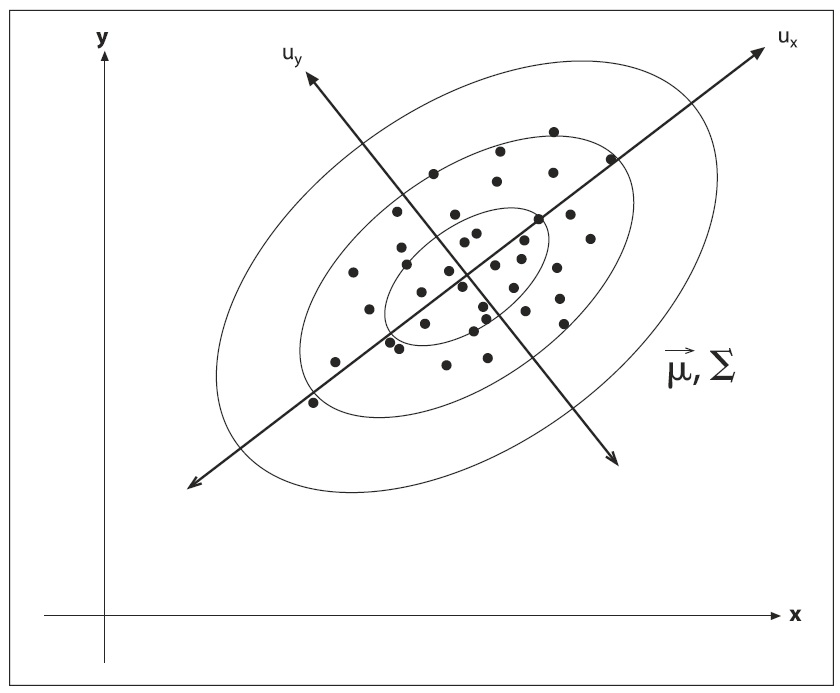

*cvMahalonobis()* вычисляется по следующей формуле:

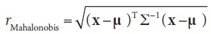

Вектор *vec1* соответствует *x*, а вектор *vec2* берется как среднее распределение. Матрица *mat* это обратная ковариационная матрица.

На практике, эта ковариационная матрица вычисляется при помощи функций *cvCalcCovarMatrix()* и *cvInvert()*. Хорошим тоном программирования считается использования метода *CV_SVD* для *cvInvert()*, потому что встречаются распределения, для которых одно из собственных чисел может быть равно нулю!

**cvMax и cvMaxS**
```cpp
	void cvMax(
		 const CvArr*	src1
		,const CvArr*	src2
		,CvArr*			dst
	);
	void cvMaxS(
		 const CvArr*	src
		,double 		value
		,CvArr* 		dst
	);
```

Функция *cvMax()* вычисляет максимальное значение каждой соответствующей пары пикселей из *src1* и *src2*. В функции *cvMaxS()* элементы *src* сравниваются с постоянным значением *value*. Если *mask != NULL*, то под вычисления попадают все элементы *dst*, соответствующие ненулевым элементам маски.

**cvMerge**
```cpp
	void cvMerge(
		 const CvArr*	src0
		,const CvArr*	src1
		,const CvArr*	src2
		,const CvArr*	src3
		,CvArr*			dst
	);
```

Функция *cvMerge()* выполняет обратную операцию по сравнению с функцией *cvSplit()*. Массивы *src0*, *src1*, *src2* и *src3* объединяются в массив *dst*. Конечно, *dst* должен быть того же типа и иметь размер как все исходные массивы, но при этом может иметь два, три или четыре канала. Исходные массивы могут быть объявлены как *NULL*.

**cvMin и cvMinS**
```cpp
	void cvMin(
		 const CvArr*	src1
		,const CvArr*	src2
		,CvArr*			dst
	);
	void cvMinS(
		 const CvArr*	src
		,double 		value
		,CvArr* 		dst
	);
```

Функция *cvMin()* вычисляет минимальное значение каждой соответствующей пары пикселей из *src1* и *src2*. В функции *cvMinS()* элементы *src* сравниваются с постоянным значением *value*. Если *mask != NULL*, то под вычисления попадают все элементы *dst*, соответствующие ненулевым элементам маски.

**cvMinMaxLoc**
```cpp
	void cvMinMaxLoc(
		 const CvArr*	arr
		,double* 		min_val
		,double* 		max_val
		,CvPoint* 		min_loc	= NULL
		,CvPoint* 		max_loc	= NULL
		,const CvArr*	mask	= NULL
	);
```

Эта функция находит минимальное и максимальное значения массива *arr* и (необязательно) возвращает их расположение. Вычисленные значения расположения максимального и минимального помещаются в *max_loc* и *min_loc* соответственно. необязательно, но возможно задать расположение этих экстемумов, если *min_loc != NULL* и *max_loc != NULL*. Если *mask != NULL*, то под вычисления попадают все элементы *arr*, соответствующие ненулевым элементам маски. Функция *cvMinMaxLoc()* может обрабатывать только одноканальные массивы, поэтому для обработки многоканального массива необходимо использовать функцию *cvSetCOI()*, что бы выделить конкретно интересующий канал. 

**cvMul**
```cpp
	void cvMul(
		 const CvArr*	src1
		,const CvArr*	src2
		,CvArr*			dst
		,double			scale = 1
	);
```

Функция *cvMul()* поэлементно перемножает все элементы *src1* и *src2* и помещает результат в *dst*. Если *mask != NULL*, то под вычисления попадают все элементы *dst*, соответствующие ненулевым элементам маски. Отсутствие функции *cvMulS()* объясняется наличием функций *cvScale()* и *cvCvtScale()*.

Необходимо понимать, что данная функция выполняет простое поэлементное перемножение матриц. Для получения обобщенной матрицы перемножения необходимо использовать функцию *cvGEMM()*.

**cvNot**
```cpp
	void(
		 const CvArr*	src
		,CvArr*			dst
	);
```

Функция *cvNot()* инвертирует каждый бит в каждом элементе *src* и помещает результат в *dst*. Таким образом для 8-битного изображения значению *0x00* будет соответствовать *0xff*, а *0x83* - *0x7c*.

**cvNorm**
```cpp
	double cvNorm(
		const CvArr*	arr1
		const CvArr*	arr2 		= NULL
		int 			norm_type	= Cv_L2
		const CvArr*	mask		= NULL
	);
```

эта функция может быть использована для вычисления обобщенной нормы массива *src1*, а также расстояние нормы относительной разницы между двумя массивами *src1* и *src2*. Для первого случая, норма вычисляется по формулам из таблицы 3-9. 

Таблица 3-9. Вычисление нормы при разнличных norm_type и src2 = NULL

| norm_type | Результат |
| -- | -- |
| CV_C |  |
| CV_L1 | 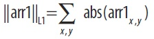 |
| CV_L2 | 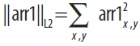 |

Если второй аргумент *arr2* не NULL, то норма вычисляется как разностная норма, т.е. что-то вроде расстояния между двумя массивами. В первых трех случаях, как показано в таблице 3-10, норма является абсолютной, в последних трех случаях она масштабируется по величине второго массива *arr2*. 

Таблица 3-10. Вычисление нормы при разнличных norm_type и src2 != NULL

| norm_type | Результат |
| -- | -- |
| CV_C | 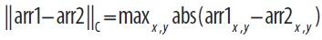 |
| CV_L1 | 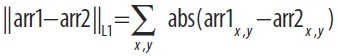 |
| CV_L2 | 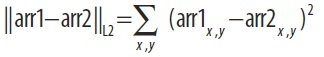 |
| CV_RELATIVE_C | 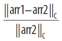 |
| CV_RELATIVE_L1 | 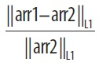 |
| CV_RELATIVE_L2 | 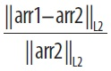 |

Во всех случаях, *arr1* и *arr2* должны быть одного размера и иметь одинаковое количество каналов. При наличии более одного канала, норма вычисляется одновременно по всем каналам (т.е. суммирование в таблицах 3-9 и 3-10 происходит не только по *x* и *y*, но и по каналам тоже). 

**cvNormalize**
```cpp
	void cvNormalize(
		 const CvArr*	src
		,CvArr*			dst
		,double			a 			= 1.0
		,double			b 			= 0.0
		,int 			norm_type 	= CV_L2
		,const CvArr*	mask		= NULL
	);
```

Как и многие другие функции OpenCV, *cvNormalize()* делает больше, чем кажется на первый взгляд. В зависимости от величины *norm_type*, нормализуется изображение *src*, иначе отображается в определенном диапазоне в *dst*. Все возможные значения *norm_type* приведены в таблице 3-11. 

Таблица 3-11. Возможные значения norm_type

| norm_type | Result |
| -- | -- |
| CV_C | 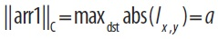 |
| CV_L1 | 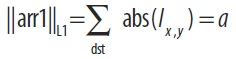 |
| CV_L2 | 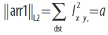 |
| CV_MINMAX | Map into range [a, b] |

В случае *CV_C*, массив *src* будет масштабироваться таким образом, что наибольшее значение абсолютной величины равно *a*. В случае *CV_L1* и *CV_L2*, массив *src* будет масштабироваться таким образом, что норма будет равна *a*. Если *norm_type* установлен в *CV_MINMAX*, то значения массива масштабируются и транслируются таким образом, что они линейно отображаются в промежутке *[a;b]*.

Если *mask != NULL*, то под вычисления попадают все элементы, соответствующие ненулевым элементам маски.

**cvOr и cvOrS**
```cpp
	void cvOr(
		 const CvArr*	src1
		,const CvArr*	src2
		,CvArr*			dst
		,const CvArr*	mask = NULL
	);
	void cvOrS(
		 const CvArr*	src
		,CvScalar		value
		,CvArr*			dst
		,const CvArr*	mask = NULL
	);
```

Эти две функции применяют побитовою операцию *OR* к массиву *src1*. В случае *cvOr()*, каждый элемент *dst* вычисляется как побитовая операция *OR* между двумя элементами *src1* и *src2*. В случае *cvOrS()*, операция производится между *src1* и *value*. Если *mask != NULL*, то под вычисления попадают все элементы, соответствующие ненулевым элементам маски.

Поддерживаются все типы данных, но *src1* и *src2* должны быть одинакового типа. 

**cvReduce**
```cpp
	CvSize cvReduce(
		 const CvArr*	src
		,CvArr*			dst
		,int 			dim
		,int 			op  = CV_REDUCE_SUM
	);
```

Сокращение является систематическим преобразованием входной матрицы *src* в вектор *dst*, применяя некоторую комбинацию правил *op* к каждой строке (или столбцу) и их соседу, пока не остнется только одна строка (или один столбец)(таблица 3-12). Аргумент *op* управляет сокращением (таблицf 3-13).

Таблица 3-12. Выбор операции сокращения

| Значение op | Результат |
| -- | -- |
| CV_REDUCE_SUM | Вычисление суммы по векторам |
| CV_REDUCE_AVG | Вычисление среднего по векторам |
| CV_REDUCE_MAX | Вычисление максимума по векторам |
| CV_REDUCE_MIN | Вычисление минимума по векторам |

Таблица 3-13. Аргумент dim для контроля направления сокращения

| Значение dim | Результат |
| -- | -- |
| +1 | Свернуть в одну строку |
| 0 | Свернуть в один столбец |
| -1 | Свернуть соответствующе dst |

*cvReduce()* поддерживает многоканальные массивы вещественного типа. Также возможно использовать типы с более высокой точностью для *dst*, чем у *src*. Это прежде всего относится к *CV_REDUCE_SUM* и *CV_REDUCE_AVG*, где возможны проблемы с переполнением. 

**cvRepeat**
```cpp
	void cvRepeat(
		 const CvArr* 	src
		,CvArr* 		dst
	);
```

Эта функция копирует содержимое *src* в *dst*, повторяя операцию столько раз, сколько потребуется для заполнения *dst*. В частности, *dst* может быть любого размера относительно *src*. 


**cvScale**
```cpp
	void cvScale(
		 const CvArr*	src
		,CvArr* 		dst
		,double 		scale
	);
```

Функция *cvScale()* на самом деле макрос функции *cvConvertScale()*, который устанавливает аргумент *shift = 0.0*. Таким образом, она может быть использована, чтобы изменять масштаб содержимого массива и для преобразования из одного вида типа данных в другой. 

**cvSet и cvSetZero**
```cpp
	void cvSet(
		 CvArr* 		arr
		,CvScalar		value
		,const CvArr*	mask = NULL
	);
```

Эта функция устанавливает все значения во всех каналах массива в значение *value*. Функция *cvSet()* принимает необязятельный аргумент *mask*: если маска задано, то операции подвергаются лишь те элементы *arr*, которые соответствуют ненулевым значениях маски. Функция *cvSetZero()* просто синоним функции *cvSet(arr, 0.0)*. 

**cvSetIdentity**
```cpp
	void cvSetIdentity( CvArr* arr );
```

Функция *cvSetIdentity()* устанавливает все элементы массива в 0 за исключением элементов, у которых строки и столбцы равны; эти элементы равны 1. Функция поддерживает все типы данных, а также не требует, чтобы массив был квадратным. 

**cvSolve**
```cpp
	int cvSolve(
		 const CvArr*	src1
		,const CvArr*	src2
		,CvArr*			dst
		,int 			method = CV_LU
	);
```

Функция *cvSolve()* обеспечивает быстрый способ для решения систем линейных уравнений, основанный на использовании функции *cvInvert()*. Вычисления производятся по следующей формуле:

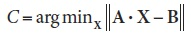

где A квадратная матрица *src1*, *B* вектор *src2* и *C* результат решения *cvSolve()* для лучшего найденного вектора *X*. Лучший вектор *X* помещается в *dst*. Поддерживаются теже методы *method*, что и в *cvInvert()* (описаны ранее); только поддерживаются вещественные типы данных. Функция возвращает целое число; 0 означает, что решение может быть найдено. 

Стоит отметить, что *cvSolve()* может быть использована для решения переопределенных систем линейных уравнений. Данная система будет решена псевдообратно, используя метод *SVD* для поиска решения наименьших квадратов для системы линейных уравнений. 

**cvSplit**
```cpp
	void cvSplit(
		 const CvArr*	src
		,CvArr*			dst0
		,CvArr*			dst1
		,CvArr*			dst2
		,CvArr*			dst3
	);
```

Иногда возникают моменты, в которые неудобно работать с многоканальными изображениями. В таких случаях следует использовать функцию *cvSplit()*, что бы скопировать каждый канал в отдельное одноканальное изображение. Исходное изображение *src* разбивается на *dst0*, *dst1*, *dst2*, *dst3* по мере необходимости. Конечные изображдения должны соответствовать исходному изображению по размеру и типу данных, но при этом, конечно, должны быть одноканальными.

Если исходное изображение имеет менее четырех каналов (зачастую это так), то ненужным аргументам будет присвоено NULL.

**cvSub, cvSubS и cvSubRS**
```cpp
	void cvSub(
		 const CvArr*	src1
		,const CvArr*	src2
		,CvArr*			dst
		,const CvArr*	mask = NULL
	);

	void cvSubS(
		 const CvArr*	src
		,CvScalar		value
		,CvArr*			dst
		,const CvArr*	mask = NULL
	);

	void cvSubRS(
		const CvArr*	src
		CvScalar		value
		CvArr*			dst
		const CvArr*	mask = NULL
	);
```

Функция *cvSub* выполняет поэлементное вычитание одного массива *src1* из другого *src2* и помещает результат в *dst*. Если *mask != NULL*, то под вычисления попадают все элементы, соответствующие ненулевым элементам маски. *src1*, *src2* и *dst* должны быть одного типа, размера и иметь одинаковое количество каналов; если задествован параметр *mask*, то это должен быть 8-битный массив того же размера и с тем же количеством каналов, что и *dst*.

Функция *cvSubS* выполняет поэлементное вычитание из массива *src* значения *value* и помещает результат в *dst*. 

Функция *cvSubRS* выполняет вычитание из значения *value* элементов массива *src* и помещает результат в *dst*. 

**cvSum**
```cpp
	CvScalar cvSum(
		CvArr*	arr
	);
```

Функция *cvSum()* суммирует все элементы во всех каналах массива *arr*. Функция возвращает значение типа *CvScalar* - это означает, что существует возможность обрабатывать многоканальные массивы. В этом случае сумма для каждого канала помещается в соответствующий компонент *CvScalar*.

**cvSVD**
```cpp
	void cvSVD(
		 CvArr*	A
		,CvArr*	W
		,CvArr*	U 		= NULL
		,CvArr*	V 		= NULL
		,int 	flags	= 0
	);
```

Сингулярное разложение (SVD) является разложением матрицы A размера mxm вида:

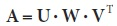

где **W** диагональная матрица, а **U** размера mxm и **V** размера nxn унитарные матрицы. Конечно матрица **W** имеет размер mxn, при этом "диагональность" не означает, что элементы строк или стобцов раны 0. Поскольку **W** обязательно диагональная, OpenCV позволяет быть ей либо mxn, либо nx1 (в этом случае вектор будет содержать только диагональные "особые" значения). 

Матрицы **U** и **V** являются необязательными для *cvSVD()* (!) и если они остаются установленными в NULL, то значение не будет возвращено (!). Завершающий аргумент *flags* может быть либо одним из трех возможных вариантов, либо сразу всеми (таблица 3-14). 

Таблица 3-14. Возможные варианты флага

| Флаг | Значение |
| -- | -- |
| CV_SVD_MODIFY_A | Позволяет модифицировать матрицу A |
| CV_SVD_U_T | Возвращает 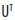 вместо U |
| CV_SVD_V_T | Возвращает 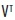 вместо V |

**cvSVBkSb**
```cpp
	void cvSVBkSb(
		 const CvArr*	W
		,const CvArr*	U
		,const CvArr*	V
		,const CvArr*	B
		,CvArr* 		X
		,int 			flags = 0
	);
```

Как правило, не так часто потребуется вызывать эту функцию напрямую. В сочетании с *cvSVD()*, эта функция лежит в основе SVD-методов для *cvInvert()* и *cvSolve()*. Но никто не запрещает работать без "посредников" и писать свои собственные функции инверсии (в ряде случаев это спасет от использования памяти для временных матриц внутри *cvInvert()* и *cvSolve()*).

Функция *cvSVBkSb()* вычисляет обратную матрицу для матрицы **A**, представленной в виде разложения матриц **U**, **W**, и **V**. Результирующая матрица **X** получается по формуле: 

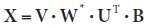

Матрица **B** является необязательной и если будет задана как NULL, то будет проигнорирована. Диагональные элементы матрицы **W*** вычисляются по формуле 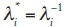 для 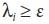. Значение *ε* является порогом, это довольно таки маленькое число и как правило пропорционально сумме диагональных элементов **W** (т.е. 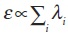).

**cvTrace**
```cpp
	CvScalar cvTrace( const CvArr* mat );
```

След матрицы это сумма всех диагональных элементов. Поддерживаются многоканальные массивы, но тогда массив *mat* должен быть вещественного типа.

**cvTranspose и cvT**
```cpp
	void cvTranspose(
		 const CvArr*	src
		,CvArr* 		dst
	);
```

Функция *cvTranspose()* копирует каждый элемент *src* в *dst* в место, соответствующее перевернутым значениям строки и столбца. Данная функция не поддерживает многоканальные массивы; однако, если используется несколько каналов представленных комплексными числами, помните, что *cvTranspose()* не делает комплексное сопряжение (быстрое выполнение этой задачи выполняется с помощью *cvXorS*). Макрос *cvT()* просто сокращение для *cvTranspose()*.

**cvXor и cvXorS**
```cpp
	void cvXor(
		 const CvArr*	src1
		,const CvArr*	src2
		,CvArr* 		dst
		,const CvArr*	mask = NULL
	);
	void cvXorS(
		 const CvArr*	src
		,CvScalar		value
		,CvArr*			dst
		,const CvArr*	mask = NULL
	);
```

Эти две функции вычисляют операцию побитового **XOR** для массива *src1*. В случае *cvXor()* каждый элемент *dst* вычисляетс якак побитовое исключающее двух соответствующих элементов *src1* и *src2*. В случае *cvXorS()*, побитовое исключающее **XOR** вычисляется с постоянным значением *value*. Если *mask != NULL*, то под вычисления попадают все элементы, соответствующие ненулевым элементам маски.

**cvZero**
```cpp
	void cvZero( CvArr* arr );
```

Эта функция устанавливает все значения во всех каналах массива в 0.