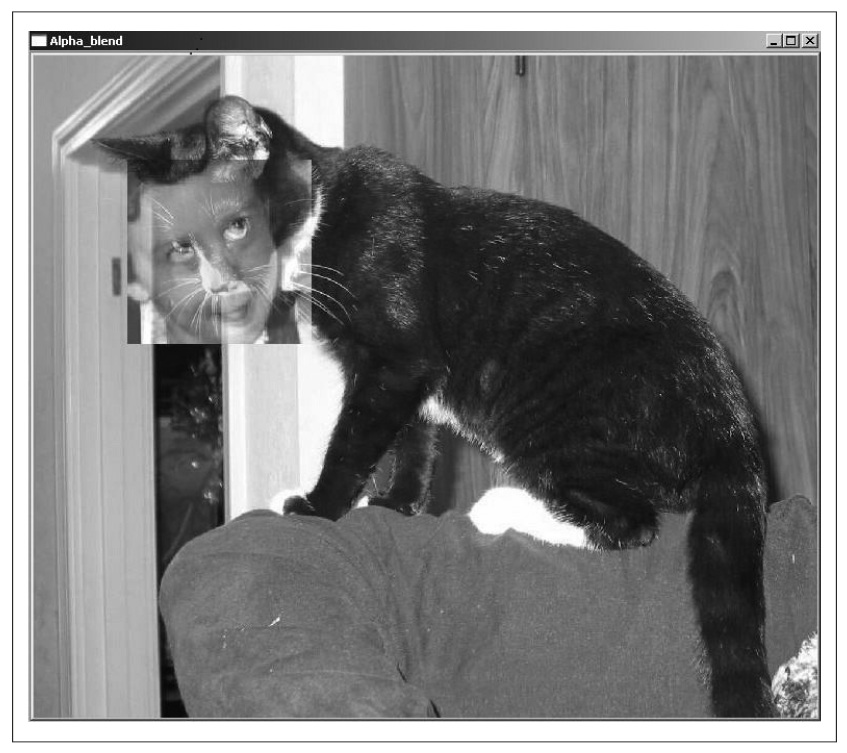
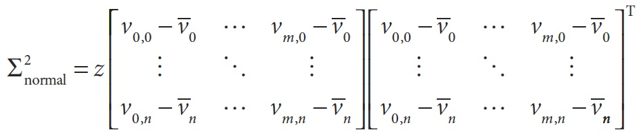
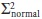
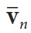
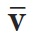
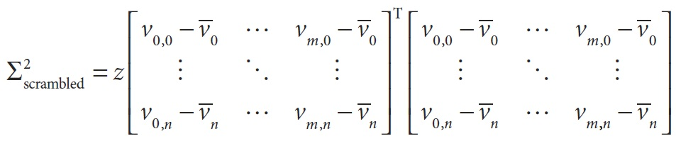

## ## [П)|(РС)|(РП) Операции над матрицами и изображениями

В таблице 3-3 перечислены различные процедуры манипуляции с матрицами, многие из которых также хорошо работают и с изображениями. Они выполняют такие "обычные" вещи, как приведение к диагональной форме и транспонирование матрицы, а также некоторые более сложные операции, такие как вычисление статистики изображения.

Таблица 3-3. Базовые операции

| Функция | Описание |
| -- | -- |
| cvAbs | Абсолютное значение всех элементов матрицы |
| cvAbsDiff | Абсолютное значение разницы между двумя элементами матрицы |
| cvAbsDiffS | Абсолютное значение разницы между элементом матрицы и скаляром |
| cvAdd | Поэлементное складывание двух матриц |
| cvAddS | Поэлементное складывание элементов матрицы и скаляра |
| cvAddWeighted | Поэлементное взвешенное складывание двух матриц (альфа-смешивание) |
| cvAvg | Среднее значение всех элементов матрицы |
| cvAvgSdv | Абсолютное значение стандартного отклонения всех элементов матрицы |
| cvCalcCovarMatrix | Вычисление ковариации набора n-мерных векторов |
| cvCmp | Применение выбранной операции сравнения для всех элементов в двух матрицах |
| cvCmpS | Применение выбранной операции сравнения отношения матрицы и скаляра |
| cvConvertScale | Изменение типа матрицы с изменением масштаба |
| cvConvertScaleAbs | Изменение типа матрицы с абсолютными значениями с изменением масштаба |
| cvCopy | Копирование элементов из одной матрицы в другую |
| cvCountNonZero | Количество ненулевых элементов матрицы |
| cvCrossProduct | Вычисление векторного произведения двух трехмерных векторов |
| cvCvtColor | Преобразование каналов матрицы из одного цветового пространства в другое |
| cvDet | Вычисление определителя квадратной матрицы |
| cvDiv | Поэлементное деление одной матрицы на другую |
| cvDotProduct | Вычисление скалярного произведения двух векторов |
| cvEigenVV | Вычисление собственных чисел и собственных векторов квадратной матрицы |
| cvFlip | Обратный порядок матрицы по выбранной оси |
| cvGEMM | Обобщенная матрица умножения |
| cvGetCol | Копирование элементов колонки частичной матрицы |
| cvGetCols | Копирование элементов из нескольких соседних столбцов матрицы |
| cvGetDiag | Копирование элементов из диагональной матрицы |
| cvGetDims | Возвращает количество измерений матрицы |
| cvGetDimSize | Возвращает размеры всех измерений матрицы |
| cvGetRow | Копирование элементов строки частичной матрицы |
| cvGetRows | Копирование элементов из нескольких соседних строк матрицы |
| cvGetSize | Получение размера двумерной матрицы и возвращение в виде CvSize |
| cvGetSubRect | Копирование элементов из выделенного региона изображения |
| cvInRange | Тестирование попадания элементов матрицы в пределы значений двух других матриц |
| cvInRangeS | Тестирование попадания элементов матрицы между двумя скалярами |
| cvInvert | Невырожденная матрица |
| cvMahalanobis | Вычисление расстояния Махаланобиса между двумя векторами |
| cvMax | Поиск максимального значения, среди двух матриц |
| cvMaxS | Поиск максимального значения, среди матрицы и скаляра |
| cvMerge | Слияние нескольких одноканальных изображений в одно многоканальное |
| cvMin | Поиск минимального значения, среди двух матриц |
| cvMinS | Поиск минимального значения, среди матрицы и скаляра |
| cvMinMaxLoc | Поиск максимального и минимального значения матрицы |
| cvMul | Поэлементное перемножение двух матриц |
| cvNot | Побитовое инвертирование всех элементов матрицы |
| cvNorm | Вычисление (!) нормальной корреляционной функции (Normalized cross-correlation) (!) между двумя матрицами |
| cvNormalize | Нормализация элементов массива до некоторого значения |
| cvOr | Поэлементная побитовая операция OR между двумя матрицами |
| cvOrS | Поэлементная побитовая операция OR между матрицей и скаляром |
| cvReduce | Преобразование двумерной матрицы в вектор |
| cvRepeat | Заполнение выходной матрицы копиями входной матрицы |
| cvSet | Установка всех элементов матрицы в заданное значение |
| cvSetZero | Установка всех элементов матрицы в 0 |
| cvSetIdentity | Установка диагональных элементов матрицы в 1, остальных в 0 |
| cvSolve | Решение системы линейных уравнений |
| cvSplit | Разделение многоканального изображения на несколько одноканальных |
| cvSub | Поэлементное вычитание одной матрицы из другой |
| cvSubS | Поэлементное вычитание скаляра из матрицы |
| cvSubRS | Поэлементное вычитание матрицы из скаляра |
| cvSum | Суммирование всех элементов матрицы |
| cvSVD | Вычисление сингулярного разложения двумерной матрицы |
| cvSVBkSb | Вычисление сингулярного разложения методом обратной замены |
| cvTrace | Вычисление следа матрицы |
| cvTranspose | Транспонирование всех элементов матрицы через диагональ |
| cvXor | Поэлементная битовая операция XOR между двумя матрицами |
| cvXorS | Поэлементная битовая операция XOR между матрицей и скаляром |
| cvZero | Установка всех элементов матрицы в 0 |

**cvAbs, cvAbsDiff, and cvAbsDiffS**
```cpp
	void cvAbs(
		 const CvArr* 	src
		,const 			dst
	);

	void cvAbsDiff(
		 const CvArr*	src1
		,const CvArr*	src2
		,const 			dst
	);

	void cvAbsDiffS(
		 const CvArr*	src
		,CvScalar		value
		,const 			dst
	);
```

Функция *cvAbs()* вычисляет абсолютные значения элементов *src* и запиcывает результат в *dst*. Функция *cvAbsDiff()* сначала вычисляет разницу между *src2* и *src1* и потом записывает абсолютное значение  в *dst*. Функция *cvAbsDiffS()* делает почти тоже самое, что и *cvAbsDiff()*, только разница находится между элементами *src* и значением скаляра *value*.

**cvAdd, cvAddS, cvAddWeighted и альфа-смешивание**
```cpp
	void cvAdd(
		 const CvArr* 	src1
		,const CvArr* 	src2
		,CvArr* 		dst
		,const CvArr* 	mask = NULL
	);

	void cvAddS(
		 const CvArr* 	src
		,CvScalar 		value
		,CvArr* 		dst
		,const CvArr* 	mask = NULL
	);

	void cvAddWeighted(
		 const CvArr*	src1
		,double 		alpha
		,const CvArr*	src2
		,double 		beta
		,double 		gamma
		,CvArr* 		dst
	);
```

Функция *cvAdd()* складывает все элементы из *src1* с элемнтами из *src2* и кладет результат в *dst*. Если *mask* не NULL, тогда некоторые элементы *dst* останутся неизменными там, где элемент масrи равен 0. Функция *cvAddS()* делает почти тоже самое, что и *cvAdd()*, за исключением того, что значение скаляра добавляется к каждому элементу *src*. 

Функция *cvAddWeighted()* аналогична *cvAdd()* за исключением того, что результат записывается в *dst* и вычисляется по формуле:
	
	dst(x,y) = α ⋅ src1(x,y) + β ⋅ src2(x,y) + γ

Эта функция может быть использована для реализации альфа-смешивания. Функция принимает два источника изображения *src1* и *src2*. Эти изображения могут быть различного типа, при этом оба изображения одинакового типа. Они также могут быть одноканальными и трехканальными (серыми или цветными), при этом оба изображения с одинаковым кол-вом каналов. Результирующее изображение *dst* также должно быть тогоже типа, что и исходные изображения. Исходные изображения могут быть разных размеров. поэтому предварительно нужно согласовать этот момент при помощи ROI, иначе OpenCV выдаст ошибку. Параметр *alpha* альфа смешивания относится к *src1*, а *beta* бетта смешивания к *src2*. Уравнение альфа смешивания:

	dst(x,y) = α ⋅ src1(x,y) + β ⋅ src2(x,y) + γ

Стандартное уравнение альфа смешивания получается путем выбора *α* между 0 и 1, *β=1-α*, *γ=0*:

	dst(x,y) = α ⋅ src1(x,y) + (1−α) ⋅ src2(x,y)

В общем случаи, требуется, чтобы ** и ** были более 0 и меньше 1; ** может быть установлена в зависимости от среднего или максимального значения изображения для увеличения масштаба пикселей. 

Пример 3-14. Альфа смешивание, смещение ROI в src2 (0,0), в src1 (x,y)
```cpp
#include <cv.h>
#include <highgui.h>

int main(int argc, char** argv)
{
	IplImage *src1, *src2;
	
	// Проверка наличия изображений по указанным путям
	// Проверка необходимого кол-ва аргументов
	if ( 
		( argc == 9 ) && 
		( (src1=cvLoadImage(argv[1],1)) != 0 ) && 
		( (src2=cvLoadImage(argv[2],1)) != 0 )
	   )
	{
		int x = atoi(argv[3]);		// Смещение по оси x
		int y = atoi(argv[4]);		// Смещение по оси y
		int width = atoi(argv[5]);	// Ширина области ROI
		int height = atoi(argv[6]);	// Высота области ROI
		double alpha = (double)atof(argv[7]);	// Значение альфа
		double beta = (double)atof(argv[8]);	// Значение бетта
		
		// Установка области ROI
		// Примечание: отсутствует логика установки областей
		// 			   одинакового размера
		cvSetImageROI(src1, cvRect(x,y,width,height));
		cvSetImageROI(src2, cvRect(0,0,width,height));

		// src1 = src1
		// src2 = src2 
		// α = alpha
		// β = beta
		// γ = 0.0
		// dst = src1
		cvAddWeighted(src1, alpha, src2, beta, 0.0, src1);
		
		// Сброс ROI для src1
		cvResetImageROI(src1);
		cvNamedWindow( “Alpha_blend”, 1 );
		cvShowImage( “Alpha_blend”, src1 );
		
		cvWaitKey();
	}

	return 0;
}
```

Результат выполнения примера 3-14 представлен на рисунке 3-4.


Рисунок 3-4. Лицо ребенка альфа смешано с лицом кошки

**cvAnd и cvAndS**
```cpp
	void cvAnd(
		 const CvArr*	src1
		,const CvArr*	src2
		,CvArr*			dst
		,const CvArr*	mask = NULL
	);

	void cvAndS(
		 const CvArr*	src1
		,CvScalar		value
		,CvArr*			dst
		,const CvArr*	mask = NULL
	);
```

Эти две функции вычисляют побитовое *AND* на массиве *src1*. В случае *cvAdd()* каждый элемент *dst* вычисляется как побитовое *AND* двух соответствующих элементов *src1* и *src2*. В случае *cvAndS* побитовое *AND* вычисляется с значением скаляра. Если *mask != NULL*, то элементы *dst* соответствуют ненулевым элементам маски.

*src1* и *src2* должны быть любого одинакового типа данных. (!) Если элементы вещественного типа, то результат тоже будет состоять из элементов вещественного типа. (!)

**cvAvg**
```cpp
	CvScalar cvAvg(
		 const CvArr*	arr
		,const CvArr*	mask = NULL
	);
```

Функция *cvAvg()* вычисляет среднее значение пикселей в *arr*. Если *mask != NULL*, то среднее будет рассчитано только на тех пикселях, для которых соответствующее значение маски отлично от нуля. 

В настоящее время функция является устаревшим псевдонимом *cvMean()*.

**cvAvgSdv**
```cpp
	cvAvgSdv(
		 const CvArr*	arr
		,CvScalar*		mean
		,CvScalar*		std_dev
		,const CvArr*	mask = NULL
	);
```

Эта функция похожа на *cvAvg()*, но в дополнение к ней вычисляет еще стандартное отклонение.

В настоящее время функция является устаревшим псевдонимом *cvMean_StdDev()*.

**cvCalcCovarMatrix**
```cpp
	void cvAdd(
		 const CvArr**	vects
		,int 			count
		,CvArr* 		cov_mat
		,CvArr*			avg
		,int 			flags
	);
```

Учитывая любое количество векторов, *cvCalcCovarMatrix()* вычисляет среднее и матрицу ковариаций для аппроксимации гауссового распределения. Это может пригодится при решенире множества задач, на этот случай в OpenCV есть специальные флаги, которые помогут при решении конкретной задачи (таблица 3-4). Возможно объединение нескольких флагов с использованием логической операции *OR*. 

Таблица 3-4. Возможные варианты флагов *cvCalcCovarMatrix()*

| Наименование флага | Значение |
| -- | -- |
| CV_COVAR_NORMAL | Среднее значение и ковариационная матрица |
| CV_COVAR_SCRAMBLED | Быстрый PCA (principal component analysis - метод главных компонент) |
| CV_COVAR_USE_AVERAGE | Использование вычисленного среднего значения |
| CV_COVAR_SCALE | Масштабирование матрици ковариаций |

Во всех случаях вектора представлены как массив массивов *vects* (т.е. указатель на список указателей на массивы). Матрица ковариаций будет размещена в *cov_mat*, а значение среднего *avg* будет зависить от флага (таблица 3-4).

Флаги *CV_COVAR_NORMAL* и *CV_COVAR_SCRAMBLED* являются взаимоисключающими; совместное использование не допустимо. В случае *CV_COVAR_NORMAL* функция вычисляет среднее значение  матрицу ковариаций.



Таким образом нормальная ковариация  вычисляется из *m* векторов длиной *n*, где  - определяет *n*-ый элемент среднего вектора . Результирующая ковариационная матрица имеет размерность *nxn*. Коэффициент *z* является необязательным масштабным коэффициентом; он будет равен 0, если не использовать флаг *CV_COVAR_SCALE*.

В случае *CV_COVAR_SCRAMBLED* функция *cvCalcCovarMatrix()* вычисляет матрицу ковариаций по следующей формуле:



