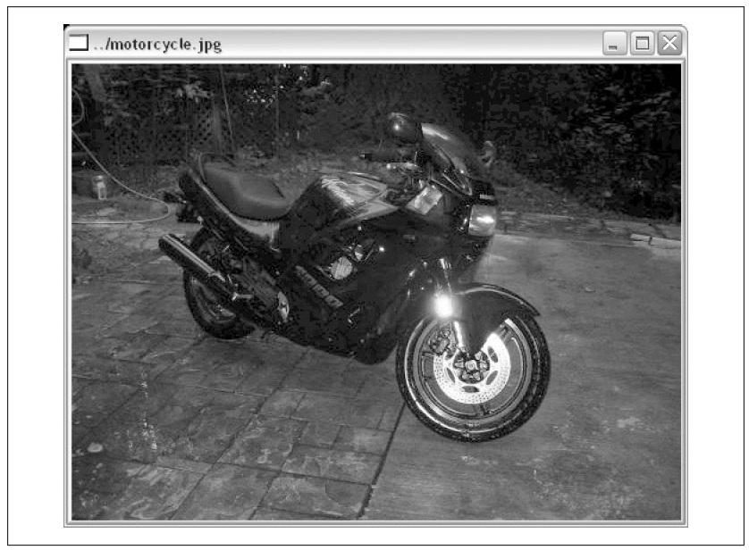

## (П]|(РС)|(РП) Отображение изображения

Теперь рассмотрим функцию при помощи которой можно отобразить изображение в ранее созданом окне. Для этого используется функция *cvShowImage()*: 

```cpp
	void cvShowImage(
		 const char* 	name
		,const CvArr* 	image
	);
```

Первый аргумент - имя окна, в котором отображается изображение, второй - указатель на изображение. 

Рассмотрим небольшой пример программы, которая отобразит изображене на экране. Вся программа занимает всего 25 строк, включая загрузку изображения, комментарии и очистку памяти.

```cpp
	int main(int argc, char** argv)
	{
		// Создание окна с таким же именем, как и у загружаемого файла изображения
		cvNamedWindow( argv[1], 1 );

		// Загрузка изображения
		IplImage* img = cvLoadImage( argv[1] );
		
		// Отображение изображения
		cvShowImage( argv[1], img );
		
		// Ожидание нажатия клавиши "Esc"
		while( 1 ) {
			if( cvWaitKey( 100 ) == 27 ) break;
		}

		// Очистка памяти
		cvDestroyWindow( argv[1] );
		cvReleaseImage( &img );
		
		exit(0);
	}
```

Для более удобного восприятия результата, получаемого в результате выпонения программы, окну присвоено имя загружаемого файла изображения (рисунок 4-1).



Рисунок 4-1. Отображение изображения при помощи функции CvShowImage()

Прежде, чем двигаться дальше, рассмотрим ещё несколько функций для работы с окнами:

```cpp
	void cvMoveWindow( const char* name, int x, int y );
	void cvDestroyAllWindows( void );
	int cvStartWindowThread( void );
```

*cvMoveWindow()* перемещает окно таким образом, чтобы его верхний левый угол располагался в точке *x*, *y*.

*cvDestroyAllWindows()* очень полезная функция, которая закрывает все окна и очищает всю занимаемую ими память. 

В Linux и MacOS имеется функция *cvStartWindowThread()*, создающая поток, который автоматически обновлает все связанные с окном события. Функция возвращает 0, если не получается запустить ни одного потока; например, при отсутствие поддержки данной функции в используемой версии OpenCV. Если не создавать окно в отдельном потоке, тогда OpenCV сможет реагировать на действия пользователя только в определенные моменты времени (например, когда вызывается функция *cvWaitKey()*).

### WaitKey

Функция *cvWaitKey()* заставляет ожидать определенное количество миллисекунд, пока пользователь не нажмет любую клавишу. Если в течении отведенного времени будет нажата клавиша, то функция вернет код нажатой клавиши, иначе вернет 0. 

```cpp
	while( 1 ) {
		if( cvWaitKey(100) == 27 ) break;
	}
```

Функция *cvWaitKey()* ожидает нажатия клавиши 100 мс. Если ASCII код нажатой клавиши равен 27 (клавиша *Esc*), то выполнение цикла прекратиться. Данной подход позволяет задержать показ окна, пока не будет нажата клавиша *Esc*. 

Если в качестве аргумента функции *cvWaitKey()* передать 0, то ожидание будет продолжаться неопределенное количество времени, до момента нажатия любой клавиши. В предыдущем примере можно было бы использовать и *cvWaitKey(0)*. Разница между этимим двумя вариантами становится более очевидной при обработки видео.

### События мыши

Теперь, когда уже есть знания по загрузке и отображении изображения, а также обработке событий от клавиши клавиатуры, можно перейти к обработке событий мыши.

В отличии от событий клавиатуры, события от мыши обрабатываются более типичным образом - при помощи механизма обратного вызова. Это означает, что необходимо писать функции обратного вызова, что бы обработать щелчки мыши. Функция обратного вызова подлежит регистрации в OpenCV, тем самым информируя OpenCV, что данная функция обрабатывает события мыши над конкретным окном.

Функцией обратного вызова может быть любая функция, которая принимает правильный набор аргументов и возвращает правильный тип. Точный прототип функции обратного вызова выглядит следующим образом:

```cpp
	void CvMouseCallback(
		 int 	event
		,int 	x
		,int 	y
		,int 	flags
		,void*	param
	);
```

При вызове данной функции OpenCV будет заполнять аргументы соответствующимим значениями. Первый аргмент *event* - событие будет иметь одно из значений, указанных в таблице 4-1.

Таблица 4-1. Типы событий мыши

| Событие | Числовое значение |
| -- | -- |
| CV_EVENT_MOUSEMOVE | 0 |
| CV_EVENT_LBUTTONDOWN | 1 |
| CV_EVENT_RBUTTONDOWN | 2 |
| CV_EVENT_MBUTTONDOWN | 3 |
| CV_EVENT_LBUTTONUP | 4 |
| CV_EVENT_RBUTTONUP | 5 |
| CV_EVENT_MBUTTONUP | 6 |
| CV_EVENT_LBUTTONDBLCLK | 7 |
| CV_EVENT_RBUTTONDBLCLK | 8 |
| CV_EVENT_MBUTTONDBLCLK | 9 |

Второй и третий аргументы устанавливают координаты места события мыши. Стоит отметить, что эти координаты представляют собой пиксель на изображение независимо от размера окна.

Четвертый аргумент *flags* - это битовое поле, в котором отдельные биты указывают на особые условия, присутствующие на момент события. Например, флаг *CV_EVENT_FLAG_SHIFTKEY*, имеющий числовое значение 16 (т.е. 5 бит), проверяет нажатие *shift*. Можно использовать сочетание нескольких флагов при помощи операции *AND*. Полный список флагов представлен в таблице 4-2.

Таблица 4-2. Флаги для событий мыши

| Флаг | Числовое значение |
| -- | -- |
| CV_EVENT_FLAG_LBUTTON | 1 |
| CV_EVENT_FLAG_RBUTTON | 2 |
| CV_EVENT_FLAG_MBUTTON | 4 |
| CV_EVENT_FLAG_CTRLKEY | 8 |
| CV_EVENT_FLAG_SHIFTKEY | 16 |
| CV_EVENT_FLAG_ALTKEY | 32 |

Последний аргумент - это указатель *void**, который может быть использован для передачи дополнительной информации в виде указателя на необходимую структуру. В общем случае, параметр *param* используется когда функция обратного вызова является статическим членом класса. 

Для регистрации функции обратного вызова используется функция *cvSetMouseCallback()*:

```cpp
	void cvSetMouseCallback(
		 const char* 		window_name
		,CvMouseCallback 	on_mouse
		,void* 				param 		= NULL
	);
```

Первый аргумент это имя окна, к которому будет прикреплена функция обратного вызова. Соответственно данная функция обратного вызова будет отслеживать только события связанные с этим окном. Вторым аргументом является функция обратного вызова. Третий аргумент позволяет указывать дополнительную информацию. Это тот самый *param*, о которм ранее шла речь. 

В примере 4-1 описана небольшая программа рисования прямоугольника при помощи мыши. Функция *my_mouse_callback()* реагирует на события мыши и определяет дальнейшие действия.

Пример 4-1. Игрушечная программа, использующая мышь для рисования прямоугольника

```cpp
#include <cv.h>
#include <highgui.h>

// Объявление прототипа функции обратного вызова для реагирования
// на события мыши
void my_mouse_callback( int event, int x, int y, int flags, void* param );

CvRect 	box;
bool 	drawing_box = false;

// Функция рисования прямоугольника на изображении
void draw_box( IplImage* img, CvRect rect ) {
	cvRectangle (
		 img
		,cvPoint(box.x,box.y)
		,cvPoint(box.x+box.width,box.y+box.height)
		,cvScalar(0xff,0x00,0x00) /* red */
	);
}

int main( int argc, char* argv[] ) {
	box = cvRect(-1,-1,0,0);
	IplImage* image = cvCreateImage(
		 cvSize(200,200)
		,IPL_DEPTH_8U
		,3
	);

	cvZero( image );
	IplImage* temp = cvCloneImage( image );
	cvNamedWindow( "Box Example" );

	// Регистрация функции обратного вызова
	// В качестве значения "param" передается изображение, 
	// которое функция обратного вызова будет обрабатывать	
	cvSetMouseCallback(
		 "Box Example"
		,my_mouse_callback
		,(void*) image
	);

	// Главный цикл. Вначале происходит копирование оригинального изображения
	// во временное "temp" изображение, и если пользователь рисует, тогда
	// прямоугольник помещается на временное изображение, отображается результат действий
	// на экране. Если после ожидания 15 мс не будет нажата необходимая для выхода из 
	// цикла клавиша происходит переход к следующей итерации
	while( 1 ) {
		cvCopyImage( image, temp );
		if( drawing_box ) draw_box( temp, box );
		cvShowImage( "Box Example", temp );
		if( cvWaitKey( 15 )==27 ) break;
	}

	// Освобождение занимаемой памяти
	cvReleaseImage( &image );
	cvReleaseImage( &temp );
	cvDestroyWindow( "Box Example" );
}

// Функция обратного вызова. Если пользователь нажмет левую клавишу
// мыши, активизируется функция рисования. Когда пользователь отпускает 
// эту калавишу, происходит добавление прямоугольника на текущее изображение.
// При перемещении мыши происходит изменение размеров прямоугольника
void my_mouse_callback( int event, int x, int y, int flags, void* param ){
	IplImage* image = (IplImage*) param;
	switch( event ) {
		case CV_EVENT_MOUSEMOVE: {
			if( drawing_box ) {
				box.width = x-box.x;
				box.height = y-box.y;
			}
		} break;
		case CV_EVENT_LBUTTONDOWN: {
			drawing_box = true;
			box = cvRect(x, y, 0, 0);
		} break;
		case CV_EVENT_LBUTTONUP: {
			drawing_box = false;
			
			if(box.width<0) {
				box.x+=box.width;
				box.width *=-1;
			}

			if(box.height<0) {
				box.y+=box.height;
				box.height*=-1;
			}

			draw_box(image, box);
		} break;
	}
}
```

### Sliders, Trackbars и Switches

В HighGUI ползунок именуется trackbar-ом. Это все потому, что в оригинальной (исторической) трактовке данный элемент используется для выбора конкретного кадра из видеопотока. При помощи данного элемента можно делать уже привычные вещи, связанные с ползунком, а так же еще и не обычные (будут рассмотрены в следующем разделе "No Buttons"). 

Как и в случае с окном, слайдер имеет уникальное имя (символьная строка), благодаря которому со слайдером можно производить различные манипуляции. Прототип функции создания слайдера:

```cpp
	int cvCreateTrackbar(
		 const char* 		trackbar_name
		,const char* 		window_name
		,int* 				value
		,int 				count
		,CvTrackbarCallback on_change
	);
```

Первые два аргумента задают имя слайдера и имя окна, к которому будет прикреплен создаваемый слайдер. После создания, слайдер будет добавлен в верхнюю или нижнюю часть окна; при этом он не будет перекрывать ранее добавленное изображение.

Следующие два аргумента: *value* - целочисленный указатель, указывающий позицию ползунка, *count* - максимальное значение ползунка. 

Последний аргумент указывает на функцию обратного вызова, которая автоматически вызывается при перемещении ползунка. Прототип функции обратного вызова:

```cpp
	void (*callback)( int position )
```

Если функция обратного вызова не требуется, то необходимо передать NULL. В этом случае эффект от использования ползунка заключается в перемещении ползунка в позицию *value*.

И в заключении, вот еще две функции, которые позволяют получать или устанавливать значение ползунка, зная его имя: 

```cpp
	int cvGetTrackbarPos(
		 const char*	trackbar_name
		,const char*	window_name
	);

	void cvSetTrackbarPos(
		 const char*	trackbar_name
		,const char*	window_name
		,int			pos
	);
```

Вызывать данные функции можно из любого места программы.

### No Buttons

К сожалению, HighGUI не обеспечивает явную поддержку для кнопок. Таким образом, общая практика преодоления данной проблемы заключается в использовании ползунка только в двух позициях. Другой вариант решения проблемы представлен в .../opencv/samples/c/ и заключается в использовании сочетании клавиш вместо кнопок (*floodfill* демо в исходниках OpenCV).

*Switches* (переключатель) это облегченный вариант слайдера, у которго только две позиции "on" (1) и "off" (0) (*count = 1*). Используя слайдер как кнопку, можно использовать функцию обратного вызова для автоматического сброса кнопки в 0 (пример 4-2) или же автоматического сброса в 0 других переключателей (эффект "радио-кнопок").

Пример 4-2. Использование слайдера как переключателя
```cpp
// Значение переключателя (глобальная переменная)
int g_switch_value = 0;

// Функция обратного вызова
void switch_callback( int position ) {
	if( position == 0 ) {
		switch_off_function();
	} 
	else {
		switch_on_function();
	}
}

int main( int argc, char* argv[] ) {
	// Создание окна
	cvNamedWindow( "Demo Window", 1 );
	
	// Создание слайдера с привязкой к окну
	// "Demo Window"
	cvCreateTrackbar(
		 "Switch"
		,"Demo Window"
		,&g_switch_value
		,1
		,switch_callback
	);

	// Ожидание нажатия кнопки Esc
	while( 1 ) {
		if( cvWaitKey(15)==27 ) break;
	}
}
```