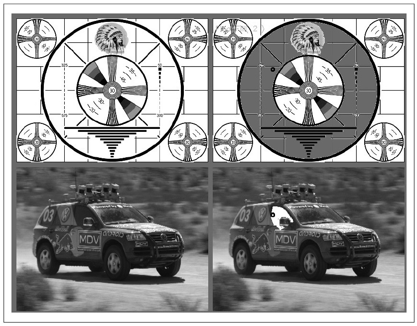
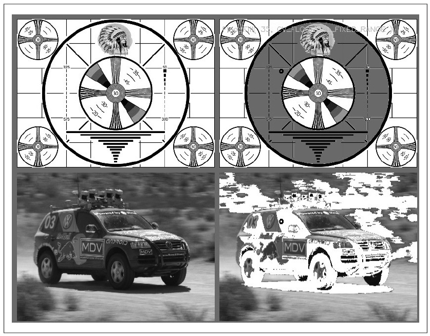

## (П]|(РС)|(РП) Заливка

Заливка - чрезвычайно полезная функция, которая зачастую используется для того, чтобы отметить или выделить часть изображения для дальнейшей обработки или анализа. Заливка может быть использована для получения маски из исходного изображения для использования в последующих процедурах, чтобы ускорить обработку или ограничить обработку только тех пикселей, которые указаны в маске. Между тем, сама функция *cvFloodFill()* принимает в качестве необязательного аргумента маску, которая в дальнейшем может быть использована для управления процессов заливки (например, для выполнения нескольких заливок на одном изображении).

В OpenCV функция заливки имеет более обобщенную идею, нежели чем в стандартных программах для рисования. Для обоих случаев выбирается начальная точка на изображении, а затем все подобные соседние точки окрашиваются в однородный цвет. Разница здесь заключается в том, что соседние пикселы не должны быть все одинаковые по цвету. Результатом операции заливки всегда будет одна непрерывная область. Функция *cvFloodFill()* будет закрашивать соседний пиксель, если он находится в пределах указанного диапазона (*loDiff* и *upDiff*) текущего пикселя или если (в зависимости от настроек флагов) соседний пиксель находиться в пределах указанного диапазона для точки *seedPoint*. Заливка также может быть ограничена за счет дополнительного аргумента маски. Прототип функции заливки:

```cpp
	void cvFloodFill(
		 IplImage*			img
		,CvPoint			seedPoint
		,CvScalar			newVal
		,CvScalar			loDiff 	= cvScalarAll(0)
		,CvScalar			upDiff 	= cvScalarAll(0)
		,CvConnectedComp*	comp 	= NULL
		,int				flags 	= 4
		,CvArr*				mask 	= NULL
	);
```

*img* - исходное изображение, которое может быть 8-битным или вещественным и одно- или трехканальным. *seedPoint* - начальная точка для заливки, *newVal* - значение цвета заливки. Пиксель будет раскрашен, если его интенсивность не меньше, чем интенсивность закрашенного соседа минус *loDiff* и не больше, чем интенсивность закрашенного соседа плюс *upDiff*. Если *flags* содержит *CV_FLOODFILL_FIXED_RANGE*, то пиксель будет сравниваться с начальной точкой, а не с соседними пикселями. Если *comp != NULL*, то в структуре *CvConnectedComp* будет содержаться статистика заполненных областей. Первый пример заливки показан на рисунке 5-19.



Рисунок 5-19. Результат заливки тестового изображения (верхнее изображение залито серым, а нижнее белым). Параметры loDiff и upDiff равны 7.0 для каждого изображения

Аргумент *mask* устанваливает маску, которая может быть использована в качестве входных (ограничивает рабочую область) или выходных (указывает на заполненные регионы) данных для *cvFloodFill()*. Еслм *mask != NULL*, то маска должна быть одноканальной, 8-битной и по размеру на 2 пикселя больше по ширине и высоте, чем исходное изображение (данный факт ускоряет внутренный алгоритм обработки). Пиксель *(x+1, y+1)* маски соответствует пикселю *(x, y)* на исходном изображении. Функция *cvFloodFill()* не будет закрашивать пиксели на исходном изображении, соответствующие ненулевым элементам маски. 

*(!) При использовании маски, её значения должны быть заданы средним битом (8-15) значения флага. Если эти биты не установлены, то значения маски устанавливаются значениями по умолчанию - 1. (!)*

Аргумент *flags* довольно таки сложен, т.к. состоит из трех частей. Его младшие 8 бит (0-7) содержат значение связности и могут равняться 4 или 8. Если установлено значение 4, то в процессе заливки участвуют соседние пиксели по горизонтали и по вертикали, а если 8, то участвуют ещё и соседние пиксели по диагонали. Старшие 8 бит (16-23) могут быть установлены флагом *CV_FLOODFILL_FIXED_RANGE* (используется разница между текущим и начальным пикселями, в противном случае - текущего и соседних) и/или *CV_FLOODFILL_MASK_ONLY* (заполнить только область, соответствующая маске). При этом во втором случае маска обязательно должна быть задана. Средний бит (8-15) хранит значение для маски. Если средний бит установлен в 0s, то значения маски будут установлены в 1s. Флаги могут скомбинириваны с помощью операции *OR*. Например, если требуется 8-связная заливка, фиксированного диапазона, ограниченная маской, заполненную значением 47, то необходимо написать следующее:

```cpp
	flags = 8
	| CV_FLOODFILL_MASK_ONLY
	| CV_FLOODFILL_FIXED_RANGE
	| (47<<8);
```

На рисунке 5-20 изображено тестовое изображение после заливки. 

Следует отметить что *newVal*, *loDiff* и *upDiff* являются прототипом *CvScalar*, поэтому они могут быть установлены для трёх каналов изображения одновременно. Например, если *lowDiff = CV_RGB(20,30,40)*, то будут установлены *lowDiff* пороги - 20 для красного, 30 для зелёного и 40 для синего. 



Рисунок 5-20. Результаты заливки тестового изображения (верхнее изображение залито серым, а нижнее белым). В данном случае заливка была выполнена с фиксированным диапазоном. Параметры loDiff и upDiff равны 25.0