## [П]|(РС)|(РП) Морфологические преобразования

OpenCV предоставляет быстрый и простой в использовании интерфейс для выполнения морфологических преобразований над изображениями. Основные морфологические преобразования - расширение и размытие (сужение) - могут возникнуть в различных контекстах, в таких, как удаление шума, выделение отдельных элементов и соединение разнородных элементов на изображении. (!) Морфологические преобразования так же могут быть использованы для поиска неровностей интенсивности или отверстий и градиент изображения. (!)

### Расширение и размытие

Раширение - светка некоторого изображения (или области изображения), которое именуются **A**, с некоторорым ядром, которое именуется **B**. Ядро, которое может быть любой формы и размера, имеет одну определенную точку привязки (якорь). Чаще всего ядро это небольшой сплошной квадрат или диск с якорем в центре. Ядро можно рассматривать в качестве шаблона или маски, и его эффект на расширение зависит от оператора локального максимума. При сканировании изображения ядром **B** происходит вычисление локального максимума пикселя, пееркрываемого **B**, и затем значение пикселя, лежащего под опорной точкой заменяется этим максимальным значением. Это приводит к появлению ярких областей на изображении, схематично этот рост показан на рисунке 5-6. Этот рост именуется "расширением оператора". 

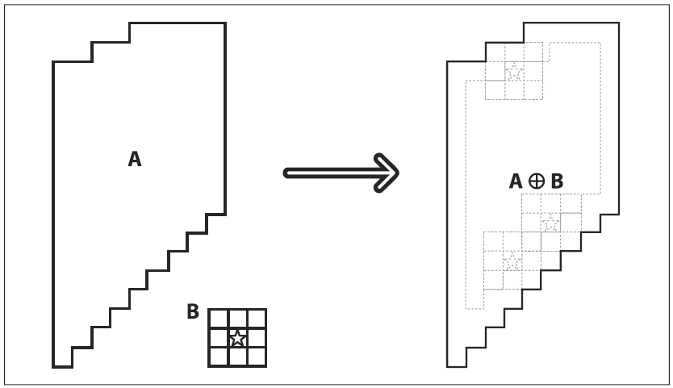

Рисунок 5-6. Морфологическое расширение

Размытие - обратная операция. Действие оператора размытия заключается в вычислении локального минимума под ядром. Данный оператор создаёт новое изображение на основе исходного по следующему алгоритму: при сканировании изображения ядром **B** происходит вычисление локального минимума пикселя, пееркрываемого **B**, и затем значение пикселя, лежащего под опорной точкой заменяется этим минимальным значением. Схематично сужение показано на рисунке 5-7.

*Морфологические преобразования чаще всего делаются на бинарных изображениях, полученные с помощью порогового преобразования.*

Расширение расширяет область **A**, размытие уменьшает облать **A**. К тому же, расширение применяется, как правило, чтобы сгладить вкрапления, а размытие, чтобы сгладить выступы. И все же конечный результат будет зависеть от ядра.

В OpenCV для выполнения этих преобразований используются функции *cvErode()* и *cvDilate()*:

```cpp
	void cvErode(
		 IplImage*		src
		,IplImage*		dst
		,IplConvKernel*	B 			= NULL
		,int			iterations 	= 1
	);

	void cvDilate(
		IplImage*		src
		IplImage*		dst
		IplConvKernel*	B 			= NULL
		int 			iterations 	= 1
	);
```

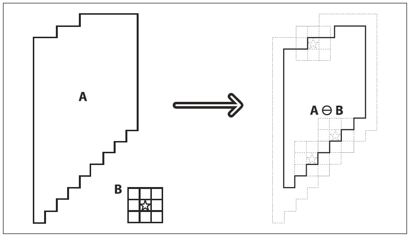

Обе функции допускают использование одного и тогоже изображения в качестве исходного и результирующего. Третий аргумент - ядро, которое по умолчанию равно NULL. Если ядро рано NULL, то используется ядро 3x3 с якорем в центре. Четвертый аргумент - количество итераций. Если указанное значение не равно 1, то операция будет применяться несколько раз в течение одного вызова функции. Результат размытия показан на рисунке 5-8, а расширения на рисунке 5-9. Операция размытия зачастую используется для устранения "вкраплений" шума на изображении. Суть операции сужения в том, что вкрапления и шумы размываются, в то время как большие и соответственно более значимые регионы не затрагиваются. Операция расширения зачастую используется при попытке найти связные компоненты (т.е. большие отдельные области аналогичного цвета или интенсивности). Полезность расширения возникает во многом из-за того, что, как правило, большая область разбита на несколько более мелких частей шумами, тенями или какими то аналогичными эффектами. Применение небольшого растягивания приводит к тому, что эти области "плавятся" в одну. 

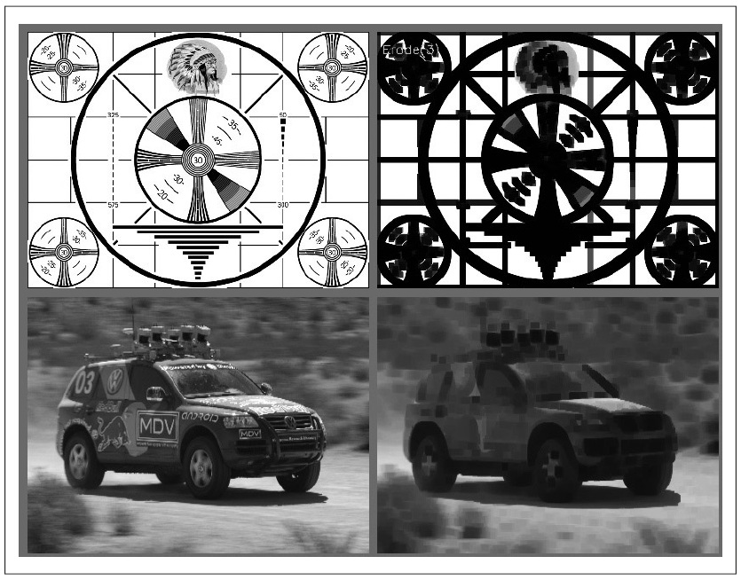

Рисунок 5-8. Результат размытия

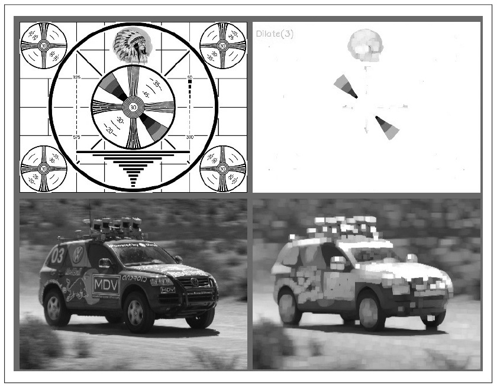

Рисунок 5-9. Результат расширения 

Напоминание: во время выполнения функции *cvErode()* значение некоторой точки *p* устанавливается в минимальное значение всех точек охватываемых ядром, выровненного относительно *p*, и наоборот в *cvDilate()* значение устанавливается в максимальное: 

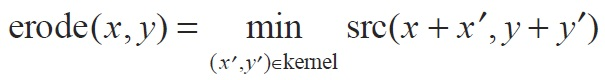

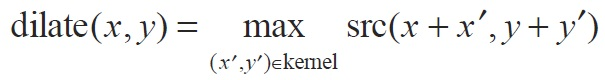

Может показаться странным, зачем знать столь сложную формулу, когда ранее описанного эврестического подхода вполне достаточно. Некоторые читатели на самом деле предпочитают знать эти формулы, но что более важно, формулы охватывают некоторые утверждения общего характера, которые не проявляются в качественном описании. Если изображение не бинарное, то операторы размытия и расширения работают менее тривиально. В качестве наглядного подтвержения данного утверждения обратитесь еще раз к рисункам 5-8 и 5-9.

### Создание собственного ядра

Для создания собственного ядра необходимо воспользоваться структурой *IplConvKernel* и функцией *cvCreateStructuringElementEx()*. Для освобождения от занимаемой ядром памяти необходимо использовать функцию *cvReleaseStructuringElement()*.

```cpp
	IplConvKernel* cvCreateStructuringElementEx(
		 int 	cols
		,int 	rows
		,int 	anchor_x
		,int 	anchor_y
		,int 	shape
		,int* 	values = NULL
	);

	void cvReleaseStructuringElement( IplConvKernel** element );
```

Морфологическое ядро в отличии от ядра свертки не требует никаких числовых значений. Элементы ядра просто указывают на то место, где будет вычислено максимальное или минимальное значение. Якорь определяет каким образом ядро будет выравниваться на исхнодном изображении, а так же место размещения вычисленного значения на результирующем изображении. При создании ядра, *cols* и *rows* определяют размер прямоугольника. Параметры *anchor_x* и *anchor_y* - это координаты якоря в пределах прямоугольника. Параметр *shape* может принимать любое значение из таблицы 5-2. Если использовать *CV_SHAPE_CUSTOM*, то целочисленный вектор *values* используется для определения пользовательской формы ядра в пределах прямоугольника размера *rowsxcols*. Этот вектор считывается в порядке сканирования растра (!) с каждой записью, представляющей другой пиксель (!) в ограничивающем прямоугольнике. Любое ненулевое значение указывает на то, что пиксель должен быть включен в ядро. Если *values = NULL*, тогда пользовательское ядро интерпритируется как ненулевое и как результат ядро прямоугольной формы.

Таблица 5-2. Значения параметра shape

| Значение | Смысл |
| -- | -- |
| CV_SHAPE_RECT | Прямоугольное ядро |
| CV_SHAPE_CROSS | Крестообразное ядро |
| CV_SHAPE_ELLIPSE | Эллиптическое ядро |
| CV_SHAPE_CUSTOM | Ядро пользовательской формы |

### Сложные морфологические преобразования

Во время работы с двоичными изображениями или масками, операторов расширения и сужения вполне достаточно. Но при работе с цветными или черно-белыми изображениями ряд дополнительных операторов могли бы быть полезны. *cvMorphologyEx()* является одной из наиболее полезной функцией. 

```cpp
	void cvMorphologyEx(
		 const CvArr* 	src
		,CvArr* 		dst
		,CvArr* 		temp
		,IplConvKernel*	element
		,int 			operation
		,int 			iterations 	= 1
	);
```

В дополнение к аргументам *src*, *dst*, *element* и *iterations*, которые были рассмотрены в предыдущей главе, функция *cvMorphologyEx()* имеет ещё два дополнительных параметра. Первый - временный массив *temp*, который используется в ряде опреаций (таблица 5-3). При необходимости, этот массив должен быть того же размера, что и исходное изображение. Второй новый аргумент *operation* - тип морфологического преобразования.

Таблица 5-3. Морфологические преобразования поддерживаемые cvMorphologyEx()

| Значение | Морфологический оператор | Потребность во временном изображении |
| -- | -- | -- |
| CV_MOP_OPEN | Сначала сужение а затем расширение | Нет |
| CV_MOP_CLOSE | Сначала расширение а затем сужение | Нет |
| CV_MOP_GRADIENT | Морфологический градиент | Всегда |
| CV_MOP_TOPHAT | Изоляция ярких регионов | Только если src == dst |
| CV_MOP_BLACKHAT | Изоляция темных регионов | Только если src == dst |

**Открытие и закрытие**

Первые две операции из таблицы 5-3 - открытие и закрытие это комбинация операций сужения и расширения. В случае открытия сначала выполняется сужение, а затем расширение (рисунок 5-10). Открытие зачастую используется для подсчета количества регионов на двоичном изображении. Например, имея изображение клеток на стекле под микроскопом после порогового преобразования, можно воспользоваться операцией открытия, чтобы выделить клекти, которые находятся друг с другом, прежде чем подсчитывать количество регионов. В случае с закрытием, сначала выполняется расширение, а затем сужение (рисунок 5-12). Закрытие зачастую используется для устранения нежелательных шумов. Для связных компонентов, как правило, сначало выполняется опреация сужения или закрытия, чтобы устранить элементы, появляющиеся из-за шума, а затем операция открытия для объединения близлежащих крупных элементов (хоть результат использования операций открытия и закрытия схож с результатом действия расширения и сужения, эти новые операции, как правило, сохраняют площадь регионов более точно).

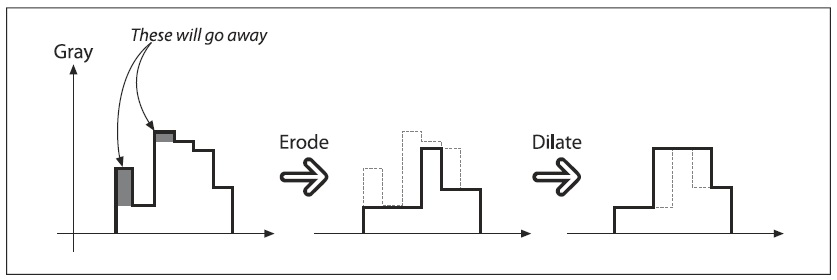

Рисунок 5-10. Морфологическая операция открытие

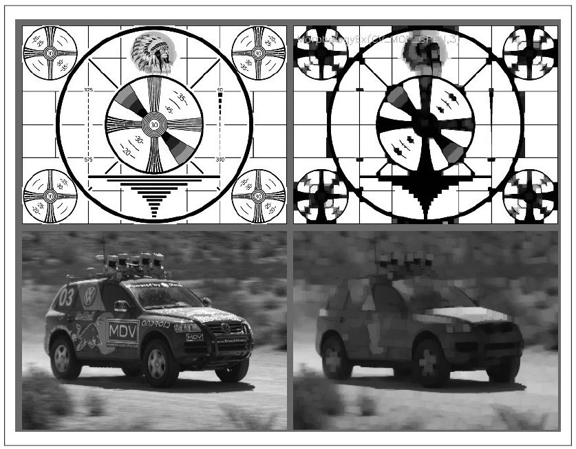

Рисунок 5-11. Результат операции морфологического открытия: мелкие яркие регионы удалены, а остальные яркие регионы изолированы, сохраняя свои размеры

Эффект от операции закрытия - устранение локальных выбросов, которые ниже чем у "соседей", а эффект от открытия - устранение выбросов которые выше чем у "соседей". Результат операции открытия представлен на рисунке 5-11, закрытия на рисунке 5-13. 

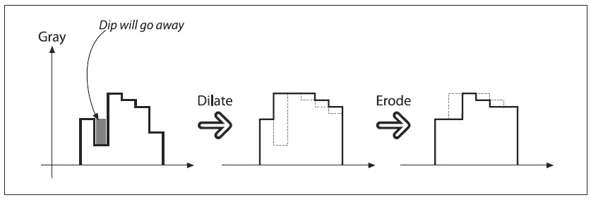

Рисунок 5-12. Морфологическая операция закрытия

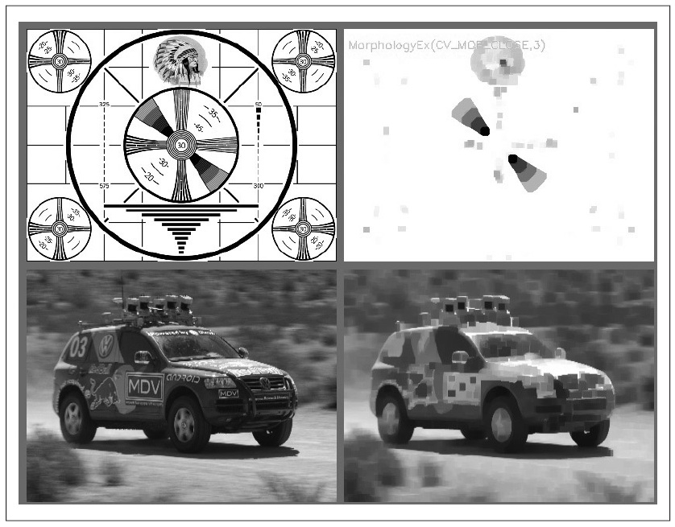

Рисунок 5-13. Результат операции морфологического закрытия: объединение ярких областей, при сохранении своих базовых размеров

И последнее замечание по операциям открытия и закрытия, касающееся количества итераций. Можно было бы ожидать, что две операции закрытия дадут что-то вроде dilate-erode-dilate-erode. Но, как оказалось, это не очень полезно, поэтому преобразование для этого случая происходит следующим образом: dilate-dilate-erode-erode. Таким образом исчезнут не только одиночные, но и соседние пары выбросов. 

**Морфологический градиент**

Наверное будет проще начать с формулы, а затем разобраться что она означает:

gradient(src) = dilate(src) - erode(src)

Результат данной операции над двоичным изображением - выделение периметров существующих пятен. этот процесс схематически изображен на рисунке 5-14, а на рисунке 5-15 показан результат операции. 

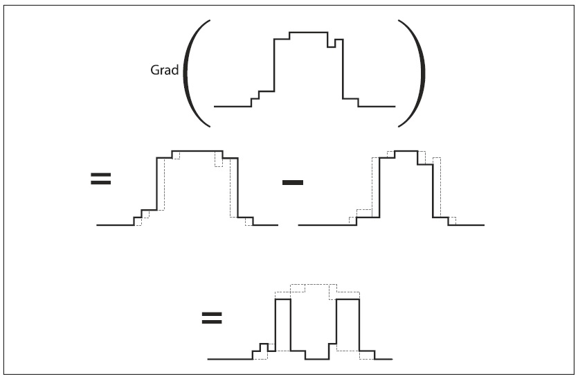

Рисунок 5-14. Применение оператора морфологического градиента к черно-белому изображению: как и ожидалось оператор получает наивысшие значения в наиболее быстро меняющихся местах изображения

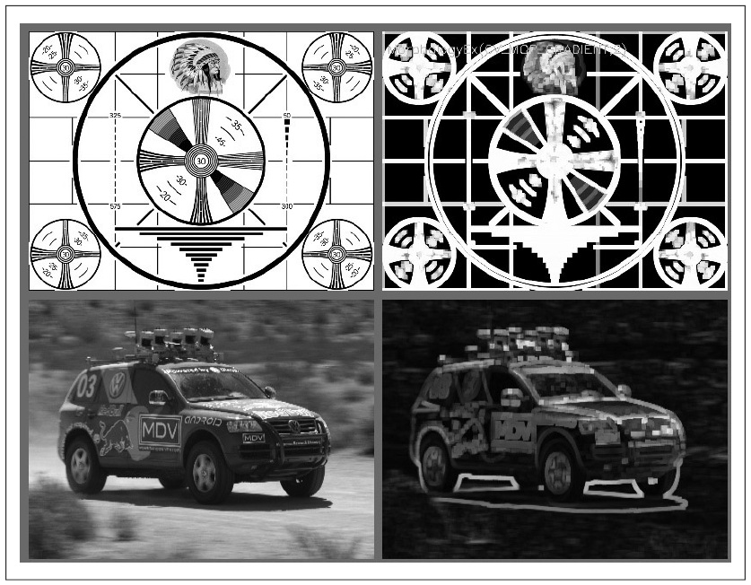

Рисунок 5-15. Результат оператора мофологический градиент: определение ярких краев по периметру

На чёрно-белом изображении данный оператор будет показывать как быстро меняется яркость, поэтому он и называется "морфологический градиент". Морфологический градиент зачастую используется в тех случаях, когда требуется изолировать периметры ярких областей для возможности рассмотреть их как целые объекты (или как целые части объектов). 

**Изоляция ярких и темных регионов**

Последние два оператора **Top Hat** и **Black Hat** используются для изоляции более ярких и более темных регионов, чем их соседи. Данные операторы могут быть использованы для изоляции частей объекта, которые проявляют изменение яркости по отношению к объекту, к которому они присоединены. Это часто происходит, например, с изображениями клеток. Обе операции основаны на более примитивных операторах: 

TopHat(src) = src–open(src)
BlackHat(src) = close(src)–src

Оператор *Top Hat* вычитает результат выполнения операции открытия на исходном изображении из исходного изображения. Эффект от использования операции открытия заключается в преувеличении небольших трещин или локальных пятен. Данная операция должна выявить более "легкие" области по сравнению с размером ядра (рисунок 5-16); и наоборот оператор *Black Hat* показывает области, которые темнее остальных (рисунок 5-17). Результаты всех морфологических преобразований, обсуждаемых в данной главе, собраны на рисунке 5-18.

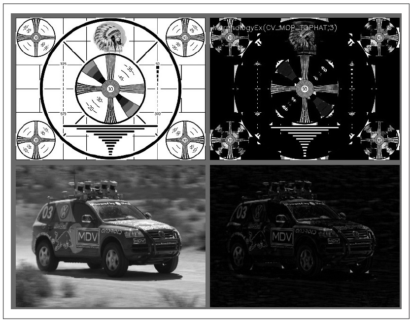

Рисунок 5-16. Результат работы операции морфологический Top Hat: изоляция пиковых ярких мест

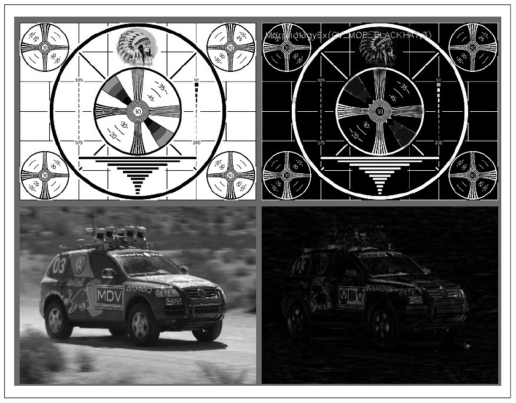

Рисунок 5-17. Результат работы операции морфологический Black Hat: изоляция пиковых ntvys[] мест

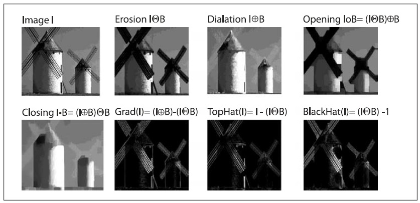

Рисунок 5-18. Результаты всех морфологических преобразований