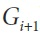
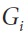
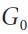
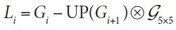
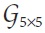
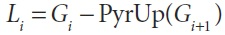
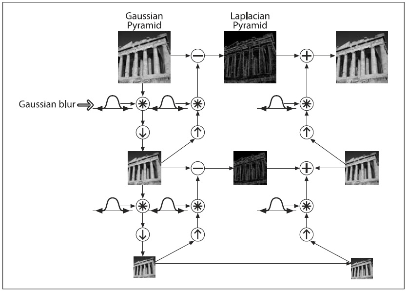
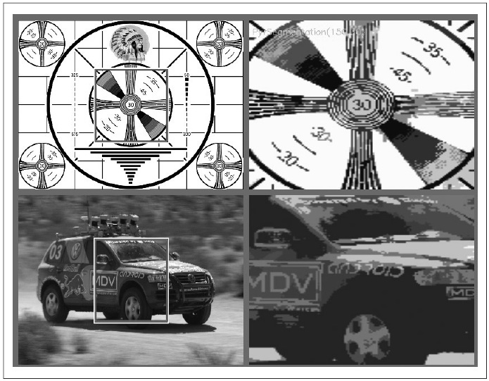

## [П]|[РС]|(РП) Пирамиды изображений

Пирамиды изображений активно используются в разнообразных приложениях компьютерного зрения. Пирамида изображения - это коллекция изображений, получаемая из исходного изображения путём последовательного сжатия, пока не будет достигнута точка останова (естественно, конечной точкой может быть один пиксель). 

Существует два вида пирамид, которые наиболее часто можно встретить в литературе и приложениях: пирамиды Гаусса и Лапласа. Пирамида Гаусса используется для сжатия изображения, а пирамида Лапласа для восстановления изображения с повышенной дискретизацией из слоя в пирамиде.

Для получения слоя *(i+1)* в Гауссовой пирамиде (пусть будет ) из слоя , необходимо сначала свернуть этот слой с помощью Гауссово ядра, а затем удалить все четные строки и столбцы. Из этого следует, что каждое последующее изображение будет занимать четверть площади предшественника. Итерационный процесс на исходном изображении  дает ту самую пирамиду. OpenCV предоставляет метод генерации каждого слоя на основе предыдущего изображения: 

```cpp
void cvPyrDown(
     IplImage*  src
    ,IplImage*  dst
    ,IplFilter  filter = IPL_GAUSSIAN_5x5
);
```

На момент написания книги, параметр *filter* поддерживал только Гауссово ядро 5x5.

Аналогичным образом, можно преобразовать существующее изображение, получив в два раза большее в обоих направлениях изображение, подобной (но не обратной) операцией: 

```cpp
void cvPyrUp(
     IplImage*  src
    ,IplImage*  dst
    ,IplFilter  filter = IPL_GAUSSIAN_5x5
);
```

В данном случае, изображение сначала преобразуется в два раза большее в обоих направлениях изображение, с новыми строками, заполненными 0s. Затем выполняется свертка по заданному фильтру (на самом деле, фильтр в два раза больше для каждого измерения, чем указано) для аппроксимации значений "отсутствующих" пикселей.

Ранее было отмечено, что функция *PyrUp()* не является обратной *PyrDown()*. Это очевидно, т.к. *PyrDown()* приводит к потери данных. Для восстановления оригинального изображения (с более высоким разрешением), требуется та самая, теряемая при сжатии изображения, информация. Эти данные формируют пирамиду Лапласа. i-ый слой пирамиды Лапласа определяется следующим образом: 



Оператор *UP()* конвертирует каждый пиксель *(x, y)* исходного изображения в пиксель *(2x + 1, 2y + 1)* в конечном изображении; символ ⊗ обозначает свертку;  Гауссово ядро размером 5x5. Конечно, формула является определением оператора *PyrUp()*. Следовательно, оператор Лапласа можно определить следующим образом:



Пирамиды Гаусса и Лапласа схематично изображены на рисунке 5-21, на котором так же показан обратный процесс для восстановления исходного изображения по субизображению. На самом деле приближение Лапласиана использует разницу Гауссианов, что собственно отражает предыдущее уравнение и что схематично показано на рисунке.



Рисунок 5-21. Пирамида Гаусса и ее противоположность - пирамида Лапласа

Существует множество операций, в которых могут быть задействованы пирамиды Гаусса и Лапласа, но наиболее важной является операция сегментации изображения (рисунок 5-22). В этом случае сначала строиться пирамида изображения, а затем выстраивается связь родитель-потомок между пикселями уровня  и соответствующими пикселями уровня . Таким образом, быстрая начальная сегментация может быть выполнена на изображениях с низким разрешением, с последующим уточнением и дальнейшим дифференцированием уровень за уровнем.



Рисунок 5-22. Сегментация с *threshold1 = 150* и *threshold2 = 30*; изображение справа содержит только часть левого изображения, т.к. сегментация требует изображение, которое N раз делится на 2, где N - вычисляемое число слоев пирамиды (в данном случае 512x512 от оригинального изображения)

В OpenCV этот алгоритм представлен функцией *cvPyrSegmentation()*:

```cpp
void cvPyrSegmentation(
     IplImage*      src
    ,IplImage*      dst
    ,CvMemStorage*  storage
    ,CvSeq**        comp
    ,int            level
    ,double         threshold1
    ,double         threshold2
);
```

Как правило *src* и *dst* это исходное и конечное изображения, которые должны быть 8-битными, одинакового размера и с одинаковым количеством каналов (1 или 3). Может возникнуть вопрос: "Что еще за конечное изображение?". На самом деле, конечное изображение *dst* используется как рабочее пространство для алгоритма, а также возвращающее визуализацию сегментации. Если взглянуть на это изображение, то можно увидеть, что каждый сегмент одноцветный. Т.к. это изображение рабочее пространство алгоритма, то его нельзя установить в NULL. Даже если результат не нужен, всё равно необходимо предоставить функции это изображение. Ещё одно важное замечание по поводу *src* и *dst*: все уровни пирамиды должны иметь целочисленные размеры в обоих направлениях, исходное изображение должно делиться на 2 столько раз, сколько есть уровней в пирамиде. Например, для четырехуровневой пирамиды изображения с шириной и высотой равными 80 (2x2x2x5) пикселей было бы достаточно, а равными 90 (2x3x3x5) пикселей нет. 

Аргумент *storage* это указатель на область хранения памяти. В главе 8 будет более детально рассказано о данной области хранения, а на данный момент будет вполне достаточно знать, что выделение данной области осуществляется следующим образом:

```cpp
CvMemStorage* storage = cvCreateMemStorage();
```

Аргумент *comp* это место для хранения дополнительной информации о результатах сегментации: последовательность связных компонент, выделенные из области хранения. О том, как это работает будет рассказано в главе 8, но для удобства работы с *cvPyrSegmentation()* некоторые детали все таки будут рассмотрены сейчас. 

Во-первых, последовательность представлена списком структур особого рода. Имея последовательность, можно получить количество элементов в ней, а также, зная тип и номер элемента в последовательности, получить сам элемент. В примере 5-1 представлен подход в получении доступа к последовательности.

Пример 5-1. Сделать что-то с каждым элементом из последовательности связных компонент, возвращаемая функцией *cvPyrSegmentation()*

```cpp
void f( IplImage* src, IplImage* dst ) {
    CvMemStorage* storage = cvCreateMemStorage(0);
    CvSeq* comp = NULL;

    cvPyrSegmentation( src, dst, storage, &comp, 4, 200, 50 );

    int n_comp = comp->total;

    for( int i = 0; i < n_comp; i++ ) {
        CvConnectedComp* cc = (CvConnectedComp*) cvGetSeqElem( comp, i );
        do_something_with( cc );
    }

    cvReleaseMemStorage( &storage );
}
```

Есть несколько вещей в этом примере, на которые стоит обратить внимание. Во-первых, на необходимость выделения памяти с помощью *cvCreateMemStorage()* под хранение связных компонент. Затем на создание указателя *comp* типа *CvSeq* и инициализацию его NULL, т.к. начальное значение в данном случае ничего не значит. Затем, на выполнение сегментации при помощи функции *cvPyrSegmentation()* и заполнение ранее созданной последовательности *comp*. После всего этого появляется возможность получать количество элементов в последовательности через поле *total*, а благодаря функции *cvGetSeqElem()* можно ещё получать и доступ к конкретному элементу из последовательности. Однако, т.к. функция является обобщенной и возвращает только указатель *void*\*, необходимо выполнить приведение типов (в данном случае к *CvConnectedComp*\*).

И в заключение, необходимо помнить о том, что связная компонента является одним из основных типов в OpenCV. Этот тип можно рассматривать как описание "капли" на изображении. Данный тип имеет следующее определение: 

```cpp
typedef struct CvConnectedComponent {
    double      area;
    CvScalar    value;
    CvRect      rect;
    CvSeq*      contour;
};
```

Аргумент *area* это область компоненты. Аргумент *value* это среднее значение цвета над областью компоненты. Аргумент *rect* это ограничительная рамка для компоненты (определенная в координатах родительского изображения). Аргумент *contour* это указатель на другую последовательность, которая может быть использована для хранения представления границ компоненты и которая, как правило, представлена в виде последовательности точек типа *CvPoint*. 

В некоторых случаях параметр *contour* *cvPyrSegmentation()* не задаётся. В результате, если необходимо получить конкретные представления пикселей компоненты, то необходимо будет вычислить их самим. Используемый для этого способ зависит, конечно, от требуемого представления. Зачастую используется булевая маска с ненулевыми элементами везде, где расположен компонент. Этого можно с легкостью добиться за счёт выделения компоненты прямоугольником (маска), а затем при помощи *cvFloodFill()* выбрать нужные пиксели внутри данного прямоугольника.

