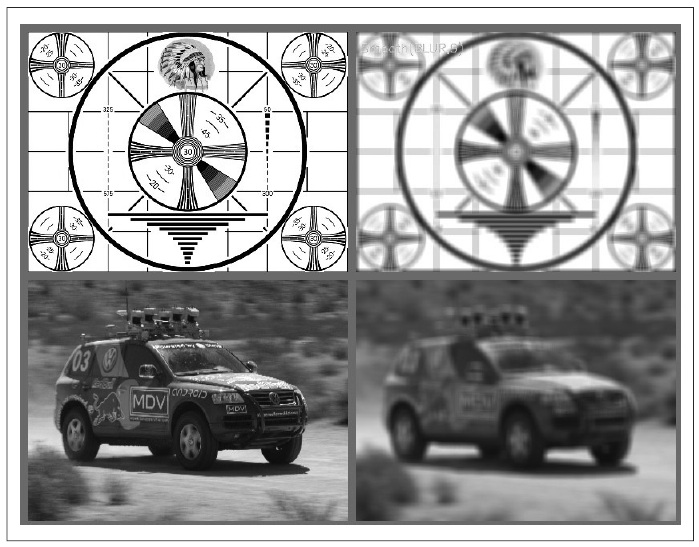
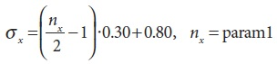
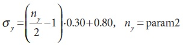
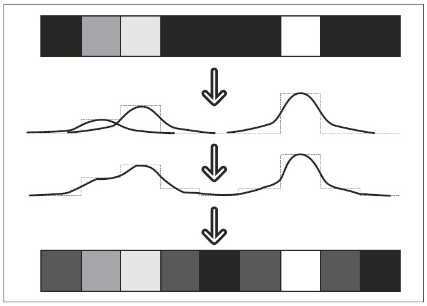
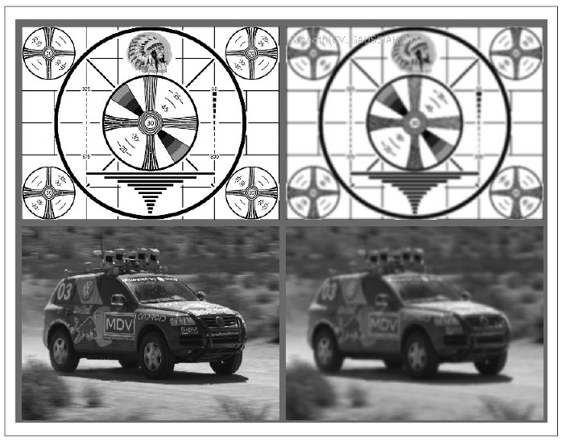
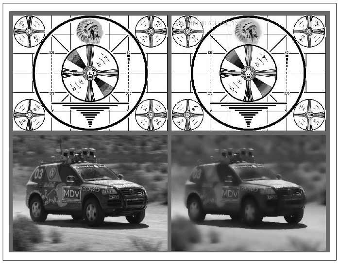

## (П]|(РС)|(РП) Сглаживание

Сглаживание или размытие - простая и часто используемая операция обработки изображения. Есть множество причин для сглаживания, но, как правило, используется данная операция для снижения шума или артефактов камеры. Сглаживание так же применяется при уменьшении размера изображения (детали данной операции будут подробно рассмотрены в последующем разделе текущей главы).

В OpenCV есть пять различных операторов сглаживания. Все они поддерживаются через одну функцию *cvSmooth()*, которая принимает желаемый вариант сглаживания в качестве аргумента. 

```cpp
	void cvSmooth(
		 const CvArr*	src
		,CvArr*			dst
		,int			smoothtype	= CV_GAUSSIAN
		,int			param1 		= 3
		,int			param2		= 0
		,double			param3		= 0
		,double			param4		= 0
	);
```

*src* и *dst* – исходное и результирующее изображение. Функция *cvSmoth()* имеет четыре неинформативных аргумента *param1*, *param2*, *param3* и *param4*. Смысл этих аргументов зависит от значения *smoothtype*, который принимает любое из пяти значений, указанных в таблице 5-1 (при некоторых значениях *smoothtype* использование одного изображения в качестве *src* и *dst* не допускается).

Таблица 5-1. Значения smoothtype

| Тип сглаживания | Наименование | Использование одного изображения | Nc | Тип src | Тип dst | Описание |
| -- | -- | -- | -- | -- | -- | -- |
| CV_BLUR | Простое размытие | Да | 1,3 | 8u, 32f | 8u, 32f | Суммирование области *param1xparam2* с последующим масштабированием 1/(*param1xparam2*) |
| CV_BLUR_NO_SCALE | Простое размытие без масштабирования | Нет | 1 | 8u | 16s (для 8u src) или 32f (для 32f src) | Суммирование области *param1xparam2* |
| CV_MEDIAN | Медианное размытие | Нет | 1,3 | 8u | 8u | Поиск среднего значения в области *param1xparam2* |
| CV_GAUSSIAN | Размытие по Гауссу | Да | 1,3 | 8u, 32f | 8u (для 8u src) или 32f (для 32f src) | Суммирование области *param1xparam2* |
| CV_BILATERAL | Двусторонняя фильтрация | Нет | 1,3 | | 8u | 8u | Двусторонняя 3x3 фильтрация с цветовой sigma = param1 и sigma = param2 |

*CV_BLUR* - простейшая операция размытия (рисунок 5-1). Каждый пиксель на выходе является средним арифметическим области пикселей на входе. Простое размытие поддерживает 1-4 канальные 8 битные или 32 битные вещественные изображения. 

Не все операторы сглаживания действуют на одних и тех же видах изображения. *CV_BLUR_NO_SCALE* (простое сглаживание без масштабирования) схоже с простым сглаживанием, только без последующего масштабирования. Для этого типа размытия исходное и результирующее изображения должны иметь различные форматы. Исходное изображение должно быть 8-битным изображением, тогда как результирующее изображение должно быть *IPL_DEPTH_16S* (*CV_16S*) или *IPL_DEPTH_32S* (CV_32S).



Рисунок 5-1. Простое сглаживание; слева исходное изображение, справа результирующее изображение.

Операцию *CV_BLUR_NO_SCALE* так же возможно выполнять и на 32-битных вещественных изображениях, при условии, что результирующее изображение так же будет 32-битным вещественным. Для данной операции не должно использовать в качестве *src* и *dst* одно и тоже изображение (это очевидно в случае 8 битного изображения, однако, для 32 битного изображения данное правило так же должно исполняться). Зачастую данный тип сглаживания предпочтительнее, нежели простое сглаживание, т.к. выполняется чуть быстрее. 

Медианный фильтр (*CV_MEDIAN*) заменяет каждый пиксель на среднее значение области вокруг центрального пикселя. *CV_MEDIAN* работает с одно-, трёх- и четырёх-канальными 8-битными изображениями, но исходное и результирующее изображения должны быть разными. Результат работы медиального фильтра показан на рисунке 5-2. Простое сглаживание может быть чувствительно к шуму, в особенности на изображениях с большой изоляцией точек выброса ("дробовый шум"). Большие различия даже в небольшом количестве точек может вызвать заметные сдвиги среденего значения. Медианный фильтр может игнорировать выбросы путем выбора средней точки.


Рисунок 5-2. Медианной сглаживание

Размытие по Гауссу (*CV_GAUSSIAN*) является наиболее полезным, хотя и не самым быстрым. Гауссовая фильтрация выполняется путем свертки каждой точки во входном массиве с гауссовым ядром и последующем суммированием для получения выходного массива. 

Для сглаживания по Гауссу (рисунок 5-3) первые два аргументы задают ширину и высоту окна фильтрации; (необязательный) третий аргумент задает значение *sigma* гауссового ядра. Если третий аргумент не задан, то он будет рассчитан из ширины и высоты окна по следующей формуле: 





Если необходимо асимметричное ядро, то не обходимо задать (необязательнй) четвертый аргмент; в этом случае третий и четвертый аргменты будут соответствовать сигме по горизонтале и вертикале, соответственно.

Если третий и четвёртый аргументы заданы, а первый и второй равны нулю, то они автоматически будут рассчитаны по значению сигмы. 



Рисунок 5-3. Размытие по Гауссу на одномерном массиве

Реализация Гауссового сглаживания в OpenCV обеспечивает высокую производительность для ряда распространенных ядер. Ядра размера 3x3, 5x5 и 7x7 имеют "стандартную" сигму (*param3 = 0.0*) и дают наилучшую производительность, чем другие ядра. Размытие по Гауссу поддерживает одно- и трехканальные 8-битные или 32-битные вещественные изображения. В качестве входного и выходного может быть использовано одно и тоже изображение. Результат размытия по Гауссу показан на рисунке 5-4.



Рисунок 5-4. Размытие по Гауссу

Пример двусторонней фильтрации представлен на рисунке 5-5. Данный тип сглаживания более известен как сглаживание с сохранением краев. Проще всего разобраться в принципе работы двусторонней фильтрации можно в сравнении с гауссовым размытием. Размытие по Гауссу снижает уровень шума при сохранении сигнала, но к сожалению этот метод плохо работает вблизи краёв, которые также размываются. Двустороння фильтрация в отличие от Гауссовской по производительности ниже, потому, как предоставляет средства размытия изображения без сглаживания краёв. 

Так же, как и в гауссовом сглаживание, в двухстороннем сглаживание создается средневзвешенное каждого пикселя и их соседий. Взвешенное значение двух компонент, первое из которых использует такой же вес как при Гауссовом сглаживание. Второй компонент так же основан на весе, используемом в Гауссовом сглаживание, однако, использует не пространственное расстояние от центральной точки, а разницу в интенсивности от центральной точки. У более схожих пикселей веса больше, чем у менее схожих. Данное сглаживание может быть полезно как вспомагательное средство при сегментации изображения.

Двусторонняя фильтрация использует два параметра. Первый задает ширину Гауссово ядра в пространственной области, который является аналогом параметра сигма в Гауссовом фильтре. Второй задает ширину Гауссово ядра в области цвета. Чем больше второй параметр, тем шире диапазон интенсивности (или цвета), который будет включен в сглаживание.



Рисунок 5-5. Двустороннее сглаживание