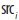
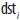
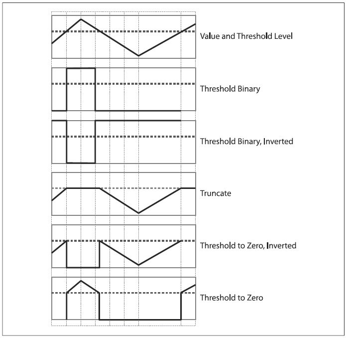
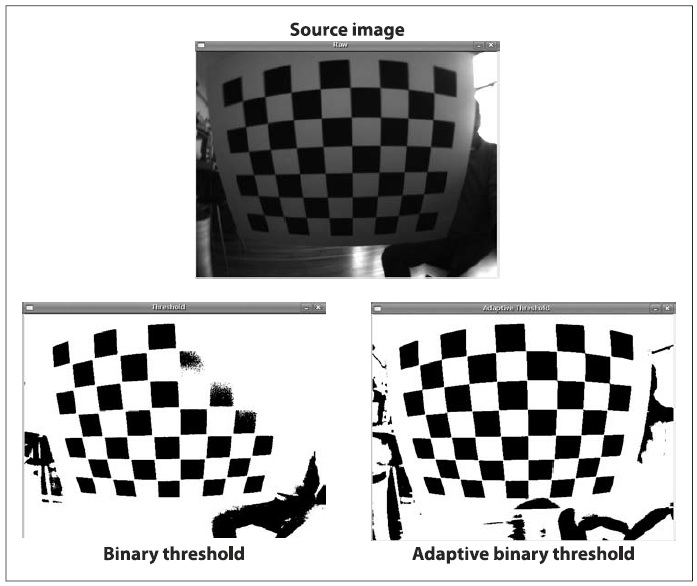

## [П]|[РС]|(РП) Пороговое преобразование

Зачастую после обработки изображения, возникает потребность, чтобы в конечном изображение остались только те пиксели, которые выше или ниже определенного значения. В OpenCV для решения данной проблемы существует функция *cvThreshold()*. Основная идея алгоритма, заложенного в функцию, заключается в том, чтобы в конечный массив попали только те пиксели, которые выше или ниже определенного значения. 

```cpp
double cvThreshold(
     CvArr* src
    ,CvArr* dst
    ,double threshold
    ,double max_value
    ,int    threshold_type
);
```

Как показано в таблице 5-5 каждому типу порога соответствует своя операция сравнения между *i*-ым пикселем исходного изображения () и порогом (обозначен как *T*). В зависимости от соотношения между значением пикселя на исходном изображении и значением порога, значение пикселя на конечном изображении  может быть установлено в 0,  или *max_value* (обозначено как *M*). 

Таблица 5-5. Значения *threshold_type* функции *cvThreshold()*

| Тип порога | Операция |
| -- | -- |
| CV_THRESH_BINARY |  = (  > T ) ? M :0 |
| CV_THRESH_BINARY_INV |  = (  > T ) ? 0: M |
| CV_THRESH_TRUNC |  = (  > T ) ? M : |
| CV_THRESH_TOZERO_INV |  = (  > T ) ? 0: |
| CV_THRESH_TOZERO |  = (  > T ) ?  :0 |

Рисунок 5-23 должен прояснить последствия каждого из типов преобразования.



Рисунок 5-23. Результаты применения типов порогового преобразования. Горизонтальная линия показывает значение порога, на первой диаграмме представлено исходное изображение, а на 5 последующих влияние применения типов порогового преобразования.

Рассмотрим небольшой пример (пример 5-2). В данном примере представлен процесс суммирования трех каналов исходного изображения с последующим удалением всех значений выше 100.

Пример 5-2. Пример использования функции *cvThreshold()*

```cpp
#include <stdio.h>
#include <cv.h>
#include <highgui.h>
 
void sum_rgb( IplImage* src, IplImage* dst ) {
    // Создание изображений для каждого канала
    // 
    IplImage* r = cvCreateImage( cvGetSize(src), IPL_DEPTH_8U, 1 );
    IplImage* g = cvCreateImage( cvGetSize(src), IPL_DEPTH_8U, 1 );
    IplImage* b = cvCreateImage( cvGetSize(src), IPL_DEPTH_8U, 1 );
     
    // "Разделение" исходного изображения на составляющие
    // 
    cvSplit( src, r, g, b, NULL );
     
    // Временное изображение
    // 
    IplImage* s = cvCreateImage( cvGetSize(src), IPL_DEPTH_8U, 1 );
     
    // Средневзвешенная сумма
    // 
    cvAddWeighted( r, 1./3., g, 1./3., 0.0, s );
    cvAddWeighted( s, 2./3., b, 1./3., 0.0, s );
     
    // Усечение значений до 100
    // 
    cvThreshold( s, dst, 100, 100, CV_THRESH_TRUNC );

    cvReleaseImage( &r );
    cvReleaseImage( &g );
    cvReleaseImage( &b );
    cvReleaseImage( &s );
}
 
int main( int argc, char** argv ) {
    // Создание окна
    // 
    cvNamedWindow( argv[1], 1 );
     
    // Создание исходного и конечного изображения
    // 
    IplImage* src = cvLoadImage( argv[1] );
    IplImage* dst = cvCreateImage( cvGetSize(src), src->depth, 1 );

    // Обработка исходного изображения
    // 
    sum_rgb( src, dst);
     
    // Вывод конечного изображения на экран
    // 
    cvShowImage( argv[1], dst );
     
    // Ожидание нажатия клавиши "Esc"
    // 
    while( 1 ) { 
        if( (cvWaitKey( 10 )&0x7f) == 27 ) {
            break;
        }
    }
     
    // Освобождение ресурсов
    // 
    cvDestroyWindow( argv[1] );
    cvReleaseImage( &src );
    cvReleaseImage( &dst );
}
```

В данном примере показано несколько довольно таки важных идей. Во-первых, к 8-битному массиву ничего не добавляется, иначе произойдет переполнение. Вместо этого используется средневзвешенное суммирование трех каналов с последующим усечением результата по насыщенности до 100. Во-вторых, функция *cvThreshold()* работает только с черно-белыми, 8-битными или вещественными изображениями. В-третьих, конечное изображение должно соответствовать исходному изображению или быть 8-битным. Кроме того, функция позволяет использовать входное изображение и как исходное и как конечное изображение. В примере в качестве промежуточного изображения использовано изображение вещественного типа для того, чтобы можно было применить код с альтернативным методом обработки (пример 5-3). Стоит обратить внимание на функцию *cvAcc()*, которая может складывать изображения целого и вещественного типа, чего в свою очередь не может делать функция *cvADD()*. 

Пример 5-3. Альтернативный метод

```cpp
IplImage* s = cvCreateImage(cvGetSize(src), IPL_DEPTH_32F, 1);
cvZero(s);
cvAcc(b,s);
cvAcc(g,s);
cvAcc(r,s);
cvThreshold( s, s, 100, 100, CV_THRESH_TRUNC );
cvConvertScale( s, dst, 1, 0 );
```


### Адаптивное пороговое преобразование

Существует еще модифицированный метод порогового преобразования, у которого пороговый уровень - это переменная величина. 

```cpp
void cvAdaptiveThreshold(
     CvArr* src
    ,CvArr* dst
    ,double max_val
    ,int    adaptive_method = CV_ADAPTIVE_THRESH_MEAN_C
    ,int    threshold_type  = CV_THRESH_BINARY
    ,int    block_size      = 3
    ,double param1          = 5
);
```

Функция реализует два варианта адаптивного порогового преобразования за счет параметра *adaptive_method*. В обоих случаях адаптивный порог *T(x, y)* устанавливает попиксельно средневзвешенное значение, вычисляемое в регионе *bxb* вокруг каждого пикселя минус константа, где *b* это аргумент *block_size*, а константа это *param1*. Если установлен метод *CV_ADAPTIVE_THRESH_MEAN_C*, тогда все пиксели области взвешиваются одинаково. Если установлен метод *CV_ADAPTIVE_THRESH_GAUSSIAN_C*, тогда пиксели в регионе вокруг *(х, y)* взвешиваются в соответствии с Гауссовой функцией их расстояния от центральной точки.

Аргумент *threshold_type* может принимать любое значение из таблицы 5-5. 

Адаптивный порог полезен в тех случаях, когда изображение засвечено или содержит отражённые градиенты, а также, если нужно, чтобы порог отработал по отношению к общей интенсивности, а не с каждым пикселем в отдельности. Функция работает только с одноканальными, 8-битными и вещественными изображениями и требует, чтобы исходное и конечное изображения были различными. 

Исходный код сравнения *cvAdaptiveThreshold()* и *cvThreshold()* приведён в примере 5-4. На рисунке 5-24 показан результат работы функции с изображением, которое имеет сильную градиентную засветку. В левой нижней части рисунка показан результат использования *cvThreshold()*, а в нижней правой части показан результат адаптивного порогового преобразования с использованием функции *cvAdapriveThreshold()*. Как видно из рисунка, с помощью адаптивного порогового преобразования получилось "увидеть" всё шахматное поле, чего, в свою очередь, не было достигнуто при использовании обычного порогового преобразования. Примечание: в примере 5-4 для адаптивного преобразования были использованы следующие параметры: 

```
./adaptThresh 15 1 1 71 15 ../Data/cal3-L.bmp
```



Рисунок 5-24. Обычное пороговое преобразование против адаптивного порогового преобразования: исходное изображение (сверху) было преобразовано в двоичное изображение с помощью глобального порога (внизу слева) и адаптивного порога (внизу справа); изображение предоставлено Kurt Konolidge

Пример 5-4. Обычное пороговое преобразование против адаптивного порогового преобразования

```cpp
#include <cv.h>
#include <highgui.h>
#include <math.h>
 
IplImage *Igray=0, *It = 0, *Iat;

int main( int argc, char** argv ) {

    if( 7 != argc ) {
        return -1; 
    }
     
    // Обработка ключей командной строки
    // 
    double threshold = (double)atof(argv[1]);
    int threshold_type = atoi(argv[2]) ? CV_THRESH_BINARY 
                                       : CV_THRESH_BINARY_INV;
    int adaptive_method = atoi(argv[3]) ? CV_ADAPTIVE_THRESH_MEAN_C 
                                        : CV_ADAPTIVE_THRESH_GAUSSIAN_C;
    int block_size = atoi(argv[4]);
    double offset = (double)atof(argv[5]);
     
    // Загрузка изображения в чёрно-белом формате
    // 
    if((Igray = cvLoadImage( argv[6], CV_LOAD_IMAGE_GRAYSCALE)) == 0) {
        return -1;
    }
     
    // Создание выходных чёрно-белых изображений
    // 
    It = cvCreateImage(cvSize(Igray->width,Igray->height), IPL_DEPTH_8U, 1);
    Iat = cvCreateImage(cvSize(Igray->width,Igray->height), IPL_DEPTH_8U, 1);
     
    // Пороговые преобразования
    // 
    cvThreshold( Igray, It,threshold, 255, threshold_type );
    cvAdaptiveThreshold( Igray, Iat, 255, adaptive_method, threshold_type, block_size, offset );
     
    // Создание окон для вывода результатов
    // 
    cvNamedWindow("Raw", 1);
    cvNamedWindow("Threshold", 1);
    cvNamedWindow("Adaptive Threshold", 1);
     
    // Вывод результатов
    // 
    cvShowImage("Raw", Igray);
    cvShowImage("Threshold", It);
    cvShowImage("Adaptive Threshold", Iat);
    cvWaitKey(0);
     
    // Освобождение занимаемых ресурсов
    // 
    cvReleaseImage( &Igray );
    cvReleaseImage( &It );
    cvReleaseImage( &Iat );
    cvDestroyWindow( "Raw" );
    cvDestroyWindow( "Threshold" );
    cvDestroyWindow( "Adaptive Threshold" );

    return(0);
}
```

