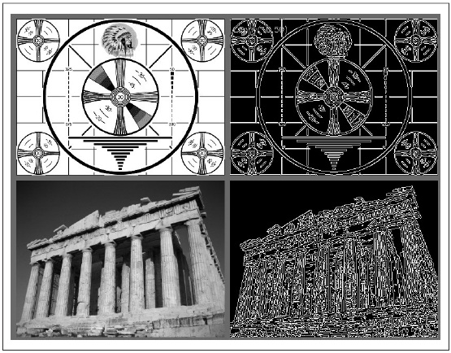
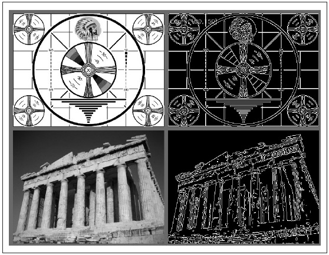

## [П]|[РС]|(РП) Canny

Только что описанный метод поиска краев в 1986 году был улучшен J. Canny и именуется как детектор границ Canny. Отличие алгоритма Canny от более простого алгоритма, основанного на преобразованиях Лапласа, в том, что в алгоритме Canny первые производные вычисляются по осям x и y, а затем объединяются в четырех направлениях производных. Точки, в которых эти производные достигают локального максимума затем рассматриваются в качестве кандидатов на группировку в край.

Однако, наиболее значимым дополнением алгоритма Canny является то, что он пытается собрать кандидатов в целые контуры (Контуры будут рассмотрены чуть позже, а пока необходимо понимать, что *cvCanny()* в действительности не возвращает объектов типа *CvContour*; при необходимости этот объект можно получить применив *cvFindContours()*. Более подробно контуры будут рассмотрены в главе 8). Эти контуры формируются путем применения порога гистерезиса к пикселям. Это означает наличие двух порогов - верхнего и нижнего. Если значение градиента пикселя больше, чем верхний порог, то он включается в край; если значение градиента пикселя меньше нижнего порога, то данный пиксель исключается из рассмотрения. Если значение градиента пикселя между этими порогами, то он будет частью края только в том случае, если он соединен с пикселем, который больше верхнего порога. Согласно рекомендациям автора, соотношение порогов *высокий:низкий* должно быть между 2:1 и 3:1. На рисунке 6-7 и рисунке 6-8 показан результат применения *cvCanny()* к тестовому шаблону и фотографии с пороговыми соотношениями 5:1 и 3:2.

```cpp
void cvCanny(
    const CvArr*    img
    ,CvArr*         edges
    ,double         lowThresh
    ,double         highThresh
    ,int            apertureSize = 3
);
```



Рисунок 6-7. Результат применения cvCanny для двух совершенно разных изображений, для которых верхний и нижний пороги установлены равными 50 и 10 соответственно



Рисунок 6-8. Результат применения cvCanny для двух совершенно разных изображений, для которых верхний и нижний пороги установлены равными 150 и 100 соответственно

Функция *cvCanny()* на вход принимает исходное изображение в оттенках серого и конечное изображение, которое также должно быть в оттенках серого (в действительности оно будет бинарным - для краев пиксели будут белого цвета, для остальных черного). Следующие два аргумента - это верхний и нижний порог, последний аргумент - размер апертуры (по умолчанию, применяется матрица размера 3х3, но возможны и другие значения - 5х5, 7х7 и т.д.). Апертура поступает на вход оператору Собеля, который вызывается внутри функции *cvCanny()*.

