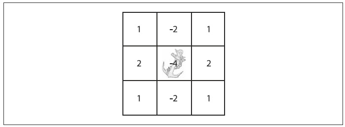
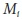
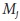
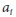
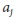
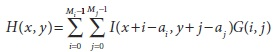
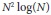
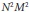
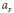
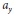

## [П]|[РС]|(РП) Свертка

Свертка - это основа большинства преобразований, о которых будет идти речь в этой главе. В общем значении, этот термин означает некоторое действие, которые выполняется над каждой частью изображения. Так, большинство операций из главы 5 могут быть представлены как особый случай свертки. Что "делает" свертка определяется по форме *ядра свертки*. Это ядро, по существу, является массивом фиксированного размера, состоящий из числовых коэффициентов, с якорной точкой (в дальнейшем просто якорь), расположенной, как правило, в центре. Размер массива именуется *support* ядра (по техническим причинам, *support* ядра состоит только из ненулевых частей массива ядра).

На рисунок 6-1 представлено ядро свертки размером 3x3 с якорем в центре. Значение свертки в конкретной точке вычисляется в следующем порядке. В начале якорь помещается поверх пикселя конкретной точки, при этом принимая во внимание тот факт, что остальная часть ядра накладывается на соответствующие рядом стоящие пиксели изображения. В результате имеем два значения для пикселей под ядром: исходное значение пикселя и значение ядра. Далее эти значения перемножаются и суммируются; результат помещается в место размещения якоря. Этот процесс повторяется для всех пикселей изображения путем "скольжения" ядра по изображению.



Рисунок 6-1. Ядро свертки 3x3 для производной Собеля. Якорь расположен в центре

Разумеется, все ранее описанные действия можно описать математическим уравнением. Пусть изображение это *I(x, y)*, ядро *G(i, j)* (где *0 < i <*  * - 1* и *0 < j <*  * - 1*) и ядро, размещенное в (, ), тогда свертка *H(x, y)* будет определяться следующим выражением:



На первый взгляд может показаться, что число операций равно количеству пикселей на изображении помноженное на количество пикселей в ядре (Так же возможно производить свертку в частотной области. В этом случае для изображения размером *NxN* и ядра *MxM*, при том, что *N > M*, время вычисления будет пропорционально , а не  как ожидается при вычислениях в пространственной области. Поскольку вычисления в частотной области не зависят от размера ядра, оно более эффективно для больших ядер. OpenCV автоматически решает, когда выполнять свертку в частотной области, учитывая размер ядра.). Это может привести к большому объему вычислений, так что такая операция, возможно, не лучший кандидат на реализацию в виде цикла *for* со множеством разыменований указателей. В этом случае лучше всего позволить OpenCV выполнить эту работу за вас путем вызова *cvFilter2D()* (вместе с тем получить преимущество от использования оптимизаций, заложенных в OpenCV):

```cpp
void cvFilter2D(
     const CvArr*   src
    ,CvArr*         dst
    ,const CvMat*   kernel
    ,CvPoint        anchor = cvPoint(-1,-1)
);
```

На вход функции передается матрица ядра с заполненными коэффициентами, исходное и конечное изображение. Так же возможно указать необязательное положение якоря (по умолчанию *cvPoint(-1, -1)* - центр ядра). Ядро может быть четного размера, если задать положение якоря; иначе оно обязательно должно быть нечетного размера.

Аргументы изображений *src* и *dst* должны быть одинакового размера. Изначально можно подумать, что исходное изображение должно быть чуть больше, чем конечное изображение, чтобы обработать избыток по ширине и длине ядра свертки. Но *src* и *dst* могут быть одинакового размера, потому что по умолчанию, до того, как происходит свертка, OpenCV создает виртуальные пиксели, лежащие за границей изображения, путем репликации пограничных пикселей *src*, чтобы пограничные пиксели *dst* можно было заполнить. Репликация выполняется как *input(-dx, y) = input(0, y)*, *input(w + dx, y) = input(w – 1, y)* и так далее. Есть несколько альтернативных способов в противовес данному поведению по умолчанию; эти способы будут рассмотрены в следующем разделе.

И в заключение, стоит отметить, что коэффициенты ядра свертки должны всегда быть вещественными числами. Это означает, что при создании матрицы ядра необходимо использовать флаг *CV_32FC1*. 


### Края свертки

Вполне естественно, что может возникнуть вопрос: как обрабатывать границы. Например, что произойдет с точкой на краю изображения, если применить ранее описанное ядро свертки? Многие встроенные функции OpenCV используют *cvFilter2D()*, при этом решают данную проблему по разному. Собственно, когда пишется самописная функция свертки, данная проблема так же должна быть обработана эффективно. 

Решением является функция *cvCopyMakeBorder()*, которая копирует исходное изображение в другое, чуть большее изображение, а затем автоматически заполняет границу тем или иным образом: 

```cpp
void cvCopyMakeBorder(
     const CvArr*   src
    ,CvArr*         dst
    ,CvPoint        offset
    ,int            bordertype
    ,CvScalar       value = cvScalarAll(0)
);
```

Аргумент *offset* указывает функции, где размещать копию исходного изображения в конечном изображение. Обычно, если ядро *NxN* (*N* нечетное число), то ширина краев равна *(N - 1)/2*, т.е. изображение, которое *N - 1* шире и выше оригинала. В этом случае лучше всего установить *offset = cvPoint((N - 1)/2, (N - 1)/2)*, так толщина границы будет одинаковой со всех сторон (Разумеется, случай ядра *NxN* с нечетным *N* и ядром в центре - это простейший случай. Если ядро имеет размер *NxM* и ядро (, ), тогда конечное изображение должно быть на *N - 1* пикселей шире и на *M - 1* пикселей выше исходного изображения. Тогда смещение будет (, ).

Аргумент *bordertype* может быть *IPL_BORDER_CONSTANT* или *IPL_BORDER_REPLICATE* (Рисунок 6-2). В первом случае, параметр *value* будет трактоваться как значение, которым будут заполнены все пиксели края. Во втором случае, строки или столбцы с каждого края исходного изображения реплицируются, чтобы увеличить изображение. Обратите внимание, что граница тестового изображения едва различима (присмотритесь к верхнему правому изображению на рисунке 6-2); на узорном изображении есть черная граница толщиной в один пиксель, кроме места, где круг близко подходит к краю изображения, там контур становиться белым. Аргумент *bordertype* поддерживает еще два типа, *IPL_BORDER_REFLECT* и *IPL_BORDER_WRAP*, которые пока не реализованы в OpenCV (по крайней мере в последней версии на момент написания книги).


Рисунок 6-2. Расширение краев изображения. В левой колонке показано действие *IPL_BORDER_CONSTANT*, где *value = 0*. В правой колонке показано действие *IPL_BORDER_REPLICATE*, где краевые пиксели реплицируются в горизонтальном и вертикальном направлениях

Ранее уже было отмечено, что функции, которые используют свертку, скрыто вызывают функцию *cvCopyMakeBorder()*, чтобы выполнить свою работу. В большинстве случаев используется *IPL_BORDER_REPLICATE*, но иногда может понадобиться поменять это поведение. Помимо этого существуют другие случаи, при которых может понадобиться функция *cvCopyMakeBorder()*. Например, при создании изображения немного большего размера, с нужным краем, с последующей обработкой этого изображения и вырезанием той части изображения, которая необходима. Таким образом, автоматическое увеличение краев не испортит важные пиксели на крае исходного изображения.

