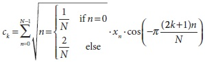

## [П]|[РС]|(РП) Дискретно косинусное преобразование

Зачастую для вычислений с участием вещественных данных достаточно только половины дискретного преобразования Фурье. Дискретно косинусное преобразование (ДКП) определяется аналогично полному ДПФ по следующей формуле:



Стоит отметить тот факт, что по соглашению, коэффициент нормализации применяется как к косинусному, так и к обратному преобразованию. И конечно, есть подобное преобразование и для более высших размерностей.

Основная идея ДПФ применима и к ДКП, только все коэффициенты вещественного типа. Внимательный читатель может возразить, что косинусное преобразование применяется к вектору, который явно не является функцией. Однако, алгоритм *cvDCT()* обрабатывает вектор так, как если бы он был продлен до отрицательных показателей зеркально. 

```cpp
void cvDCT(
     const CvArr*   src
    ,CvArr*         dst
    ,int            flags
);
```

Функция *cvDCT()* ожидает аргументы, такие же как и для *cvDFT()* за исключением того, что поскольку результат состоит из действительных чисел, то нет необходимости в специальной упаковке результирующего массива (или исходного массива в случае обратного преобразования). Аргумент *flags* может быть установлен в *CV_DXT_FORWARD* или *CV_DXT_INVERSE*, которые могут быть скомбинированы с *CV_DXT_ROWS* с тем же эффектом, как у *cvDFT()*. Из-за различных соглашений по нормализации, прямое и обратное косинусное преобразование всегда содержат соответствующие вклады в общую нормализацию преобразования; следовательно *CV_DXT_SCALE* не играет никакой роли в *cvDCT()*.

