## [П]|[РС]|(РП) Дискретное преобразование Фурье (ДПФ)

Для произвольного набора значений, которые проиндексированы дискретным (целочисленным) параметром, возможно определить дискретное преобразование Фурье (ДПФ), аналогичное по виду преобразованию Фурье для непрерывной функции (Джозеф Фурье был первым, кто обнаружил, что некоторые функции могут быть разложены в бесконечный ряд других функций - это привело к появлению раздела, названного анализ Фурье. Некоторые ключевые моменты, связанные с разложением функций в ряд Фурье, можно найти у Morse для физиков в частности и у Papoulis в общем. Быстрое преобразование Фурье было изобретено Cooley и Tukeye в 1965, хотя основные моменты самой идеи были предложены еще Карлом Гауссом в 1805. Первое упоминание об использовании разложения в ряд Фурье в компьютерном зрении можно найти у Ballard и Brown). Для N комплексных чисел  одномерное ДПФ определяется по следующей формуле (где i = 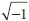):

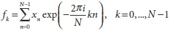

Подобное преобразование может быть определено для двумерного массива чисел (разумеется существуют аналоги и для массивов более высших порядков):

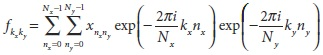

В общем, можно ожидать, что на вычисление N разных членов 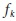 потребуется O(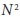) операций. На самом деле, существует несколько алгоритмов *быстрого преобразования Фурье* (БПФ), способных вычислять эти величины за время O(NlogN). Функция OpenCV *cvDFT()* реализует один из таких алгоритмов БПФ. Функция *cvDFT()* вычисляет БПФ для одномерных и двумерных исходных массивов. Для последнего случая, может быть вычислено двумерное преобразование, либо, если указано, одномерное преобразование для каждого независимого ряда (эта операция намного быстрее, чем вызов *cvDFT()* для каждого отдельного случая).

```cpp
void cvDFT(
     const CvArr*   src
    ,CvArr*         dst
    ,int            flags
    ,int            nonzero_rows = 0
);
```

Исходный и конечный массивы могут быть вещественного типа одно- или двухканальными. В случае одноканального (исходного) массива, элементами являются действительные значения, а выходные значения будут упакованы в специальный, компактный формат (унаследованный от старой библиотеки IPL, так же, как и структура *IplImage*). В случае двухканального (исходного) массива, два канала будут интерпретироваться как действительные и мнимые компоненты входных данных. В этом случае не будет никакого особенного упаковывания результатов; тем самым будет потеряно некоторое пространство, заполненное множеством нулей как в исходном, так и в конечном массивах (При использовании этого метода необходимо явно устанавливать мнимые компоненты в нули в двухканальном представлении. Простой способ сделать это - создать матрицу заполненную нулями при помощи *cvZero()* для мнимой части, а затем вызвать *cvMerge()* вместе с матрицей действительных чисел, чтобы сформировать временный массив комплексных чисел и выполнить *cvDFT()*. Эта процедура приведет к выводу полноразмерной, неупакованной, комплексной матрицы спектра).

Форматы специально упакованных выходных данных для случая с одноканальным выходным массивом.

Для одномерного массива:

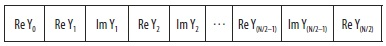

Для двумерного массива:

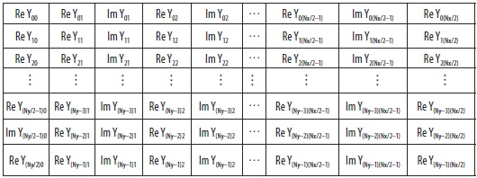

Стоит заострить внимание на индексах этих массивов. Проблема в том, что некоторые значения гарантированно нулевые (если более точно, то некоторые значения  гарантированно только действительные). При этом стоит отметить, что последний ряд таблицы будет присутствовать только если 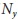 нечетно, а последняя колонка будет присутствовать только если 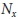 нечетно. (В случае двумерного массива, рассматриваемого как  одномерных массивов, вместо полноценного двумерного преобразования, все выходные строки будут аналогичны единственной строке одномерного массива).

Третий аргумент *flags* определяет тип операции. *Прямое преобразование* задаётся флагом *CV_DXT_FORWARD*. *Обратное преобразование* определяется схожим образом, за исключением смены знака у экспоненты и масштабного коэффициента (При обратном преобразовании, входные данные упаковываются в специальный формат. Это имеет смысл, т.к. если вызывать прямое ДПФ, а затем обратное ДПФ, то результатом должны быть исходные данные - это произойдёт только в том случае, если используется флаг *CV_DXT_SCALE*). Для выполнения обратного преобразования без масштабного коэффициента, используется флаг *CV_DXT_INVERSE*. Флаг *CV_DXT_SCALE* отвечает за масштабный коэффициент - это приводит к масштабированию результата на величину 1/N (или 1/( ) для двумерного преобразования). Этот флаг используется, если в результате последовательности прямого и обратного преобразования над исходными данными необходимо получить исходные данные в том же виде. Т.к. довольно-таки часто приходиться использовать сочетание флагов *CV_DXT_INVERSE* и *CV_DXT_SCALE*, существует несколько сокращенных записей для операций такого рода. В дополнение к простому комбинированию этих флагов при помощи операции *OR*, можно воспользоваться флагом *CV_DXT_INV_SCALE* (или *CV_DXT_INVERSE_SCALE*, если короткие записи "не по вкусу"). И последний вариант флага, который может быть задействован, *CV_DXT_ROWS* указывает *cvDFT()* обрабатывать двумерный массив как набор одномерных, каждый из которых должен быть преобразован независимо, так будто имеется  независимых векторов длинною . Это значительно снижает накладные расходы на выполнение множества одновременных преобразований (особенно при использовании библиотеки Intel IPP). Использование флага *CV_DXT_ROWS* позволяет осуществить трехмерное (или выше) ДПФ.

Прежде, чем осознать назначение последнего аргумента *nonzero_rows*, необходимо немного отвлечься. В общем, алгоритмы ДПФ сильно зависят от длин векторов или размерностей массивов. В большинстве алгоритмах ДПФ, предпочитаемые размеры должны быть степени двойки (т.е. 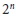 для целого n). В случае алгоритма, используемого в OpenCV, предпочтение отдается векторам длинною, или массивам размерностью, равными 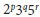 для некоторых целых p, q и r. Поэтому, как правило, создается несколько больший массив (для этих целей существует удобная функция *cvGetOptimalDFTSize()*, которая принимает длину вектора, а возвращает первый приемлемый размер, больший или равный длине вектора) с последующим использованием *cvGetSubRect()* для копирования исходного массива в более вместительный массив с нулями в конце. Помимо необходимости занулять окончание, *cvDFT()* так же можно указать, что эти строки не нужно преобразовывать, а просто добавлять после реальных данных (или, если выполняется обратное преобразование, то указать, что эти строки не нужны). В любом случае, параметр *nonzero_rows* указывает какое количество строк нужно проигнорировать. Это немного экономит вычислительное время.


### Перемножение спектров

В большинстве приложений, которые используют ДПФ, также требуется вычисление поэлементного произведения двух спектров. Поскольку результат обычно упаковывается в специальный уплотненный формат и, как правило, значения - это комплексные числа, было бы утомительно распаковывать их и выполнять произведение при помощи "обычных" матричных операций. К счастью, OpenCV предоставляет удобную функцию *cvMulSpectrums()* для выполнения этих и ещё нескольких других полезных операций. 

```cpp
void cvMulSpectrums(
     const CvArr*   src1
    ,const CvArr*   src2
    ,CvArr*         dst
    ,int            flags
);
```

Первые два параметра - это обычные массивы, хотя на самом деле это спектры, полученные в результате вызова *cvDFT()*. Третьим параметром должен быть указатель на массив - того же типа и размера, что и исходные два массива - в него будет помещен результат. Последний аргумент *flags* указывает *cvMulSpectrums()*, что конкретно необходимо выполнить. В частности, он может быть установлен в 0 (*CV_DXT_FORWARD*) для выполнения перемножения исходных массивов или в *CV_DXT_MUL_CONJ* для выполнения перемножения элемента первого массива на соответствующее комплексное сопряженное элемента второго массива. Флаги допускается комбинировать с *CV_DXT_ROWS* для двумерного случая, при условии, что каждый ряд массива должен трактоваться как отдельный спектр (помните, при создании массивов спектров с флагом *CV_DXT_ROWS* упаковка данных несколько отличается от той, что была бы, если бы этот флаг не использовался, так что следует быть последовательными в методе вызова *cvMulSpectrums()*).


### Свертка и ДПФ

Существует возможность существенно увеличить скорость свертки, используя ДПФ по теореме свертки, которая соотносит свертку в пространственном пространстве с произведением в пространстве Фурье (Алгоритм ДПФ в OpenCV использует БПФ в тех случаях, когда размеры данных позволяют это сделать). Для выполнения этого сначала потребуется выполнить преобразование Фурье над изображением, а затем преобразование Фурье над сверточным фильтом. После этого свертка может быть выполнена в пространстве преобразования за линейное время по отношению к количеству пикселей на изображении. Пример 6-5, взятый из справки по OpenCV, отображает вычисление подобной свертки.

Пример 6-5. Использование *cvDFT()* для ускоренного вычисления свертки

```cpp
// Использование ДПФ для ускоренного вычисления свертки массива A ядром B.
// Результат размещается в массиве V.
// 
void speedy_convolution(
    const CvMat*    A   // Размер: M1xN1
    ,const CvMat*   B   // Размер: M2xN2
    ,CvMat*         C   // Размер: (A->rows+B->rows-1)x(A->cols+B->cols-1)
) {
    int dft_M = cvGetOptimalDFTSize( A->rows+B->rows-1 );
    int dft_N = cvGetOptimalDFTSize( A->cols+B->cols-1 );

    CvMat* dft_A = cvCreateMat( dft_M, dft_N, A->type );
    CvMat* dft_B = cvCreateMat( dft_M, dft_N, B->type );
    CvMat tmp;

    // Копирование A в dft_A и дополнение dft_A нулями в конце
    //
    cvGetSubRect( dft_A, &tmp, cvRect(0,0,A->cols,A->rows));
    cvCopy( A, &tmp );
    cvGetSubRect(
         dft_A
        ,&tmp
        ,cvRect( A->cols, 0, dft_A->cols-A->cols, A->rows )
    );
    cvZero( &tmp );

    // Нет необходимости дополнять нижнюю часть dft_A нулями, т.к. 
    // используется параметр nonzero_rows в вызове cvDFT()
    //
    cvDFT( dft_A, dft_A, CV_DXT_FORWARD, A->rows );

    // Выполнение тех же операций над вторым массивом
    //
    cvGetSubRect( dft_B, &tmp, cvRect(0, 0, B->cols, B->rows) );
    cvCopy( B, &tmp );
    cvGetSubRect(
         dft_B
        ,&tmp
        ,cvRect( B->cols, 0, dft_B->cols-B->cols, B->rows )
    );
    cvZero( &tmp );

    // Нет необходимости дополнять нижнюю часть dft_B нулями, т.к.
    // используется параметр nonzero_rows в вызове cvDFT()
    //
    cvDFT( dft_B, dft_B, CV_DXT_FORWARD, B->rows );

    // Или CV_DXT_MUL_CONJ, чтобы получить корреляцию вместо свертки
    //
    cvMulSpectrums( dft_A, dft_B, dft_A, 0 );

    // Вычисление только верхней части
    //
    cvDFT( dft_A, dft_A, CV_DXT_INV_SCALE, C->rows );
    cvGetSubRect( dft_A, &tmp, cvRect(0, 0, conv->cols, C->rows) );

    cvCopy( &tmp, C );

    cvReleaseMat( dft_A );
    cvReleaseMat( dft_B );
}
```

В примере 6-5 можно увидеть, что исходные массивы сначала создаются, а затем инициализируются. После создаются два новых массива, размерность которых оптимальна для алгоритма ДПФ. Исходные массивы копируются в эти новые массивы, а затем выполняется преобразование. В заключении, спектры перемножаются и к перемножению применяется обратное преобразование. Преобразование - наиболее медленная часть (под "наиболее медленным" подразумевается "асимптотически наиболее медленный" - иными словами, эта часть алгоритма требует больше времени для очень больших N. Это важное отличие. На практике, как было показано в предыдущей секции о свертке, не всегда оптимально расходовать время при преобразовании в пространство Фурье. В общем, выполняя свертку с малым ядром, не стоит производить подобное преобразование) всей операции; изображение NxN требует времени O( log N), что соответствует всему времени вычислений (при условии, что N>M для сверточного ядра размером MxM). Это намного быстрее, чем O( 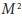) затрачиваемое на более простой не-ДПФ метод.

