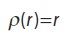
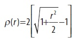
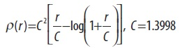
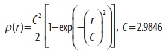
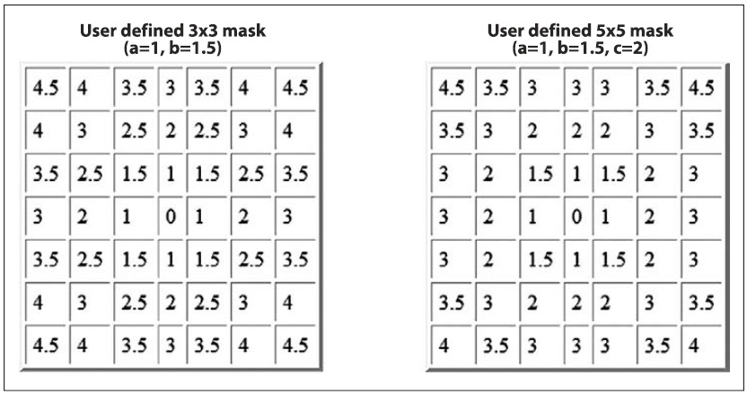
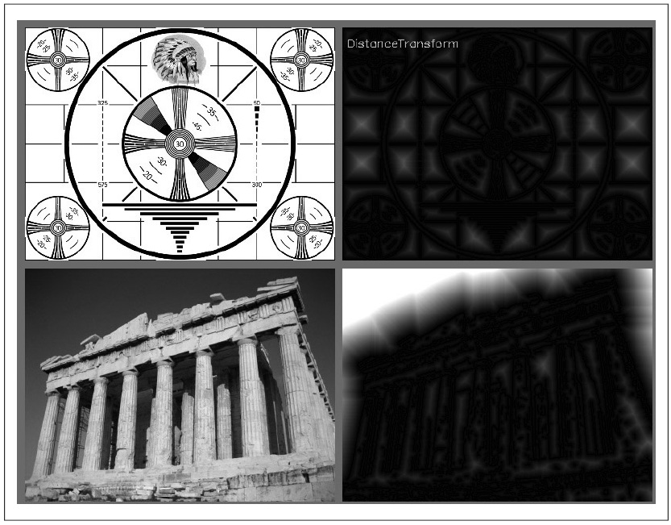

## [П]|[РС]|(РП) Дистанционные преобразования

*Дистанционное преобразование* для изображения определяется как новое изображение, в котором каждый пиксель установлен в значение, равное расстоянию до ближайшего нулевого пикселя в исходном изображении. Должно быть очевидным, что типичным входом дистанционного преобразования должен быть край изображения. В большинстве приложений входом дистанционного преобразования является выход от детектора краев, такого как Canny, который в свою очередь был ещё и инвертирован (так что края имеют нулевые значения, а не края ненулевые).

На практике, дистанционное преобразование осуществляется при помощи маски: матрицы 3x3 или 5x5. Каждая точка в массиве определяет "расстояние", связанное с точкой в конкретной позиции по отношению к центру маски. Увеличение расстояния строится (и таким образом аппроксимируется) в виде последовательности "ходов", определяемых в маске. Это означает, что использование большой маски дает более точные расстояния.

В зависимости от желаемых показателей расстояния, соответствующая маска автоматически выбирается из набора, известного OpenCV. Помимо этого, можно запросить вычислить "точные" расстояния по некоторой формуле, соответствующей выбранным показателям, однако это заметно замедляет процесс вычислений. 

Дистанционный показатель может быть любым из доступных типов, включая классический L2 (декартовый) дистанционный показатель; полный список в таблице 6-2. В добавок к этому можно определить пользовательские показатели и связать с ними собственную маску.

Таблица 6-2. Возможные значения для аргумента *distance_type* *cvDistTransform()*

| Значение distance_type | Метрика |
| -- | -- |
| CV_DIST_L2 |  |
| CV_DIST_L1 |  |
| CV_DIST_L12 |  |
| CV_DIST_FAIR |  |
| CV_DIST_WELSCH |  |
| CV_DIST_USER | Пользовательская метрика |

При вызове функции дистанционного преобразования, конечное изображение должно быть 32-битным вещественным (т.е. *IPL_DEPTH_32F*).

```cpp
void cvDistTransform(
     const CvArr*   src
    ,CvArr*         dst
    ,int            distance_type = CV_DIST_L2
    ,int            mask_size = 3
    ,const float*   kernel = NULL
    ,CvArr*         labels = NULL
);
```

При вызове *cvDistTransform()* можно использовать несколько дополнительных параметров. Первый, *distance_type*, указывает на тип дистанционной метрики. Возможные значения для этого аргумента были определены в Borgefors (1986).

Далее аргумент *mask_size*, который может быть 3 (*CV_DIST_MASK_3*) или 5 (*CV_DIST_MASK_5*); в альтернативе, расчеты можно произвести и без ядра (*CV_DIST_MASK_PRECISE*). Аргумент *kernel* - это расстояние маски, которое будет использовано в случае пользовательской метрики. Эти ядра строятся по методу Gunilla Borgefors, и два примера таких ядер показаны на рисунке 6-20. Последний аргумент *labels* указывает, что ассоциации должны быть выполнены между отдельными точками и ближайшими связными компонентами, состоящих из нулевых точек. Если *label != NULL*, то это указатель на массив целых значений того же размера, что и исходное и конечное изображения. Когда функция возвращает результат, по этому изображению можно определить какой из объектов был ближе всего к конкретной точке на стадии рассмотрения. На рисунке 6-21 показано конечное дистанционное преобразование на тестовом шаблоне и фотографии.



Рисунок 6-20. Две маски пользовательского дистанционного преобразования



Рисунок 6-21. Используется детектор границ Кенни с параметрами param1 = 100 и param2 = 200; поэтому для повышения видимости дистанционное преобразование производится с масштабным коэффициентом 5

