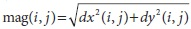

## [П]|[РС]|(РП) Упражнения

1. Используя *cvFilter2D()*, создайте фильтр, который определит только линии под 60 градусов к горизонту. Отобразите довольно-таки интересный результат. 

2. Разделяемые ядра. Создайте ядро Гаусса 3x3, используя следующие значения по строкам [(1/16, 2/16, 1/16), (2/16, 4/16, 2/16), (1/16, 2/16, 1/16)], с якорем по середине.

	a. Используйте это ядро на любом изображении и отобразите результат

	b. Теперь создайте два одномерных ядра с якорем по центру: матрица строка (1/4, 2/4, 1/4) и матрица столбец (1/4, 2/4, 1/4). Загрузите любое изображение и примените к нему *cvFilter2D()*, чтобы выполнить свертку дважды, один раз с первым одномерным ядром и один раз со вторым одномерным ядром. Опишите результат.

	c. Опишите порядок сложности (количество операций) для ядра из пункта a и ядра из пункта b. Разницу в преимуществах от использования разделяемых ядер и всего класса фильтров Гаусса - и любого линейно нестабильного фильтра, который разделим, а свёртка является линейной операцией.

3. Можно ли сделать разъемное ядро из фильтра с рисунка 6-5? Если да, то покажите, как оно выглядит.

4. Нарисуйте серию концентрических окружностей в форме, напоминающей мишени в таких видах спорта, как стрельба из лука или дартс (например, в PowerPoint)

	a. Нарисуйте серию линий, сходящихся в центре окружностей.

	b. Воспользуйтесь апертурой размера 3x3 и получите производные первого порядка по осям x и y. Затем повторите с увеличенной апертурой 5x5, 9x9 и 13x13. Опишите результаты.

5. Создайте изображение, состоящие из чередующихся черных и белых линий, расположенных под углом 45 градусов к горизонту. Для получения нескольких размеров апертур, сначала получите производную первого порядка по оси x (dx), а затем производную первого порядка по оси y (dy). Затем снимите мерку для этих линий следующим образом: dx и dy будут представлять градиент для входного изображения, магнитуда точки (i,j) будет вычисляться по формуле , а угол по формуле θ(i,j) = arctan( dy(i,j)×dx(i,j) ). Просканируйте изображение и найдите места где магнитуда равна или близка к максимуму. Зафиксируйте значение угла в этих местах. Вычислите средний угол и зафиксируйте его как угол для линий.

	a. Проделайте все это по новой с апертурой 3x3 фильтра Собеля.

	b. Проделайте все это по новой с апертурой 5x5.

	c. Проделайте все это по новой с апертурой 9x9.

	d. Изменяется ли результат? Если да, то почему?

6. Найдите и загрузите фотографию лица, где лицо фронтально, глаза открыты и лицо занимает большую часть изображения. Напишите код, который найдет зрачки глаз.

	*Лапласиане "нравиться" яркая центральная точка, окруженная темнотой. Зрачок как раз-таки соответствует противоположному варианту. Инвертируйте и найдите свертку для достаточно большого Лапласиана*

7. В этом упражнение мы научимся подбирать хорошие значения *lowThresh* и *highThresh* для *cvCanny()*. Загрузите любое изображение с довольно таки необычной структурой линий. В данном упражнении используйте три различных соотношения высокий:низкий порог: 1.5:1, 2.75:1 и 4:1. 

	a. Зафиксируйте результат с величиной высокого порога меньшего, чем 50.

	b. Зафиксируйте результат с величиной высокого порога между 50 и 100.

	c. Зафиксируйте результат с величиной высокого порога между 100 и 150.

	d. Зафиксируйте результат с величиной высокого порога между 150 и 200.

	e. Зафиксируйте результат с величиной высокого порога между 200 и 250.

	f. Дайте оценку полученным результатам и объясните какой из указанных вариантом подходит лучше всего.

8. Загрузите изображение, содержащее четкие линии и окружности (например, вид велосипеда сбоку). Воспользуйтесь линиями и окружностями Хафа и оцените получаемые результаты. 

9. Придумайте способ, если сможете, использования преобразования Хафа для выявления каких-либо фигур с ярко выраженными краями.

10. Взгляните на диаграмму на которой функция лог-полярного преобразования превращает квадрат в волнистую линию.

	a. Какой результат будет получен в результате размещения центра функции лог-полярного преобразования в одном из углов квадрата.

	b. Что бы круг после лог-полярного преобразования выглядел как круг, центральная точка должна быть внутри или вблизи края круга?

	c. Что будет если разместить центральную точку за пределами круга?

11. Лог-полярное преобразование может обрабатывать фигуры различных размеров и разворотов в пространстве, со сдвигами по осям *θ* и *log(r)*. Преобразование Фурье является инвариантным. Как можно использовать эти факты, чтобы автоматически получать из фигур различных размеров и разворотов эквивалентные представления в лог-полярном представлении?

12. Нарисуйте несколько изображений, состоящих из: больших квадратов, маленьких квадратов, из больших развернутых квадратов, из маленьких развернутых квадратов. Выполните лог-полярное преобразование для каждого изображения в отдельности. Добавьте бегунок к каждой картинке и "свяжите" его с центральной точкой. Сдвигайте центральные точки до тех пор, пока результаты не будут максимально идентичными.

13. Возьмите преобразование Фурье небольшого распределения Гаусса и преобразование Фурье изображения. Перемножьте их и возьмите обратное преобразование от результата перемножения. Что получилось? 

14. Возьмите любое интересное изображение, конвертируйте его в черно-белое и получите интегральное изображение. Теперь найдите вертикальные и горизонтальные края при помощи свойств интегрального изображения. 

	*Используйте длинные узкие прямоугольники*

15. Объясните, как при помощи дистанционных преобразований можно выправить известную фигуру при помощи тестовой фигуры, при условии, что масштабный коэффициент известен и зафиксирован. Как это можно сделать при помощи нескольких изменений масштабного коэффициента?

16. Попрактикуйтесь в корректировке гистограмм любых интересных вам изображений.

17. Загрузите любое изображение, примените перспективное преобразование и разверните. Можно ли выполнить данное преобразование за один шаг?

