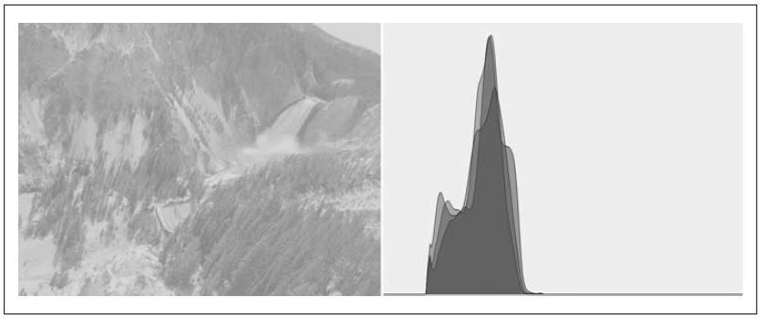
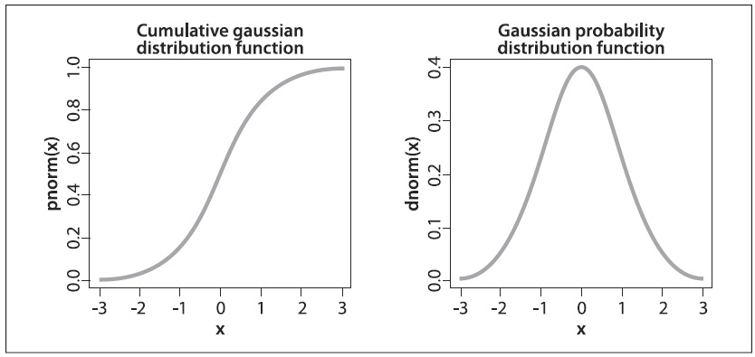
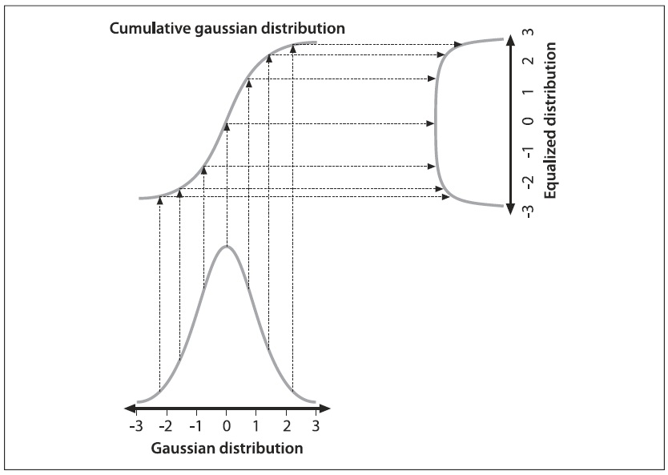
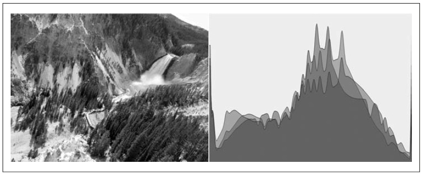

## [П]|[РС]|(РП) Коррекция гистограмм

Камеры и детекторы изображений должны, как правило, заниматься обработкой не только контраста, но и света от датчиков изображения. В стандартной камере затвор и диафрагма объектива попеременно подают на датчики либо слишком много, либо слишком мало света. Часто диапазон контрастов слишком велик для датчиков; следовательно, существует компромисс между сбором данных темных областей (например, теней), которые требуют увеличения времени экспозиции, и светлых областей, которые требуют малого времени экспозиции, чтобы избежать "пересвета".

После того, как снимок сделан, уже не возможно изменить то, что записывается датчиком; однако, все еще возможно попытаться расширить динамический диапазон изображения. Наиболее часто используемым методом для этого является коррекция гистограмм (Может возникнуть вопрос, почему данная тема не рассматривается в главе 7; причина в том, что коррекция гистограмм не использует явно какой-либо тип гистограмм данных. Даже с учетом того, что гистограмма зашита внутри, функция (с точки зрения разработчика) не запрашивает гистограмму в явном виде. Коррекция гистограмм - это старый математический метод; его применение в обработке изображений было описано в различных учебниках, на научных конференциях и даже в биологическом зрении). На рисунке 6-22 видно, что левое изображение бедно, т.к. диапазон изменений значений невелик. Это видно по гистограмме интенсивности справа. Т.к. представлено 8-битное изображение, то его значения интенсивности могут изменяться в диапазоне от 0 до 255, однако, гистограмма показывает, что фактические значения интенсивности сгруппированы вблизи середины доступного диапазона. Коррекция гистограммы - это метод растяжки этого диапазона.



Рисунок 6-22. Изображение слева имеет плохую контрастность, что подтверждает гистограмма значений интенсивности справа

Лежащая в основе коррекции гистограмм математика включает в себя отображение одного распределения (учитывающее значения интенсивности гистограммы) на другое распределение (в ширину и, в идеале, равномерно распределяя значения интенсивности). Т.е. требуется раскидать y-значения первоначального распределения как можно равномернее в новом распределении. Оказывается, что есть хорошее решение проблемы распространения распределения значений: функция повторного отображения должна быть *интегральной функцией распределения*. Пример интегральной функции плотности показан на рисунке 6-23 для несколько идеализированного случая распределения, которое изначально было чисто Гауссовым. Тем не менее, совокупная плотность может быть применена к любому распределению; это просто текущая сумма первоначального распределения от отрицательного до положительного предела.

Функцию распределения можно использовать для переназначения первоначального распределения в качестве равномерного распространения распределения (рисунок 6-24), просто просматривая каждое y-значение в первоначальном распределении и отслеживая направление равномерного распределения.



Рисунок 6-23. Интегральная функция распределения (слева) и Гауссово распределение (справа)



Рисунок 6-24. Использование интегральной функции плотности для выравнивания распределения Гаусса

Для непрерывного распределения результат будет точным, но для цифровых/дискретных распределений результаты могут быть далеко не однородными.

В результате применения процесса выравнивания к рисунку 6-22 происходит выравнивание гистограммы распределения интенсивности; результирующее изображение на рисунке 6-25. Весь этот процесс "зашит" в одной функции:

```cpp
void cvEqualizeHist(
     const CvArr*   src
    ,CvArr*         dst
);
```



Рисунок 6-25. Результат выравнивания гистограммы

В *cvEqualizeHist()* исходное и конечное изображения должны быть одноканальными, 8-битными, одного и того же размера. В случае цветных изображений, каждый канал обрабатывается по отдельности.

