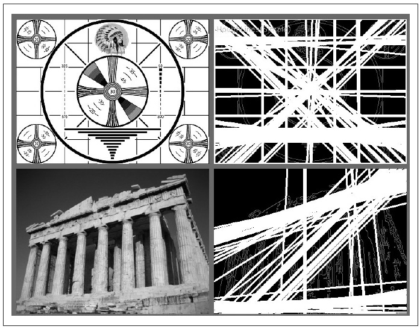
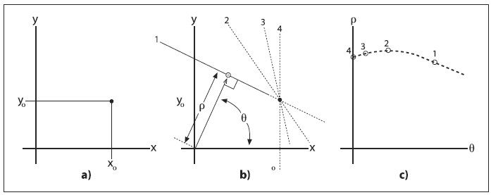
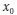
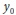
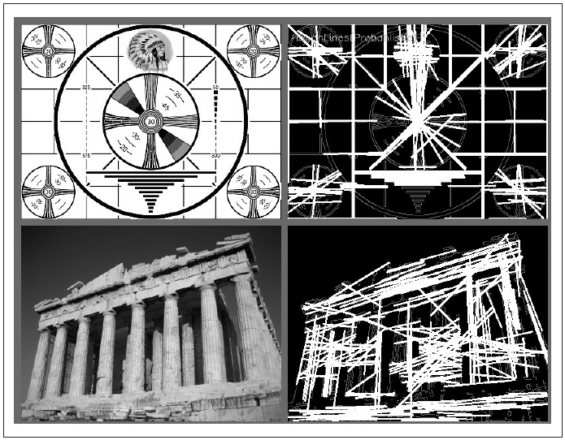
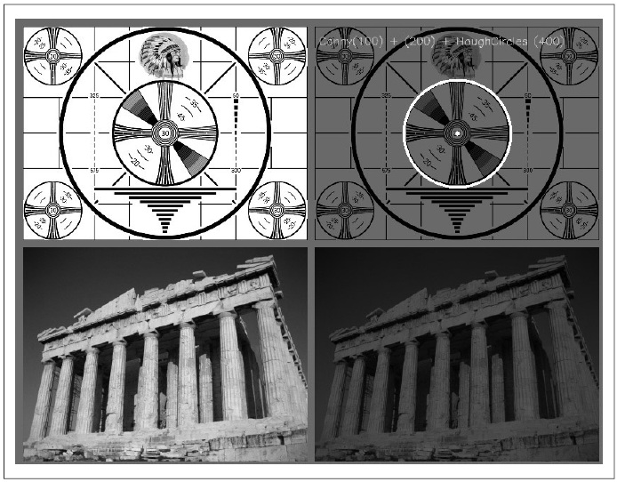

## [П]|[РС]|(РП) Преобразования Хафа

Преобразования Хафа - это метод нахождения линий, кругов и других простых форм на изображении (Хаф разработал данное преобразование для применения в физических экспериментах. Внедрение преобразования для решения задач компьютерного зрения осуществили Duda и Hart). Первоначально преобразование Хафа применялось для нахождения линий, т.к. является относительно быстрым способом нахождения прямых линий на бинарном изображении. В дальнейшем данное преобразование обобщили для более сложных задач, чем просто поиск линий. 


### Преобразование Хафа для линий

Теоретической подоплекой преобразования Хафа для линий является то, что любая точка на бинарном изображении, возможно, является частью некоторого множества линий. Если описать каждую линию по её наклону *a* и сдвигу *b* {**Roman**: наклон и пересечение (или наклон-сдвиг) - параметры уравнения прямой *y = k•x + b*, где *k* - угловой коэффициент прямой, вычисляемый через тангенс, а пересечение *b* - коэффициент сдвига прямой по оси *y* так, чтобы прямая пересекала ось *y* на высоте *b*}, то точка на исходном изображении преобразуется во множество точек на плоскости *(a, b)*, соответствующие всем линиям, проходящих через эту точку (рисунок 6-9). Если преобразовать каждый ненулевой пиксель во входном изображении в такой набор точек в выходном изображении и просуммировать все подобные внесения, тогда линия, появившаяся на входном изображении (то есть на плоскости *(x,y)*) будет соответствовать локальному максимуму в выходном изображении (то есть на плоскости *(a,b)*). Поскольку суммируется вклад от каждой точки, плоскость *(a,b)* принято называть накопительной плоскостью (в дальнейшем просто накопитель). 

Может оказаться, что плоскость вида наклон-сдвиг не лучший способ представления всех линий, проходящих через точку (из-за значительно различной плотности линий в зависимости от наклона и от того, что интервал возможных наклонов лежит в диапазоне от –∞ до +∞) {**Roman** - бесконечности из-за того, что наклон рассчитывается через тангенс}. По этой причине, в численных расчетах используется другая параметризация преобразования изображения. Предпочтительная параметризация представляет каждую линию как точку в полярных координатах (*ρ*, *θ*), при этом эта линия проходит через указанную точку, но линия должна быть перпендикулярной к радиус-вектору от начала координат до этой точки на линии (рисунок 6-10). Уравнение для такой прямой: 

*ρ* = *x*cos*θ* + *y*sin*θ*



Рисунок 6-9. Преобразование Хафа для линий находит множество линий на каждом изображении. Некоторые из них ожидаемые, но другие могут не быть таковыми



Рисунок 6-10. Точка (, ) на плоскости изображения (график *a*) соответствует множеству линий, каждая из которых параметризирована разными *ρ* и *θ* (график *b*); каждая из этих линий соответствует точкам на плоскости (*ρ*, *θ*), которые, будучи собранными вместе, образуют кривую характеристической формы (график *c*)

Алгоритм преобразования Хафа не является явным для пользователя. Вместо этого он просто возвращает локальный максимум на плоскости (*ρ*, *θ*). Однако, необходимо понимать процесс преобразования, чтобы осознавать назначения входных аргументов функции, выполняющая преобразования Хафа для линий.

OpenCV поддерживает два вида преобразований Хафа для линий: *обычное преобразование Хафа* (SHT) и *прогрессивное (улучшенное) вероятностное преобразование Хафа* (PPHT). Ранее уже был рассмотрен алгоритм SHT. PPHT является его разновидностью и также вычисляет протяжённость каждой линии в дополнение к их наклону (рисунок 6-11). Алгоритм назван "вероятностным", т.к. вместо добавления каждой возможной точки на накопительную плоскость, он добавляет только часть из них. Идея состоит в том, что если существует максимум на плоскости, то, в любом случае, хотя бы частичное попадание в этот максимум будет достаточным условием, чтобы обнаружить линию; как результат - существенное снижение времени выполнения вычислений. Для обоих случаев в OpenCV существует одна функция, которая, в зависимости от входных параметров, принимает решение о выполнение того или иного метода. 

```cpp
CvSeq* cvHoughLines2(
     CvArr* image
    ,void*  line_storage
    ,int    method
    ,double rho
    ,double theta
    ,int    threshold
    ,double param1 = 0
    ,double param2 = 0
);
```

Первый аргумент - это исходное изображение. Оно должно быть 8-битным, но при этом будет трактоваться как бинарное (т.е. все ненулевые значения будут восприниматься как равные единицы). Второй аргумент - указатель на место, где будет храниться результат, который может быть либо хранилищем в памяти (*CvMemoryStorage* из главы 8), либо матрицей размера *Nx1* (при этом количество строк *N* будет также еще ограничивать максимальное число возвращаемых линий). Следующий аргумент *method* может быть *CV_HOUGH_STANDARD*, *CV_HOUGH_PROBABLISTIC*, *CV_HOUGH_MULTI_SCALE* для SHT, PPHT и многопараметрического варианта SHT (MSHT) соответственно. 

Следующие два аргумента, *rha* и *theta*, устанавливают желательное разрешение для линий (т.е. разрешение накопительной плоскости). Параметр *rho* вычисляется в пикселях, а параметр *theta* в радианах, поэтому накопительную плоскость можно рассматривать как двухмерную гистограмму с ячейками размерностью *rho* пикселей на *theta* радиан. Значение параметра *threshold* определяет величину, при достижении которой сообщается о нахождении линии. Этот последний параметр на практике несколько мудрён, при чем он не нормализуется, поэтому ожидается, что сам разработчик будет его масштабировать с учетом роста размерности входного изображения для алгоритма SHT. Помните, этот параметр, в действительности, определяет количество точек, которое должна содержать линия, чтобы быть добавленной в возвращаемый список линий. 



Рисунок 6-11. Сначала выполнен проход при помощи детектора границ *Canny* (*param1 = 50*, *param2 = 150*), результат показан в оттенках серого. Затем произведено прогрессивное вероятностное преобразование Хафа (*param1 = 50*, *param2 = 10*), результат показан белым. Заметьте, что преобразование Хафа в основном правильно обнаруживает чёткие линии

Аргументы *param1* и *param2* алгоритм SHT не использует. Для алгоритма PPHT *param1* задает минимальную длину для возвращаемого сегмента линии, а аргумент *param2* задает расстояние между коллинеарными сегментами, необходимое для того, чтобы алгоритм не склеил их вместе в один сегмент большей длины. Для многопараметрического варианта SHT эти два параметра применяются для указания наивысшего разрешения до которого параметры возвращаемых линий должны быть вычислены. Многопараметрический SHT сначала вычисляет положение линий с учетом разрешений *rho* и *theta*, а затем начинает уточнение результатов до степени параметров *param1* и *param2* соответственно (т.е. конечное разрешение *rho* – это *rho* делённое на *param1*, а конечное разрешение для *theta* равно *theta* делённому на *param2*). 

Возвращаемое значение функции зависит от входных параметров. Если параметр *line_storage* матрица, тогда возвращаемое значение будет NULL. В этом случае, матрица должна быть типа *CV_32FC2* для SHT или многопараметрического SHT и *CV_32SC4* для PPHT. В первых двух случаях величины *ρ* и *θ* для каждой линии будут размещены в двух каналах массива. В случае PPHT, четыре канала будут содержать значения *x* и *y* для начальной и конечной точек возвращаемого сегмента. И для всех этих случаев, количество строк в массиве будет обновлено функцией *cvHoughLines2()* до количества возвращаемых линий. 

Если параметр *line_storage* содержит указатель на хранилище в памяти (более подробно об этом будет рассказано в главе 8), тогда возвращаемым значением будет указатель на структуру последовательности *CvSeq*. В этом случае, можно получить каждую линию или сегмент линии из последовательности при помощи подобной команды:

```cpp
float* line = (float*) cvGetSeqElem( lines, i );
```

где *lines* это возвращаемое значение функции *cvHoughLines2()*, а *i* - индекс запрашиваемой линии. В этом случае, *line* будет указателем на данные запрашиваемой линии, при чем *line[0]* и *line[1]* будут действительными числами, соответствующие значениям *ρ* и *θ* (для SHT и MSHT), либо указателем на структуру из парных значений *CvPoint* для начальной и конечной точек сегмента (для алгоритма PPHT). 


### Преобразование Хафа для окружностей

Преобразование Хафа для окружностей (рисунок 6-12) работает почти аналогично только что описанному преобразованию Хафа для линий. "Почти" только лишь потому, что - если выполнить точно аналогичные действия - накопительная плоскость будет замещена плоскостью объема с тремя измерениями: одно для *x*, одно для *y* и последнее для радиуса круга *r*. Это приводит к значительно большим затратам памяти и значительно меньшей скорости выполнения. Реализация преобразования Хафа для окружности в OpenCV уходит от этой проблемы, применяя несколько более хитрый метод, называемый *градиентным методом Хафа*.

Градиентный метод Хафа работает следующим образом. Вначале изображение проходит фазу поиска краев (использование функции *cvCanny()*). Затем для каждой ненулевой точки краев изображения ищется локальный градиент (вычисляется путем расчета производных Собеля первого и второго порядка для *x* и *y* при помощи функции *cvSobel()*). Используя этот градиент, каждая точка линии обозначается как наклон - от установленного минимума до указанного максимального расстояния - итерационно изменяя накопитель. В тоже время, запоминается расположение каждой ненулевой точки на изображении краев. Центры-кандидаты затем выбираются из тех точек (двухмерного) накопителя, величины которых выше заданного порога и, одновременно, больше всех их непосредственных соседей. Эти центры-кандидаты сортируются в порядке убывания их величины в накопителе, так, что центры с наибольшим количеством пикселей выбираются первыми. Далее, для каждого центра, анализируются все ненулевые пиксели. Эти пиксели сортируются в соответствии с их расстоянием от центра. Обрабатывая от наименьших расстояний до наибольших радиусов, выбирается единственный радиус, который лучше всего подходит ненулевым пикселям. Центр сохраняется, если он имеет достаточное количество ненулевых пикселей на краях изображения и если расстояние от любого ранее выбранного центра удовлетворяет заданному значению. 

Эта реализация позволяет алгоритму выполняться намного быстрее и, что еще более важно, позволяет обойти проблему разрастания трехмерного накопителя, что приводит к значительно большому зашумлению и нестабильно отражаемому результату. С другой стороны, этот алгоритм имеет несколько недостатков.



Рисунок 6-12. Преобразование Хафа для круга находит несколько кругов на тестовом шаблоне и (правильно) не находит ничего на фотографии

Во-первых, применение производных Собеля для вычисления локального градиента - и предположение, что он может быть рассмотрен как локальный тангенс - численно не стабильное решение. Он может давать верный результат "большую часть времени", при этом на выходе не исключено присутствие некоторого количества шума. 

Во-вторых, каждый ненулевой пиксель на гранях изображения рассматривается как центр-кандидат, поэтому для малого значения порога накопителя время выполнения алгоритма резко возрастет. В-третьих, поскольку для каждого центра выбирается только одна окружность, то в случае существования концентрических окружностей, используется только одна из них.

И наконец, поскольку центры рассматриваются в возрастающем порядке значений из накопителя и к тому же новые центры не добавляются, если они слишком близки к уже добавленным центрам, в случае концентрических кругов (либо около концентрических), предпочтение может отдаваться тем, у которых наибольший размер. (Указано "может" потому что существует некоторый шум, исходящий от производных Собеля; на гладком изображении с бесконечным расширением алгоритм будет определенным)

Принимая во внимание все выше сказанное, рассмотрим функцию OpenCV, которая реализует алгоритм Хафа для окружностей:

```cpp
CvSeq* cvHoughCircles(
     CvArr* image
    ,void*  circle_storage
    ,int    method
    ,double dp
    ,double min_dist
    ,double param1      = 100
    ,double param2      = 300
    ,int    min_radius  = 0
    ,int    max_radius  = 0
);
```

Функция преобразования Хафа для окружностей *cvHoughCircles()* имеет параметры, схожие с параметрами функции для линий. Исходное изображение должно быть 8-битным. Значительное отличие между *cvHoughCircles()* и *cvHoughLines2()* в том, что последняя функция запрашивает бинарное изображение. Функция *cvHoughCircles()* внутренне (автоматически) сама вызывает функцию *cvSobel()* (Внутренне вызывается функция *cvSobel()*, вместо *cvCanny()*. Это связано с тем, что *cvHoughCircles()* необходимо определить направление градиента для каждого пикселя, а это сложно выполнить для бинарной карты краев), поэтому вполне хватает и изображения в оттенках серого. 

Аргумент *circle_storage* может быть либо массивом, либо хранилищем в памяти - зависит от предпочтений разработчика. Если массив, то он должен иметь одну колонку типа *CV_32FC3*; три канала используются для хранения значений положения и радиуса круга. Если хранилище в памяти, то окружности будут преобразованы в последовательности OpenCV, а функция *cvHoughCircles()* возвратит указатель на эту последовательность. (При указании в *circle_storage* указателя на массив, возвращаемым значением функции будет NULL). Аргумент *method* всегда должен быть равен *CV_HOUGH_GRADIENT*. 

Аргумент *dp* является разрешением накопителя. Этот аргумент позволяет создавать накопитель более низких разрешений, чем исходное изображение. (Есть смысл так делать, т.к. нет никаких оснований для существования окружностей, которые точно бы подходили под количество категорий, такие как высота или ширина изображения, сами по себе). Если аргумент *dp* равен 1, тогда разрешение будет таким же, как и у исходного изображения; если аргумент *dp* больше 1, тогда разрешение будет в *dp* раз меньше (в случае *dp = 2*, будет половинным). Значение *dp* не может быть меньше 1.

Аргумент *min_dist* задает минимальное расстояние между двумя окружностями, чтобы алгоритм рассматривал их как две разные окружности.

Для применяемого (и требуемого на данный момент) метода *CV_HOUGH_GRADIENT*, следующие два параметра, *param1* и *param2*, являются порогами для краев (Canny) и накопителя соответственно. В данном случае может смутить, что Canny сам по себе запрашивает два разных параметра для порогов. На самом деле внутренний вызов функции *cvCanny()* устанавливает в качестве верхнего порога значение равное *param1*, а нижний порог устанавливает равным половине величине *param1*. Параметр *param2* применяется к накопителю в точно таком же смысле, как и параметр *threshold* для *cvHoughLines()*. 

Последние два параметра - это минимально и максимально возможные значения радиуса для окружностей, которые ищутся. Это означает, что они являются радиусами окружностей, для которых накопитель имеет представление. Пример 6-1 отражает пример использования функции *cvHoughCircles()*.

Пример 6-1. Использование *cvHoughCircles()* для получения последовательности найденных окружностей на изображение в оттенках серого

```cpp
#include <cv.h>
#include <highgui.h>
#include <math.h>

int main(int argc, char** argv) {
    IplImage* image = cvLoadImage(
         argv[1]
        ,CV_LOAD_IMAGE_GRAYSCALE
    );
    
    CvMemStorage* storage = cvCreateMemStorage( 0 );
    cvSmooth( image, image, CV_GAUSSIAN, 5, 5 );
    
    CvSeq* results = cvHoughCircles(
         image
        ,storage
        ,CV_HOUGH_GRADIENT
        ,2
        ,image->width/10
    );

    for( int i = 0; i < results->total; i++ ) {
        float* p = (float*) cvGetSeqElem( results, i );
        CvPoint pt = cvPoint( cvRound( p[0] ), cvRound( p[1] ) 
        cvCircle(
             image
            ,pt
            ,cvRound( p[2] )
            ,CV_RGB( 0xff, 0xff, 0xff )
        );
    }

    cvNamedWindow( "cvHoughCircles", 1 );
    cvShowImage( "cvHoughCircles", image );
    cvWaitKey( 0 );
}
```

Стоит заострить внимание на том, что независимо от все возможных применяемых приемов, описать окружности можно только при помощи трех степеней свободы (*x*, *y* и *r*), в то время как для линий достаточно только двух (*ρ* и *θ*). Как результат, алгоритм поиска окружностей, по сравнению с алгоритмом поиска линий, затрачивает на выполнение больше времени и памяти. Принимая во внимание данный факт, неплохо было бы ограничивать радиус окружности насколько это возможно в той или иной ситуации (Хотя *cvHoughCircles()* улавливает центры достаточно точно, он иногда не способен найти правильный радиус. Поэтому в приложениях, где требуется только нахождение центра (либо там, где для нахождения радиуса можно применить другие механизмы), величину радиуса, возвращаемую *cvHoughCircles* можно игнорировать). Преобразование Хафа было расширено произвольными формами Балларда в 1981, в основном рассматривая формы, как наборы градиентных граней.

