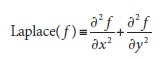
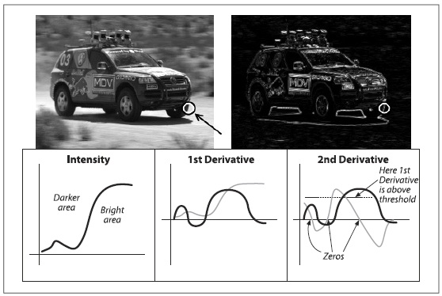

## [П]|[РС]|(РП) Лапласиан

Функция Лапласа (впервые используемая в компьютерном зрении Marr) реализует дискретный аналог оператора Лапласа (при этом не стоит путать с пирамидой Лапласа):



Поскольку оператор Лапласа может быть определен в терминологии второй производной, то можно предположить, что дискретная реализация работает подобно производной Собеля второго порядка. В действительности так и есть, при реализации оператора Лапласа OpenCV использует оператор Собеля.

```cpp
void cvLaplace(
     const CvArr*   src
    ,CvArr*         dst
    ,int            apertureSize = 3
);
```

Функция *cvLaplace()* принимает в качестве входных параметров исходное и конечное изображения, а также размер апертуры. Исходное изображение должно быть 8-битным (без знаковым) или 32-битным (вещественным). Конечное изображение должно быть 16-битным (знаковым) или 32-битным (вещественным). Апертура — это тот же самый аргумент, как и в производных Собеля и задает размер региона, по которому обрабатываются пиксели при вычислении вторых производных. 

Оператор Лапласа может быть применен в различных контекстах. Наиболее общее применение - обнаружение "капель". Оператор Лапласа выражается в виде суммы вторых производных по осям *x* и *y*. Это означает, что единичная точка или любая маленькая капля (меньше апертуры), которые обнаружены большими значениями приведет к возрастанию значения выходной функции. И наоборот, точка или маленькая капля, которая окружена меньшими значениями будет стремиться максимизировать отрицательное значение данной функции. 

Принимая это во внимание, оператор Лапласа может быть использован в качестве детектора для подсветки (выделения) краев. Что бы осознать, как это происходит, представьте первую производную функции, которая будет большой в местах, где функция быстро изменяется. В то же время, она будет скачкообразно возрастать в местах приближения к краеобразной неоднородности и скачкообразно уменьшаться при выходе из неоднородности. Получается производная будет иметь локальный максимум где-то в этом диапазоне. Таким образом для поиска таких локальных максимумов необходимо найти нули второй производной. Границы в исходном изображении будут нулями для Лапласиана. При этом нулями Лапласиана будут как более существенные, так и менее значимые края, но это не проблема, т.к. можно просто отфильтровать те пиксели, которые имеют наибольшие значения для первой производной Собеля. На рисунке 6-6 приведен пример применения Лапласиана над изображением вместе с деталями о первой и второй производной и их пересечениях нулевых значений.



Рисунок 6-6. Применение преобразования Лапласа (сверху справа) на изображение гоночной машины: масштабирование в области шины (выделено белым кругом) и, рассматривая только ось x, отображение (качественное) представления яркости, а также значений первой и второй производной (три нижних рисунка); нули второй производной соответствуют краям на изображении, а нули первой производной соответствуют четким краям

