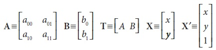
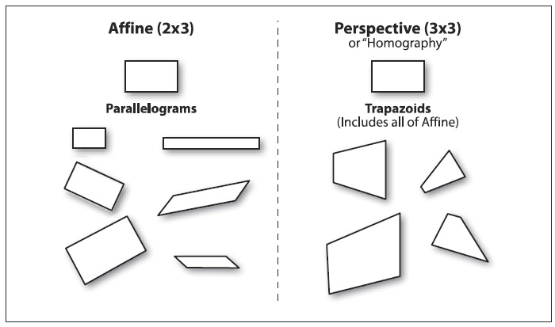
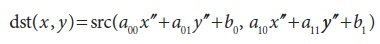
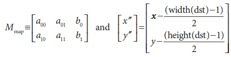
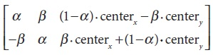
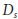
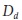
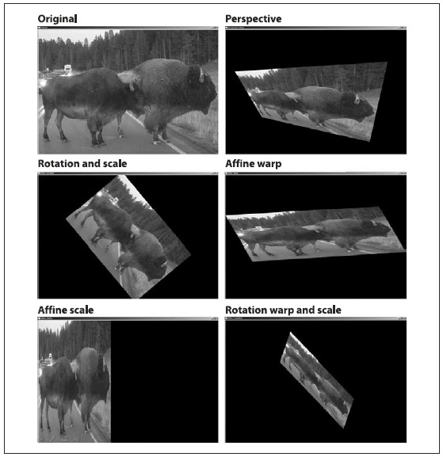

## [П]|[РС]|(РП) Растягивание, сжатие, деформация и поворот

В данном разделе речь пойдет о геометрических манипуляциях над изображениями (об этих преобразования довольно таки подробно будет рассказано в этом разделе и в главе 11, когда они будут использованы в контексте трехмерного компьютерного зрения). Такие манипуляции включают в себя растягивания в различных направлениях, при этом речь может идти как об однородных, так и об неоднородных изменениях размера (последнее более известно, как *деформация*). Есть множество причин, чтобы выполнить эти операции: например, деформируя и поворачивая изображение так, чтобы уместить его в существующей сцене или для искусственного увеличения набора шаблонных изображений, используемых для распознавания объектов (это может показаться хитроумным; в конце концов, почему бы просто не использовать метод распознавания, инвариантный к локальным аффинным искажениям? Тем не менее, этот метод имеет долгую историю и до сих пор может быть весьма полезным на практике). Функции, которые могут растягивать, сжимать, деформировать и/или поворачивать изображение именуются *геометрическими трансформациями*. Для плоскости есть две разновидности геометрических преобразований: преобразование, которое использует матрицу 2x3 и именуется *аффинным преобразованием*; и преобразование, которое использует матрицу 3x3 и именуется *перспективным преобразованием* или *гомографией*. Для последнего преобразования нужно представить, что оно основано на методе вычисления пути, по которому в трехмерном измерении направлен взор конкретного наблюдателя, при условии, что прямо взглянуть на эту плоскость он не может.

Аффинные преобразования - это любые преобразования, которые могут быть выражены в виде последовательного перемножения матриц и сложения с некоторым вектором. В OpenCV стандартной для таких преобразований является матрица размера 2x3. 



Нетрудно заметить, что результатом аффинных преобразований является **AX + B**, что в точности эквивалентно расширению вектора **X** до вектора **X'** и последующего левого умножения на вектор **T**. 

Аффинные преобразования могут быть представлены следующим образом: любой параллелограмм ABCD на плоскости может быть отражен в любой другой параллелограмм A'B'C'D'; если площади этих параллелограммов не равны нулю, тогда подразумеваемое аффинное преобразование однозначно определено для трех вершин обоих параллелограммов. Так же для понимания аффинного преобразования можно представить изображение в виде большого резиного листа, который в результате деформации нажатием или растягиванием (вплоть до переворота параллелограмма) за углы может быть преобразован в разнообразные параллелограммы. 

Имея несколько изображений одного объекта с разных ракурсов, можно применить фактическое преобразование для связывания различных ракурсов. В этом случае, зачастую для моделирования ракурсов используются аффинные преобразования, потому что задействуется малое количество параметров, что облегчает процесс вычисления. При этом недостатком является то, что реальные перспективные преобразования могут быть смоделированы только при помощи гомографии ("гомография" - это математический термин для отображения точек одной поверхности к точкам на другой поверхности. В контексте компьютерного зрения, под гомографией почти всегда имеется ввиду отображение между точками двух плоскостей изображений, которые соответствуют расположению объектов на плоскости в реальном мире. Такое преобразование представляется ортогональной матрицей 3x3 (подробнее об этом в главе 11)), так как аффинные преобразования дают представления, которые не могут вместить все возможные связи между ракурсами. С другой стороны, для небольших изменений положения наблюдателя, результирующее искажение будет аффинным, поэтому в некоторых случаях аффинных преобразований вполне достаточно. 

За счет аффинного преобразования прямоугольник может быть преобразован в параллелограмм. При этом, в результате преобразований (вращения и/или масштабирования), стороны должны сохранять параллельность. Перспективные преобразования обеспечивают большую гибкость; прямоугольник может быть преобразован в трапецию. Так как параллелограмм можно рассматривать как частный случай трапеции, то и аффинное преобразование можно рассматривать как подмножество перспективного преобразования. На рисунке 6-13 представлены примеры различных аффинных и перспективных преобразований.



Рисунок 6-13. Аффинные и перспективные преобразования


### Аффинные преобразования

Есть две ситуации, при которых используются аффинные преобразования. В первом случае для выполнения преобразования над изображением (или его частью); во втором случае для выполнения преобразования по списку точек.

**Плотные аффинные преобразования**

В первом случае очевидно, что входные и выходные форматы - это изображения, и для преобразования явно требуется, чтобы пиксели были *плотным представлением* нижележащего изображения. Это значит, что преобразователь изображения должен производить интерполяцию, так что конечное изображение будет выглядеть натурально и сглажено. Функция OpenCV, отвечающая за аффинные преобразования, именуется *cvWarpAffine()*.

```cpp
void cvWarpAffine(
     const CvArr*   src
    ,CvArr*         dst
    ,const CvMat*   map_matrix
    ,int            flags = CV_INTER_LINEAR | CV_WARP_FILL_OUTLIERS
    ,CvScalar       fillval = cvScalarAll(0)
);
```

Параметры *src* и *dst* указывают на массив или изображение, которые могут быть одно- или трехканальными произвольного типа (при этом оба обязательно одного типа и размера) (Так как вращение изображения приводит к расширению описывающего его прямоугольника, результатом станет отсеченное изображение. Обойти эту проблему можно либо за счет сжатия изображения, либо за счет копирования первого изображения в область интереса ROI целевого изображения большего размера, которое затем используется как исходное изображение для проведения преобразования). Параметр *map_matrix* - это матрица размера 2x3 по которой вычисляется требуемое преобразование. Предпоследний параметр *flags* определяет метод интерполяции, ровно, как и следующие вспомогательные опции (комбинирование все возможных значений флага производиться при помощи **OR**).

*CV_WARP_FILL_OUTLIERS* - зачастую, в результате преобразований, изображение *src* не вписывается в изображение *dst*, поэтому на конечное изображение нужно *перенести* пиксели исходного изображения, которых в действительности нет. Если данный флаг выбран, то эти потерянные значения заполняются значением параметра *fillval*.

*CV_WARP_INVERSE_MAP*. Этот флаг предназначен для обратного преобразования *dst* в *src*, вместо стандартного *src* в *dst*.

**Производительность cvWarpAffine**

Важно знать, что использование *cvWarpAffine()* приводит к значительным накладным расходам. Альтернативой является использование *cvGetQuadrangleSubPix()*. Эта функция функционально ограничена, однако, имеет ряд преимуществ. В частности, она имеет меньшие накладные расходы и обрабатывает частный случай, когда исходное изображение 8 битное, а конечное изображение вещественное. Так же эта функция может обрабатывать и многоканальные изображения.

```cpp
void cvGetQuadrangleSubPix(
     const CvArr*   src
    ,CvArr*         dst
    ,const CvMat*   map_matrix
);
```

*cvGetQuadrangleSubPix()* вычисляет все точки *dst* путем (интерполированного) их отображения из точек *src*, за счет применения аффинного преобразования, что в свою очередь подразумевает умножение на матрицу *map_matrix* размером 2x3. (Преобразование расположения пикселей в *dst* к однородным координатам для выполнения умножения производиться автоматически)

Особенность *cvGetQuadrangleSubPix()* заключается в том, что функция производит дополнительное отображение. В частности, результат, указанный в *dst* вычисляется по следующей формуле: 



где 



Стоит обратить внимание, что отображение (x, y) в (x", y") имеет следующий эффект - даже если преобразование M единичное преобразование - точки в центре конечного изображения будут соответствовать точкам, взятым из начала отсчета исходного изображения. Если *cvGetQuadrangleSubPix()* требуется точка вне изображения, будет задействована репликация для восстановления этих значений.

**Вычисление матрицы аффинного преобразования**

OpenCV предоставляет две функции для вычисления матрицы *map_matrix*. Первая используется, когда уже есть два изображения, о которых известно, что они соотносятся неким аффинным преобразованием или могут быть аппроксимированы следующим образом:

```cpp
CvMat* cvGetAffineTransform(
     const CvPoint2D32f*    pts_src
    ,const CvPoint2D32f*    pts_dst
    ,CvMat*                 map_matrix
);
```

*src* и *dst* - это массивы, содержащие три двухмерные (x, y) точки, а *map_matrix* - вычисляемая из этих точек аффинная матрица. 

Аргументы *pts_src* и *pts_dst* функции *cvGetAffineTransform()* - это всего лишь массивы из трех точек, определяющие два параллелограмма. Простейший способ определить аффинное преобразование - установить указатель *pts_src* на три (вполне достаточно трех точек, т.к. в аффинном преобразовании используется параллелограмм. Четыре точки будут задействованы только в случае с трапецией общего вида в перспективном преобразовании) угла исходного изображения - например, на верхний и нижний левый и на верхний правый. Отображение исходного изображения в конечное изображение полностью определяется указанием в *pts_dst* места, в котором по трем точкам будет отображено конечное изображение. После произведения отображения этих трех независимых углов (которые на самом деле "представляют" параллелограмм), все остальные точки могут быть преобразованы соответственно.

В примере 6-2 приведен код, использующий эти функции. В данном примере получение параметров матрицы функции *cvWarpAffine()* производиться следующим образом: в начале происходит построение двух трехкомпонентных массивов точек (для углов параллелограмма), а затем преобразование их в действительную матрицу преобразований за счет вызова *cvGetAffineTransform()*. Потом выполняются аффинные преобразования с последующим вращением изображения. Для исходного изображения создается массив точек именуемый *srcTri[]* с заданными точками: (0, 0), (0, height - 1) и (width - 1, 0). В завершении указывается в какое соответствующее расположение будут отображены точки из массива *srcTri[]* в массив *dstTri[]*.

Пример 6-2. Аффинные преобразования

```cpp
// Пример использования: warp_affine <файл_изображения>
// 
#include <cv.h>
#include <highgui.h>

int main( int argc, char** argv ) {
    CvPoint2D32f    srcTri[3], dstTri[3];
    CvMat*          rot_mat = cvCreateMat( 2, 3, CV_32FC1 );
    CvMat*          warp_mat = cvCreateMat( 2, 3, CV_32FC1 );
    IplImage        *src, *dst;

    if( argc == 2 && ((src=cvLoadImage(argv[1], 1)) != 0 ) ) {
        dst = cvCloneImage( src );
        dst->origin = src->origin;
        cvZero( dst );

        // Вычисление матрицы преобразования
        //
        srcTri[0].x = 0;					//Верхний левый угол источника
        srcTri[0].y = 0;
        srcTri[1].x = src->width - 1;		//Верхний правый угол источника
        srcTri[1].y = 0;
        srcTri[2].x = 0;					//Сдвиг нижнего левого угла источника
        srcTri[2].y = src->height - 1;
        dstTri[0].x = src->width * 0.0;		//Верхний левый угол приемника
        dstTri[0].y = src->height * 0.33;
        dstTri[1].x = src->width * 0.85;	//Верхний левый угол приемника
        dstTri[1].y = src->height * 0.25;
        dstTri[2].x = src->width * 0.15;	//Сдвиг нижнего левого угла приемника
        dstTri[2].y = src->height * 0.7;

        cvGetAffineTransform( srcTri, dstTri, warp_mat );
        cvWarpAffine( src, dst, warp_mat );
        cvCopy( dst, src );

        // Вычисление матрицы вращения
        //
        CvPoint2D32f center = cvPoint2D32f(
             src->width/2
            ,src->height/2
        );

        double angle = -50.0;
        double scale = 0.6;
        cv2DRotationMatrix( center, angle, scale, rot_mat );

        // Выполение преобразования
        //
        cvWarpAffine( src, dst, rot_mat );

        // Отображение результата
        //
        cvNamedWindow( "Affine_Transform", 1 );
        cvShowImage( "Affine_Transform", dst );
        cvWaitKey();
    }

    cvReleaseImage( &dst );
    cvReleaseMat( &rot_mat );
    cvReleaseMat( &warp_mat );

    return 0;
}
```

Второй функцией вычисления матрицы *map_matrix* является *cv2DRotationMatrix()*, которая вычисляет матрицу преобразований при помощи вращения вокруг заданной точки и необязательного масштабирования. Это всего лишь один из возможных вариантов аффинных преобразований, однако, очень важный, т.к. имеет альтернативное (и более интуитивное) представление, которое легче понимать и использовать:

```cpp
CvMat* cv2DRotationMatrix(
     CvPoint2D32f   center
    ,double         angle
    ,double         scale
    ,CvMat*         map_matrix
);
```

Первый аргумент *center* - точка вращения. Следующие два аргумента задают величину вращения и масштабный коэффициент. Последний аргумент - матрица *map_matrix* вещественного типа размерностью 2x3.

Если определить α = scale⋅cos(angle) и β = scale⋅sin(angle), тогда функция будет производить вычисление *map_matrix* по следующей формуле:



Эти методы получения *map_matrix* можно комбинировать для получения, например, повернутого, масштабированного и деформированного изображения.

**Разряженное аффинное преобразование**

Ранее уже было сказано, что для обработки плотных преобразований используется *cvWarpAffine()*. Для разряженного преобразования (т.е. преобразования набора независимых точек) лучше всего использовать *cvTransform()*:

```cpp
void cvTransform(
     const CvArr*   src
    ,CvArr*         dst
    ,const CvMat*   transmat
    ,const CvMat*   shiftvec = NULL
);
```

Аргумент *src* - это массив Nx1 c  каналами, где N - количество точек для преобразования, а  - размерность этих точек. Аргумент *dst* должен быть того же размера, но может иметь отличное количество каналов . Матрица преобразований *transmat* - это матрица размерностью x, которая затем применяется к каждому элементу из *src*, с последующим размещением результата в *dst*. Если необязательный вектор *shiftvec* не NULL, то он должен быть массивом размерностью x1, элементы которого добавляются к результату до его размещения в *dst*.

В случае аффинного преобразования, существует два способа использования *cvTransform()*, выбор зависит от представления преобразования. В первом случае, преобразование раскладывается на части размером 2x2 (которая выполняет вращение, масштабирование и деформацию) и размером 2x1 (которая выполняет преобразование). Входные данные: массив Nx1 с двумя каналами, *transmat* локальное гомогенное преобразование, а *shiftvec* содержит все необходимые сдвиги. Во втором случае, применяется обычное представление матрицы аффинного преобразования размерностью 2x3. В этом случае, *src* - это трехканальный массив, для которого нужно установить все элементы третьего канала в 1 (т.е. точки должны быть представлены в однородных координатах). Разумеется, выходной массив будет двухканальным.


### Перспективные преобразования

Для получения большей гибкости при помощи перспективных преобразованиях (гомографии), необходима новая функция, которая позволит выразить этот широкий класс преобразований. Прежде всего стоит отметить что, хотя перспективная проекция задается полностью при помощи одной матрицы, проекция на самом деле это не линейное преобразование. Это связано с тем, что преобразование требует деление на последнее измерение (обычно на Z, Глава 11), тем самым в процессе преобразования одно измерение теряется. 

Как и в аффинных преобразованиях, операции над изображениями (плотные преобразования) и точечные преобразования (разряженные преобразования) обрабатываются различными функциями.

**Плотное перспективное преобразование**

При плотном перспективном преобразовании используются аналогичные функции OpenCV, что и при плотных аффинных преобразованиях. В частности *cvWarpPerspective()* имеет такой же набор аргументов, как и *cvWarpAffine()*, с одним лишь существенным отличием - матрица отображения должна быть размера 3x3. 

```cpp
void cvWarpPerspective(
     const CvArr*   src
    ,CvArr*         dst
    ,const CvMat*   map_matrix
    ,int            flags   = CV_INTER_LINEAR + CV_WARP_FILL_OUTLIERS
    ,CvScalar       fillval = cvScalarAll(0)
);
```

Флаги те же, что и в случае с аффинным преобразованием.

**Вычисление матрицы перспективного преобразования**

Как и в случае аффинных преобразований, для заполнения матрицы *map_matrix* функции *cvWarpPerspective()* есть функция, которая может вычислить матрицу преобразования из списка точечных соответствий:

```cpp
CvMat* cvGetPerspectiveTransform(
     const CvPoint2D32f*    pts_src
    ,const CvPoint2D32f*    pts_dst
    ,CvMat*                 map_matrix
);
```

Аргументы *pts_src* и *pts_dst* теперь массивы четырех точек (а не трех), поэтому теперь контролировать отображение углов (обычно) прямоугольника *pts_src* в некий ромб *pts_dst* можно самостоятельно. Преобразование полностью определяется указанием четырех точек назначения. Ранее уже было отмечено, что для перспективного преобразования необходимо выделять массив *map_matrix* размера 3x3; в примере 6-3 показан пример применения перспективного преобразования. Иная размерность матрицы отображения, 3x3, и переход от трех контрольных точек к четырем - это все, что отличает перспективное преобразование от аффинного. 

Пример 6-3. Пример применения перспективного преобразования

```cpp
// Пример использования: warp <файл_изображения>
// 
#include <cv.h>
#include <highgui.h>

int main(int argc, char** argv) {
    CvPoint2D32f    srcQuad[4], dstQuad[4];
    CvMat*          warp_matrix = cvCreateMat( 3, 3, CV_32FC1 );
    IplImage        *src, *dst;

    if( argc == 2 && ((src = cvLoadImage(argv[1], 1)) != 0 )) {
        dst = cvCloneImage( src );
        dst->origin = src->origin;
        cvZero(dst);

        srcQuad[0].x = 0;				// src Top left
        srcQuad[0].y = 0;
        srcQuad[1].x = src->width - 1;	// src Top right
        srcQuad[1].y = 0;
        srcQuad[2].x = 0;				// src Bottom left
        srcQuad[2].y = src->height - 1;
        srcQuad[3].x = src-width - 1;	// src Bottom right
        srcQuad[3].y = src->height - 1;

        dstQuad[0].x = src->width*0.05;	// dst Top left
        dstQuad[0].y = src->height*0.33;
        dstQuad[1].x = src->width*0.9;	// dst Top right
        dstQuad[1].y = src->height*0.25;
        dstQuad[2].x = src->width*0.2;	// dst Bottom left
        dstQuad[2].y = src->height*0.7;
        dstQuad[3].x = src->width*0.8;	// dst Bottom right
        dstQuad[3].y = src->height*0.9;

        cvGetPerspectiveTransform(
             srcQuad
            ,dstQuad
            ,warp_matrix
        );

        cvWarpPerspective( src, dst, warp_matrix );
        cvNamedWindow( "Perspective_Warp", 1 );
        cvShowImage( "Perspective_Warp", dst );
        cvWaitKey();
    }

    cvReleaseImage( &dst );
    cvReleaseMat( &warp_matrix );

    return 0;
}
```

**Разряженное перспективное преобразование**

В OpenCV есть специальная функция *cvPerspectiveTransform()*, которая выполняет точечное перспективное преобразование; использование функции *cvTransform()* недопустимо, т.к. она предназначена только для выполнения линейных операций. В случае же с перспективным преобразованием требуется деление на третью координату однородного представления (*x = f∗X/Z*, *y = f∗Y/Z*). Функция *cvPerspctiveTransfom()* решает все эти задачи за разработчиков самостоятельно.

```cpp
void cvPerspectiveTransform(
     const CvArr*   src
    ,CvArr*         dst
    ,const CvMat*   mat
);
```

Как правило, *src* и *dst* это массивы исходных и конечных точек соответственно; массивы должны быть трехканальными вещественного типа. Размерность матрицы *mat* может быть либо 3x3, либо 4x4. Если 3x3, то проекция не меняет размерность (два); если 4x4, то проекция меняет размерность с четырех до трех.

В текущем контексте происходит преобразование установленных точек на исходном изображении в другие установленные точки на конечном изображении, о котором говорят как об отображении из двумерного в двумерное пространство. Но это не совсем точно, так как на самом деле при перспективном преобразовании происходит отображение точек на двумерную плоскость, встроенную в трехмерное пространство, в обратное (другое) двухмерное подпространство. Представляйте это как тоже самое, что делает камера (более подробно об этом будет рассказано в последующих главах с описанием работы камеры). Камера снимает точки трехмерного пространства и отображает их в двухмерном пространстве камеры. По сути, имеется ввиду, что точки источника должны быть взяты в "однородных координатах". Вводится измерение Z и все значения этого измерения заполняются 1. Затем выполняется прямое преобразование проекции, и обратное в двумерном пространстве конечного изображения.

Результаты выполнения аффинных и перспективных преобразований из примера 6-3 показаны на рисунке 6-14. Сравнивая этот результат с диаграммами на рисунке 6-13 можно увидеть, как это работает с реальными изображениями. На рисунке 6-14 преобразованию подверглось всё изображения. Но можно преобразовывать не всё изображение; можно просто в *src_pts* определить меньшую (или большую!) область преобразования. К тому же можно задействовать ROI в исходном или конечном изображении для ограничения преобразования.



Рисунок 6-14. Пример выполнения аффинных и перспективных преобразований

