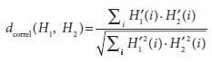
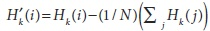
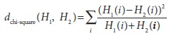
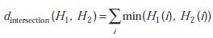
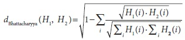
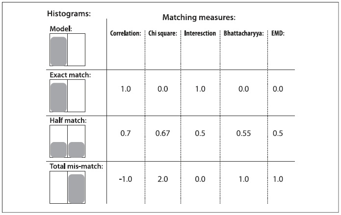
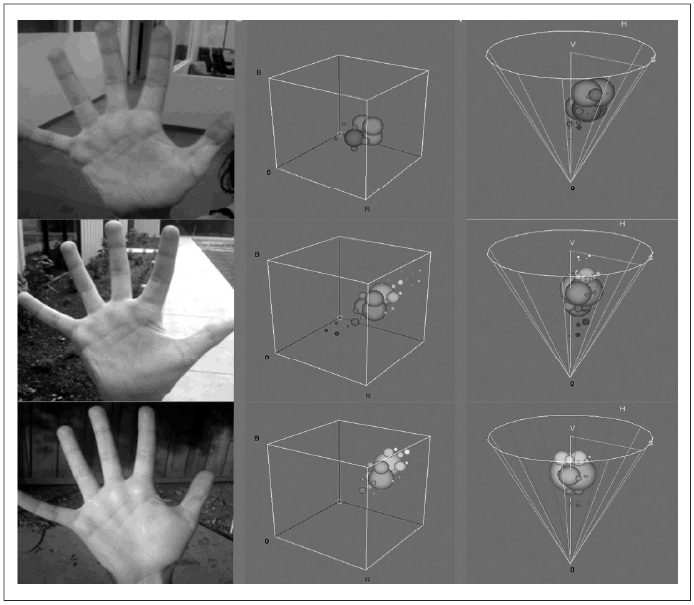

## [П]|[РС]|(РП) Базовые манипуляции над гистограммами

Теперь, разобрав структуру Histogram, можно переходить к разбору некоторых более интересных вещей. Для начала необходимо рассмотреть основы основ, которые будут использоваться снова и снова. А затем уже можно будет перейти к более сложным функциям, которые можно будет задействовать при выполнении более сложных задач.

При работе с гистограммами, как правило, необходимо просто накапливать информацию в различных контейнерах. При этом, зачастую желательно, чтобы гистограмма была нормализована, т.е. когда каждый контейнер представлял долю от общего числа событий:

```cpp
	cvNormalizeHist( CvHistogram* hist, double factor );
```

Аргумент *hist* - это гистограмма, а *factor* - число на которое необходимо нормализовать гистограмму (обычно он равен 1). Как можно было заметить, аргумент *factor* имеет тип double, хотя внутри функции *CvHistogram()* он всегда float - это ещё одно доказательство того, что OpenCV постоянно развивается!

Следующая удобная функция - функция порогового преобразования:

```cpp
	cvThreshHist( CvHistogram* hist, double factor );
```

Аргумент *factor* - это пороговое значение. В результате порогового преобразования над гистограммой, все контейнеры, у которых стоимость ниже порогового значения, устанавливаются в 0. Если вспомнить функцию *cvThreshold()*, можно сказать, что функция порогового преобразования над гистограммами аналогична вызову функции порогового преобразования над изображениями с установленным значением аргумента *threshold_type* в *CV_THRESH_TOZERO*. К сожалению, не существует функций, обеспечивающих преобразования аналогичные другим функциям пороговых преобразований. Однако, на практике, функции *cvThreshHist()* вполне достаточно, т.к. при работе с реальными данными некоторые контейнеры содержат малое количество точек, которые в свою очередь являются шумами и должны быть, как правило, обнуляться.

*cvCopyHist()* - ещё одна удобная функция, которая копирует данные одной гистограммы в другую.

```cpp
	void cvCopyHist( const CvHistogram* src, CvHistogram** dst );
```

Эту функцию можно использовать двумя способами. Если конечная гистограмма ***dst** имеет тот же размер, что и исходная гистограмма, то все данные **src** будут скопированы в ***dst**. Другой способ использовать *cvCopyHist()* - установить ***dst** в NULL, в этом случае под ***dst** будет выделено столько памяти, сколько занимает **src**, с последующим копированием данных (эту функцию можно сравнить с аналогичной ей *cvCloneImage()*). Если при вызове *cvCopyHist()* ***dst = NULL**, то ***dst** будет задан указателем на вновь выделенную гистограмму только после того, как функция вернет значение.

Следующей удобной функцией является *cvGetMinMaxHistValue()*, которая возвращает максимальное и минимальное значения в гистограмме.

```cpp
	void cvGetMinMaxHistValue(
		 const CvHistogram* 	hist
		,float* 				min_value
		,float* 				max_value
		,int* 					min_idx = NULL
		,int* 					max_idx = NULL
	);
```

Аргумент *hist* - это гистограмма. Функция возвращает максимальное и минимальное значения в ***min_value** и ***max_value** соответственно. Если одно из значений (или оба) не нужны, тогда нужно установить соответствующий аргумент в NULL. Следующие два аргумента не обязательны: если они установлены в значения по умолчанию (NULL), то они не используются. Однако, если указатели ***int != NULL**, тогда эти аргументы будут содержать индексы минимального и максимального значений. Если гистограмма многомерная, то аргументы *min_idx* и *max_idx* (если они не NULL) должны указывать на массивы целых чисел размером равным размерности гистограммы. Если более чем один контейнер имеет одинаковое минимальное (или максимальное) значение, то будет возвращен наименьший индекс (в лексографическом порядке для многомерных гистограмм).

Зачастую, после сбора данных и формирования гистограммы используется функция *cvGetMinMaxHistValue()* для поиска минимального значения, с последующим поиском порога в районе этого минимума при помощи *cvThreshHist()* и окончательной нормализацией гистограммы при помощи *cvNormalizeHist()*.

Последней, но не менее значимой, удобной функцией является cvCalcHist(). Она автоматически вычисляет гистограмму по изображению:

```cpp
	void cvCalcHist(
		 IplImage** 	image
		,CvHistogram* 	hist
		,int 			accumulate = 0
		,const CvArr* 	mask = NULL
	);
```

 Аргумент *image* - это указатель на массив указателей на *IplImage* (также возможно использование указателя на матрицу **CvMat***). Это позволяет обрабатывать несколько плоскостей изображения. В случае с многоканальными изображениями (например, HSV или RGB), перед вызовом *cvCalcHist()* необходимо разделить это изображение на плоскости при помощи *cvSplit()*. Правда это немного мучительно, однако, зачастую, требуется "пройтись" по многоканальному изображению, которое содержит различные отфильтрованные версии изображения - например, плоскость градиента или U- и V- плоскости YUV. Это может повлечь за собой бардак при попытке передачи изображений с различным числом каналов (а то, что кто-то в определенный момент времени захочет получить лишь часть изображения сомневаться не стоит!). Что бы избежать всей этой путаницы, передаваемые в *cvCalcHist()* изображения должны быть одноканальными. При заполнении гистограмм, контейнеры будут идентифицироваться как кортежи, образованные на основе этих многоканальных изображениях. Аргумент *hist* должен быть гистограммой соответствующего размера (т.е. размерности, равной числу плоскостей изображения передаваемых изображений). Последние два аргумента не обязательны. Если накопительный аргумент не нулевой, то он указывает на то, что гистограмма *hist* не должна быть очищена прежде чем изображение будет прочитано; стоит обратить внимание на то, что накопитель позволяет вызывать *cvCalcHist()* несколько раз во время циклического сбора данных. Последний аргумент *mask* обычно необязательная булева маска; если *mask != NULL*, тогда пиксели, соответствующие ненулевым элементам в маске будут включены в гистограмму.

 ### Сравнение двух гистограмм

 Ещё одним незаменимым инструментом при работе с гистограммами, впервые введенный Swain и Ballard и обобщенный в дальнейшем Schiele и Crowley, является возможность сравнить две гистограммы в терминологии некоторых специфичных критериев подобия. В OpenCV для этого существует функция *cvCompareHist()*:

 ```cpp
	double cvCompareHist(
		 const CvHistogram* 	hist1
		,const CvHistogram* 	hist2
		,int 					method
	);
 ```

Первые два аргумента - это гистограммы для сравнения, которые должны быть одинакового размера. Третий аргумент задает дистанционную метрику. Доступны четыре варианта этой метрики.

**Корреляция (method = CV_COMP_CORREL)**



где , а N равно числу контейнеров гистограммы. 

Для *корреляции* большая оценка представляет лучшее совпадение, чем меньшая. Идеальное совпадение 1, а максимальное несовпадение -1; значение 0 указывает на отсутствие корреляции (случайная ассоциация).

**Хи-квадрат (method = CV_COMP_CHISQR)**



Для *хи-квадрата* (хи-квадрат был изобретён Karl Pearson, который основал область математической статистики) более низкая оценка означает лучшее совпадение, чем более высокая. Идеальное совпадение равно 0, а максимальное несовпадение не ограничено (зависит от размера гистограммы)

**Пересечение (method = CV_COMP_INTERSECT)**



Для *пересечения гистограмм* высокая оценка указывает на хорошее совпадение, а низкая на плохое. Если обе гистограммы нормированы на 1, то идеальное совпадение это 1, а совершенное несовпадение - 0.

**Расстояние Bhattacharyya (method = CV_COMP_BHATTACHARYYA)**



Для *соответствия Bhattacharyya* низкие показатели свидетельствуют о хорошем совпадении, а высокие о плохом. Идеальное совпадение 0, а совершенное несовпадение 1. 

При помощи *CV_COMP_BHATTACHARYYA* осуществляется нормализация исходной гистограммы. В целом, однако, нормализация гистограмм должна происходить перед их сравнением, потому что такие понятия, как пересечение гистограмм имеют мало смысла без нормализации.

Простейший случай изображенный на рисунке 7-4 должен прояснить ситуацию. На самом деле, речь идет о наиболее простейшем случае, который возможно представить: одномерная гистограмма с двумя контейнерами. Данная модель гистограммы имеет значение 1.0 для левого контейнера и 0.0 для правого контейнера. Последние три строки показывают сравнение гистограмм и значения сгенерированные различными метриками (метрика EMD будет описана позже).



Рисунок 7-4. Сопоставление гистограмм

Рисунок 7-4 предоставляет наглядное представление сравнения различных типов сопоставления, но есть в этом рисунке кое-что, что может смутить. Если совместить все контейнеры гистограммы в один слот - например, гистограммы из первого и третьего графика сравнения - то все эти методы сопоставления (за исключением EMD) дают максимальное несоответствие, даже при условии, что эти две гистограммы имеют аналогичную "форму". В крайне правом столбце на рисунке 7-4 указаны значения, возвращаемые EMD. Согласно третьей модели, мера EMD количественно изменяет ситуацию, а именно: третья гистограмма смещается вправо на одну единицу. Про данное поведение будет более подробно рассказано в следующем разделе "Earth Mover’s Distance". 

Согласно опыту авторов метрик, пересечение работает хорошо для быстрых и грязных соответствий, а хи-квадрат или Bhattacharyya работает хорошо для медленных, но более точных совпадений. EMD дает более интуитивно понятные совпадения, но при этом работает медленнее.

**Пример использования гистограмм**

Программа из примера 7-1 показывает, как можно использовать некоторые из ранее рассмотренных функций. Эта программа вычисляет гистограмму тон-насыщенность для изображения и рисует эту гистограмму как освещенную сетку.

Пример 7-1. Вычисление и отображение гистограммы

```cpp
#include <cv.h>
#include <highgui.h>
 
int main( int argc, char** argv ) {
	IplImage* src;
	 
	if( argc == 2 && (src=cvLoadImage(argv[1], 1))!= 0) {
	
		// Конвертация изображения в формат HSV и раскладывание его на каналы
		//
		IplImage* hsv = cvCreateImage( cvGetSize(src), 8, 3 );
		cvCvtColor( src, hsv, CV_BGR2HSV );
		 
		IplImage* h_plane = cvCreateImage( cvGetSize(src), 8, 1 );
		IplImage* s_plane = cvCreateImage( cvGetSize(src), 8, 1 );
		IplImage* v_plane = cvCreateImage( cvGetSize(src), 8, 1 );
		IplImage* planes[] = { h_plane, s_plane };
		cvCvtPixToPlane( hsv, h_plane, s_plane, v_plane, 0 );
		 
		// Построение гистограммы
		//
		int h_bins = 30, s_bins = 32;
		CvHistogram* hist;
		{
			int 	hist_size[] = { h_bins, s_bins };
			float 	h_ranges[] 	= { 0, 180 }; // hue is [0,180]
			float 	s_ranges[] 	= { 0, 255 };
			float* 	ranges[] 	= { h_ranges, s_ranges };
			
			hist = cvCreateHist(
				 2
				,hist_size
				,CV_HIST_ARRAY
				,ranges
				,1
			);
		}
		 
		cvCalcHist( planes, hist, 0, 0 ); 	// Вычисление гистограммы
		cvNormalizeHist( hist[i], 1.0 ); 	// Нормализация
		 
		// Создание изображения для визуализации гистограммы
		//
		int scale = 10;
		IplImage* hist_img = cvCreateImage(
			 cvSize( h_bins * scale, s_bins * scale )
			,8
			,3
		);
		cvZero( hist_img );
		 
		// Заполнение изображения небольшими серыми квадратами
		//
		float max_value = 0;
		cvGetMinMaxHistValue( hist, 0, &max_value, 0, 0 );
		for( int h = 0; h < h_bins; h++ ) {
		    for( int s = 0; s < s_bins; s++ ) {
			    float bin_val = cvQueryHistValue_2D( hist, h, s );
			    int intensity = cvRound( bin_val * 255 / max_value );
			    
			    cvRectangle(
				     hist_img
				    ,cvPoint( h*scale, s*scale )
				    ,cvPoint( (h+1)*scale - 1, (s+1)*scale - 1)
				    ,CV_RGB( intensity,intensity,intensity )
				    ,CV_FILLED
			    );
		    }
		}
		 
		cvNamedWindow( "Source", 1 );
		cvShowImage( "Source", src );
		cvNamedWindow( "H-S Histogram", 1 );
		cvShowImage( "H-S Histogram", hist_img );
		 
		cvWaitKey(0);
	}
}
```

В данном примере было проделано не мало работы по подготовке аргументов функции *cvCalcHist()*. Так же было принято решение о нормализации цвета, а не самой гистограммы, хотя обратный вариант, в случае с некоторыми изображениями, может дать лучше результат. Выбрать какой порядок использовать, можно с помощью *cvGetMinMaxHistValue()*.

Теперь давайте рассмотрим более практичный пример: цветовая гистограмма человеческой руки под различным освещением. В левой колонке на рисунке 7-5 представлены фотографии руки в помещение, на улице в тени и на солнце. В средней колонке показаны синие, зеленые и красные (BGR) гистограммы отслеживаемых тонов руки. В правом столбце представлены соответствующие HSV гистограммы, где вертикальная ось это V (значение), радиус это S (насыщенность), а угол это H (оттенок). Стоит отметить тот факт, что цветовое смещение вызвано изменением освещающего света. 

В качестве тестовой гистограммы сравнения можно рассмотреть часть одного из ранее представленных изображений (например, верхнюю половину ладони в помещении) и сравнить гистограммы представляющие цвета в этом изображении или гистограммы представляющие цвета в нижней половине взятого изображения; либо сравнить гистограммы представлений двух других изображений руки. Телесные цвета легче распознать, если преобразовать изображение в цветовое пространство HSV. Оказывается, ограничившись тоном и насыщенностью, можно распознавать признаки телесного цвета по всем этническим группам. Результаты сравнения для описанного эксперимента показаны в таблице 7-1, подтверждают тот факт, что освещение может вызвать серьезные несоответствия в цвете. Иногда в контексте изменения освещения, нормализованные BGR изображения дают результат лучше, чем HSV.



Рисунок 7-5. Гистограммы фотографий руки, сделанным в разных местах (в помещении, в тени и на солнце); По середине гистограмма BGR, а справа HSV

Таблица 7-1. Гистограммы сравнения фотографий руки (в помещении, в тени и на солнце), построенные при помощи четырех методов сопоставления

| Объект сравнения | CORREL | CHISQR | INTERSECT | BHATTACHARYYA |
| -- | -- | -- | -- | -- |
| В помещении | 0.96 | 0.14 | 0.82 | 0.2 |
| В тени | 0.09 | 1.57 | 0.13 | 0.8 |
| На солнце | 0.0 | 1.98 | 0.01 | 0.99 |