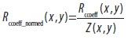
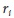

## [П]|[РС]|(РП) Упражнения

1. Сгенерируйте 1000 случайных чисел  между 0 и 1. Определите размер контейнера гистограммы как .

	a. Присутствуют ли в полученной гистограмме контейнеры со схожим (разброс ±10) количеством записей

	b. Предложите способ борьбы с нелинейным распределением, так, чтобы каждый контейнер имел схожее количество данных

2. Возьмите три изображения руки в трех различных сценах (как было описано в тексте главы). Используйте *cvCalcHist()* чтобы создать RGB гистограмму телесного цвета для руки в помещении.

	a. Попробуйте использовать только несколько больших контейнеров (например, 2), среднее количество контейнеров (например, 16) и малое количество контейнеров (например, 256). Затем запустите процедуру сопоставления (используя все методы сопоставления). Опишите результаты

	b. Теперь добавьте 8, а затем 32 контейнера и попытайтесь сопоставить при различном освещении (в помещении и на улице). Опишите результаты.

3. Как и в упражнении 2, создайте RGB гистограмму телесного цвета руки. Примите первую гистограмму руки в помещении (внутренней) за модель и измерьте EMD в отношении второй внутренней, первой открытой затененной и первой открытой освещенной гистограммах. Используйте эти измерения для установки расстояния порога.

	a. Используя этот EMD порог, оцените насколько хорошо был обнаружен телесный цвет на третьей внутренней, второй открытой затененной и второй открытой освещенной гистограммах. Опишите результат.

	b. Выберете случайным образом *patch* не телесного цвета, чтобы увидеть существенную разницу. Возможно ли удаление фона при подборе правдивой гистограммы телесного цвета?

4. Используя коллекцию изображений рук, смоделируйте гистограмму, по которой можно будет определить в каком из трех условий освещения данное изображение было сделано. Для выполнения этой задачи, вам необходимо создать признаки – возможно, это будет часть сцены, значения яркости и/или относительной яркости (например, от верхнего к нижнему *patch* в кадре) или градиенты от центра к краям.

5. Соберите модели гистограмм телесного цвета при трех условиях освещения. 

	a. Используйте первые во внутреннем, открытом затененном и открытом освещенным гистограммы как модели. Сопоставьте каждую из них со вторыми изображениями в каждой из соответствующей категории, чтобы увидеть насколько хорошо работает оценка совпадения плоти.

	b. Используйте "детектор сцены" из задания a, чтобы создать модель "переключения гистограмм". Сначала используйте детектор сцены, чтобы определить, какие модели гистограмм задействовать: внутреннюю, открытую затененную, открытую освещенную. Затем используйте соответствующую телесную модель, чтобы принять или отклонить второй телесный *patch* в рамках всех трех условий. Насколько хорошо работает данная модель переключения?

6. Создание региона интереса телесного цвета 

	a. Используйте несколько образцов рук и лица телесного цвета в помещении, чтобы создать гистограмму RGB.

	b. Используйте *cvCalcBackProject()* для поиска областей телесного цвета

	c. Используйте *cvErode()* из главы 5, чтобы избавиться от шумов, а затем примените *cvFloodFill()* (из этой же главы) для поиска больших участком телесного цвета на изображении. Это и будут регионы интересов.

7. Попробуйте распознать жест руки. Сфотографируйте руку в 2 футах (~ 60 см) от камеры, создайте несколько (неподвижных) жестов руки: большой палец вверх, влево и вправо.

	a. Используйте регион интереса из упражнения 6, возьмите изображение градиентов в области руки и создайте модели гистограмм для каждого из трех жестов. Так же создайте гистограмму лица (если лицо есть на изображении). Так же можно получить гистограммы некоторых аналогичных, но не жестовых положений рук.

	b. Тест распознавания с использованием веб-камеры: используйте регион интереса телесного цвета для поиска "потенциальной руки"; получите градиенты для каждого региона телесного цвета; используйте гистограмму сопоставления превышающая порог для обнаружения жеста. Если две модели выше порога, возьмите лучшее соответствие.

	c. Переместите руки на 1-2 фута дальше и посмотрите может ли еще распознавать жесты градиент гистограммы.

8. Повторите упражнение 7, но с EMD для сравнения. Что происходит с EMD, когда перемещается рука?

9. Для тех же изображений используйте *cvMatchTemplate()* вместо гистограмм соответствия. Что будет происходить с шаблоном сопоставления, когда вы будете перемещать вашу руку назад так, что она будет становиться меньше?
