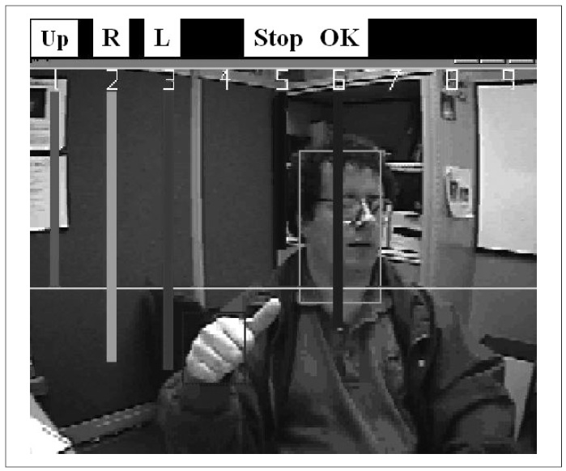
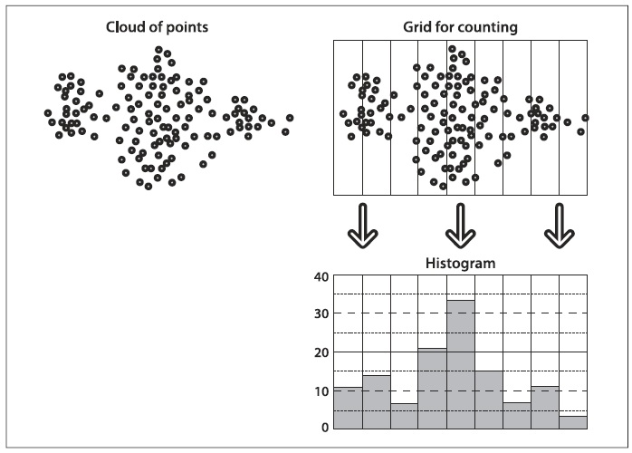
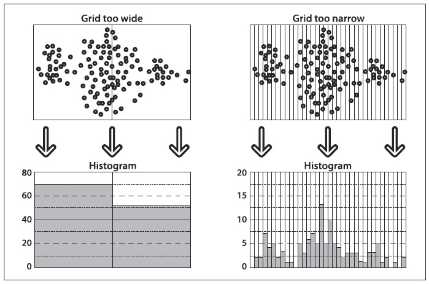

## [П]|[РС]|(РП) Гистограммы и сопоставления

Зачастую, в ходе анализа изображений, объектов и видеоинформации, требуется представление в виде *гистограммы*. Гистограммы могут быть использованы для представления таких вещей, как цветовое распределение объекта, шаблона градиента краев объекта и распределение вероятностей, представляющие текущую гипотезу о местонахождении объекта. Рисунок 7-1 отображает использование гистограмм для быстрого распознавания жестов. Градиенты краев были собраны из жестов: "вверх", "вправо", "влево" и "ОК". При помощи этих жестов возможно управлять видеопотоком с веб-камеры. В каждом кадре, цвет региона интересов определяется с поступающего видео; затем вычисляются значения краев градиента вокруг этих регионов и в завершении эти значения представляются в виде гистограмм. Гистограммы сопоставляются с моделями жестов и жест распознается. Вертикальные полосы на рисунке 7-1 отображают сопоставление уровней различных жестов. Серая горизонтальная линия представляет порог для принятия решения о соответствующем жесте. 

Гистограммы находят применения во многих приложениях компьютерного зрения. Гистограммы могут использоваться для обнаружения переходов между сценами видеопотока, отмечая заметные изменения краев и цвета от кадра к кадру. Они используются для идентификации интересующих точек на изображении, назначив каждой точке "метку", состоящей из гистограмм близлежащих признаков. Гистограммы краев, цвета, углов и т.д. формируют общий тип признаков, который в последующем передается классификаторам для распознавания объекта. Последовательности цвета или краев гистограмм используют для определения, например, было ли видео скачано с интернета. Гистограммы являются классическим инструментом компьютерного зрения.

Гистограммы - это просто коллекция *counts*, представляющая основу данных и организованная в набор заранее определенных *контейнеров*. Они могут быть представлены такими вычисляемыми признаками, как градиент магнитуды и направления, цвета или какими-либо другими характеристиками. В любом случае, они используются для получения статистического представления основного распределения данных. Гистограммы, как правило, по размерам меньше, чем исходные данные. На рисунке 7-2 показана типичная ситуация. Показано двумерное распределение точек (вверху слева); наложенная сетка (вверху справа) и количество точек в каждой *ячейке сетки*, в итоге получается одномерная гистограмма (справа внизу). Поскольку вместо точек могут быть любые другие данные, то гистограмма является удобным средством представления всего, что можно получить из изображения.

Рисунок 7-1. Гистограммы используются для распознавания жестов руки

Рисунок 7-2. Типичный пример гистограмм

Гистограммы, которые представляют непрерывное распределение, строятся таким образом, чтобы неявно содержать среднее количество точек в каждой ячейке сетки. Это то место, где могут возникнуть проблемы (рисунок 7-3). Если сетка слишком широка (вверху слева), то получиться большое усреднение и структура распределения будет утеряна. Если сетка слишком узкая (вверху справа), то получиться не достаточное усреднение для представления точного распределения и в итоге получатся небольшие, "заостренные" ячейки. 

В OpenCV есть тип данных для представления гистограмм. Данная структура способна представлять гистограммы в одном или нескольких измерениях и содержит все необходимые данные для отслеживания контейнеров однородного или неоднородного размера. Для всего этого имеется множество полезных функций, которые позволяют с легкостью выполнять типовые операции над гистограммами.

Рисунок 7-3. Точность гистограмм зависит от размера сетки: сетки, у которых широкие ячейки имеют слишком большое пространственное усреднение на гистограмме counts (слева); сетка со слишком маленькими "заостренными" ячейками и одиночным результатом имеют слишком малое пространственное усреднение (справа)